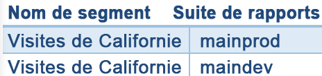
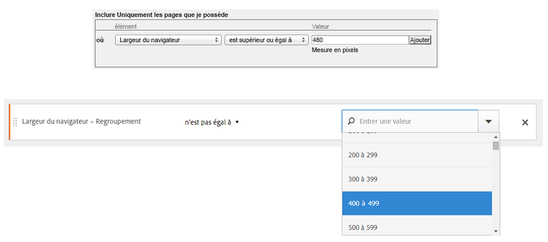

# Questions fréquentes sur les segments hérités

Répond aux questions fréquentes sur les bonnes pratiques de gestion des segments hérités - segments créés avant 2014.

## Gestion des segments existants {#legacy}

+++ **Qu’est-il advenu de mes segments existants ?**

Vos segments existants continueront à fonctionner comme auparavant. Tout rapport auquel ces segments sont appliqués continuera à fonctionner correctement. [Plus...](/help/components/segmentation/seg-transition.md)

La plupart des anciens segments prédéfinis et de suite seront migrés sous forme de modèles de segments dans le créateur de segments. Les modèles de segments sont utilisés pour créer rapidement des segments personnalisés avec des audiences courantes. Ils ne peuvent pas être directement appliqués à un rapport, mais peuvent être facilement enregistrés dans un segment personnalisé.

Les modèles de segments sont marqués par une icône spéciale dans le Créateur de segments :

+++

+++ **Qu’est-il advenu des rapports planifiés auxquels des segments avaient été appliqués ?**

Les rapports planifiés continuent de fonctionner correctement avec les segments que vous avez définis.

Lorsque vous supprimez un segment, les rapports planifiés et les tableaux de bord auxquels ce segment est appliqué continuent de fonctionner normalement, c’est-à-dire que le segment ou le tableau de bord continue à utiliser le segment supprimé.

Les rapports planifiés ne sont pas mis à jour lorsque vous modifiez un segment portant le même nom. Par exemple, supposons que 2 segments portant le même nom figurent dans différentes suites de rapports :

Vous êtes doté d’un signet qui référence le segment pour la suite de rapports mainprod. Puis, vous supprimez ce segment, car il s’agit d’un doublon. Le signet continue à fonctionner, référençant la définition du segment supprimé. Si vous modifiez la définition de segment du segment maindev pour inclure l’île Catalina et Tijuana au Mexique, le segment appliqué au signet ne change pas. Il utilise l’ancienne définition. Pour corriger ce problème, mettez à jour le signet pour référencer la nouvelle définition. Si vous n’êtes pas certain qu’un signet, tableau de bord ou rapport planifié utilise un segment supprimé, vous pouvez modifier le nom du segment restant afin qu’il soit plus clair que le signet utilise le segment restant.

+++

+++ **Qu’est-il advenu des segments de Data Warehouse ?**

Tous les segments Data Warehouse existants fonctionnent toujours dans l’entrepôt de données. La plupart des segments Data Warehouse fonctionneront également dans d’autres composants tels qu’Analysis Workspace.

Vous pouvez créer ou modifier de nouveaux segments Data Warehouse depuis le Créateur/Gestionnaire de segments. Le mécanisme de compatibilité des produits du Créateur de segments détermine automatiquement si un segment est compatible avec Data Warehouse.

+++

+++ **Qu’est-il advenu des segments préconfigurés ?**

* **Visites de page unique**
* **Visites depuis des appareils mobiles**
* **Visites depuis la recherche naturelle**
* **Visites d’une recherche payante**
* **Visites avec cookie d’identifiant visiteur**

Ces segments seront migrés sous forme de modèles de segments dans le Créateur de segments. Les rapports existants auxquels sont appliqués ces segments continueront de fonctionner correctement.

+++

+++ **Qu’est-il advenu des segments Experience Cloud (Suite) ?**

* Non-acheteurs
* Acheteurs
* Premières visites
* Visites depuis les sites sociaux
* Visites de plus de 10 minutes*
* Visites avec 5+ visites précédentes*
* Visites depuis Facebook*

La plupart de ces segments (à l’exception de ceux marqués d’un astérisque *) ont été migrés sous forme de modèles de segments dans le créateur de segments. En outre, plusieurs nouveaux modèles de segments ont été ajoutés.

Les rapports existants auxquels ces segments sont appliqués continuent de fonctionner correctement.

+++

+++ **Qu’est-il advenu des segments administrateur (également appelés &quot;segments globaux&quot;) ?**

Les segments d’**administrateur** seront migrés vers la nouvelle interface de segment et s’afficheront en tant que segments partagés avec tout le monde.

Le propriétaire de ces segments est défini sur l’administrateur doté du compte le plus ancien dans la liste des administrateurs de la société de connexion. Toutefois, tous les administrateurs peuvent supprimer, modifier et partager ces segments.

L’interface de gestion des segments d’Admin Console dans laquelle les administrateurs ont créé et géré ces segments globaux n’est plus disponible. Les administrateurs doivent désormais utiliser le nouveau Créateur de segments pour créer des segments et les partager avec les groupes ou individus appropriés ou à l’échelle de l’entreprise.

Les segments existants qui utilisent une logique qui a été modifiée comme indiqué dans ce document continuent à fonctionner correctement, bien qu’ils doivent être mis à jour pour pouvoir être enregistrés à nouveau. Par exemple, si vous êtes doté d’un segment existant pour lequel États-Unis contient « New-York », il continue à fonctionner correctement, mais la prochaine fois que vous modifiez le segment, vous devrez le mettre à jour afin d’utiliser le type énuméré avec la condition « égal à ».

+++

+++ **Que dois-je faire des segments en double portant le même nom mais ayant des définitions différentes ?** Maintenant que les segments fonctionnent dans plusieurs suites de rapports, il est possible que vous disposiez de plusieurs segments portant le même nom. Il est conseillé d’effectuer les opérations suivantes :

* renommer les segments portant le même nom mais ayant des définitions différentes, ou
* supprimer les segments qui ne sont plus utiles.

+++

+++ **Quelles sont les recommandations d’Adobe au sujet du nettoyage des segments ?**

* Marquez tous les segments avec une balise héritée.
* Examinez les segments à votre disposition.
* Ajoutez les segments à la bibliothèque de segments lorsque cela est possible.
* Approuvez les segments canoniques.
* Marquez les segments en fonction de [bonnes pratiques](/help/components/segmentation/segmentation-workflow/seg-workflow.md).

+++

### Conseils de migration

Les conseils suivants vous aideront à migrer les dimensions courantes :

* Ville/région/pays géo : recherchez et sélectionnez des villes, des régions ou des pays spécifiques au lieu d’utiliser une correspondance partielle.
* Navigateurs : utilisez la dimension Types de navigateur afin de regrouper tous les navigateurs dans un type, par exemple Google Chrome.
* Systèmes d’exploitation : utilisez les dimensions des types de système d’exploitation pour regrouper tous les systèmes d’exploitation dans un type, par exemple Microsoft Windows.
* Voir la section &quot;Dimensions nouvelles et renommées&quot; (voir ci-dessous).

## Dimensions nouvelles et renommées {#renamed}

Le tableau suivant contient une liste de dimensions renommées dans le Créateur de segments.

| Nouveau nom de la dimension | Ancien nom | Remarques |
|--- |--- |--- |
| Types de systèmes d’exploitation | Nouveau | Ajoutée au printemps 2015. |
| Largeur du navigateur - Regroupement | Largeur du navigateur | Cette dimension est compatible avec toutes les interfaces et est fractionnée en une liste énumérée de plages au lieu de valeurs d’entiers spécifiques. Si vous devez segmenter des valeurs spécifiques, utilisez la version granulaire de cette dimension dans un segment d’entrepôt de données. |
| Hauteur du navigateur - Regroupement | Hauteur du navigateur | Cette dimension est compatible avec toutes les interfaces et est fractionnée en une liste énumérée de plages au lieu de valeurs d’entiers spécifiques. Si vous devez segmenter des valeurs spécifiques, utilisez la version granulaire de cette dimension dans un segment d’entrepôt de données. |
| Largeur du navigateur - Granulaire | Largeur du navigateur | A été renommée et est à présent compatible avec l’entrepôt de données uniquement. Lors de la définition de segments qui sont compatibles avec toutes les interfaces, utilisez le type énuméré Largeur du navigateur - Regroupement. |
| Hauteur du navigateur - Granulaire | Hauteur du navigateur | A été renommée et est à présent compatible avec l’entrepôt de données uniquement. Lors de la définition de segments qui sont compatibles avec toutes les interfaces, utilisez le type énuméré Hauteur du navigateur - Regroupement. |
| Prise en charge des cookies | Cookies | - |
| Profondeur de couleur | Intensité de couleur de l’écran | - |
| - | &quot;App - *&quot; | Les préfixes « App - » ont été supprimés de plusieurs types de dimensions. Les données des applications mobiles étant généralement capturées dans une suite de rapports qui ne contient pas de données Web, ces préfixes n’étaient pas nécessaires. |
| Page d’accès d’origine | Page d’accès originale | - |
| Compatible Java | Java | - |
| Mobile - Longueur max. d’URL de navigateur | Longueur d’URL de navigateur mobile | - |
| Mobile - Décoration de courrier | Prise en charge de Decoration Mail mobile | - |
| Appareil mobile | Nom de l’appareil mobile | - |
| Mobile - Longueur max. du signet | Longueur maxi d’URL en signet pour mobile | - |
| Mobile - Longueur max. d’adresse e-mail | Longueur maxi d’URL de messagerie pour mobile | - |
| Système d’exploitation mobile (obsolète) | SE Mobile | Utilisez la dimension du système d’exploitation et appliquez à la place une visite depuis les segments d’appareils mobiles. |
| Mobile - Presser pour parler | PTT mobile | - |
| Vues d’une enquête | Total des vues d’une enquête | - |
| Réponses de l’enquête | Total des réponses de l’enquête | - |
| Profondeur de visite | Longueur de chemin | - |
| Code postal | Code postal | - |

{style="table-layout:auto"}

## Modifications apportées à des dimensions basées sur des chaînes possédant des valeurs connues  {#string-based-dims}

Les dimensions basées sur des chaînes dotées d’un jeu connu de valeurs ont été modifiées en types énumérés. Lors de la création d’un segment utilisant ces dimensions, la liste est pré-remplie avec toutes les valeurs connues et le seul opérateur pris en charge est « égal à ». Vous pouvez ainsi segmenter rapidement les valeurs exactes que vous recherchiez sans sélectionner des valeurs non voulues lors de l’utilisation d’une correspondance moins stricte.

Les dimensions suivantes ont été modifiées en listes énumérées :

| Nom de la Dimension | Nom de la Dimension | Nom de la Dimension |
| --- | --- | --- |
| fabricant du périphérique mobile | longueur d’adresse e-mail du périphérique mobile | profondeur de couleur |
| taille de l’écran du périphérique mobile | numéro de l’appareil mobile | résolution de l’écran |
| hauteur d’écran du périphérique mobile | mobile - presser pour parler | module externe |
| prise en charge des cookies sur le périphérique mobile | mobile - décoration de courrier | système d’exploitation |
| prise en charge des images sur le périphérique mobile | services d’informations mobiles | type de référent |
| intensité de couleur du périphérique mobile | type d’appareil mobile | moteur de recherche |
| prise en charge de l’audio sur le périphérique mobile | type de navigateur | state |
| prise en charge de la vidéo sur le périphérique mobile | navigateur | pays géo |
| DRM mobile | type de connexion | région géo |
| protocoles Net mobile | opérateur de téléphonie mobile | ville géo |
| SE Mobile | cookie | DMA géo |
| java VM de mobile | fidélisation des clients | cookie persistant |
| longueur du signet du périphérique mobile | compatible java | référencement payant |
| longueur de l’URL du périphérique mobile | langue |  |

## Modifications apportées à des dimensions basées sur des entiers possédant des valeurs connues  {#integer-based-dims}

Les dimensions basées sur des entiers (la largeur du navigateur par exemple) avec un jeu connu de valeurs ont été fractionnées en plages énumérées afin que vous puissiez définir rapidement les segments pour une plage spécifique. « - Regroupement » est ajouté à ces listes énumérées après le nom de la dimension. L’écran suivant montre comment ces dimensions sont segmentées à l’aide des interfaces précédente et nouvelle du créateur de segments :

Les opérateurs « inférieur à », « supérieur à » et similaires sont désormais compatibles avec les segments Data Warehouse uniquement. Les segments prévus pour être compatibles avec toutes les interfaces de création de rapports doivent utiliser la version « Regroupement » de la mesure avec l’opérateur « égal à ».
