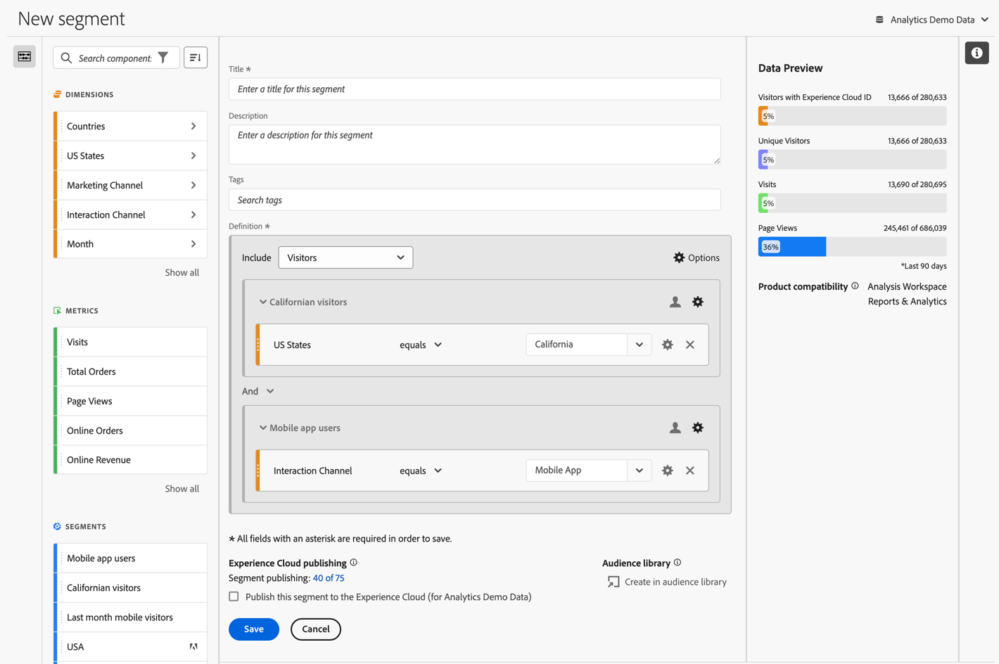
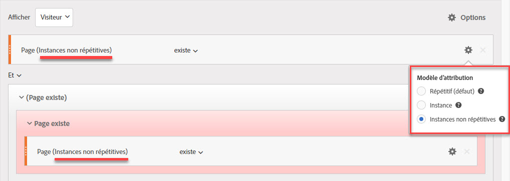
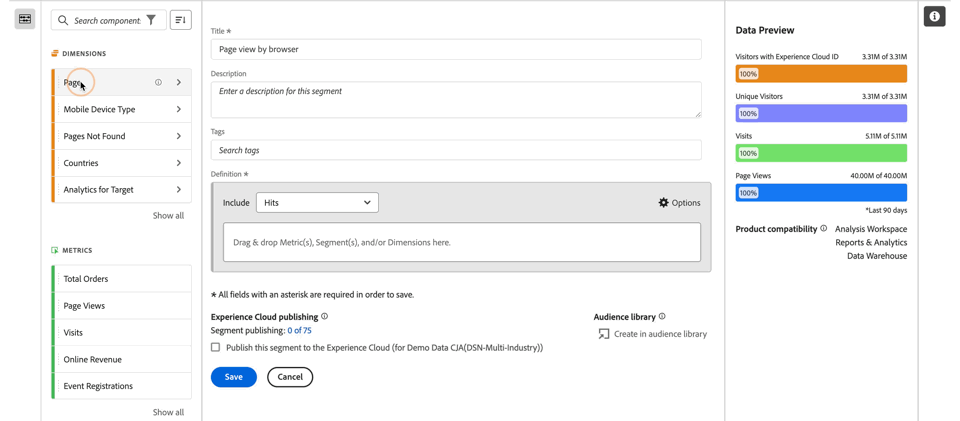
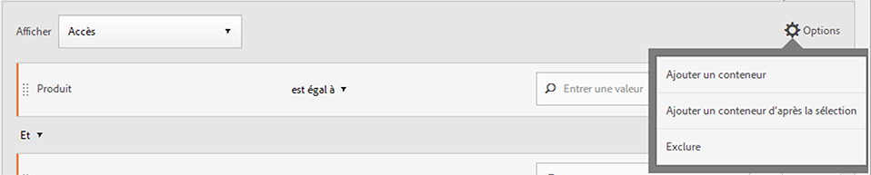
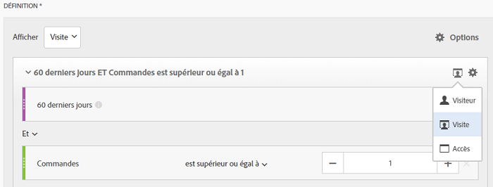
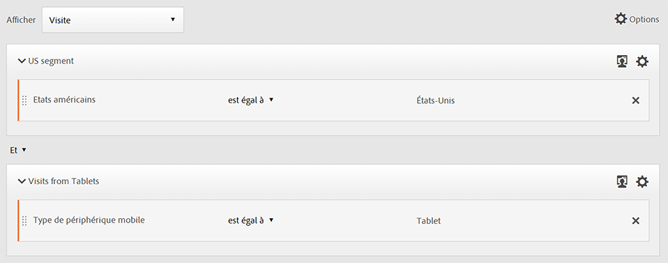

# Créateur de segments {#segment-builder}

>[!CONTEXTUALHELP]
>id="components_segments_productcompatibility"
>title="Compatibilité des produits"
>abstract="Un petit nombre de critères de segment disponibles ne sont pas compatibles avec tous les outils Adobe Analytics. Les outils compatibles avec le segment sont indiqués dans cette liste. Pour rendre un segment compatible avec tous les outils Adobe Analytics, modifiez vos critères."

>[!CONTEXTUALHELP]
>id="components_filters_createaudience"
>title="Créer une audience"
>abstract="Les audiences peuvent être créées à partir d’un segment et partagées avec Adobe Experience Platform pour activation."

>[!CONTEXTUALHELP]
>id="components_filters_datapreview"
>title="Prévisualisation des données"
>abstract="Compare les données de ce segment aux données de la vue de données. Le pourcentage de prévisualisation est basé sur le nombre total dans la vue de données des **90 derniers jours**.  Si la prévisualisation ne se charge pas, il se peut que votre connexion soit encore en train de remplir les données."

La boîte de dialogue **[!UICONTROL Créateur de segments]** permet de créer des segments ou de modifier des segments existants. La boîte de dialogue est intitulée **[!UICONTROL Nouveau segment]** ou **[!UICONTROL Modifier le segment]** pour les segments que vous créez ou gérez à partir du gestionnaire [[!UICONTROL Segment]](/help/components/segmentation/segmentation-workflow/seg-manage.md).

>[!BEGINTABS]

>[!TAB Créateur de segments]

>[!TAB Créer ou modifier un segment]

>[!ENDTABS]

1. Spécifiez les détails suivants ( est obligatoire) :

   | Élément | Description |
   | --- | --- |
   | **[!UICONTROL Suite de rapports]** | Vous pouvez sélectionner la suite de rapports pour le segment. |
   | **[!UICONTROL Segment de projet uniquement]** | Une zone d’informations expliquant que le segment n’est visible que dans le projet dans lequel il est créé et que le segment ne sera pas ajouté à votre liste de composants. Activez **[!UICONTROL Rendre ce segment disponible pour tous vos projets et l’ajouter à votre liste de composants]** pour modifier ce paramètre. Cette zone d’informations n’est visible que lorsque vous créez un [segment rapide](seg-quick.md) et que vous convertissez le segment rapide en segment standard à l’aide de l’interface **[!UICONTROL Ouvrir le créateur]** à partir de l’[!UICONTROL Segment rapide]. |
   | **[!UICONTROL Titre]**  | Nommez le segment, par exemple `Last month mobile visitors`. |
   | **[!UICONTROL Description]** | Fournissez une description du segment, par exemple : `Segment to define the mobile customers for the last month`. |
   | **[!UICONTROL Étiquettes]** | Organisez le segment en créant ou en appliquant une ou plusieurs balises. Commencez à saisir du texte pour rechercher les balises existantes que vous pouvez sélectionner. Ou appuyez sur **[!UICONTROL ENTRÉE]** pour ajouter une nouvelle balise. Sélectionnez  pour supprimer une étiquette. |
   | **[!UICONTROL Définition]**  | Définissez votre segment à l’aide du [créateur de définitions](#definition-builder). |

   {style="table-layout:auto"}

1. Pour vérifier si votre définition de segment est correcte, utilisez l’aperçu constamment mis à jour des résultats du segment en haut à droite.
1. Pour publier le segment dans Experience Cloud, sélectionnez **[!UICONTROL Publier ce segment dans Experience Cloud (par *suite de rapports*)]**. Voir [Publication de segments dans Experience Cloud](/help/components/segmentation/segmentation-workflow/seg-publish.md) pour plus d’informations.
1. Sélectionnez :
   * **[!UICONTROL Enregistrer]** pour enregistrer le segment.
   * **[!UICONTROL Enregistrer sous]** pour enregistrer une copie du segment.
   * **[!UICONTROL Supprimer]** pour supprimer le segment.
   * **[!UICONTROL Annuler]** pour annuler les modifications apportées au segment ou annuler la création d’un segment.

## Créateur de définitions

Le créateur de définitions permet de créer votre définition de segment. Dans cette construction, vous utilisez des composants, des conteneurs, des opérateurs et une logique.

Vous pouvez configurer le type et l’étendue de votre définition :

1. Pour spécifier le type de votre définition, indiquez si vous souhaitez que la définition soit inclusive ou exclusive. Sélectionnez  **[!UICONTROL Options]** et dans le menu déroulant **[!UICONTROL Inclure]** ou **[!UICONTROL Exclure]**.
1. Pour spécifier la portée de votre définition, choisissez dans le menu déroulant **[!UICONTROL Inclure]** ou **[!UICONTROL Exclure]** si vous souhaitez que la portée de la définition soit **[!UICONTROL Accès]**, **[!UICONTROL Visites]** ou **[!UICONTROL Visiteurs]**.

Vous pourrez toujours modifier ces paramètres ultérieurement.

### Composants

Une partie essentielle de la construction de votre définition de segment consiste à utiliser des dimensions, des mesures, des segments et des périodes existants. Tous ces composants sont disponibles à partir du panneau des composants dans le créateur de segments.

{width=100%}

Pour ajouter un composant :

1. Faites glisser et déposez un composant du panneau Composants sur **[!UICONTROL Faites glisser et déposez ici les mesures, les segments et/ou les dimensions]**. Vous pouvez utiliser la fonction  dans la barre des composants pour rechercher des composants spécifiques.
1. Spécifiez les détails du composant. Par exemple, sélectionnez une valeur dans **[!UICONTROL Sélectionner la valeur]**. Ou Saisissez une valeur. Le contenu et la manière dont vous pouvez spécifier une ou plusieurs valeurs dépendent du composant et de l’opérateur.
1. Modifiez éventuellement l’opérateur par défaut. Par exemple, de **[!UICONTROL égal]** à **[!UICONTROL égal à n’importe lequel]**. Consultez [Opérateurs](../seg-reference/seg-operators.md) pour une présentation détaillée des opérateurs disponibles.

Pour ajouter un composant, procédez comme suit :

* Sélectionnez un nouvel opérateur pour le composant dans le menu déroulant opérateur .
* Sélectionnez ou spécifiez une autre valeur pour l’opérateur, le cas échéant.
* Si le type de composant est une dimension, vous pouvez définir le modèle d’attribution. Consultez [Modèle d’attribution](#attribution) pour en savoir plus.

Pour ajouter un composant, procédez comme suit :

* Sélectionnez  dans un composant.

### Conteneurs

Vous pouvez regrouper plusieurs composants dans un ou plusieurs conteneurs et définir une logique au sein des conteneurs et entre ceux-ci. Les conteneurs vous permettent de créer des définitions complexes pour votre segment.

{Width=100%}

* Pour ajouter un conteneur, sélectionnez **[!UICONTROL Ajouter un conteneur]** dans  **[!UICONTROL Options]**.
* Pour ajouter un composant existant au conteneur, faites-le glisser dans le conteneur.
* Pour ajouter un autre composant au conteneur, faites glisser un composant du panneau des composants et déposez-le dans le conteneur. Utilisez la ligne d’insertion bleue comme guide.
* Pour ajouter un autre composant à l’extérieur du conteneur, faites glisser un composant depuis le panneau des composants à l’extérieur du conteneur, mais à l’intérieur du conteneur de définition principal. Utilisez la ligne d’insertion bleue comme guide.
* Pour modifier la logique entre les composants d’un conteneur, entre les conteneurs ou entre un conteneur et un composant, sélectionnez les opérateurs **[!UICONTROL Et]**, **[!UICONTROL Ou]** et **[!UICONTROL Alors]** appropriés. Lorsque vous sélectionnez **[!UICONTROL Ensuite]**, vous transformez le segment en segment séquentiel. Voir [Créer un segment séquentiel](seg-sequential-build.md) pour plus d’informations.
* Pour changer le niveau du conteneur, sélectionnez  **[!UICONTROL Accès]**,  **[!UICONTROL Visites]** ou Visiteurs **&#x200B;**.

Vous pouvez utiliser  dans un conteneur pour les actions suivantes :

| Action du conteneur | Description |
|---|---|
| **[!UICONTROL Ajouter un conteneur]** | Ajoutez un conteneur imbriqué au conteneur. |
| **[!UICONTROL Exclure]** | Excluez le résultat du conteneur dans la définition de segment. Une fine barre rouge à gauche identifie un conteneur d’exclusion. |
| **[!UICONTROL Inclure]** | Incluez le résultat du conteneur dans la définition de segment. L’inclusion est le paramètre par défaut. Une fine barre grise à gauche identifie un conteneur d’inclusion. |
| **[!UICONTROL Nommer le conteneur]** | Renommez le conteneur à partir de sa description par défaut. Saisissez un nom dans le champ de texte. Si vous ne fournissez aucune entrée, la description par défaut est utilisée. |
| **[!UICONTROL Supprimer le conteneur]** | Supprimez le conteneur de la définition. |

## Périodes

Vous pouvez créer des segments qui contiennent des périodes flottantes. Vous pouvez ainsi répondre aux questions sur les campagnes ou les événements en cours. Par exemple, vous pouvez créer un segment qui comprend *toute personne ayant effectué un achat en ligne au cours des 60 derniers jours*.

>[!BEGINSHADEBOX]

Voir  [Périodes flottantes dans les segments](https://video.tv.adobe.com/v/25403/?quality=12&learn=on){target="_blank"} pour une vidéo de démonstration.

>[!ENDSHADEBOX]

## Empilement de segments {#stack}

Vous pouvez créer un segment à l’aide de segments. Lorsque vous utilisez des segments dans un segment, vous pouvez optimiser le segment et réduire la complexité.

Imaginez que vous souhaitiez effectuer une segmentation sur la combinaison du canal d’interaction (5) et des états américains (50). Vous pouvez créer 250 segments, chacun pour la combinaison unique de type d’appareil (téléphone mobile ou tablette) et d’état des États-Unis. Pour obtenir les utilisateurs de la tablette en Californie, vous devez utiliser l’un des 250 segments :

Vous pouvez également définir 55 segments : 50 segments pour les états américains et 5 segments pour les canaux d’interaction possibles. Empilez ensuite les segments pour obtenir les mêmes résultats. Pour obtenir les utilisateurs de l’application mobile en Californie, vous devez empiler deux segments :

## Attribution {#attribution}

>[!CONTEXTUALHELP]
>id="components_filters_attribution_repeating"
>title="Répétitif"
>abstract="Inclut des instances et des valeurs persistantes pour la dimension."

>[!CONTEXTUALHELP]
>id="components_filters_attribution_instance"
>title="Instance"
>abstract="Inclut des instances pour la dimension."

>[!CONTEXTUALHELP]
>id="components_filters_attribution_nonrepeatinginstance"
>title="Instance non répétitive"
>abstract="Inclut des instances uniques (non répétées) pour la dimension."

Lorsque vous utilisez une dimension dans le créateur de segments, vous disposez des options permettant de spécifier le modèle d’attribution pour cette dimension. Le modèle d’attribution que vous sélectionnez détermine si les données sont admissibles pour la condition que vous avez spécifiée pour le composant de dimension.

Sélectionnez  dans le composant de dimension, puis sélectionnez l’un des modèles d’attribution dans la fenêtre contextuelle :

| Modèles | Description |
|---|---|
| **[!UICONTROL Modèle répétitif (par défaut)]** | Incluez l’instance et les valeurs persistantes pour la dimension afin de déterminer la qualification. |
| **[!UICONTROL Instance]** | Incluez uniquement des valeurs d’instance pour la dimension afin de déterminer la qualification. |
| **[!UICONTROL Instance non répétitive]** | Incluez des valeurs d’instance uniques (non répétitives) pour la dimension afin de déterminer la qualification. |

### Exemple

Dans le cadre d’une définition de segment, vous avez spécifié la condition suivante : Le nom de page est égal à Femmes. Similaire à l’exemple ci-dessus. Vous répétez cette définition de segment à l’aide des deux autres modèles d’attribution. Vous disposez donc de trois segments ayant chacun leur propre modèle d’attribution :

* Page Femmes - Attribution - Répétition (par défaut)
* Page Femmes - Attribution - Instance
* Page Femmes - Attribution - Instance non répétitive

Le tableau ci-dessous explique, pour chaque modèle d’attribution, les événements entrants qualifiés  pour cette condition.

| Page Femmes - Attribution -  *Modèle d’attribution* | Événement 1 :  Nom de page égal Femmes | Événement 2 :  Nom de page égal  Hommes | Événement 3 :  Nom de page égal Femmes | Événement 4 :  Nom de page égal Femmes (persistant) | Événement 5 :  Nom depage égal Passage en caisse | Événement 6 :  Nom de page égal Femmes | Événement 7 :  Nom de page égal Accueil |
|---|:---:|:---:|:---:|:---:|:---:|:---:|:--:|
| Répétition (par défaut) |  |  |  |  |  |  |  |
| Instance |  |  |  |  |  |  |  |
| Instance non répétitive |  |  |  |  |  |  |  |

Un exemple de rapport sur les événements utilisant les trois segments se présente comme suit :

<!--

The [!UICONTROL Segment Builder] lets you build simple or complex segments that identify visitor attributes and actions across visits and page hits. It provides a canvas to drag and drop metric dimensions, events, or other segments in order to segment visitors based on hierarchy logic, rules, and operators.

There are several ways to access the Segment Builder:

* **Analytics top navigation**: Click **[!UICONTROL Analytics]** > **[!UICONTROL Components]** > **[!UICONTROL Segments]**.
* **[!UICONTROL Analysis Workspace]**: Click **[!UICONTROL Analytics]** > **[!UICONTROL Workspace]**, open a project and click **[!UICONTROL + New]** > **[!UICONTROL Create Segment]**.
* **[!UICONTROL Report Builder]**: [Add or edit segments in Report Builder](https://experienceleague.adobe.com/en/docs/analytics/analyze/report-builder/work-with-segments).

## Builder criteria {#section_F61C4268A5974C788629399ADE1E6E7C}

You can add rule definitions and containers to define your segments.

1. **[!UICONTROL Title]**: Name the segment.
1. **[!UICONTROL Description]**: Provide a description for the segment. 
1. **[!UICONTROL Tags]**: [Tag the segment](/help/components/segmentation/segmentation-workflow/seg-workflow.md) you are creating by picking from a list of existing tags or creating a new tag.
1. **[!UICONTROL Definitions]**: This is where you [build and configure segments](/help/components/segmentation/segmentation-workflow/seg-workflow.md), add rules, and nest and sequence containers. 
1. **[!UICONTROL Show]**: (Top Container selector.) Lets you select the top-level [container](/help/components/segmentation/seg-overview.md) ( [!UICONTROL Visitor], [!UICONTROL Visit], [!UICONTROL Hit]). The default top-level container is the Hit container.
1. **[!UICONTROL Options]**: (gear) icon

   * **[!UICONTROL + Add container]**: Lets you add a new container (below the top-level container) to the segment definition.
   * **[!UICONTROL Exclude]**: Lets you define the segment by excluding one or more dimensions, segments, or metrics.

1. **[!UICONTROL Dimensions]**: Components are dragged and dropped from the Dimensions list (orange sidebar).
1. **[!UICONTROL Operator]**: You can compare and constrain values using selected operators.
1. **[!UICONTROL Value]**: The value you entered or selected for the dimension or segment or metric.
1. **[!UICONTROL Attribution Models]**: Available for dimensions only, these models determine what values in a dimension to segment for. Dimension models are particularly useful in sequential segmentation.

   * **[!UICONTROL Repeating]** (default): Includes instances and persisted values for the dimension.
   * **[!UICONTROL Instance]**: Includes instances for the dimension.
   * **[!UICONTROL Non-repeating instance]**: Includes unique instances (non-repeating) for the dimension. This is the model applied in Flow when repeat instances are excluded.

   

   **Example: Hit segment where eVar1 = A** 

   |  Example  | A  | A  |  A (persisted) | B  | A  | C  |
   |---|---|---|---|---|---|---|
   |  Repeating  | X  | X  | X  | -  | X  | -  |
   |  Instance  | X  | X  | - | - | X | - |
   |  Non-repeating instance  | X | - | - | -  | X  | -  |

1. **[!UICONTROL And/Or/Then]**: Assigns the [!UICONTROL AND/OR/THEN] operators between containers or rules. The THEN operator lets you [define sequential segments](/help/components/segmentation/segmentation-workflow/seg-sequential-build.md).
1. **[!UICONTROL Metric]**: (Green sidebar) Metric that was dragged and dropped from the Metrics list.
1. **[!UICONTROL Comparison]** operator: You can compare and constrain values using selected operators.
1. **[!UICONTROL Value]**: The value you entered or selected for the dimension or segment or metric.
1. **[!UICONTROL X]**: (Delete) Lets you delete this part of the segment definition.
1. **[!UICONTROL Experience Cloud publishing]**: Publishing an Adobe Analytics segment to the Experience Cloud lets you use the segment for marketing activity in [!DNL Audience Manager] and in other activation channels. [Learn more...](/help/components/segmentation/segmentation-workflow/seg-publish.md)
1. **[!UICONTROL Audience library]**: Adobe's audience services manage the translation of visitor data into audience segmentation. As such, creating and managing audiences is similar to creating and using segments, with the added ability to share the audience segment to the Experience Cloud. [Learn more...](https://experienceleague.adobe.com/docs/core-services/interface/audiences/audience-library.html)
1. **[!UICONTROL Search]**: Searches the list of dimensions, segments, or metrics.
1. **[!UICONTROL Dimensions]**: (List) Click the header to expand.
1. **[!UICONTROL Metrics]**: Click the header to expand.
1. **[!UICONTROL Segments]**: Click the header to expand.
1. **[!UICONTROL Report suite selector]**: Lets you select the report suite that this segment will be saved under. You can still utilize the segment in all report suites.
1. **[!UICONTROL Segment Preview]**: Lets you preview the key metrics to see whether you have a valid segment and how broad the segment is. Represents the breakdown of the data set you can expect to see if you apply this segment. Shows 3 concentric circles and a list to show the number and percentage of matches for [!UICONTROL Hits], [!UICONTROL Visits], and [!UICONTROL Visitors] for a segment run against a data set. This chart is updated immediately after you create or make changes to your segment definition.
1. **[!UICONTROL Product Compatibility]**: Provides a list of which Adobe Analytics products (Analysis Workspace, Data Warehouse) with which the segment you created is compatible. Most segments are compatible with all products. However, not all operators and dimensions are compatible with all Analytics products, especially [Data Warehouse](/help/components/segmentation/seg-reference/seg-compatibility.md). This chart is updated immediately after you make changes to your segment definition.
1. **[!UICONTROL Save]** or **[!UICONTROL Cancel]**: Saves or cancels the segment. After clicking **[!UICONTROL Save]**, you are taken to the Segment Manager where you can manage the segment.

## Build segments {#build-segments}

1. Simply drag a Dimension, Segment, or Metric Event from the left pane to the [!UICONTROL Definitions] field.

   

   The default top-level [!UICONTROL Hit] container is shown after dragging an element to [!UICONTROL Definitions]. You can change the container type to Visit or Visitor from the **[!UICONTROL Show]** drop-down menu.

1. Set the [operator](/help/components/segmentation/seg-reference/seg-operators.md) from the drop-down menu.
1. Enter or select a value for the item selected.
1. Add additional containers if needed, using **[!UICONTROL And]**, **[!UICONTROL Or]**, or **[!UICONTROL Then]** rules.
1. After placing the containers and setting the rules, see the results of the segment in the validation chart at the top right. The validator indicates the percentage and absolute number of page views, visits, and unique visitors that match the segment you created.
1. Under **[!UICONTROL Tags]**, [tag](/help/components/segmentation/segmentation-workflow/seg-tag.md) the container by selecting an existing tag or creating a new one.
1. Click **[!UICONTROL Save]** to save the segment.

You are now taken to the [Segment Manager](/help/components/segmentation/segmentation-workflow/seg-manage.md), where you can tag, share, and manage your segment in multiple ways.

## Add containers {#section_1C38F15703B44474B0718CEF06639EFD}

You can [build a framework of containers](/help/components/segmentation/seg-overview.md) and then place logic rules and operators between.

1. Click **[!UICONTROL Options > Add Container]**.

   

   A new [!UICONTROL Hit] container opens without a [!UICONTROL Hit] (Page View) identified.

   

1. Change the container type as needed.
1. Drag a Dimension, Segment, or Event from the left pane to the container.
1. Continue to add new containers from the top-level **[!UICONTROL Options]** > **[!UICONTROL Add container]** button at the top of the definition, or add containers from within a container to nest logic.

   **OR**

   Select one or more rules and then click **[!UICONTROL Options]** > **[!UICONTROL Add container from selection]**. This turns your selection into a separate container.

## Use date ranges {#concept_252A83D43B6F4A4EBAB55F08AB2A1ACE}

You can build segments that contain rolling date ranges in order to answer questions about ongoing campaigns or events.

For example, you can easily build a segment that includes "everyone who has made a purchase over the past 60 days".

You create a Visit container and within it, add the [!UICONTROL Last 60 days] time range and the metric [!UICONTROL Orders is greater than or equal to 1], with an AND operator:

>[!BEGINSHADEBOX]

See  [Rolling date ranges in segments](https://video.tv.adobe.com/v/25403?quality=12&learn=on){target="_blank"} for a demo video.

>[!ENDSHADEBOX]

## Stack segments {#task_58140F17FFD64FF1BC30DC7B0A1B0E6D}

Stacking segments works by combining the criteria in each segment using an 'and' operator, and then applying the combined criteria. This can be done in a Workspace project directly or in segment builder. 

For example, stacking a "mobile phone users" segment and a "US geography" segment would return data only for mobile phone users in the US.

Think of these segments as building blocks or modules that you can include in a segment library, for users to use as they see fit. That way, you can dramatically reduce the number of segments needed. For example, assume you have 40 segments:

* 20 for mobile phone users in different countries (US_mobile, Germany_mobile, France_mobile, Brazil_mobile, etc.) 
* 20 for tablet users in different countries (US_tablet, Germany_tablet, France_tablet, Brazil_tablet, etc.)

By using segment stacking, you can reduce your segment count to 22 and stack them as needed. You would need to create these segments:

* one segment for mobile users 
* one segment for tablet users 
* 20 segments for the different geographies

>[!NOTE]
>
>When stacking two segments, they are by default joined by an AND statement. This cannot be changed to an OR statement.

1. Go to the Segment Builder.
1. Provide a title and description for the segment.

   Step Result 1. Click **[!UICONTROL Show Segments]** to bring up the list of segments in the left navigation.

   Step Result 1. Drag and drop the segments you want to stack to the segment definition canvas. Here is an example of a segment that stacks the existing segments "Visits from Tablets" and "US Geo":

   

1. Save the segment.

   Step Result 

-->

## Modèles de segment {#concept_5098446CC78D441E93B8E4D1D1EA6558}

Les modèles de segment sont fournis pour les cas d’utilisation courants de segmentation, tels que « Premières visites » ou « Visites depuis des appareils mobiles ». Ils sont disponibles dans les projets Workspace et dans le Créateur de segments en tant que blocs de création pour les nouveaux segments.

Les modèles sont identifiés par le logo « A » d’Adobe. Vous trouverez ci-dessous un exemple des modèles :

<table id="table_98B87D807E9344C9BEBF072C65D87B1B"> 
 <thead> 
  <tr> 
   <th colname="col1" class="entry"> Nom du modèle </th> 
   <th colname="col2" class="entry"> Définition </th> 
  </tr> 
 </thead>
 <tbody> 
  <tr> 
   <td colname="col1"> Abandonner le panier </td> 
   <td colname="col2">Affiche les données concernant les visiteurs qui ont ajouté des éléments à leur panier mais n’ont rien commandé. Dans la définition de segment, le conteneur est Visite. La règle pour ce segment séquentiel est la suivante : 
 l’option Ajouts au panier n’a pas la valeur nulle 
 
Alors 
 
Les commandes sont égales à 0. 
 </td> 
  </tr> 
  <tr> 
   <td colname="col1"> Premières visites </td> 
   <td colname="col2">Affiche des données concernant les visiteurs qui ont visité le site au maximum une [1] fois. Dans la définition de segment, le conteneur est Visite. La règle est la suivante : 
Nombre de visites = 1. 
 </td> 
  </tr> 
  <tr> 
   <td colname="col1"> Non-acheteurs </td> 
   <td colname="col2">Affiche les données concernant les visiteurs qui n’ont pas participé à un événement de commande. Dans la définition de segment, le conteneur est Visiteur. Ce segment utilise la logique Exclure. La règle est la suivante : 
Les commandes n’ont pas la valeur nulle. 
 </td> 
  </tr> 
  <tr> 
   <td colname="col1"> Hors visite sur une seule page (sans rebonds) </td> 
   <td colname="col2">Affiche les données concernant les visiteurs qui ont effectué plus d’une visite. Dans la définition de segment, le conteneur est Visiteur. Ce segment utilise la logique Exclure. La règle est la suivante : 
L’accès unique n’a pas la valeur nulle. 
 </td> 
  </tr> 
  <tr> 
   <td colname="col1"> Référencement payant </td> 
   <td colname="col2">Affiche les données concernant les visiteurs provenant d’une recherche payante. Dans la définition de segment, le conteneur est Visite. La règle est la suivante : 
Recherche payée = 1. 
 </td> 
  </tr> 
  <tr> 
   <td colname="col1"> Acheteurs </td> 
   <td colname="col2">Affiche les données concernant les visiteurs qui ont participé à un événement de commande. Dans la définition de segment, le conteneur est Visiteur. La règle est la suivante : 
Les commandes n’ont pas la valeur nulle. 
 </td> 
  </tr> 
  <tr> 
   <td colname="col1"> Visites renouvelées </td> 
   <td colname="col2">Affiche les données concernant les visiteurs qui ont effectué au moins une visite. Dans la définition de segment, le conteneur est Visite. La règle est la suivante : 
Nombre de visites supérieur à 1. 
 </td> 
  </tr> 
  <tr> 
   <td colname="col1"> Visites de page unique </td> 
   <td colname="col2"> Affiche les données provenant de visites dans lesquelles vous consultez une seule valeur de page, même si vous pouvez soumettre plusieurs pages vues au cours de cette visite. Les visites de page unique avec des événements de lien de sortie sont incluses dans le segment. Dans la définition de segment, le conteneur est Visite. La règle est la suivante : 
Visites de page unique = 1. 
 </td> 
  </tr> 
  <tr> 
   <td colname="col1"> Produit affiché non ajouté au panier </td> 
   <td colname="col2">Affiche les données concernant les visiteurs qui ont affiché des produits mais sans les ajouter au panier. Dans la définition de segment, le conteneur est Visite. La règle pour ce segment séquentiel est la suivante : 
Les consultations produits n’ont pas la valeur nulle 
 
Alors 
 
 Les ajouts au panier sont égaux à 0. 
 </td> 
  </tr> 
  <tr> 
   <td colname="col1"> Visites à partir de la campagne </td> 
   <td colname="col2">Affiche les données concernant les visiteurs venus par l’entremise des campagnes. Dans la définition de segment, le conteneur est Visite. La règle est la suivante : 
Le code de suivi n’a pas la valeur nulle. 
 </td> 
  </tr> 
  <tr> 
   <td colname="col1"> Visites depuis des appareils mobiles </td> 
   <td colname="col2">Affiche les données concernant les visiteurs utilisant des appareils mobiles. Dans la définition de segment, le conteneur est Visite. La règle est la suivante : 
Appareil mobile différent de zéro. 
 </td> 
  </tr> 
  <tr> 
   <td colname="col1"> Visites depuis la recherche naturelle </td> 
   <td colname="col2">Affiche les données concernant les visiteurs ne provenant pas d’une recherche payante. Dans la définition de segment, le conteneur est Visite. La règle est la suivante : 
Recherche payée = 0. 
 </td> 
  </tr> 
  <tr> 
   <td colname="col1"> Visites à partir d’appareils non mobiles </td> 
   <td colname="col2">Affiche les données concernant les visiteurs n’utilisant pas d’appareils mobiles. Dans la définition de segment, le conteneur est Visite. Ce segment utilise la logique Exclure. La règle est la suivante : 
Type d’appareil mobile = Téléphone mobile 
 
Ou 
 
Type d’appareil mobile = Tablette. 
 </td> 
  </tr> 
  <tr> 
   <td colname="col1"> Visites à partir de téléphones </td> 
   <td colname="col2">Affiche les données concernant les visiteurs utilisant des téléphones. Dans la définition de segment, le conteneur est Visite. La règle est la suivante : 
Type d’appareil = Téléphone mobile. 
 </td> 
  </tr> 
  <tr> 
   <td colname="col1"> Visites à partir de moteurs de recherche </td> 
   <td colname="col2">Affiche les données concernant les visiteurs venus par l’entremise des moteurs de recherche. Dans la définition de segment, le conteneur est Visite. La règle est la suivante : 
Type de référent = Moteurs de recherche 
 </td> 
  </tr> 
  <tr> 
   <td colname="col1"> Visites depuis les sites sociaux </td> 
   <td colname="col2">Affiche les données concernant les visiteurs venus par l’entremise des sites sociaux. Dans la définition de segment, le conteneur est Visite. La règle est la suivante : 
Type de référent = Réseaux sociaux. 
 </td> 
  </tr> 
  <tr> 
   <td colname="col1"> Visites à partir de tablettes </td> 
   <td colname="col2">Affiche les données concernant les visiteurs utilisant des tablettes. Dans la définition de segment, le conteneur est Visite. La règle est la suivante : 
Type d’appareil = Tablette. 
 </td> 
  </tr> 
  <tr> 
   <td colname="col1"> Visites avec cookie d’identifiant visiteur </td> 
   <td colname="col2">Affiche les données concernant les visiteurs de votre site, où un cookie persistant est requis. Dans la définition de segment, le conteneur est Visite. La règle est la suivante : 
Cookie persistant = 1. 
 </td> 
  </tr> 
 </tbody> 
</table>
