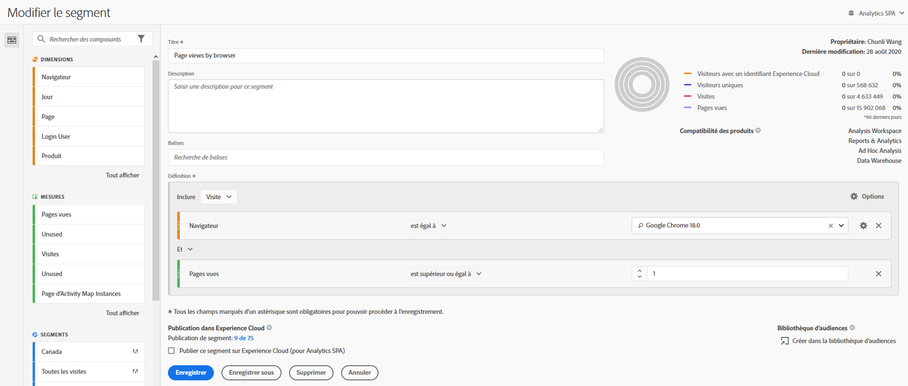
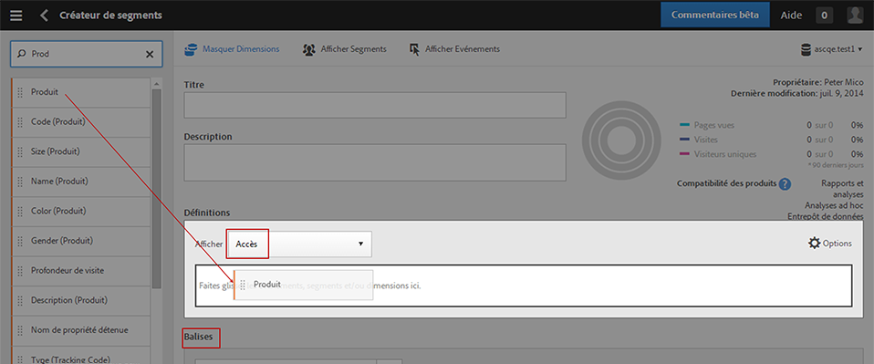

# Créateur de segments

Le [!UICONTROL Créateur de segments] permet de créer des segments simples ou complexes qui identifient les attributs et actions des visiteurs lors les visites et accès aux pages. Il offre un canevas permettant de faire glisser et de déposer des dimensions de mesure, des événements ou d’autres segments afin de segmenter les visiteurs selon une logique de hiérarchie, des règles et des opérateurs.

Il existe plusieurs façons d’accéder au Créateur de segments :

* **Volet de navigation supérieur d’Analytics** : cliquez sur **[!UICONTROL Analytics]** > **[!UICONTROL Composants]** > **[!UICONTROL Segments]**.
* **[!UICONTROL Analysis Workspace]** : cliquez sur **[!UICONTROL Analytics]** > **[!UICONTROL Workspace]**, ouvrez un projet et cliquez sur **[!UICONTROL + Nouveau]** > **[!UICONTROL Créer un segment]**.
* **[!UICONTROL Report Builder]** : [ajoutez ou modifiez des segments dans le créateur de segments](https://experienceleague.adobe.com/docs/analytics/analyze/report-builder/data-requests/segmentation.html?lang=fr).

## Critères du créateur {#section_F61C4268A5974C788629399ADE1E6E7C}

Vous pouvez ajouter des définitions de règles et des conteneurs pour définir vos segments.

1. **[!UICONTROL Titre]** : nommez le segment.
1. **[!UICONTROL Description]** : fournissez une description du segment.
1. **[!UICONTROL Balises]** : [marquez le segment](/help/components/segmentation/segmentation-workflow/seg-workflow.md) que vous créez en effectuant une sélection depuis une liste de balises existantes ou en créant une balise.
1. **[!UICONTROL Définitions]** : il s’agit de l’espace de travail dans lequel vous [créez et configurez des segments](/help/components/segmentation/segmentation-workflow/seg-workflow.md), ajoutez des règles, et imbriquez et séquencez des conteneurs.
1. **[!UICONTROL Afficher]** : (Sélecteur Conteneur supérieur.) Permet de sélectionner le [conteneur de niveau supérieur](/help/components/segmentation/seg-overview.md) ([!UICONTROL Visiteur], [!UICONTROL Visite], [!UICONTROL Accès]). Le conteneur de niveau supérieur par défaut est le conteneur Accès.
1. **[!UICONTROL Options]** : icône (engrenage)

   * **[!UICONTROL + Ajouter un conteneur]** : permet d’ajouter un nouveau conteneur (sous le conteneur de niveau supérieur) à la définition de segment.
   * **[!UICONTROL Exclure]** : permet de définir le segment en excluant un ou plusieurs segments, dimensions ou mesures.

1. **[!UICONTROL Dimensions]** : les composants sont glissés et déposés depuis la liste Dimensions (barre latérale orange).
1. **[!UICONTROL Opérateur]** : vous pouvez comparer et contraindre des valeurs en utilisant certains opérateurs.
1. **[!UICONTROL Valeur]** : valeur que vous avez saisie ou sélectionnée pour la dimension, le segment ou la mesure.
1. **[!UICONTROL Modèles d’attribution]** : disponibles uniquement pour les dimensions, ces modèles déterminent les valeurs d’une dimension pour lesquelles effectuer un segment. Les modèles de dimension sont particulièrement utiles pour la segmentation séquentielle.

   * **[!UICONTROL Répétitif]** (défaut) : inclut des instances et des valeurs persistantes pour la dimension.
   * **[!UICONTROL Instance]** : inclut des instances pour la dimension.
   * **[!UICONTROL Instances non répétitives]** : inclut des instances uniques (non répétées) pour la dimension. Il s’agit du modèle appliqué dans le flux lorsque les instances de répétition sont exclues.

   

   **Exemple : segment d’accès où eVar1 = A**

   | Exemple | A | A | A (persistante) | B | A | C |
   |---|---|---|---|---|---|---|
   | Répétitif | X | X | X | - | X | - |
   | Instance | X | X | - | - | X | - |
   | Instance non répétitive | X | - | - | - | X | - |
1. **[!UICONTROL And/Or/Then]** : affecte les opérateurs [!UICONTROL AND/OR/THEN] entre des conteneurs ou règles. L’opérateur THEN permet de [définir des segments séquentiels](/help/components/segmentation/segmentation-workflow/seg-sequential-build.md).
1. **[!UICONTROL Mesure]** : (barre latérale verte) qui a été glissée-déposée depuis la liste Mesures.
1. **[!UICONTROL Opérateur de comparaison]** : vous pouvez comparer et contraindre des valeurs en utilisant certains opérateurs.
1. **[!UICONTROL Valeur]** : valeur que vous avez saisie ou sélectionnée pour la dimension, le segment ou la mesure.
1. **[!UICONTROL X]** : (Supprimer) permet de supprimer la partie en question de la définition de segment.
1. **[!UICONTROL Publication Experience Cloud]** : la publication d’un segment Adobe Analytics dans Experience Cloud vous permet d’utiliser ce segment pour l’activité marketing dans [!DNL Audience Manager] et dans d’autres canaux d’activation. [En savoir plus...](/help/components/segmentation/segmentation-workflow/seg-publish.md)
1. **[!UICONTROL Bibliothèque d’audiences]** : les services d’audience d’Adobe gèrent la conversion des données de visiteur en segmentation de l’audience. Ainsi, la création et la gestion des audiences sont similaires à la création et à l’utilisation de segments, avec la possibilité de partager les segments d’audience dans Experience Cloud. [En savoir plus...](https://experienceleague.adobe.com/docs/core-services/interface/audiences/audience-library.html?lang=fr)
1. **[!UICONTROL Rechercher]** : permet d’effectuer des recherches dans la liste de dimensions, de segments ou de mesures.
1. **[!UICONTROL Dimensions]** : (Liste) cliquez sur l’en-tête pour développer la liste.
1. **[!UICONTROL Mesures]** : cliquez sur l’en-tête pour développer la liste.
1. **[!UICONTROL Segments]** : cliquez sur l’en-tête pour développer la liste.
1. **[!UICONTROL Sélecteur de suite de rapports]** : permet de sélectionner la suite de rapports sous laquelle ce segment sera enregistré. Vous pouvez tout de même utiliser le segment dans toutes les suites de rapport.
1. **[!UICONTROL Aperçu de segments]** : permet de prévisualiser les mesures clés afin de vérifier que votre segment est valide et consulter sa largeur. Représente la répartition du jeu de données auquel vous pouvez vous attendre si vous appliquez ce segment. Affiche 3 cercles concentriques et une liste afin d’afficher le nombre et le pourcentage de correspondances pour [!UICONTROL Accès], [!UICONTROL Visites] et [!UICONTROL Visiteurs] pour une exécution de segment par rapport à un jeu de données. Ce graphique est mis à jour immédiatement une fois que vous avez créé ou apporté des modifications à votre définition de segment.
1. **[!UICONTROL Compatibilité des produits]** : fournit une liste des produits Adobe Analytics (Analysis Workspace, Data Warehouse) avec lesquels le segment que vous avez créé est compatible. La plupart des segments sont compatibles avec tous les produits. Cependant, tous les opérateurs et dimensions ne sont pas compatibles avec tous les produits Analytics, en particulier [Data Warehouse](/help/components/segmentation/seg-reference/seg-compatibility.md). Ce graphique est mis à jour instantanément quand vous modifiez votre définition de segment.
1. **[!UICONTROL Enregistrer]** ou **[!UICONTROL Annuler]** : permet d’enregistrer ou d’annuler le segment. Après avoir cliqué sur **[!UICONTROL Enregistrer]** vous accédez au Gestionnaire de segments qui vous permet de gérer le segment.

## Création de segments {#build-segments}

1. Faites simplement glisser une dimension, un segment ou un événement de mesure depuis le panneau de gauche vers le champ [!UICONTROL Définitions].

   

   Le conteneur [!UICONTROL Accès] de niveau supérieur par défaut s’affiche après avoir fait glisser un élément vers [!UICONTROL Définitions]. Vous pouvez modifier le type de conteneur sur Visite ou Visiteur depuis le menu déroulant **[!UICONTROL Afficher]**.

1. Définissez l’[opérateur](/help/components/segmentation/seg-reference/seg-operators.md) dans le menu déroulant.
1. Saisissez ou sélectionnez une valeur pour l’élément sélectionné.
1. Ajoutez des conteneurs supplémentaires, le cas échéant, en utilisant les règles **[!UICONTROL AND]**, **[!UICONTROL OR]** ou **[!UICONTROL THEN]**.
1. Après avoir placé les conteneurs et défini les règles, consultez les résultats du segment dans le graphique de validation dans la partie supérieure droite. Le programme de validation indique le pourcentage et le nombre absolu de pages vues, de visites et de visiteurs uniques qui correspondent au segment que vous avez créé.
1. Sous **[!UICONTROL Balises]**, [balise](/help/components/segmentation/segmentation-workflow/seg-tag.md) du conteneur en sélectionnant une balise existante ou en en en créant une.
1. Cliquez sur **[!UICONTROL Enregistrer]** pour enregistrer le segment.

Vous accédez maintenant au [Gestionnaire de segments](/help/components/segmentation/segmentation-workflow/seg-manage.md), où vous pouvez marquer, partager et gérer votre segment de différentes manières.

## Ajout d’un conteneur {#section_1C38F15703B44474B0718CEF06639EFD}

Vous pouvez [créer une structure de conteneurs](/help/components/segmentation/seg-overview.md) et y placer des règles logiques et des opérateurs.

1. Cliquez sur **[!UICONTROL Options > Ajouter un conteneur]**.

   

   Un nouveau conteneur [!UICONTROL Accès] s’ouvre sans qu’aucun conteneur [!UICONTROL Accès] (Page vue) ne soit identifié.

   

1. Modifiez le type de conteneur, le cas échéant.
1. Faites glisser une dimension, un segment ou un événement depuis le panneau de gauche vers le conteneur.
1. Continuez à ajouter des conteneurs à partir du bouton de niveau supérieur **[!UICONTROL Options]** > **[!UICONTROL Ajouter un conteneur]** situé en haut de la définition ou ajoutez des conteneurs depuis un conteneur pour imbriquer la logique.

   **OU**

   Sélectionnez une ou plusieurs règles, puis cliquez sur **[!UICONTROL Options]** > **[!UICONTROL Ajouter un conteneur d’après la sélection]**. Votre sélection devient ainsi un conteneur distinct.

## Utilisation de périodes {#concept_252A83D43B6F4A4EBAB55F08AB2A1ACE}

Vous pouvez créer des segments qui contiennent des périodes flottantes afin d’obtenir des réponses sur les campagnes ou les événements en cours.

Vous pouvez par exemple créer facilement un segment qui comprend « toutes les personnes qui ont effectué un achat au cours des 60 derniers jours ».

Vous pouvez créer un conteneur Visite et dans celui-ci ajouter la période [!UICONTROL 60 derniers jours] et la mesure [!UICONTROL Ordre est supérieur ou égal à 1], avec un opérateur AND :

Regardez cette vidéo sur l’utilisation de périodes flottantes dans les segments :

>[!VIDEO](https://video.tv.adobe.com/v/25403/?quality=12)

## Empilement de segments {#task_58140F17FFD64FF1BC30DC7B0A1B0E6D}

L’empilement de segments fonctionne en associant les critères de chaque segment en utilisant un opérateur « and », puis en appliquant les critères associés. Vous pouvez effectuer cette opération directement dans un projet Workspace ou dans le Créateur de segments.

Par exemple, l’empilement d’un segment « utilisateurs de téléphone mobile » et d’un segment « géographie États-Unis » renvoie des données uniquement pour les utilisateurs de téléphone mobile aux États-Unis.

Envisagez ces segments comme des blocs de création ou des modules que vous pouvez inclure dans une bibliothèque de segments pour que les utilisateurs s’en servent à leur guise. Ainsi, vous pouvez fortement réduire le nombre de segments requis. Par exemple, présumons que vous avez 40 segments :

* 20 pour les utilisateurs de téléphone mobile dans différents pays (États-Unis_mobile, Allemagne_mobile, France_mobile, Brésil_mobile, etc.)
* 20 pour les utilisateurs de tablette dans différents pays (États-Unis_tablette, Allemagne_tablette, France_tablette, Brésil_tablette, etc.)

À l’aide de l’empilement de segments, vous pouvez réduire votre nombre de segments à 22 et les empiler, le cas échéant. Vous devrez créer les segments suivants :

* un segment pour les utilisateurs de téléphone mobile
* un segment pour les utilisateurs de tablette
* 20 segments pour les différents pays

>[!NOTE]
>
>Lors de l’empilement de deux segments, ils sont par défaut associés à une instruction AND, qui ne peut pas être changée en instruction OR.

1. Accédez au Créateur de segments.
1. Fournissez un titre et une description du segment.

   Résultat de l’étape 1. Cliquez sur **[!UICONTROL Afficher segments]** pour afficher la liste de segments dans la navigation de gauche.

   Résultat de l’étape 1. Faites glisser et déposez les segments que vous souhaitez empiler sur le canevas de définitions de segment. Vous trouverez ci-dessous un exemple de segment qui empile les segments existants « Visites provenant de tablettes » et « Géographie États-Unis » :

   

1. Enregistrez le segment.

   Résultat de l’étape

## Modèles de segment {#concept_5098446CC78D441E93B8E4D1D1EA6558}

Les modèles de segment sont fournis pour les cas d’utilisation courants de segmentation, tels que « Premières visites » ou « Visites depuis des appareils mobiles ». Ils sont disponibles dans les projets Workspace et dans le Créateur de segments en tant que blocs de création pour les nouveaux segments.

Les modèles sont identifiés par le logo « A » d’Adobe. Vous trouverez ci-dessous un exemple des modèles :

<table id="table_98B87D807E9344C9BEBF072C65D87B1B"> 
 <thead> 
  <tr> 
   <th colname="col1" class="entry"> Nom du modèle </th> 
   <th colname="col2" class="entry"> Définition </th> 
  </tr> 
 </thead>
 <tbody> 
  <tr> 
   <td colname="col1"> Abandonner le panier </td> 
   <td colname="col2">Affiche les données concernant les visiteurs qui ont ajouté des éléments à leur panier mais n’ont rien commandé. Dans la définition de segment, le conteneur est Visite. La règle pour ce segment séquentiel est la suivante : 
 l’option Ajouts au panier n’a pas la valeur nulle 
 
Alors 
 
Les commandes sont égales à 0. 
 </td> 
  </tr> 
  <tr> 
   <td colname="col1"> Premières visites </td> 
   <td colname="col2">Affiche des données concernant les visiteurs qui ont visité le site au maximum une [1] fois. Dans la définition de segment, le conteneur est Visite. La règle est la suivante : 
Nombre de visites = 1. 
 </td> 
  </tr> 
  <tr> 
   <td colname="col1"> Non-acheteurs </td> 
   <td colname="col2">Affiche les données concernant les visiteurs qui n’ont pas participé à un événement de commande. Dans la définition de segment, le conteneur est Visiteur. Ce segment utilise la logique Exclure. La règle est la suivante : 
Les commandes n’ont pas la valeur nulle. 
 </td> 
  </tr> 
  <tr> 
   <td colname="col1"> Hors visite sur une seule page (sans rebonds) </td> 
   <td colname="col2">Affiche les données concernant les visiteurs qui ont effectué plus d’une visite. Dans la définition de segment, le conteneur est Visiteur. Ce segment utilise la logique Exclure. La règle est la suivante : 
L’accès unique n’a pas la valeur nulle. 
 </td> 
  </tr> 
  <tr> 
   <td colname="col1"> Référencement payant </td> 
   <td colname="col2">Affiche les données concernant les visiteurs provenant d’une recherche payante. Dans la définition de segment, le conteneur est Visite. La règle est la suivante : 
Recherche payée = 1. 
 </td> 
  </tr> 
  <tr> 
   <td colname="col1"> Acheteurs </td> 
   <td colname="col2">Affiche les données concernant les visiteurs qui ont participé à un événement de commande. Dans la définition de segment, le conteneur est Visiteur. La règle est la suivante : 
Les commandes n’ont pas la valeur nulle. 
 </td> 
  </tr> 
  <tr> 
   <td colname="col1"> Visites renouvelées </td> 
   <td colname="col2">Affiche les données concernant les visiteurs qui ont effectué au moins une visite. Dans la définition de segment, le conteneur est Visite. La règle est la suivante : 
Nombre de visites supérieur à 1. 
 </td> 
  </tr> 
  <tr> 
   <td colname="col1"> Visites de page unique </td> 
   <td colname="col2"> Affiche les données provenant de visites dans lesquelles vous consultez une seule valeur de page, même si vous pouvez soumettre plusieurs pages vues au cours de cette visite. Les visites de page unique avec des événements de lien de sortie sont incluses dans le segment. Dans la définition de segment, le conteneur est Visite. La règle est la suivante : 
Visites de page unique = 1. 
 </td> 
  </tr> 
  <tr> 
   <td colname="col1"> Produit affiché non ajouté au panier </td> 
   <td colname="col2">Affiche les données concernant les visiteurs qui ont affiché des produits mais sans les ajouter au panier. Dans la définition de segment, le conteneur est Visite. La règle pour ce segment séquentiel est la suivante : 
Les consultations produits n’ont pas la valeur nulle 
 
Alors 
 
 Les ajouts au panier sont égaux à 0. 
 </td> 
  </tr> 
  <tr> 
   <td colname="col1"> Visites à partir de la campagne </td> 
   <td colname="col2">Affiche les données concernant les visiteurs venus par l’entremise des campagnes. Dans la définition de segment, le conteneur est Visite. La règle est la suivante : 
Le code de suivi n’a pas la valeur nulle. 
 </td> 
  </tr> 
  <tr> 
   <td colname="col1"> Visites depuis des appareils mobiles </td> 
   <td colname="col2">Affiche les données concernant les visiteurs utilisant des appareils mobiles. Dans la définition de segment, le conteneur est Visite. La règle est la suivante : 
Appareil mobile différent de zéro. 
 </td> 
  </tr> 
  <tr> 
   <td colname="col1"> Visites depuis la recherche naturelle </td> 
   <td colname="col2">Affiche les données concernant les visiteurs ne provenant pas d’une recherche payante. Dans la définition de segment, le conteneur est Visite. La règle est la suivante : 
Recherche payée = 0. 
 </td> 
  </tr> 
  <tr> 
   <td colname="col1"> Visites à partir d’appareils non mobiles </td> 
   <td colname="col2">Affiche les données concernant les visiteurs n’utilisant pas d’appareils mobiles. Dans la définition de segment, le conteneur est Visite. Ce segment utilise la logique Exclure. La règle est la suivante : 
Type d’appareil mobile = Téléphone mobile 
 
OU 
 
Type d’appareil mobile = Tablette. 
 </td> 
  </tr> 
  <tr> 
   <td colname="col1"> Visites à partir de téléphones </td> 
   <td colname="col2">Affiche les données concernant les visiteurs utilisant des téléphones. Dans la définition de segment, le conteneur est Visite. La règle est la suivante : 
Type d’appareil = Téléphone mobile. 
 </td> 
  </tr> 
  <tr> 
   <td colname="col1"> Visites à partir de moteurs de recherche </td> 
   <td colname="col2">Affiche les données concernant les visiteurs venus par l’entremise des moteurs de recherche. Dans la définition de segment, le conteneur est Visite. La règle est la suivante : 
Type de référent = Moteurs de recherche 
 </td> 
  </tr> 
  <tr> 
   <td colname="col1"> Visites depuis les sites sociaux </td> 
   <td colname="col2">Affiche les données concernant les visiteurs venus par l’entremise des sites sociaux. Dans la définition de segment, le conteneur est Visite. La règle est la suivante : 
Type de référent = Réseaux sociaux. 
 </td> 
  </tr> 
  <tr> 
   <td colname="col1"> Visites à partir de tablettes </td> 
   <td colname="col2">Affiche les données concernant les visiteurs utilisant des tablettes. Dans la définition de segment, le conteneur est Visite. La règle est la suivante : 
Type d’appareil = Tablette. 
 </td> 
  </tr> 
  <tr> 
   <td colname="col1"> Visites avec cookie d’identifiant visiteur </td> 
   <td colname="col2">Affiche les données concernant les visiteurs de votre site, où un cookie persistant est requis. Dans la définition de segment, le conteneur est Visite. La règle est la suivante : 
Cookie persistant = 1. 
 </td> 
  </tr> 
 </tbody> 
</table>
