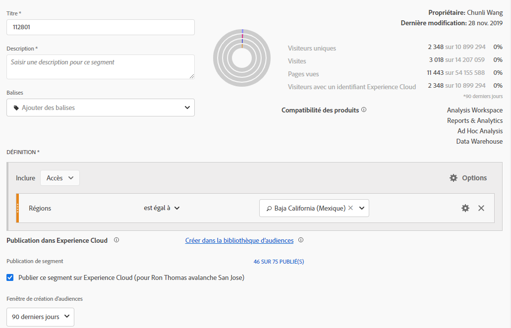
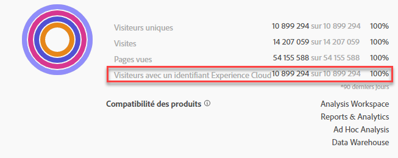
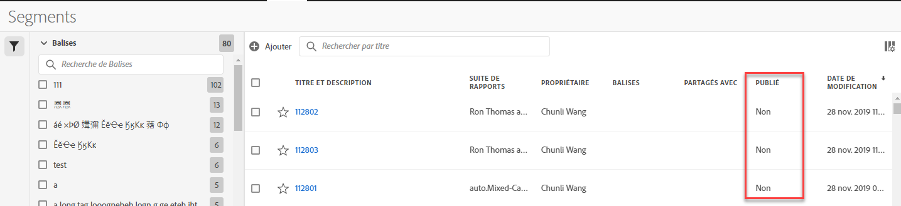

# Segments Publish vers l’Experience Cloud

La publication d’un segment Adobe Analytics dans Experience Cloud vous permet d’utiliser le segment pour une activité marketing dans [!DNL Audience Manager] et dans d’autres canaux d’activation, y compris les [!DNL Advertising Cloud], [!DNL Target] et [!DNL Campaign] d’Adobe.

Vous pouvez publier des segments Analytics sur Experience Cloud en moins de 8 heures. Utilisez ces segments pour activer des audiences dans Audience Manager vers toutes les destinations en aval.

>[!BEGINSHADEBOX]

Voir  [Segments Publish](https://video.tv.adobe.com/v/36929?quality=12&learn=on&captions=fre_fr){target="_blank"} pour une vidéo de démonstration.

>[!ENDSHADEBOX]

>[!NOTE]
>
>Adobe Campaign (Classic et Standard) se comporte différemment dans le sens où il génère une latence supplémentaire de 24 heures en plus de la latence de 8 heures.

## Conditions préalables

* Assurez-vous que la suite de rapports dans laquelle vous enregistrez ce segment est [activée pour Experience Cloud ](https://experienceleague.adobe.com/docs/core-services/interface/audiences/t-publish-audience-segment.html?lang=fr). Sinon, vous ne pouvez pas le publier sur l’Experience Cloud.
* Assurez-vous que votre entreprise utilise des Experience Cloud ID.
* Avant de pouvoir publier des segments, votre administrateur doit affecter l’autorisation [!UICONTROL Publication de segments] à un profil de produit dans l’[Admin Console](https://experienceleague.adobe.com/docs/core-services/interface/manage-users-and-products/admin-getting-started.html?lang=fr) et vous ajouter au profil de produit.

## Considérations

* **Limites de suites de rapports** : vous pouvez publier jusqu’à 75 segments par suite de rapports. Cette limite est appliquée. Si 75 segments ont déjà été publiés, vous ne pouvez pas en publier d’autres tant que vous n’avez pas annulé la publication de suffisamment de segments pour arriver sous le seuil de 75 segments.
* **Limites d’abonnements** : les audiences partagées avec [!DNL Experience Cloud] depuis Adobe Analytics ne doivent pas dépasser 20 millions de membres uniques.
* **Confidentialité des données** : les audiences ne sont pas filtrées d’après l’état d’authentification d’un visiteur. Si un visiteur peut parcourir votre site qu’il soit authentifié ou non, les actions qui se produisent lorsqu’il n’est pas authentifié peuvent avoir pour conséquence que le visiteur est inclus dans une audience. Examinez la [politique de confidentialité d’Adobe Experience Cloud](https://www.adobe.com/fr/privacy/experience-cloud.html) pour bien comprendre toutes les implications du partage des audiences en matière de confidentialité.
* Pour une discussion sur les **différences entre les segments dans [!DNL Adobe Analytics] et[!DNL Audience Manager]**, consultez [ce lien](https://experienceleague.adobe.com/docs/analytics/integration/audience-analytics/audience-analytics-workflow/aam-analytics-segments.html?lang=fr).

## Journal de publication des segments

| Ce qui est disponible | Lorsqu’il est disponible | Où il est disponible |
|---|---|---|
| Métadonnées (titre et définition du segment) | Immédiatement après la publication | [!DNL Audience Manager], [!UICONTROL Bibliothèque d’audiences Experience Cloud], [!DNL Target] |
| Segment utilisable avec abonnement | Jusqu’à huit heures après la publication | Visionneuse du profil du visiteur dans [!DNL Audience Manager] |
| Caractéristique et population membre | Dans les 24 à 48 heures | [!DNL Audience Manager] |

>[!NOTE]
>Une fois par semaine, toutes les données seront entièrement synchronisées afin de tenir compte des écarts ou incohérences qui n’ont pas été capturés au cours de la semaine précédente.

## Publier des segments dans le [!UICONTROL Créateur de segments]

1. Dans Adobe Analytics, accédez à **[!UICONTROL Composants]** > **[!UICONTROL Segments]**
1. Sélectionnez **[!UICONTROL Ajouter]** pour créer un segment.
   
1. Fournissez un titre et une description pour le segment. Ces champs sont obligatoires avant l’enregistrement.
1. Dans la section **[!UICONTROL Publication d’Experience Cloud]**, sélectionnez l’option **[!UICONTROL Publish ce segment vers l’Experience Cloud (pour *suite de rapports*)]**.

>[!IMPORTANT]
>Veillez à utiliser « Visiteurs avec un ID Experience Cloud » lors de l’affichage des aperçus de segments dans Analytics au lieu de l’aperçu du segment total de « visiteurs uniques » lorsque vous comparez des chiffres d’Adobe Analytics aux chiffres d’Audience Manager :
>
>

| Élément | Description |
|---|---|
| **[!UICONTROL Publish ce segment à l&#39;Experience Cloud (par *`<report suite>`*)]** | Lorsque cette option est activée, le titre et la définition du segment (c’est-à-dire l’audience shell souvent utilisée dans les plateformes publicitaires) sont partagés instantanément avec l’Experience Cloud, tandis que l’appartenance au segment est évaluée et partagée toutes les 4 heures.   Lorsque cette audience est associée à une activité dans [!DNL Target], par exemple, [!DNL Analytics] commence à envoyer les identifiants des visiteurs à inclure dans cette audience Experience Cloud et [!DNL Target]. À ce stade, le nom de l’audience et les données correspondantes commencent à s’afficher sur la page [!DNL Audience Library] dans Experience Cloud.   |
| **[!UICONTROL Fenêtre de création d’audiences]** | La période sélectionnée sert à créer l’audience selon un calendrier variable. Par exemple, « 30 derniers jours » (par défaut) inclut les visiteurs qui se sont qualifiés pour l’audience au cours des 30 derniers jours à compter de la date du jour (PAS à partir de la date d’origine de la création du segment). |
| **[!UICONTROL Créer dans la bibliothèque d’audiences]** | Les segments que vous créez et publiez peuvent être disponibles sans latence sur la page [!DNL Audience Library] dans Experience Cloud. Ils ne dépendent pas des mises à jour Analytics. Ces segments ne sont pas pris en compte par rapport à votre limite de 75 segments publiés. |
| **[!UICONTROL x sur 75 publiés]** | Affiche le nombre de segments que vous avez publiés sur l’Experience Cloud. Cliquez sur le lien pour afficher la liste des segments publiés, ainsi que la suite de rapports et le propriétaire qui y sont associés. |
| **[!UICONTROL Enregistrer]** | Enregistre ce segment. |

## Dépublier ou supprimer des segments

Pour supprimer un segment qui a été publié sur Experience Cloud, vous devez d’abord le dépublier. Pour dépublier un segment, il vous suffit de **désactiver** la case à cocher que vous avez cochée pour le publier.

>[!NOTE]
>
>Vous **ne pouvez pas** dépublier un segment qui est actuellement utilisé par l’une des solutions Adobe suivantes : [!DNL Analytics] (dans [!DNL Audience Analytics]), [!DNL Campaign], [!DNL Advertising Cloud] (pour les utilisateurs de [!DNL Core Service] et d’[!DNL Audience Manager]) et tous les autres partenaires externes (pour les utilisateurs de [!DNL Audience Manager]). Vous **pouvez** dépublier un segment utilisé par [!DNL Target].

## Affichage du statut de publication des segments

Le nombre maximal de segments Adobe Analytics pouvant être publiés est de 75.

Pour afficher les segments publiés :

1. Dans Adobe Analytics, accédez à **[!UICONTROL Composants]** > **[!UICONTROL Segments]**.

1. Affichez la colonne **[!UICONTROL Publié]**. **[!UICONTROL Oui]** dans cette colonne indique que le segment a été publié sur l’Experience Cloud. **[!UICONTROL Non]** indique que ce n’est pas le cas.

   

## Récupérer l’[!DNL Audience Manager]UUID

Il existe deux manières de capturer l’UUID Adobe Audience Manager actuellement associé au navigateur :

* Adobe Experience Cloud Debugger
* Outil de développement natif dans les navigateurs (par exemple, Chrome Developer Tools)

Les captures d’écran suivantes vous montrent comment récupérer l’UUID Adobe Audience Manager sur votre navigateur et l’utiliser dans la visionneuse du profil du visiteur d’Audience Manager pour valider l’appartenance à une caractéristique et à un segment.

### Méthode 1 : utiliser Adobe Experience Cloud Debugger

1. Téléchargez et installez [Adobe Experience Cloud Debugger](/help/implement/validate/debugger.md) dans Chrome Web Store.
1. Lancez le débogueur lors du chargement d’une page.
1. Faites défiler jusqu’à la section Audience Manager et recherchez l’UUID Adobe Audience Manager défini sur la page du navigateur active
(`50814298273775797762943354787774730612` dans l’exemple ci-dessous)

### Méthode 2 : utiliser Chrome Developer Tools (ou les outils de développement d’un autre navigateur)

1. Lancer Chrome Developer Tools avant le chargement d’une page
1. Chargez la page et cochez Applications > Cookies. L’UUID Adobe Audience Manager doit être défini dans le tiers
Cookie Demdex ([adobe.demdex.net](https://experienceleague.adobe.com/docs/audience-manager/user-guide/reference/demdex-calls.html?lang=fr) dans l&#39;exemple ci-dessous). Le champ demdex est l’UUID Adobe Audience Manager défini
dans le navigateur (`50814298273775797762943354787774730612` dans l’exemple ci-dessous).

## Utiliser la [!UICONTROL visionneuse du profil du visiteur] d’Audience Manager

L’UUID Adobe Audience Manager du navigateur est utilisé par défaut lors du chargement de la [!UICONTROL visionneuse du profil du visiteur]. Si vous vérifiez des réalisations de caractéristiques pour d’autres utilisateurs, saisissez un UUID dans le champ UUID, puis cliquez sur [!UICONTROL Actualiser]. Consultez [Visionneuse du profil du visiteur](https://experienceleague.adobe.com/docs/audience-manager/user-guide/features/visitor-profile-viewer.html?lang=fr) pour plus d’informations.

## Afficher les caractéristiques du segment dans [!DNL Audience Manager]

Dans Adobe Audience Manager, la liste des visiteurs avec des ECID pour un segment donné est évaluée en flux continu car Analytics partage les segments avec Experience Cloud.

1. Dans [!DNL Audience Manager], sélectionnez [!UICONTROL Données d’audience > Caractéristiques > Caractéristiques d’Analytics]. Un dossier s’affiche pour chaque suite de rapports Analytics associée à votre organisation Experience Cloud. Ces dossiers (pour Caractéristiques, Segments et Sources de données) sont créés lorsque le service principal Profils et audiences / Personnes est lancé ou mis en service.
1. Sélectionnez le dossier de la suite de rapports dans laquelle vous avez créé le segment que vous souhaitez partager avec [!DNL Audience Manager]. Vous verrez le segment/l’audience que vous avez créé. Lorsque vous partagez un segment, deux choses se produisent dans [!DNL Audience Manager] :
   * Une caractéristique est créée, tout d’abord sans contenir de données. Environ Huit heures après la publication du segment dans [!DNL Analytics], la liste des ECID est intégrée et partagée avec [!DNL Audience Manager] et d’autres solutions Experience Cloud.

     

   * Un segment à caractère unique est créé. Il utilise la source de données associée à la suite de rapports dans laquelle vous avez publié le segment.
   * L’expiration des caractéristiques est désormais définie sur 16 jours (au lieu de 2 jours auparavant).

## Afficher le segment dans [!DNL Adobe Target]

La case [!UICONTROL Publier ce segment sur Experience Cloud], qui s’affiche pendant le processus de création d’un segment dans Adobe Analytics, rend le segment disponible dans la bibliothèque d’audiences personnalisées d’Adobe Target. Un segment créé dans Analytics ou dans Audience Manager peut être utilisé pour des activités dans Target. Vous pouvez par exemple créer des activités de campagne d’après les mesures de conversion d’Analytics et les segments d’audience créés dans Analytics.

1. Cliquez sur [!UICONTROL Audiences].
1. Sur la page [!UICONTROL Audiences], recherchez l’audience provenant d’[!DNL Experience Cloud]. Ces audiences peuvent être utilisées dans des activités [!DNL Target].
