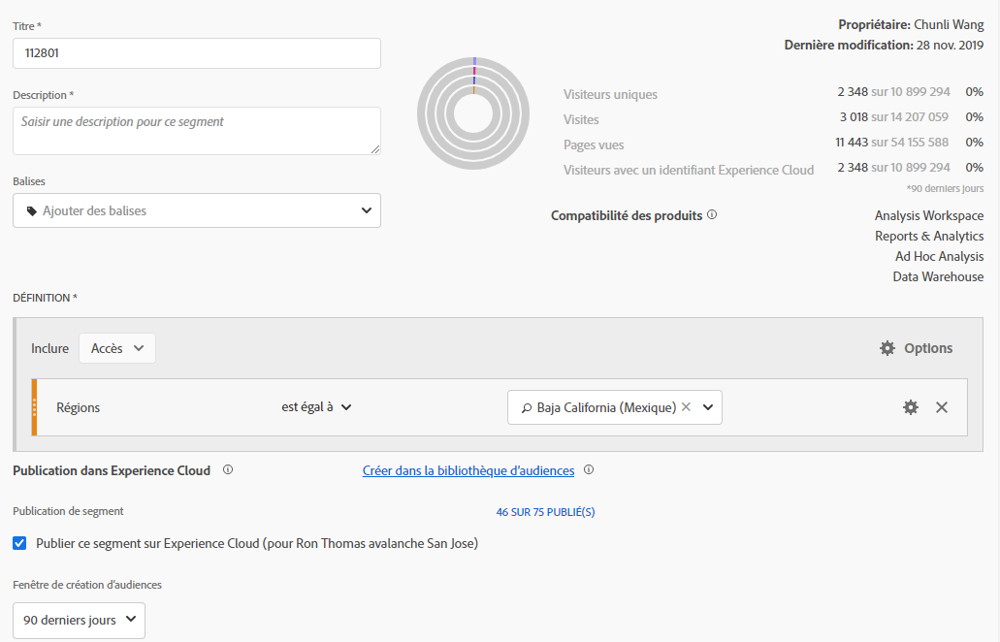

# Publier des segments {#publish-segments}

>[!CONTEXTUALHELP]
>id="components_segments_publishing"
>title="Publication d’entreprise CX"
>abstract="Vous pouvez publier l’audience dans la bibliothèque d’audiences, où elle peut être utilisée pour des activités marketing dans Target et d’autres solutions d’entreprise CX."

>[!CONTEXTUALHELP]
>id="components_segments_audiencelibrary"
>title="Bibliothèque d’audiences"
>abstract="Les segments créés dans la bibliothèque d’audiences sont disponibles instantanément et ne dépendent pas des mises à jour d’Analytics."

Vous pouvez publier un segment Adobe Analytics sur l’expérience client Entreprise. Vous pouvez donc utiliser le segment pour l’activité marketing dans Audience Manager et dans d’autres canaux d’activation, y compris Advertising, Target et Campaign.

Vous pouvez publier des segments Analytics sur CX Enterprise en moins de 8 heures. Utilisez ces segments pour activer des audiences dans Audience Manager vers toutes les destinations en aval.

>[!BEGINSHADEBOX]

Voir  [Publication de segments](https://experienceleague.adobe.com/en/docs/analytics-learn/tutorials/integrations/experience-cloud/improved-experience-cloud-audience-publishing){target="_blank"} pour une vidéo de démonstration.

>[!ENDSHADEBOX]

>[!NOTE]
>
>Adobe Campaign (Classic et Standard) se comporte différemment dans le sens où il génère une latence supplémentaire de 24 heures en plus de la latence de 8 heures.

## Conditions préalables

* Assurez-vous que la suite de rapports dans laquelle vous enregistrez ce segment est [activée pour CX Enterprise](/help/components/segmentation/segmentation-workflow/seg-publish.md). Sinon, vous ne pouvez pas le publier sur CX Enterprise.
* Assurez-vous que votre entreprise utilise des Experience Cloud ID.
* Avant de pouvoir publier des segments, votre administrateur doit affecter l’autorisation [!UICONTROL Publication de segments] à un profil de produit dans l’[Admin Console](https://experienceleague.adobe.com/fr/docs/core-services/interface/administration/admin-tool-experience-cloud) et vous ajouter au profil de produit.

## Considérations

* **Limites de suites de rapports** : vous pouvez publier jusqu’à 75 segments par suite de rapports. Cette limite est appliquée. Si 75 segments ont déjà été publiés, vous ne pouvez pas en publier d’autres tant que vous n’avez pas annulé la publication de suffisamment de segments pour arriver sous le seuil de 75 segments.
* **Limites d’adhésion** : les audiences partagées avec CX Enterprise à partir d’Adobe Analytics ne peuvent pas dépasser 20 millions de membres uniques.
* **Confidentialité des données** : les audiences ne sont pas filtrées d’après l’état d’authentification d’un visiteur. Un visiteur peut être en mesure de parcourir votre site dans des états non authentifiés et authentifiés. Les actions qui se produisent lorsqu’un visiteur n’est pas authentifié peuvent toujours entraîner l’inclusion d’un visiteur dans une audience. Consultez [Confidentialité d’Adobe CX Enterprise](https://www.adobe.com/fr/privacy/experience-cloud.html) pour comprendre toutes les implications du partage d’audiences en matière de confidentialité.
* Pour plus d’informations sur les **différences entre les segments dans [!DNL Adobe Analytics] et Audience Manager**, voir [Présentation des segments dans Analytics et Audience Manager](/help/integrate/c-audience-analytics/aam-analytics-segments.md).

## Journal de publication des segments

| Ce qui est disponible | Lorsqu’il est disponible | Où il est disponible |
|---|---|---|
| Métadonnées (titre et définition du segment) | Immédiatement après la publication | Audience Manager, Bibliothèque d’audiences d’entreprise CX, Target |
| Segment utilisable avec abonnement | Jusqu’à huit heures après la publication | Visionneuse de profil du visiteur dans Audience Manager |
| Caractéristique et membres du segment | Dans les 24 à 48 heures | Audience Manager |

>[!NOTE]
>Une fois par semaine, toutes les données sont entièrement synchronisées pour prendre en compte les deltas ou les incohérences non capturés au cours de la semaine précédente.

## Publication de segments dans [!UICONTROL Créateur de segments]

1. Dans Adobe Analytics, accédez à **[!UICONTROL Composants]** > **[!UICONTROL Segments]**
1. Sélectionnez **[!UICONTROL Ajouter]** pour créer un segment.
   
1. Fournissez un titre et une description pour le segment. Ces champs sont obligatoires avant de pouvoir enregistrer le segment.
1. Dans la section **[!UICONTROL Publication]**, sélectionnez l’option **[!UICONTROL Publier ce segment dans Experience Cloud (pour *suite de rapports*)]**.

   >[!IMPORTANT]
   >
   >Veillez à surveiller les **[!UICONTROL Visiteurs avec un Experience Cloud ID]** dans l’**[!UICONTROL Aperçu des données]** au lieu des **[!UICONTROL Visiteurs uniques]** lorsque vous comparez des nombres Adobe Analytics aux nombres Audience Manager.
   >

| Élément | Description |
|---|---|
| **[!UICONTROL Publier ce segment dans Experience Cloud (par *suite de rapports*)]** | Lorsque cette option est activée, le titre et la définition du segment sont partagés instantanément avec CX Enterprise, tandis que l’appartenance au segment est évaluée et partagée toutes les 4 heures.   Lorsque cette audience est associée à une activité dans Target, par exemple, [!DNL Analytics] commence à envoyer les identifiants des visiteurs qui remplissent les critères pour cette audience CX Enterprise et Target. À ce stade, le nom de l’audience et les données correspondantes commencent à s’afficher sur la page [!DNL Audience Library] dans CX Enterprise.   |
| **[!UICONTROL Fenêtre de création d’audiences]** | La période que vous sélectionnez est utilisée pour créer l’audience sur une base de calendrier glissant. Par exemple, la mention **[!UICONTROL 30 derniers jours]** (par défaut) inclut les visiteurs qui se sont qualifiés pour l’audience au cours des 30 derniers jours à compter de la date d’aujourd’hui (et NON à compter de la date d’origine de création du segment). |
| **[!UICONTROL Créer dans la bibliothèque d’audiences]** | Les segments que vous créez et publiez peuvent être disponibles sans latence sur la page [!DNL Audience Library] dans l’expérience client. Ils ne dépendent pas des mises à jour Analytics. Ces segments ne sont pas pris en compte par rapport à votre limite de 75 segments publiés. |
| **[!UICONTROL x sur 75 publiés]** | Nombre de segments que vous avez publiés sur l’expérience client Entreprise. Cliquez sur le lien pour afficher la liste des segments publiés, ainsi que la suite de rapports et le propriétaire qui y sont associés. |
| **[!UICONTROL Enregistrer]** | Enregistre ce segment. |

## Dépublier ou supprimer des segments

>[!CAUTION]
>
>Pour supprimer un segment qui a été publié sur CX Enterprise, vous devez d’abord dépublier le segment. Pour dépublier un segment, désélectionnez simplement **[!UICONTROL Publier ce segment dans Experience Cloud (par *suite de rapports*)]**.

>[!NOTE]
>
>Vous **ne pouvez pas** dépublier un segment actuellement utilisé par l’une des solutions Adobe suivantes : Analytics (dans Audience Analytics), Campaign, Advertising (pour les clients Core Service et Audience Manager) et tous les autres partenaires externes (pour les clients Audience Manager). Vous **pouvez** dépublier un segment utilisé par Target.

## Affichage du statut de publication des segments

Le nombre maximal de segments Adobe Analytics pouvant être publiés est de 75.

Pour afficher les segments publiés :

1. Dans Adobe Analytics, accédez à **[!UICONTROL Composants]** > **[!UICONTROL Segments]**.

1. Affichez la colonne **[!UICONTROL Publié]**. **[!UICONTROL Oui]** dans cette colonne indique que le segment est publié sur l’expérience client Entreprise. **[!UICONTROL Non]** indique que le segment n’est pas publié.

## Récupérer l’UUID Audience Manager

Il existe deux manières de capturer l’UUID Adobe Audience Manager actuellement associé au navigateur :

* Adobe CX Enterprise Debugger
* Outil de développement natif dans les navigateurs (par exemple, outils de développement Chrome)

Les captures d’écran suivantes vous montrent comment récupérer l’UUID Adobe Audience Manager dans votre navigateur et l’utiliser dans la visionneuse de profil du visiteur Audience Manager pour valider l’appartenance à une caractéristique et à un segment.

### Méthode 1 : utiliser Adobe CX Enterprise Debugger

1. Téléchargez et installez [Adobe CX Enterprise Debugger](/help/implement/validate/debugger.md) dans la boutique en ligne Chrome.
1. Lancez le débogueur lors du chargement d’une page.
1. Faites défiler jusqu’à la section Audience Manager et recherchez l’UUID Adobe Audience Manager défini sur la page du navigateur active
(`35721780439475290181087231320657663953` dans l’exemple ci-dessous)

   

### Méthode 2 : utiliser Chrome Developer Tools (ou les outils de développement d’un autre navigateur)

1. Lancer Chrome Developer Tools avant le chargement d’une page
1. Chargez la page et cochez Applications > Cookies. L’UUID Adobe Audience Manager doit être défini dans le tiers
Cookie Demdex ([adobe.demdex.net](https://experienceleague.adobe.com/en/docs/audience-manager/user-guide/reference/demdex-calls) dans l&#39;exemple ci-dessous). Le champ demdex est l’UUID Adobe Audience Manager défini
dans le navigateur (`35721780439475290181087231320657663953` dans l’exemple ci-dessous).

   

## Utiliser la [!UICONTROL visionneuse du profil du visiteur] d’Audience Manager

L’UUID Adobe Audience Manager du navigateur est défini par défaut lors du chargement de la [!UICONTROL visionneuse du profil du visiteur]. Si vous vérifiez la réalisation des caractéristiques pour d’autres utilisateurs, saisissez un UUID dans le champ UUID et cliquez sur [!UICONTROL Actualiser]. Consultez [Visionneuse du profil du visiteur](https://experienceleague.adobe.com/en/docs/audience-manager/user-guide/features/visitor-profile-viewer) pour plus d’informations.

## Affichage des caractéristiques du segment dans Audience Manager

Dans Adobe Audience Manager, la liste des visiteurs avec des ECID pour un segment donné est évaluée tandis qu’Analytics partage des segments avec CX Enterprise.

1. Dans Audience Manager, accédez à **[!UICONTROL Données d’audience]** > **[!UICONTROL Caractéristiques]** > **[!UICONTROL Caractéristiques Analytics]**. Un dossier est affiché pour chaque suite de rapports Analytics mappée à votre organisation CX Enterprise. Ces dossiers (pour Caractéristiques, Segments et Sources de données) sont créés lorsque le service principal Profils et audiences / Personnes est lancé ou mis en service.
1. Sélectionnez le dossier de la suite de rapports dans laquelle vous avez précédemment créé le segment que vous souhaitez partager avec Audience Manager. Le segment/l’audience que vous avez créé s’affiche. Lorsque vous partagez un segment, 2 choses se produisent dans Audience Manager :
   * Une caractéristique est créée, tout d’abord sans contenir de données. Environ 8 heures après la publication du segment dans [!DNL Analytics], la liste des ECID est intégrée et partagée avec Audience Manager et d’autres solutions d’entreprise CX.

     

   * Un segment à caractère unique est créé. Il utilise la source de données associée à la suite de rapports dans laquelle vous avez publié le segment.
   * L’expiration des caractéristiques est désormais définie sur 16 jours (au lieu de 2 jours auparavant).

## Afficher le segment dans [!DNL Adobe Target]

L’option **[!UICONTROL Publier ce segment dans Experience Cloud]** permet au segment d’être disponible dans la bibliothèque d’audiences personnalisées d’Adobe Target. Un segment créé dans Analytics ou dans Audience Manager peut être utilisé pour des activités dans Target. Vous pouvez par exemple créer des activités de campagne d’après les mesures de conversion d’Analytics et les segments d’audience créés dans Analytics.

Dans Adobe Target :

1. Sélectionnez **[!UICONTROL Audiences]**.
1. Sur la page **[!UICONTROL Audiences]**, recherchez l’audience provenant de l’expérience client Entreprise. Ces audiences peuvent être utilisées dans les activités Target.

   
