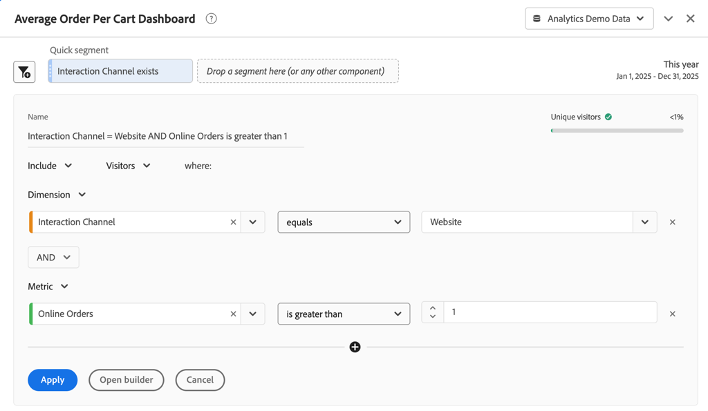

# Segments rapides

Les segments rapides vous permettent d’explorer rapidement les données d’un projet Workspace, sans avoir à créer de segment dans le [Créateur de segments](seg-create.md).

>[!BEGINSHADEBOX]

Consultez  [Segments rapides dans Analysis Workspace](https://video.tv.adobe.com/v/345337/?quality=12&learn=on&captions=fre_fr){target="_blank"} pour une vidéo de démonstration.

>[!ENDSHADEBOX]

Lorsque vous souhaitez utiliser des segments rapides, notez que :

* Les segments rapides sont créés directement dans un projet Workspace. Par conséquent, un segment rapide s’applique uniquement au projet Workspace dans lequel vous créez le segment rapide. Les segments rapides de votre projet Workspace ne sont pas disponibles dans d’autres projets et ne peuvent pas être partagés avec d’autres utilisateurs.
* Vous ne pouvez spécifier que trois conditions dans le cadre d’un segment rapide.
* Les segments rapides ne prennent pas en charge les conteneurs imbriqués ni les conditions séquentielles.
* Vous pouvez modifier des segments rapides dans un projet Workspace partagé. Ainsi, d’autres utilisateurs peuvent modifier les segments rapides dans un projet Workspace que vous avez partagé avec ces utilisateurs.

## Créer

Les segments rapides s’appliquent aux panneaux. Vous pouvez créer un ou plusieurs segments rapides pour chaque panneau de votre projet Workspace. Tout utilisateur d’Analysis Workspace peut créer des segments rapides.

Pour créer un segment rapide :

* Sélectionnez  en haut du panneau.  Ensuite, modifiez directement le segment dans le [Créateur de segments rapides](#quick-segment-builder).
* Faites glisser un composant du panneau des composants vers la zone de dépôt de segments dans l’en-tête du panneau. Une fois déposé, passez le curseur sur le segment et sélectionnez  pour modifier le segment dans le [Créateur de segments rapides](#quick-segment-builder).

Lorsque vous créez un segment rapide par glisser-déposer, notez les points suivants :

* Tous les types de composants ne sont pas pris en charge. Les mesures calculées ne sont pas prises en charge. Seules les dimensions et mesures à partir desquelles vous pouvez créer des segments sont prises en charge.
* Pour les composants de dimensions et de mesures, le [créateur de segments rapides](#quick-segment-builder) crée automatiquement des conditions de `exists`. Par exemple, si vous effectuez un glisser-déposer de `City`, la condition `City exists` est créée.
* Pour les valeurs de dimension, le [créateur de segments rapides](#quick-segment-builder) crée automatiquement une condition de `equals`. Par exemple, si vous effectuez un glisser-déposer de `amsterdam` à partir de la dimension `City`, la condition `City equals amsterdam` est créée.
* Si vous faites glisser et déposez des `unspecified` ou des `none`, le [créateur de segments rapides](#quick-segment-builder) crée automatiquement une condition de `does not exist`.

Les segments rapides que vous créez s’affichent en haut du panneau. Les segments rapides ont une fine barre de gauche bleu clair. Lorsqu’un segment rapide est en mode de modification à l’aide du [créateur de segments rapides](#quick-segment-builder), l’arrière-plan du segment rapide est bleu clair.

Les résultats des segments rapides que vous créez dans un panneau sont appliqués (à l’aide de la logique ET) à toutes les visualisations qui font partie du panneau.

## Gérer

Pour gérer un segment rapide, passez la souris sur un **[!UICONTROL segment rapide]** spécifique.

* Sélectionnez  pour ouvrir le [Créateur de segments rapides](#quick-segment-builder) et modifier le segment rapide.
* Sélectionnez  pour ouvrir une fenêtre contextuelle. La fenêtre contextuelle affiche des informations sur le segment. Vous pouvez sélectionner **[!UICONTROL Rendre disponible pour tous les projets et ajouter le segment à votre liste de composants]** Pour ajouter le segment à la liste de composants  **[!UICONTROL Segments]** dans le panneau des composants. Une boîte de dialogue **[!UICONTROL Enregistrer le segment rapide]** s’affiche, vous invitant à spécifier un nom pour le segment. Sélectionnez **[!UICONTROL Enregistrer]** pour continuer. Votre [!UICONTROL segment rapide] se transforme en **[!UICONTROL segment]**. Vous ne pouvez plus modifier le segment à l’aide du [créateur de segments rapides](#quick-segment-builder). Au lieu de cela, vous devez modifier le segment en tant que segment standard, à l’aide du [créateur de segments](seg-build.md).

## Créateur de segments rapides

Consultez ci-dessous un exemple du créateur de segments rapides. Dans cet exemple, le créateur est ouvert pour un segment rapide intitulé `Interaction Channel equals Website AND Online Orders is greater than 1`. Le segment rapide en haut s’applique au panneau [!UICONTROL Tableau de bord de la valeur moyenne de la commande] et à toutes les visualisations qu’il contient.

Le créateur de segments rapides se compose des zones et boutons suivants.

### Zone d’en-tête

La zone d’en-tête détermine le nom, le type et la portée du segment rapide. Il affiche également un visuel pour les résultats du segment rapide.

| Élément | Description |
|---|---|
| **[!UICONTROL Nom]** | Le nom est automatiquement dérivé de la définition de segment rapide. |
| **[!UICONTROL Personnes]**    | Prévisualisez les données issues du segment rapide. Une barre et un pourcentage indiquent à insight la quantité de données globales qui fait partie du résultat du segment rapide. Une  rouge indique que le segment rapide ne renvoie pas de données. |
| **[!UICONTROL Inclure]** **[!UICONTROL Exclure]** | Dans la liste déroulante  choisissez d’inclure ou d’exclure les résultats du segment rapide des données du panneau. |
| **[!UICONTROL Événement]** **[!UICONTROL Session]** **[!UICONTROL Personne]** | Dans le menu déroulant  sélectionnez la portée du segment rapide. |

### Zone de condition

La zone de condition spécifie les conditions (trois au maximum). Pour chaque condition, vous pouvez spécifier les éléments suivants :

| Élément | Description |
|---|---|
| **[!UICONTROL Dimension]** **[!UICONTROL Mesure]** **[!UICONTROL Période]** | Dans le menu déroulant  choisissez si vous souhaitez spécifier une condition pour une dimension, une mesure ou une période. |
| **[!UICONTROL *Composant *]** | Champ de composant de la condition. Vous pouvez [!UICONTROL *Saisir pour ajouter*] un composant, sélectionner un composant dans la liste ou faire glisser et déposer un composant depuis le panneau des composants. Vous pouvez uniquement déposer des composants similaires dans le champ de composant de la condition. Par exemple, vous pouvez uniquement déposer un composant de dimension à partir du panneau des composants sur une condition de dimension.  Vous pouvez également effectuer un glisser-déposer pour remplacer un composant existant. Sélectionnez  pour supprimer le composant du champ de composant. |
| **[!UICONTROL *Opérateur *]** | Opérateur du composant. Consultez [Opérateurs](../seg-reference/seg-operators.md) pour plus d’informations. Disponible uniquement pour les dimensions et les mesures. |
| **[!UICONTROL *value *]** | Valeur de la condition. Selon l’opérateur sélectionné, la valeur peut être sélectionnée dans une liste ou vous pouvez saisir une valeur. |
|  | Sélectionnez cette option pour supprimer une condition du segment rapide. |

### Boutons

| Bouton | Description |
|---|---|
| **[!UICONTROL ET]** **[!UICONTROL OU]** | Disponible uniquement lorsque vous définissez plusieurs conditions. Faites votre choix dans le menu déroulant  entre les conditions. La sélection détermine la logique booléenne du segment rapide. Il n’est pas possible de mélanger la logique avec trois conditions. La logique booléenne est soit **[!UICONTROL ET]** soit **[!UICONTROL OU]**. |
|  | Ajoute une autre condition à votre segment rapide. Ce bouton n’est disponible que lorsque vous avez défini une ou deux conditions pour le segment rapide. |
| **[!UICONTROL Appliquer]** | Appliquez les modifications au segment rapide. |
| **[!UICONTROL Ouvrir le créateur]** | Vous recevez une invitation à confirmer l’opération à l’aide d’une boîte de dialogue **[!UICONTROL En êtes-vous sûr(e) ?]**. Si vous sélectionnez **[!UICONTROL OK]**, vous ne pouvez plus modifier votre segment dans le [Créateur de segments rapides](#quick-segment-builder) Votre segment rapide est renommé **[!UICONTROL Segment]** et se compose désormais d’une fine barre de gauche bleu foncé. [ Le créateur de segments](seg-build.md) classique s’ouvre avec la possibilité de **[!UICONTROL Rendre ce segment disponible pour tous vos projets et l’ajouter à votre liste de composants]**. <ul><li>Si vous sélectionnez cette option et sélectionnez **[!UICONTROL Appliquer]**, le segment est ajouté à la liste de composants  **[!UICONTROL Segment]** dans le panneau des composants.</li><li>Si vous ne sélectionnez pas cette option et sélectionnez **[!UICONTROL Appliquer]**, le segment reste un segment de projet uniquement Workspace.</li></ul> |
| **[!UICONTROL Annuler]** | Sélectionnez cette option pour annuler la création ou la modification d’un segment rapide. |

## Segments rapides ou segments

Les segments rapides portent exactement le même nom. Vous pouvez créer et modifier des segments rapides rapidement intégrés et voir les effets immédiatement dans votre panneau.

Les segments présentent les avantages suivants par rapport aux segments rapides.

* Les segments peuvent être disponibles dans tous vos projets Workspace
* Les segments prennent en charge une plus grande complexité à l’aide de [conteneurs](../seg-containers.md) imbriqués et hiérarchiques, et de séquences (à l’aide de [segments séquentiels](seg-sequential-build.md).

