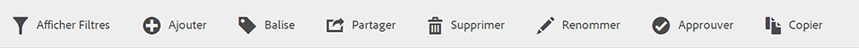
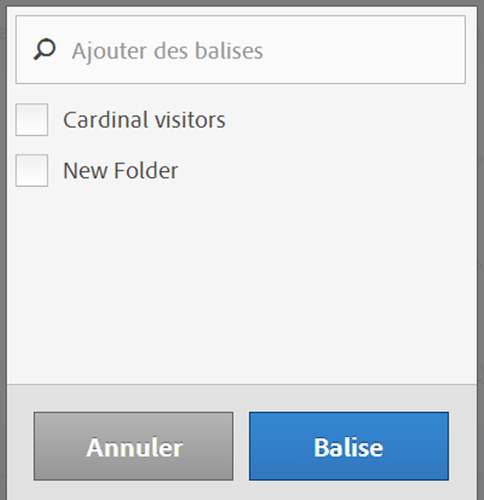

# Balisage des segments

Dans le Gestionnaire de segments, le marquage de segments permet de les organiser.

Tous les utilisateurs peuvent créer des balises pour les segments et en appliquer une ou plusieurs à un segment. Néanmoins, vous ne pouvez afficher les balises que pour les segments que vous possédez ou qui ont été partagés avec vous. Quels types de balises devriez-vous créer ? Vous trouverez ci-dessous quelques suggestions de balises utiles :

* Des balises basées sur des **noms d’équipe**, par exemple Marketing des réseaux sociaux, Marketing des périphériques mobiles.
* Les balises **Projet** (balises d’analyse), telle que l’analyse de la page d’accès.
* Les balises **Catégorie** : Hommes ; géographie.
* Les balises **Processus** : Sous réserve d’approbation ; Organisé pour (une unité opérationnelle spécifique).

1. Dans le Gestionnaire de segments, cochez la case en regard du segment que vous souhaitez marquer. La barre d’outils de gestion des segments apparaît :

   

1. Cliquez sur **[!UICONTROL Balise]** et

   * effectuez une sélection dans les balises existantes, ou
   * ajoutez une nouvelle balise et appuyez sur **[!UICONTROL Entrée]**.

     

1. Cliquez à nouveau sur **[!UICONTROL Balise]** pour marquer le segment.

La balise doit à présent apparaître dans la colonne Balises. (Cliquez sur l’icône en forme d’engrenage dans la partie supérieure droite pour gérer vos colonnes.)

Vous pouvez également filtrer par balises en accédant à **[!UICONTROL Filtres]** > **[!UICONTROL Balises]**.
