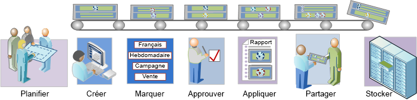

# Workflow de segmentation - Aperçu

Décrit un processus suggéré pour les segments créés par le Créateur de segments et gérés dans le Gestionnaire de segments.

 

Avez-vous posé toutes les questions appropriées avant de créer des segments et de configurer un environnement de gestion des segments ? Avez-vous conçu le segment en gardant à l’esprit son objectif prévu et son utilisation spécifique ?

Consultez la Liste de contrôle de la planification des segments pour obtenir de l’aide sur la planification et l’organisation de vos segments.

 [Création de segments](/help/components/segmentation/segmentation-workflow/seg-build.md)

Créez et modifiez des segments pour une utilisation dans toutes les fonctionnalités d’Analytics.

Voir [Créer des segments séquentiels](/help/components/segmentation/segmentation-workflow/seg-sequential-build.md) pour savoir comment créer des segments avec l’opérateur ALORS.

 [Baliser les segments](/help/components/segmentation/segmentation-workflow/seg-tag.md)

Marquez les segments pour faciliter l’organisation et le partage. Apprenez à planifier et affecter des balises pour des recherches simples et avancées et pour l’entreprise.

 [Approuver les segments](/help/components/segmentation/segmentation-workflow/seg-approve.md)

Approuvez les segments pour les rendre canoniques.

 [Appliquer des segments](/help/components/segmentation/segmentation-workflow/t-seg-apply.md)

Vous pouvez appliquer des segments directement depuis un rapport, à partir du rail de segments (Afficher segments).

 [Partager des segments](/help/components/segmentation/segmentation-workflow/t-seg-share.md)

Partagez vos segments avec l’audience prévue dans d’autres outils d’Analytics et avec Adobe Target et Adobe Experience Cloud.

 [Filtrer les segments](/help/components/segmentation/segmentation-workflow/t-seg-filter.md)

Filtrez par balises, propriétaires et autres filtres (Tout afficher, Le mien, Partagés avec moi, Favoris et Approuvés.)

 [Marquer le segment comme favoris](/help/components/segmentation/segmentation-workflow/t-seg-favorite.md)

Le marquage des segments en tant que favoris est une autre manière de les organiser pour en faciliter l’utilisation.

[Gestion des segments](/help/components/segmentation/segmentation-workflow/seg-manage.md)

Le Gestionnaire de segments offre plusieurs manières d’organiser les segments, par exemple le partage, le filtrage, le marquage, l’approbation, la copie, la suppression et le marquage en tant que favoris.
