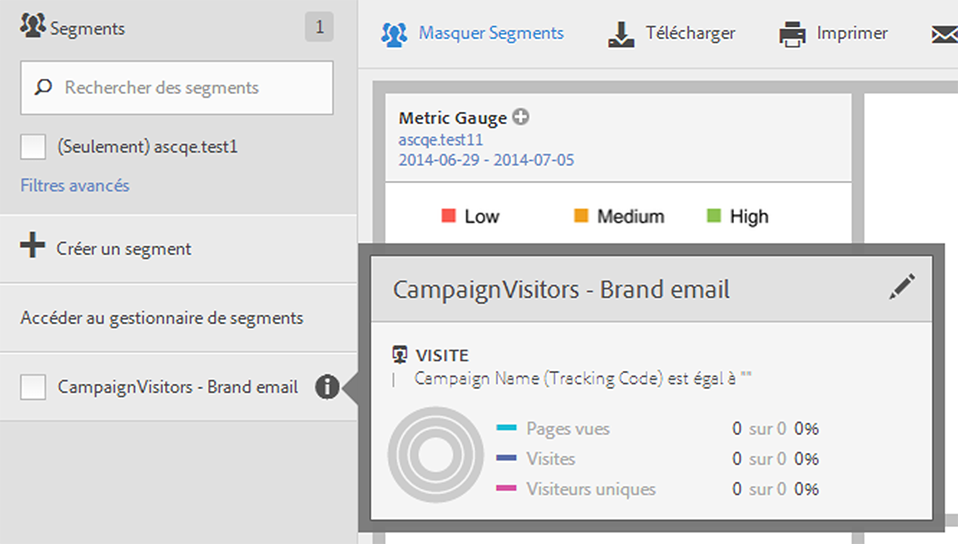
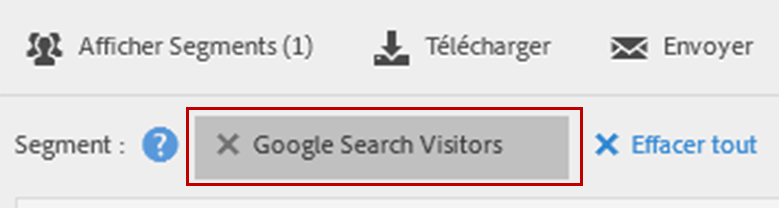

# Utiliser les segments

Pour utiliser des segments dans Analysis Workspace, il vous suffit de faire glisser un ou plusieurs segments depuis **[!UICONTROL Segments]** dans le rail des composants, puis de les déposer :

* Un [panneau](/help/analyze/analysis-workspace/c-panels/panels.md) dans Analysis Workspace pour segmenter toutes les visualisations dans le panneau.
* Ligne d’en-tête d’un [tableau à structure libre](/help/analyze/analysis-workspace/visualizations/freeform-table/freeform-table.md) dans Analysis Workspace pour remplacer la dimension.
* Une ligne dans un [tableau à structure libre](/help/analyze/analysis-workspace/visualizations/freeform-table/freeform-table.md) dans Analysis Workspace pour lancer une répartition.
* Une colonne dans un [tableau à structure libre](/help/analyze/analysis-workspace/visualizations/freeform-table/freeform-table.md) dans Analysis Workspace pour ajouter ou remplacer une colonne, ou pour lancer un filtre.
* Configurations des panneaux pour la visualisation ou des panneaux qui permettent de déposer des segments. Par exemple, dans une visualisation récapitulative [Comparaison de segments](/help/analyze/analysis-workspace/c-panels/c-segment-comparison/segment-comparison.md) panneau ou [Mesure clé](/help/analyze/analysis-workspace/visualizations/key-metric.md)
* Le [créateur de définitions pour un segment](/help/components/segmentation/segmentation-workflow/seg-build.md#definition-builder) afin d’inclure un segment dans votre définition de segment.
* Le [créateur de définitions pour une mesure calculée](/help/components/calculated-metrics/workflow/c-build-metrics/cm-build-metrics.md#definition-builder) afin d’inclure un segment dans votre définition de mesure calculée.

<!--
How to apply one or more segments to a report from the segment rail.

1. Bring up the report to which you want to apply a segment, for example the [!UICONTROL Pages Report].
1. Click **[!UICONTROL Show Segments]** above the report. The segment rail opens.

   

1. Mark the checkbox next to one or more of the segments or **[!UICONTROL Search Segments]** to find the right segment.

   >[!NOTE]
   >
   >You can apply more than one segment to a report (this is called segment stacking). When multiple segments are applied, the criteria in each segment is combined using an 'and' operator and then applied. There is no limit to how many segments you can stack.

   >[!NOTE]
   >
   >Clicking the Information icon (i) next to the segment name lets you preview the key metrics to see whether you have a valid segment and how broad the segment is.

1. You can filter by report suite by selecting the **[!UICONTROL (Only) `<report suite name>`]** check box. This will show only those segments that were last saved in that report suite.
1. Click **[!UICONTROL Apply Segment]** and the report will refresh. The segment or segments that are applied now display at the top of the report:

   

-->
