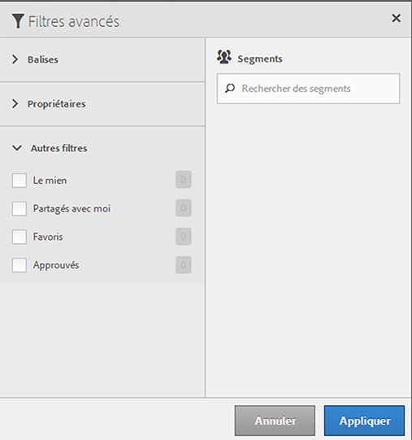

# Filtrer des segments

Filtrez par balises, propriétaires et autres filtres (Tout afficher, Le mien, Partagés avec moi, Favoris et Approuvés.)

Le filtrage facilite la recherche de segments dans le rail de segments.

1. Dans le Gestionnaire de segments, cliquez sur l’icône **[!UICONTROL Filtres]** : 

   

2. Les filtres suivants sont disponibles :

   | Nom du filtre | Description |
   |---|---|
   | Balises | Permet de filtrer les segments selon des balises spécifiques   [balises](/help/components/segmentation/segmentation-workflow/seg-tag.md). La colonne Balises s’affiche par défaut. |
   | Propriétaires | Permet de filtrer les segments par propriétaire. |
   | Autres filtres > Tout afficher | **(Administrateur uniquement)** Affiche tous les segments, leur propriétaire et la date la plus récente à laquelle ils ont été modifiés. |
   | Autres filtres > À moi | Affiche tous les segments que vous possédez. |
   | Autres filtres > Partagés avec moi | Affiche tous les segments que d’autres   [ont partagé](/help/components/segmentation/segmentation-workflow/t-seg-share.md) avec vous. |
   | Autres filtres > Favoris | Affiche tous les segments que vous avez marqués comme   [Favoris](/help/components/segmentation/segmentation-workflow/t-seg-favorite.md). |
   | Autres filtres > Approuvés | Affiche toutes les mesures   [approuvés](/help/components/segmentation/segmentation-workflow/seg-approve.md). |
   | Rechercher des segments | Permet de rechercher des segments par nom. |
