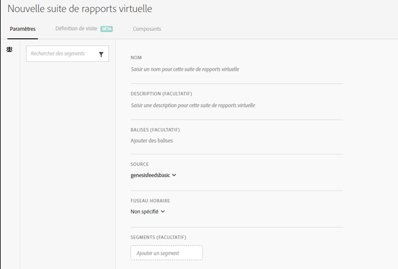

# Création des suites de rapports virtuelles

Avant de créer des suites de rapports virtuelles, vous devez tenir compte des quelques points suivants.

* Les utilisateurs qui ne sont pas administrateurs ne peuvent pas visualiser le Gestionnaire de suites de rapports virtuelles.
* Les suites de rapports virtuelles ne peuvent pas être partagées. Le « partage » est effectué par le biais de groupes/autorisations.
* Dans le Gestionnaire de suites de rapports virtuelles, vous ne pouvez afficher que vos propres suites de rapports virtuelles. Vous devez cliquer sur « Tout afficher » pour afficher les suites de rapports virtuelles des autres utilisateurs.

1. Accédez à **[!UICONTROL Composants]** &gt; **[!UICONTROL Suites de rapports virtuelles]**.
1. Cliquez sur **[!UICONTROL Ajouter +]**.

   

1. Renseignez les champs suivants :

<table id="table_0F85B56480BB46CBA5BE236BBD70156D"> 
 <thead> 
  <tr> 
   <th colname="col1" class="entry"> Élément </th> 
   <th colname="col2" class="entry"> Description </th> 
  </tr> 
 </thead>
 <tbody> 
  <tr> 
   <td colname="col1"> Nom </td> 
   <td colname="col2"> 
Le nom de la suite de rapports virtuelle n’est pas hérité de la suite de rapports parente et doit être distinct. 
 </td> 
  </tr> 
  <tr> 
   <td colname="col1"> Description </td> 
   <td colname="col2"> 
Ajoutez une description précise pour les utilisateurs d’entreprise. 
 </td> 
  </tr> 
  <tr> 
   <td colname="col1"> Balises </td> 
   <td colname="col2"> 
Vous pouvez ajouter des balises pour organiser vos suites de rapports. 
 </td> 
  </tr> 
  <tr> 
   <td colname="col1"> Groupes </td> 
   <td colname="col2"> 
Sélectionnez les groupes d’autorisations qui doivent avoir accès à une suite de rapports virtuelle donnée. (Vous pouvez également gérer les autorisations de groupe sous Administration &gt; Gestion utilisateur &gt; Groupes.) 
 </td> 
  </tr> 
  <tr> 
   <td colname="col1"> Suite de rapports parente </td> 
   <td colname="col2"> 
Suite de rapports à partir de laquelle cette suite de rapports virtuelle hérite des paramètres suivants. La plupart des niveaux de service et des fonctionnalités (par exemple, les paramètres eVar, les règles de traitement, les classifications, etc.) sont hérités. Pour apporter des modifications à ces paramètres hérités sur une suite de rapports virtuelle, vous devez modifier la suite de rapports parente (Administration &gt; Suites de rapports). 
 </td> 
  </tr> 
  <tr> 
   <td colname="col1"> Fuseau horaire </td> 
   <td colname="col2"> 
Le choix d’un fuseau horaire est facultatif. 
 
Si vous choisissez un fuseau horaire, il est enregistré avec la suite de rapports virtuelle. Si aucun fuseau horaire n’est choisi, celui de la suite de rapports parente est utilisé. 
 
Lors de la modification d’une suite de rapports virtuelle, le fuseau horaire enregistré avec la suite de rapports virtuelle apparaît dans le sélecteur déroulant. Si la suite de rapports virtuelle a été créée avant l’ajout de la prise en charge du fuseau horaire, le fuseau horaire de la suite de rapports parente s’affiche dans la liste de sélection déroulante. 
 </td> 
  </tr> 
  <tr> 
   <td colname="col1"> Segments </td> 
   <td colname="col2"> 
Vous pouvez ajouter un seul segment ou <a href="https://marketing.adobe.com/resources/help/en_US/analytics/segment/seg_stack.html"  >empiler des segments</a>. 
 
 
Remarque : Lors de l’empilement de deux segments, ils sont associés par une instruction ET, qui ne peut pas être changée en instruction OU. 
 
 
Lorsque vous essayez de supprimer ou de modifier un segment qui est actuellement utilisé dans une suite de rapports virtuelle, un avertissement s’affiche. 
 </td> 
  </tr> 
 </tbody> 
</table>

