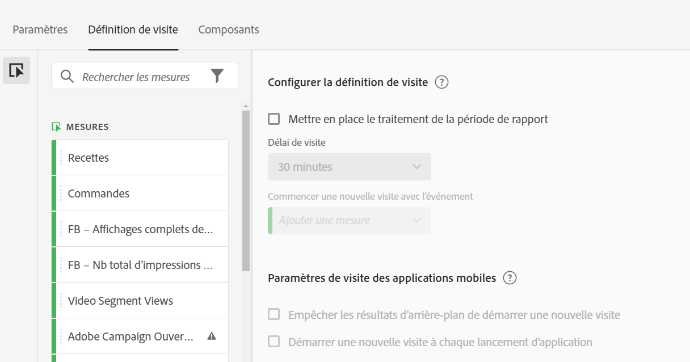
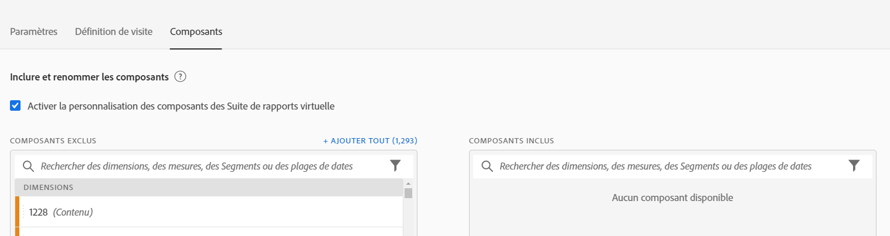

# Création des suites de rapports virtuelles

Avant de créer des suites de rapports virtuelles, vous devez tenir compte des quelques points suivants.

* Les utilisateurs non administrateurs ne peuvent pas voir le gestionnaire de suites de rapports virtuelles.
* Les suites de rapports virtuelles ne peuvent pas être partagées. Le « partage » est effectué par le biais de groupes/autorisations.
* Dans le gestionnaire de suites de rapports virtuelles, vous ne pouvez afficher que vos propres suites de rapports virtuelles. Vous devez cliquer sur « Tout afficher » pour afficher les suites de rapports virtuelles des autres utilisateurs.

1. Accédez à **[!UICONTROL Composants]** > **[!UICONTROL Suites de rapports virtuelles]**.
1. Cliquez sur **[!UICONTROL Ajouter +]**.

   

## Définir les paramètres

Dans l’onglet [!UICONTROL Paramètres], définissez les paramètres, puis cliquez sur **[!UICONTROL Continuer]**.

| Élément | Description |
| --- |--- |
| Nom | Le nom de la suite de rapports virtuelle n’est pas hérité de la suite de rapports parente et doit être distinct. |
| Description | Ajoutez une description précise pour les utilisateurs d’entreprise. |
| Balises | Vous pouvez ajouter des balises pour organiser vos suites de rapports. |
| Source | Suite de rapports à partir de laquelle cette suite de rapports virtuelle hérite des paramètres suivants. La plupart des niveaux de service et des fonctionnalités (par exemple, les paramètres eVar, les règles de traitement, les classifications, etc.) sont hérités. Pour apporter des modifications à ces paramètres hérités sur une suite de rapports virtuelle, vous devez modifier la suite de rapports parente (Administration > Suites de rapports). |
| Fuseau horaire | Le choix d’un fuseau horaire est facultatif. Si vous choisissez un fuseau horaire, il est enregistré avec la suite de rapports virtuelle. Si aucun fuseau horaire n’est choisi, celui de la suite de rapports parente est utilisé.  Lors de la modification d’une suite de rapports virtuelle, le fuseau horaire enregistré avec la suite de rapports virtuelle s’affiche dans le sélecteur déroulant. Si la suite de rapports virtuelle a été créée avant l’ajout de la prise en charge des fuseaux horaires, le fuseau horaire de la suite de rapports parente s’affiche dans le sélecteur déroulant. |
| Segments | Vous pouvez ajouter un seul segment ou empiler des segments.   Remarque : Lors de l’empilement de deux segments, ils sont associés par une instruction AND, qui ne peut pas être changée en instruction OR. Lorsque vous essayez de supprimer ou de modifier un segment qui est actuellement utilisé dans une suite de rapports virtuelle, un avertissement s’affiche. |

## Définir une définition de visite

Dans l’onglet [!UICONTROL Définition de visite], définissez les paramètres, puis cliquez sur **[!UICONTROL Continuer]**.

>[!BEGINSHADEBOX]

Voir  [Ajuster une définition de visite](https://video.tv.adobe.com/v/3428473?quality=12&learn=on&captions=fre_fr){target="_blank"} pour une vidéo de démonstration.

>[!ENDSHADEBOX]

| Élément | Description |
| --- |--- |
| **Configurer la définition de visite** |  |
| Mettre en place le traitement de la période de rapport | Utilisez le traitement de la période de rapport pour modifier la longueur par défaut du délai d’expiration de la visite. Ces paramètres sont non destructifs et s’appliquent à Analysis Workspace uniquement. [En savoir plus](/help/components/vrs/vrs-report-time-processing.md) |
| Délai de visite | Définit la quantité d’inactivité qu’un visiteur unique doit atteindre avant qu’une nouvelle visite soit automatiquement démarrée. Cette option concerne la mesure des visites, le conteneur de segment de visite et les eVar qui expirent lors de la visite. |
| Commencer une nouvelle visite avec l’événement | Démarre une nouvelle session quand un des événements spécifiés est déclenché, qu’une session ait expiré ou non. |
| **Paramètres de visite des applications mobiles** | Modifiez la façon dont les visites sont définies pour les accès aux applications mobiles collectés par les SDK mobiles d’Adobe. Ces paramètres sont non destructifs et s’appliquent à Analysis Workspace uniquement. |
| Empêcher les résultats d’arrière-plan de démarrer une nouvelle visite | Empêche les accès en arrière-plan de démarrer une nouvelle visite, et de gonfler les mesures de visites et de visiteurs uniques. |
| Démarrer une nouvelle visite à chaque lancement d’application | Démarre une nouvelle session lorsqu’une application est lancée. [En savoir plus](/help/components/vrs/vrs-mobile-visit-processing.md) |

## Inclure et renommer des composants

1. Dans l’onglet [!UICONTROL Composants], cochez la case pour appliquer le traitement afin d’inclure, d’exclure et de renommer les composants de cette suite de rapports virtuelle dans Analysis Workspace.
Pour plus d’informations sur le traitement des composants des suites de rapports virtuelles, consultez [Traitement des composants des suites de rapports virtuelles](https://experienceleague.adobe.com/docs/analytics/components/virtual-report-suites/vrs-components.html?lang=fr#virtual-report-suites).

1. Faites glisser les composants (dimensions, mesures, segments ou périodes) que vous souhaitez inclure dans la suite de rapports virtuelle dans la section [!UICONTROL Composants inclus].

1. Une fois que vous avez terminé, cliquez sur **[!UICONTROL Enregistrer]**.

## Aperçu des données

Sur le côté droit de chaque onglet, vous pouvez prévisualiser le nombre total d’accès, de visites et de visiteurs dans cette suite de rapports virtuelle, par rapport à la suite de rapports d’origine.

## Afficher la compatibilité des produits

Certaines fonctionnalités des suites de rapports virtuelles ne sont pas prises en charge par tous les produits Adobe Analytics. La liste de compatibilité des produits vous permet de voir quels produits Adobe Analytics sont pris en charge en fonction des paramètres actuels de votre suite de rapports virtuelle.
