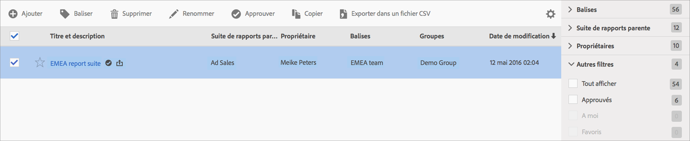

# Gestion des suites de rapports virtuelles

Le gestionnaire des suites de rapports virtuelles permet aux administrateurs de modifier, ajouter, baliser, supprimer, renommer, approuver, copier, exporter et filtrer des suites de rapports virtuelles. Il n’est pas visible par les utilisateurs qui ne sont pas administrateurs.

**[!UICONTROL Analytics]** > **[!UICONTROL Composants]** > **[!UICONTROL Suites de rapports virtuelles]**

>[!NOTE]
>
>Dans le gestionnaire de suites de rapports virtuelles, vous ne pouvez afficher que vos propres suites de rapports virtuelles. Vous devez cliquer sur **[!UICONTROL Tout afficher]** pour afficher les suites de rapports virtuelles des autres utilisateurs.

| Tâche | Description |
| --- | --- |
| Ajouter | Permet d’accéder au créateur de suites de rapports virtuelles où vous pouvez créer des suites de rapports virtuelles. |
| Balises | Tous les utilisateurs peuvent créer des balises pour les suites de rapports virtuelles et appliquer une ou plusieurs balises à l’une de ces suites. Cependant, vous ne pouvez afficher les balises que pour les suites de rapports virtuelles qui vous appartiennent. Quels types de balises devriez-vous créer ? Vous trouverez ci-dessous quelques suggestions de balises utiles :<ul><li>Des balises basées sur des noms d’équipe, par exemple Marketing des réseaux sociaux, Marketing des appareils mobiles</li><li>Les balises Projet (balises d’analyse), telles que l’analyse de la page d’accès</li><li>Les balises Catégorie : Hommes ; géographie</li><li>Les balises Workflow : Traité pour (une division spéciale) ; Approuvé.</li></ul> |
| Supprimer | Si vous supprimez une suite de rapports virtuelle, les rapports planifiés et les tableaux de bord pour lesquels cette suite de rapports est appliquée continuent de fonctionner correctement (par exemple, le rapport ou le tableau de bord continue d’utiliser la suite de rapports virtuelle supprimée jusqu’à ce que vous enregistriez de nouveau le rapport planifié).  Les rapports planifiés ne sont pas mis à jour lorsque vous modifiez une suite de rapports virtuelle portant le même nom. Par exemple : vous disposez de deux suites de rapports virtuelles portant le même nom et de suites de rapports parentes différentes : Un signet référence la suite de rapports virtuelle pour la suite de rapports mainprod. Vous supprimez ensuite cette suite de rapports virtuelle, car elle est en double. Le signet continue de fonctionner, référençant la définition des suites de rapports virtuelles supprimées. Si vous modifiez la définition des suites de rapports virtuelles restantes, la suite de rapports virtuelle appliquée au signet ne change pas. Elle utilise l’ancienne définition. Pour corriger ce problème, mettez à jour le signet pour référencer la nouvelle définition. Si vous ne savez pas si un signet, un tableau de bord ou un rapport planifié utilise une suite de rapports virtuelle supprimée, vous pouvez modifier le nom des suites de rapports virtuelles restantes afin qu’il soit plus clair que le signet utilise les suites de rapports virtuelles restantes. |
| Renommer | À tous les emplacements où s’affiche la suite de rapports virtuelle (comme dans le sélecteur de suite de rapports), son nouveau nom apparaît. |
| Approuver/Ne plus approuver | Permet d’approuver les suites de rapports virtuelles pour les rendre officielles ou canoniques. Vous pouvez inverser le processus en annulant l’approbation. |
| Copier | Permet de créer une copie distincte avec un nouvel identifiant de suite de rapports. Elle est toutefois dotée du même nom et de la même définition. |
| Exporter dans un fichier CSV | Permet d’exporter la définition de suite de rapports virtuelle vers un fichier .csv. |
| Filtre | Permet de filtrer par balises, suite de rapports parente, propriétaires et d’autres filtres (Tout afficher, A moi, Favoris et Approuvé). |
