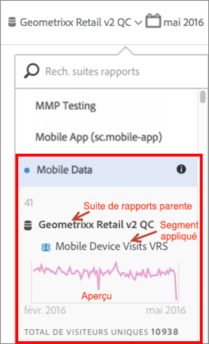

# Affichage des informations d'une suite de rapports virtuelle

Cliquez sur l’icône i (Informations) située en regard du nom de la suite de rapports pour obtenir des informations sur celle-ci.

## Dans le sélecteur de suite de rapports {#section_74E43B60C1CA4180B5ACA57574C1FA0F}

Lorsque vous cliquez sur l’icône Informations située en regard de la suite de rapports virtuelle dans le sélecteur de suite de rapports, les informations suivantes s’affichent :

* Nom de la suite de rapports parente.
* Nom des segments qui lui sont appliqués.
* Aperçu simple de la suite de rapports avec le segment appliqué.
* Nombre total de visiteurs uniques.

