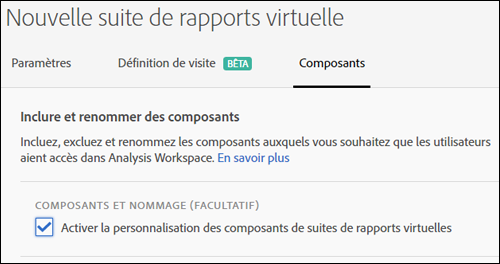
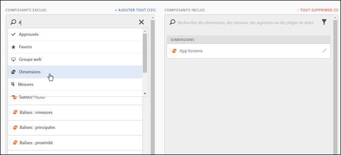
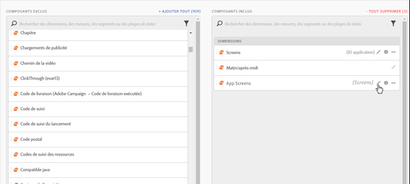
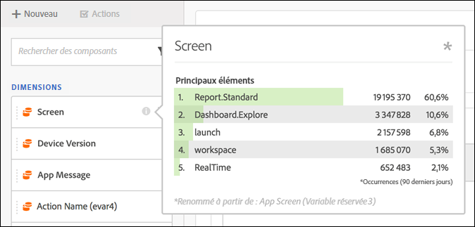
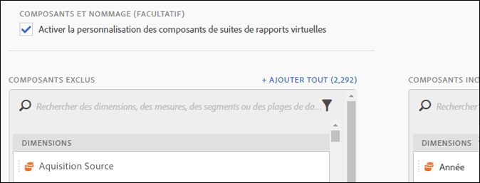

# Traitement des composants des suites de rapports virtuelles

Les suites de rapports virtuelles peuvent être traitées de manière à inclure et à exclure des composants d’Analysis Workspace.

>[!BEGINSHADEBOX]

Voir  [Traitement des composants](https://video.tv.adobe.com/v/23544?quality=12&learn=on){target="_blank"} pour une vidéo de démonstration.

>[!ENDSHADEBOX]

>[!NOTE]
>
>Des modifications ont été apportées quant aux composants visibles aux personnes administratrices et non administratrices dans les suites de rapports virtuelles et les projets Workspace traités. Auparavant, les composants non traités étaient visibles par tous en cliquant sur le bouton **[!UICONTROL Afficher tous les composants]**. La [mise à jour de l’expérience de traitement](/help/analyze/analysis-workspace/curate-share/curate.md) permet de mieux contrôler quels composants sont visibles.

Pour activer le traitement des composants,

1. Accédez à **[!UICONTROL Analytics]** > **[!UICONTROL Composants]** > **[!UICONTROL Suites de rapports virtuelles]** > **[!UICONTROL Créer une suite de rapports virtuelle]**.
1. Après avoir défini les **[!UICONTROL Paramètres]**, cliquez sur l’onglet **[!UICONTROL Composants]**.

1. Cochez la case **[!UICONTROL Activer la personnalisation des composants de la suite de rapports virtuelle]** :

   

   >[!NOTE]
   >
   >Si la personnalisation des composants est activée, la suite de rapports virtuelle est **accessible uniquement dans Analysis Workspace** et ne l’est pas dans :
   >
   >* [!UICONTROL Data Warehouse]
   >* [!UICONTROL Report Builder]
   >* [!UICONTROL Activity Map]
   >* API de création de rapports dans Analytics

   Une fois la case activée, vous pouvez ajouter les composants que vous souhaitez inclure dans la suite de rapports virtuelle en les faisant glisser de la colonne « exclus » vers la colonne « inclus ». Les composants pouvant être inclus et exclus sont les suivants :

   * Dimensions
   * Mesures
   * Segments
   * Périodes

   >[!NOTE]
   >
   >Il n’est plus nécessaire de *partager* les composants traités (segments, mesures calculées, périodes). S’ils sont traités pour la suite de rapports virtuelle, ils seront visibles dans Analysis Workspace, même s’ils ne sont pas partagés.

1. En outre, vous pouvez filtrer ou rechercher les composants et ajouter la totalité de la sélection filtrée à la colonne « inclus » en cliquant sur **[!UICONTROL Tout ajouter]**.

   

## Changement du nom des composants {#section_0F7CD9F684FE4765BC00A2AFED56550E}

Vous pouvez modifier les noms d’affichage des composants inclus spécifiques à la suite de rapports virtuelle. Par exemple, si vous souhaitez inclure le nom de page dans la suite de rapports virtuelle, mais que vous souhaitez le renommer pour un contexte plus mobile, vous pouvez le modifier en « écrans d’application ». Le nouveau nom s’affiche dans Analysis Workspace chaque fois que cette suite de rapports virtuelle est utilisée.

Dans Analysis Workspace, cliquez sur l’icône d’information pour tout composant inclus afin de révéler le nom d’origine du composant renommé :

## Groupes de composants  {#section_483BEC76F49E46ADAAA03F0A12E48426}

Utilisez les groupes de composants pour ajouter des composants en vrac à la suite de rapports virtuelle. Par exemple, si vous souhaitez importer un jeu de composants par défaut spécifique à l’analyse des applications mobiles, sélectionnez le groupe d’applications mobiles. Un jeu correspondant de dimensions et de mesures (déjà renommées) est automatiquement ajouté à la liste Inclus de la suite de rapports virtuelle.

## Comportement de Workspace  {#section_6C32F8B642804C0097FCB14E21028D4A}

Pour plus d’informations sur le traitement dans Analysis Workspace, voir [Traitement et partage d’un projet](/help/analyze/analysis-workspace/curate-share/curate.md).
