# Sessions contextuelles

Les sessions contextuelles dans les suites de rapports virtuelles modifient la façon dont Adobe Analytics calcule les visites mobiles. Cet article décrit les implications du traitement des événements d’accès en arrière-plan et de lancement d’applications (toutes deux définies par le SDK Mobile) sur la façon dont les visites mobiles sont définies.

Vous pouvez définir une visite comme vous le souhaitez sans modifier les données sous-jacentes, afin de correspondre à la façon dont vos visiteurs interagissent avec vos applications mobiles.

## Paramètre de l’URL de la perspective client  {#section_8B298006362341E3AC16A148422D1F65}

Le processus de collecte de données Adobe Analytics permet de définir un paramètre de chaîne de requête indiquant la perspective client (appelé paramètre de chaîne de requête « cp »). Ce champ indique l’état de l’application numérique de l’utilisateur final. Il permet de savoir si un accès a été généré alors qu’une application mobile était dans un état d’arrière-plan.

## Traitement des accès en arrière-plan  {#section_D47B3161B7E145B6A32AB06E9AA03FA3}

Un accès en arrière-plan est un type d’accès envoyé à Analytics depuis le SDK Adobe Mobile version 4.13.6 (et supérieure) lorsque l’application émet une demande de suivi dans un état d’arrière-plan. Des exemples types incluent :

* Données envoyées lors d’un croisement de géo-barrières
* Une interaction de notification Push

Les exemples suivants décrivent la logique utilisée pour déterminer quand une visite commence et se termine pour un visiteur lorsque le paramètre « Empêcher les accès en arrière-plan de commencer une nouvelle visite » est ou n’est pas activé pour une suite de rapports virtuelle.

**Si le paramètre « Empêcher les accès en arrière-plan de commencer une nouvelle visite » n’est pas activé :**

Si cette fonctionnalité n’est pas activée pour une suite de rapports virtuelle, les accès en arrière-plan sont traités de la même manière que les autres accès, ce qui signifie qu’ils démarrent de nouvelles visites et agissent exactement de la même manière que les accès de premier plan. Par exemple, si un accès en arrière-plan se produit moins de 30 minutes (délai d’attente d’une session standard pour une suite de rapports) avant un jeu d’accès de premier plan, l’accès en arrière-plan fait partie de la session.

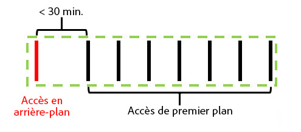

Si l’accès en arrière-plan se produit plus de 30 minutes avant les accès de premier plan, l’accès en arrière-plan crée sa propre visite, pour un nombre total de visites de 2.

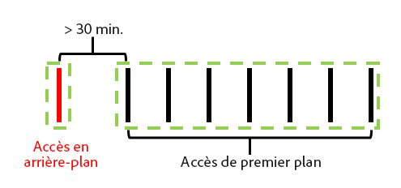

**Si le paramètre « Empêcher les accès en arrière-plan de commencer une nouvelle visite » est activé :**

Les exemples suivants illustrent le comportement des accès en arrière-plan lorsque ce paramètre est activé.

Exemple 1 : un accès en arrière-plan se produit à un temps (t) avant une série d’accès de premier plan.

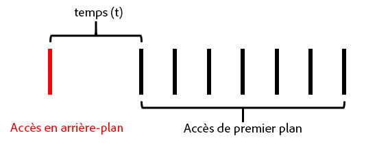

Dans cet exemple, si *t* est postérieur au délai de visite configuré de la suite de rapports virtuelle, l’accès en arrière-plan est exclu de la visite formée par les accès de premier plan. Par exemple, si le délai de visite de la suite de rapports virtuelle est défini sur 15 minutes et que *t* est défini sur 20 minutes, la visite formée par cette série d’accès (indiquée par le contour vert) exclue l’accès en arrière-plan. Cela signifie que toute eVar définie avec une expiration de « visite » sur l’accès en arrière-plan **n’est pas** conservée dans la visite suivante et qu’un conteneur de segments de visite inclut uniquement les accès de premier plan compris dans le contour vert.

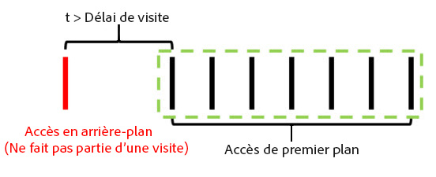

Inversement, si *t* est antérieur au délai de visite configuré de la suite de rapports virtuelle, l’accès en arrière-plan est inclus dans la visite comme s’il s’agissait d’un accès de premier plan (illustré par le contour vert) :

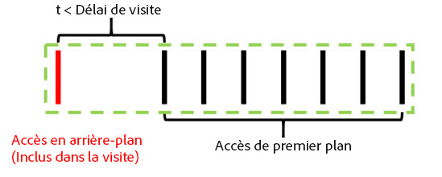

Cela signifie que :

* Toute eVar définie avec l’expiration « visite » sur l’accès en arrière-plan conserve ses valeurs dans les autres accès de cette visite.
* Toutes les valeurs définies dans l’accès en arrière-plan sont incluses dans l’évaluation de la logique du conteneur de segments de niveau visite.

Dans les deux cas, le nombre total de visites est de 1.

Exemple 2 : si un accès en arrière-plan se produit après une série d’accès de premier plan, le comportement est similaire :

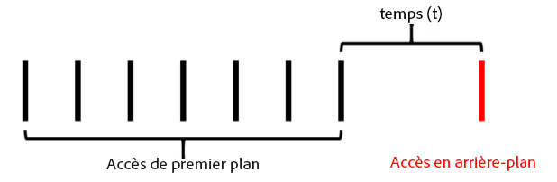

Si l’accès en arrière-plan se produit après le délai d’attente configuré de la suite de rapports virtuelle, l’accès en arrière-plan ne fait pas partie d’une session (indiquée par le contour vert) :

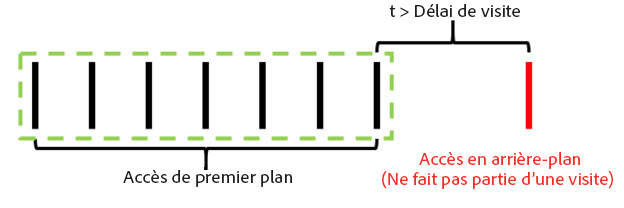

De même, si le temps *t* est antérieur au délai d’attente configuré de la suite de rapports virtuelle, l’accès en arrière-plan est inclus dans la visite formée par les précédents accès de premier plan :

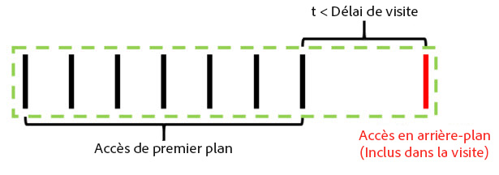

Cela signifie que :

* Toute eVar définie avec l’expiration « visite » sur l’accès en arrière-plan précédent conserve ses valeurs dans l’accès en arrière-plan de cette visite.
* Toutes les valeurs définies dans l’accès en arrière-plan sont incluses dans l’évaluation de la logique du conteneur de segments de niveau visite.

Comme auparavant, le nombre total de visites dans les deux cas est de 1.

Exemple 3 : dans certaines circonstances, un accès en arrière-plan peut entraîner la combinaison de deux visites distinctes en une seule visite. Dans le scénario suivant, un accès en arrière-plan est précédé et suivi d’une série d’accès de premier plan :

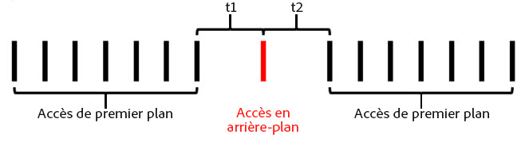

Si, dans cet exemple, *t1* et *t2* sont antérieurs au délai de visite configuré de la suite de rapports virtuelle, tous les accès sont combinés en une seule visite, même si *t1* et *t2* combinés sont postérieurs au délai de visite :

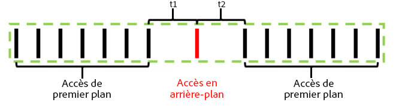

Cependant, si *t1* et *t2* sont postérieurs au délai de visite configuré de la suite de rapports virtuelle, ces accès sont séparés en deux visites distinctes :

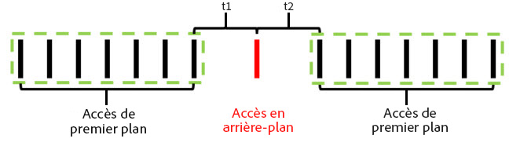

De même (comme dans nos exemples précédents), si *t1* est antérieur au délai de visite et *t2* également, l’accès en arrière-plan est inclus dans la première visite :

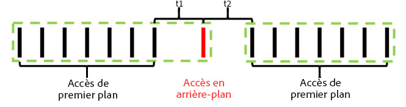

Si *t1* est postérieur au délai de visite et *t2* est antérieur, l’accès en arrière-plan est inclus dans la deuxième visite :

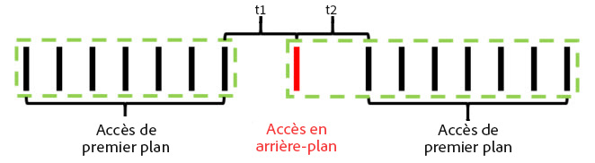

Exemple 4 : dans les scénarios où une série d’accès en arrière-plan se produit pendant le délai de visite de la suite de rapports virtuelle, les accès forment une « visite en arrière-plan » invisible qui n’est pas incluse dans le nombre de visites et n’est pas accessible à l’aide d’un conteneur de segmentation des visites.

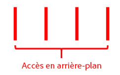

Même si cela n’est pas considéré comme une visite, tous les jeux d’eVars disposant d’une expiration de visite conservent leur valeur dans les autres accès en arrière-plan de cette « visite en arrière-plan ».

Exemple 5 : dans les scénarios où plusieurs accès en arrière-plan se produisent consécutivement à la suite d’une série d’accès de premier plan, il est possible (en fonction du paramètre de délai de visite) que les accès en arrière-plan maintiennent une visite active plus longtemps que le délai de visite. Par exemple, si *t1* et *t2* combinés sont postérieurs au délai de visite de la suite de rapports virtuelle, mais individuellement antérieurs au délai de visite, la visite s’étend afin d’inclure les deux accès en arrière-plan :

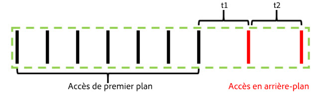

De même, si une série d’accès en arrière-plan se produit avant une série d’événements de premier plan, un comportement similaire se produit :

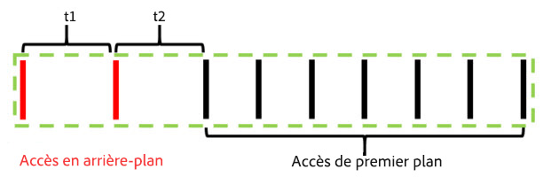

Les accès en arrière-plan se comportent de cette manière afin de conserver les effets d’affectation provenant des eVars ou d’autres variables définies lors des accès en arrière-plan. Cela permet d’affecter des événements de conversion de premier plan en aval à des actions entreprises lorsqu’une application se trouvait à l’état d’arrière-plan. Cela permet également à un conteneur de segments de visite d’inclure des accès en arrière-plan qui ont abouti à une session de premier plan en aval, ce qui est utile pour mesurer l’efficacité des messages push.

## Comportement de la mesure des visites  {#section_50B82618A39B454493B33B1450CCBD3E}

Le nombre de visites est basé uniquement sur le nombre de visites comprenant au moins un accès de premier plan. Cela signifie que les accès en arrière-plan orphelins ou les « visites en arrière-plan » ne sont pas prises en compte dans la mesure des visites.

## Temps passé par comportement de la mesure des visites  {#section_0A149ABB3E034B97BD0B3A7F3EB67383}

Le temps passé est toujours calculé d’une manière analogue à la façon dont il l’est sans accès en arrière-plan, en utilisant le temps entre les accès. Néanmoins, si une visite inclut des accès en arrière-plan (car ils se sont produits suffisamment proches des accès de premier plan), ces accès sont inclus dans le calcul du temps passé par visite comme s’il s’agissait d’accès de premier plan.

## Paramètres du traitement des accès en arrière-plan  {#section_C8B1D38C06FF4ABAAFA78CE9550C0F4B}

Comme le traitement des accès en arrière-plan est uniquement disponible pour les suites de rapports virtuelles utilisant le paramètre Reporter le traitement du temps, Adobe Analytics prend en charge deux méthodes de traitement des accès en arrière-plan afin de conserver les nombres de visites dans la suite de rapports de base (parente) qui n’utilise pas le paramètre Reporter le traitement du temps. Pour accéder à ce paramètre, accédez à l’Admin Console d’Adobe Analytics, puis aux paramètres de la suite de rapports de base applicable, puis au menu « Gestion mobile », et enfin au sous-menu « Rapports d’applications mobiles ».

1. « Traitement hérité activé » : il s’agit du paramètre par défaut pour toutes les suites de rapports. Le fait de laisser le traitement hérité activé traite les accès en arrière-plan comme des accès normaux dans notre pipeline de traitement en ce qui concerne la suite de rapports de base (parente) sans attribution de la période du rapport. Cela signifie que les accès en arrière-plan qui apparaissent dans la suite de rapports de base (parente) incrémentent les visites comme un accès normal. Si vous ne souhaitez pas que les accès en arrière-plan apparaissent dans la suite de rapports de base (parente), définissez ce paramètre sur « Désactivé ».
1. « Traitement hérité désactivé » : avec le traitement hérité désactivé pour les accès en arrière-plan, tous les accès en arrière-plan envoyés à la suite de rapports de base (parente) sont ignorés par cette dernière et accessibles uniquement lorsqu’une suite de rapports virtuelle créée à partir de cette suite de rapports de base est configurée pour utiliser le paramètre Reporter le traitement du temps. Cela signifie que toutes les données capturées par les accès en arrière-plan envoyées à cette suite de rapports de base (parente) n’apparaissent que dans une suite de rapports virtuelle incluant le paramètre Reporter le traitement du temps.

   Ce paramètre est destiné aux clients qui souhaitent profiter du nouveau traitement des accès en arrière-plan sans modifier les nombres de visites de leur suite de rapports de base (parente).

Dans les deux cas, les accès en arrière-plan sont facturés au même coût que tout autre accès envoyé à Analytics.

## Démarrage de nouvelles visites à chaque lancement d’une application  {#section_9DA9A8B9758248A6B311EFBA06AECA80}

En plus du traitement des accès en arrière-plan, les suites de rapports virtuelles peuvent forcer une nouvelle visite à démarrer chaque fois que le SDK Mobile envoie un événement de lancement d’une application. Lorsque ce paramètre est activé, chaque fois qu’un événement de lancement d’une application est envoyé à partir du SDK, ce dernier force le démarrage d’une nouvelle visite, qu’une visite ouverte ait atteint son délai ou non. L’accès contenant l’événement de lancement d’une application est inclus comme premier accès lors de la prochaine visite, incrémente le nombre de visites et crée un conteneur de visites distinct pour la segmentation.
