# Sessions contextuelles

Les sessions contextuelles dans les suites de rapports virtuelles modifient la manière dont Adobe Analytics calcule les visites de n’importe quel appareil. Cet article décrit également les implications du traitement des hits en arrière-plan et des événements de lancement de l’application (tous deux définis par le SDK mobile) pour la définition des visites mobiles.

Vous pouvez définir une visite comme vous le souhaitez sans modifier les données sous-jacentes, afin de correspondre à la façon dont vos visiteurs interagissent avec vos expériences digitales.

>[!BEGINSHADEBOX]

Voir  [Sessions contextuelles](https://experienceleague.adobe.com/fr/docs/analytics-learn/tutorials/components/virtual-report-suites/context-aware-sessions-in-virtual-report-suites){target="_blank"} pour une vidéo de démonstration.

>[!ENDSHADEBOX]

## Paramètre de l’URL de la perspective client

Le processus de collecte de données Adobe Analytics permet de définir un paramètre de chaîne de requête indiquant la perspective client (appelé paramètre de chaîne de requête « cp »). Ce champ indique l’état de l’application numérique de l’utilisateur final. Il permet de savoir si un hit a été généré alors qu’une application mobile était dans un état d’arrière-plan.

## Traitement des hits en arrière-plan

Un hit en arrière-plan est un type de hit envoyé à Analytics depuis le SDK Adobe Mobile version 4.13.6 (et supérieure) lorsque l’application émet une demande de suivi dans un état d’arrière-plan. Des exemples types incluent :

* Données envoyées lors d’un géorepérage
* Une interaction de notification Push

Les exemples suivants décrivent la logique utilisée pour déterminer quand une visite commence et se termine pour un visiteur lorsque le paramètre « Empêcher les hits en arrière-plan de commencer une nouvelle visite » est ou n’est pas activé pour une suite de rapports virtuelle.

**Si le paramètre « Empêcher les hits d’arrière-plan de démarrer une nouvelle visite » n’est pas activé :**

Si cette fonctionnalité n’est pas activée pour une suite de rapports virtuelle, les hits en arrière-plan sont traités de la même manière que les autres hits, ce qui signifie qu’ils démarrent de nouvelles visites et agissent exactement de la même manière que les hits de premier plan. Par exemple, si un hit en arrière-plan se produit moins de 30 minutes (délai d’expiration d’une session standard pour une suite de rapports) avant un jeu de hits de premier plan, le hit en arrière-plan fait partie de la session.

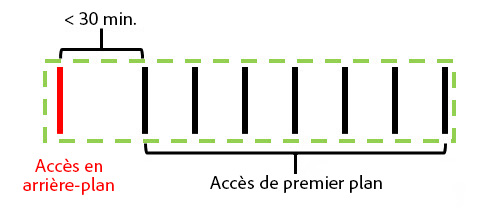

Si le hit en arrière-plan se produit plus de 30 minutes avant les hits de premier plan, le hit en arrière-plan crée sa propre visite, pour un nombre total de visites de 2.

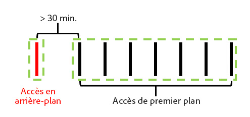

**Si le paramètre « Empêcher les hits d’arrière-plan de démarrer une nouvelle visite » est activé :**

Les exemples suivants illustrent le comportement des hits en arrière-plan lorsque ce paramètre est activé.

Exemple 1 : un hit en arrière-plan se produit à un temps (t) avant une série de hits de premier plan.

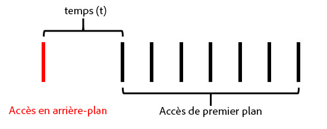

Dans cet exemple, si *t* est postérieur au délai d’expiration de visite configuré de la suite de rapports virtuelle, le hit en arrière-plan est exclu de la visite formée par les hits de premier plan. Par exemple, si le délai d’expiration de visite de la suite de rapports virtuelle est défini sur 15 minutes et que *t* est défini sur 20 minutes, la visite formée par cette série de hits (indiquée par le contour vert) exclut le hit en arrière-plan. Cela signifie que toute eVar définie avec une expiration de « visite » sur l’accès en arrière-plan **n’est pas** conservée dans la visite suivante et qu’un conteneur de segments de visite inclut uniquement les accès de premier plan compris dans le contour vert.

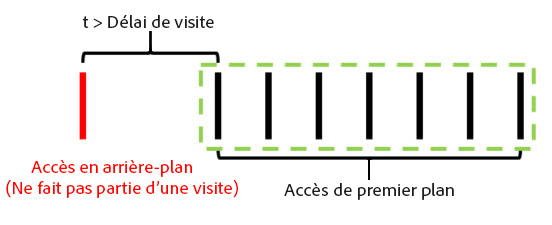

Inversement, si *t* est antérieur au délai d’expiration de visite configuré de la suite de rapports virtuelle, le hit en arrière-plan est inclus dans la visite comme s’il s’agissait d’un hit de premier plan (illustré par le contour vert) :

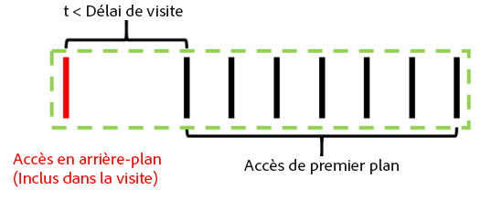

Cela signifie que :

* Toute eVar définie avec l’expiration « visite » sur l’accès en arrière-plan conserve ses valeurs dans les autres accès de cette visite.
* Toutes les valeurs définies dans le hit en arrière-plan sont incluses dans l’évaluation de la logique du conteneur de segments de niveau visite.

Dans les deux cas, le nombre total de visites est de 1.

Exemple 2 : si un hit en arrière-plan se produit après une série de hits de premier plan, le comportement est similaire :

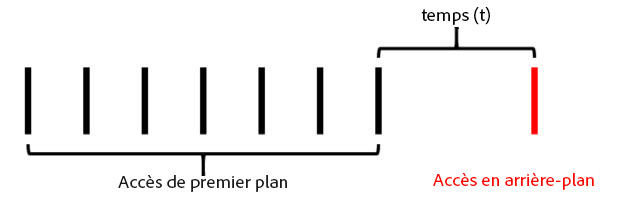

Si le hit en arrière-plan se produit après le délai d’expiration configuré de la suite de rapports virtuelle, le hit en arrière-plan ne fait pas partie d’une session (indiquée par le contour vert) :

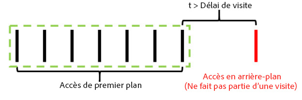

De même, si le temps *t* est antérieur au délai d’expiration configuré de la suite de rapports virtuelle, le hit en arrière-plan est inclus dans la visite formée par les précédents hits de premier plan :

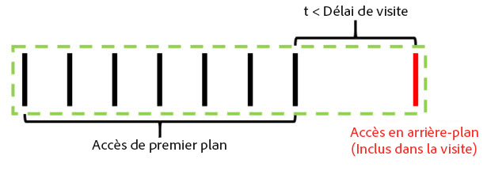

Cela signifie que :

* Toute eVar définie avec l’expiration « visite » sur les hits de premier plan précédents conserve ses valeurs dans le hit en arrière-plan de cette visite.
* Toutes les valeurs définies dans le hit en arrière-plan sont incluses dans l’évaluation de la logique du conteneur de segments de niveau visite.

Comme auparavant, le nombre total de visites dans les deux cas est de 1.

Exemple 3 : dans certaines circonstances, un hit en arrière-plan peut entraîner la combinaison de deux visites distinctes en une seule visite. Dans le scénario suivant, un hit en arrière-plan est précédé et suivi d’une série de hits de premier plan :

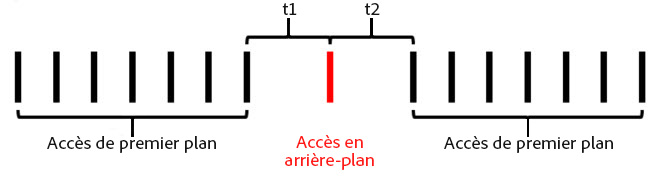

Si, dans cet exemple, *t1* et *t2* sont antérieurs au délai d’expiration de visite configuré de la suite de rapports virtuelle, tous les hits sont combinés en une seule visite, même si *t1* et *t2* combinés sont postérieurs au délai de visite :

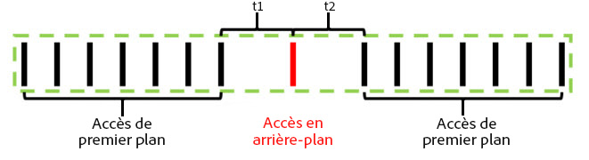

Cependant, si *t1* et *t2* sont postérieurs au délai d’expiration de visite configuré de la suite de rapports virtuelle, ces hits sont séparés en deux visites distinctes :

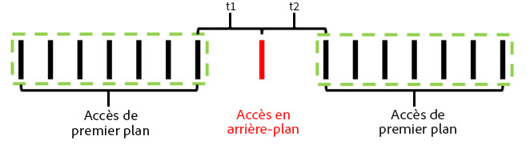

De même (comme dans nos exemples précédents), si *t1* est inférieur à la temporisation et *t2* est supérieur à la temporisation, l’accès en arrière-plan est inclus dans la première visite :

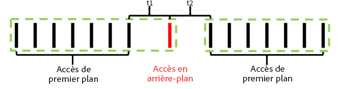

Si *t1* est postérieur au délai d’expiration de visite et *t2* est antérieur, le hit en arrière-plan est inclus dans la deuxième visite :

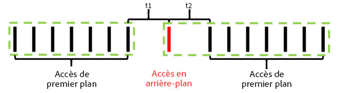

Exemple 4 : dans les scénarios où une série de hits en arrière-plan se produit pendant le délai de d’expiration de visite de la suite de rapports virtuelle, les hits forment une « visite en arrière-plan » invisible qui n’est pas incluse dans le nombre de visites et n’est pas accessible à l’aide d’un conteneur de segmentation des visites.

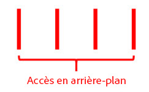

Même si cela n’est pas considéré comme une visite, tous les jeux d’eVars disposant d’une expiration de visite conservent leur valeur dans les autres accès en arrière-plan de cette « visite en arrière-plan ».

Exemple 5 : dans les scénarios où plusieurs hits en arrière-plan se produisent consécutivement à la suite d’une série de hits de premier plan, il est possible (en fonction du paramètre de délai d’expiration de visite) que les hits en arrière-plan maintiennent une visite active plus longtemps que le délai d’expiration de visite. Par exemple, si *t1* et *t2* combinés sont postérieurs au délai d’expiration de visite de la suite de rapports virtuelle, mais individuellement antérieurs au délai d’expiration de visite, la visite s’étend afin d’inclure les deux hits en arrière-plan :

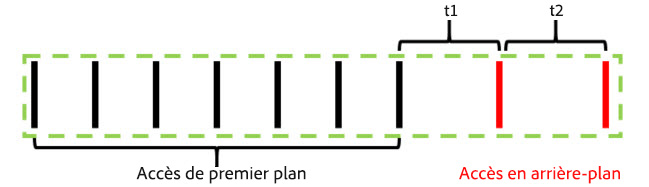

De même, si une série de hits en arrière-plan se produit avant une série d’événements de premier plan, un comportement similaire se produit :

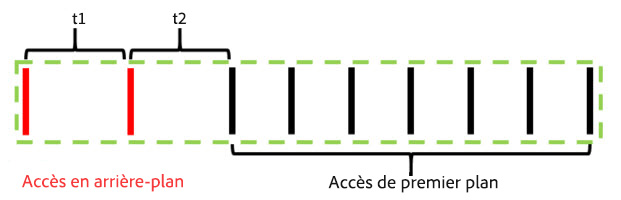

Les hits en arrière-plan se comportent de cette manière afin de conserver les effets d’affectation provenant des eVars ou d’autres variables définies lors des hits en arrière-plan. Cela permet d’affecter des événements de conversion de premier plan en aval à des actions entreprises lorsqu’une application se trouvait à l’état d’arrière-plan. Cela permet également à un conteneur de segments de visite d’inclure des hits en arrière-plan qui ont abouti à une session de premier plan en aval, ce qui est utile pour mesurer l’efficacité des messages push.

## Comportement de la mesure des visites

Le nombre de visites est basé uniquement sur le nombre de visites comprenant au moins un hit de premier plan. Cela signifie que les hits en arrière-plan orphelins ou les « visites en arrière-plan » ne sont pas prises en compte dans la mesure des visites.

## Temps passé par comportement de la mesure des visites

Le temps passé est toujours calculé d’une manière analogue à la façon dont il l’est sans hits en arrière-plan, en utilisant le temps entre les hits. Néanmoins, si une visite inclut des hits en arrière-plan (car ils se sont produits suffisamment proches des hits de premier plan), ces hits sont inclus dans le calcul du temps passé par visite comme s’il s’agissait de hits de premier plan.

## Paramètres du traitement des hits en arrière-plan

Comme le traitement des hits en arrière-plan est uniquement disponible pour les suites de rapports virtuelles utilisant le paramètre Reporter le traitement du temps, Adobe Analytics prend en charge deux méthodes de traitement des hits en arrière-plan afin de conserver les nombres de visites dans la suite de rapports de base (parente) qui n’utilise pas le paramètre Reporter le traitement du temps. Pour accéder à ce paramètre, accédez aux outils d’administration d’Adobe Analytics, aux paramètres de la suite de rapports de base applicable, puis au menu « Gestion mobile », puis au sous-menu « Création de rapports sur les applications mobiles ».

1. « Traitement hérité activé » : il s’agit du paramètre par défaut pour toutes les suites de rapports. Le fait de laisser le traitement hérité activé traite les hits en arrière-plan comme des hits normaux dans notre pipeline de traitement en ce qui concerne la suite de rapports de base (parente) sans attribution de la période du rapport. Cela signifie que les hits en arrière-plan qui apparaissent dans la suite de rapports de base (parente) incrémentent les visites comme un hit normal. Si vous ne souhaitez pas que les hits en arrière-plan apparaissent dans la suite de rapports de base (parente), définissez ce paramètre sur « Désactivé ».
1. « Traitement hérité désactivé » : avec le traitement hérité désactivé pour les hits en arrière-plan, tous les hits en arrière-plan envoyés à la suite de rapports de base (parente) sont ignorés par cette dernière et accessibles uniquement lorsqu’une suite de rapports virtuelle créée à partir de cette suite de rapports de base est configurée pour utiliser le paramètre Traitement lors de l’exécution du rapport. Cela signifie que toutes les données capturées par les hits en arrière-plan envoyées à cette suite de rapports de base (parente) n’apparaissent que dans une suite de rapports virtuelle incluant le paramètre Traitement lors de l’exécution du rapport.

   Ce paramètre est destiné aux clients qui souhaitent profiter du nouveau traitement des hits en arrière-plan sans modifier les nombres de visites de leur suite de rapports de base (parente).

Dans les deux cas, les hits en arrière-plan sont facturés au même coût que tout autre hit envoyé à Analytics.

## Démarrage de nouvelles visites à chaque lancement d’une application

En plus du traitement des hits en arrière-plan, les suites de rapports virtuelles peuvent forcer une nouvelle visite à démarrer chaque fois que le SDK mobile envoie un événement de lancement d’une application. Lorsque ce paramètre est activé, chaque fois qu’un événement de lancement d’une application est envoyé à partir du SDK, ce dernier force le démarrage d’une nouvelle visite, qu’une visite ouverte ait atteint son délai d’expiration ou non. Le hit contenant l’événement de lancement d’une application est inclus comme premier hit lors de la prochaine visite, incrémente le nombre de visites et crée un conteneur de visites distinct pour la segmentation.
