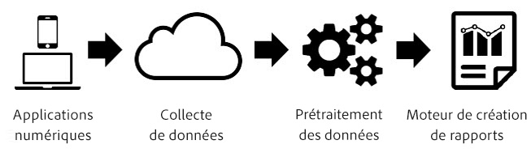

# Traitement de la période de rapport

Le traitement de la période de rapport est un paramètre des suites de rapports virtuelles qui permet aux données d’être traitées de façon rétroactive et non destructrice.

> [!NOTE] Le traitement de la période de rapport n’est disponible que dans Analysis Workspace.

Le traitement de la période de rapport affecte uniquement les données de la suite de rapports virtuelle et n’a aucune incidence sur les données ou la collecte de données dans la suite de rapports de base (parente). La différence entre le traitement de la période de rapport et le traitement Analytics classique est plus facile à comprendre à l’aide du diagramme suivant :

Lors du traitement des données Analytics, les données circulent dans le pipeline de collecte de données et dans une étape de prétraitement qui prépare les données pour la création de rapports. Cette étape de prétraitement applique une logique d’expiration de visite et une logique de persistance des eVars (entre autres) aux données lors de leur collecte. Le principal inconvénient de ce modèle de prétraitement est qu’il nécessite une configuration préalable, avant la collecte des données. Cela signifie, qu’à partir de ce moment-là, les modifications apportées aux paramètres de prétraitement s’appliquent uniquement aux nouvelles données. Cela pose problème si les données n’arrivent pas dans l’ordre ou si les paramètres ont été mal configurés.

Le traitement de la période de rapport est une manière fondamentalement différente de traiter les données Analytics pour la création de rapports. Au lieu de prédéterminer la logique de traitement avant la collecte des données, Analytics ignore le jeu de données pendant l’étape de prétraitement et applique cette logique chaque fois qu’un rapport est exécuté :

Cette architecture de traitement offre des options de création de rapports beaucoup plus flexibles. Par exemple, vous pouvez modifier le délai de visite de manière non destructive et ces modifications sont répercutées rétroactivement dans la persistance des eVars et les conteneurs de segments, comme si vous aviez appliqué ces paramètres avant la collecte des données. En outre, vous pouvez créer un nombre illimité de suites de rapports virtuelles, chacune avec des options de traitement de la période de rapport différentes, basées sur la même suite de rapports de base (parente), sans modifier les données de cette dernière.

Le traitement de la période de rapport permet également à Analytics d’empêcher les accès en arrière-plan de démarrer de nouvelles visites et permet au [SDK Mobile](https://marketing.adobe.com/developer/get-started/mobile/c-measuring-mobile-applications) d’indiquer à la création de rapports de démarrer une nouvelle visite chaque fois qu’un événement de lancement d’application est déclenché.

Les options de configuration suivantes sont actuellement disponibles pour les suites de rapports virtuelles pour lesquelles le traitement de la période de rapport est activé :

* **Délai de visite** : le paramètre Délai de visite définit le délai d’inactivité d’un visiteur unique avant qu’une nouvelle visite ne soit lancée automatiquement. Par défaut, cela prend 30 minutes. Par exemple, si vous définissez le délai de visite sur 15 minutes, un nouveau groupe de visites est créé pour chaque séquence d’accès collectés, séparé par 15 minutes d’inactivité. Ce paramètre impacte non seulement le nombre de visites, mais également la manière dont les conteneurs de segments de visite sont évalués, ainsi que la logique d’expiration de la visite pour les eVars expirant lors de la visite. La réduction du délai de visite augmentera probablement le nombre total de visites dans les rapports, tandis que l’augmentation du délai de visite réduira probablement le nombre total de visites dans les rapports.
* **Paramètres de visite pour les applications mobiles** : pour les suites de rapports contenant des données générées par des applications mobiles via les [SDK Adobe Mobile](https://www.adobe.io/apis/cloudplatform/mobile.html), des paramètres de visite supplémentaires sont disponibles. Ces paramètres sont non destructifs et affectent uniquement les accès collectés via les SDK Mobile. Ces paramètres n’ont aucun impact sur les données collectées en dehors du SDK Mobile.
* **Empêcher les accès en arrière-plan de commencer une nouvelle visite** : les accès en arrière-plan sont collectés par les SDK mobiles lorsque l’application est en arrière-plan.
* **Démarrer de nouvelles visites à chaque lancement d’une application** : en plus du délai de visite, vous pouvez forcer une visite à démarrer chaque fois qu’un événement de lancement d’application est enregistré depuis les SDK Mobile, quelle que soit la fenêtre d’inactivité. Ce paramètre affecte la mesure des visites et le conteneur de segments de visite, ainsi que la logique d’expiration de visite des eVars.
* **Démarrer une nouvelle visite avec un événement** : une nouvelle session démarre lorsqu’un événement est déclenché, qu’une session ait expiré ou non. La session nouvellement créée inclut l’événement à l’origine de son démarrage. De plus, vous pouvez utiliser plusieurs événements pour démarrer une session. Une nouvelle session se déclenche alors si l’un de ces événements est observé dans les données. Ce paramètre aura un impact sur le nombre de visites, sur le conteneur de segmentation des visites et sur la logique d’expiration de visite des eVars.

Le traitement de la période de rapport ne prend pas en charge toutes les mesures et dimensions disponibles dans la création de rapports Analytics traditionnelle. Les suites de rapports virtuelles utilisant le traitement de la période de rapport sont accessibles uniquement dans Analysis Workspace et ne sont pas accessibles dans les [!UICONTROL Reports &amp; Analytics], les Ad Hoc Analysis, Data Warehouse, le Report Builder, les flux de données ou l’API de création de rapports.

En outre, le traitement de la période de rapport traite uniquement les données comprises dans la plage de dates de création de rapports (appelée « fenêtrage de dates » ci-dessous). Cela signifie que les valeurs eVar définies sur « ne jamais expirer » pour un visiteur antérieurement à la plage de dates de création de rapports ne sont pas conservées dans les fenêtres de création de rapports et n’apparaissent pas dans les rapports. Cela signifie également que les mesures de fidélisation des clients sont basées exclusivement sur les données présentes dans la plage de dates de création de rapports et non sur l’ensemble de l’historique antérieurement à la plage de dates de création de rapports.

Vous trouverez ci-dessous une liste de mesures et de dimensions qui ne sont actuellement pas prises en charge lors de l’utilisation du traitement de la période de rapport :

* **Analytics pour Target** : actuellement non pris en charge. Une prise en charge est prévue à l’avenir.
* **Mesures/dimensions réservées d’Analytics pour Advertising Cloud :** actuellement non pris en charge. Une prise en charge est prévue à l’avenir.
* **Mesure Accès unique** : sans prise en charge permanente.
* **Variables de liste** : actuellement non pris en charge. Une prise en charge est prévue à l’avenir.
* **eVars de compteur :** sans prise en charge permanente.
* **Variables Canaux marketing** : actuellement non pris en charge. Une prise en charge est prévue à l’avenir.
* **Jours depuis la dernière dimension d’achat** : en raison de la nature du fenêtrage de dates de traitement de l’heure des rapports, cette dimension n’est pas prise en charge.
* **Jours avant la première dimension d’achat** : en raison de la nature du fenêtrage de dates de traitement de l’heure des rapports, cette dimension n’est pas prise en charge.
* **Dimension Fréquence des retours** : en raison de la nature du fenêtrage de dates de l’option Traitement de la période de rapport, cette dimension n’est pas prise en charge. Une autre approche utilisant une mesure du nombre de visites dans un segment est possible, ou en utilisant la mesure des visites dans un rapport sous forme d’histogramme.
* **Jours depuis la dimension Dernière visite** : en raison de la nature du fenêtrage de dates de traitement de l’heure des rapports, cette dimension n’est pas prise en charge.
* **Dimension Page d’accès d’origine** : en raison de la nature du fenêtrage de dates de l’option Traitement de la période de rapport, cette dimension n’est pas prise en charge.
* **eVars d’affectation linéaire** : actuellement non pris en charge. Une prise en charge est prévue à l’avenir.
* **Dimension Domaine référent initial** : actuellement non pris en charge. Une prise en charge est prévue à l’avenir.
* **Nombre de visites** : en raison de la nature du fenêtrage de dates de l’option Traitement de la période de rapport, cette mesure n’est pas prise en charge. Autre possibilité dans les applications mobiles, vous pouvez utiliser une mesure calculée incluant les visiteurs/visites avec la mesure Installation de l’application pour identifier les nouveaux visiteurs ou les nouvelles visites.
* **Sources de données d’ID de transaction** : actuellement non pris en charge. Une prise en charge est prévue à l’avenir.

Vous trouverez ci-dessous une liste des dimensions et des mesures affectées en fonction des paramètres de traitement de la période de rapport sélectionnés :

* Si l’option « Empêcher les accès en arrière-plan de commencer une nouvelle visite » est activée, les modifications suivantes se produisent. Voir [Session contextuelle](vrs-mobile-visit-processing.md) pour plus d’informations.
   * **Rebonds/Taux de rebond** : les accès en arrière-plan qui ne sont pas suivis d’un accès de premier plan ne sont pas considérés comme un rebond et ne font pas partie du taux de rebond.
   * **Durée de la visite en secondes** : seules les visites qui incluent des accès de premier plan sont incluses dans cette mesure.
   * **Durée de la visite** : seules les visites qui incluent des accès de premier plan sont incluses dans cette mesure.
   * **Dimensions et mesures d’entrée/sortie** : seules les entrées et les sorties des visites avec accès de premier plan apparaissent dans cette dimension.
   * **Mesure Visiteurs uniques** : les visiteurs uniques n’incluent pas les visiteurs qui n’ont eu que des accès en arrière-plan dans la plage de dates de création de rapports.
* **Visites** : les visites reflètent les paramètres configurés par la suite de rapports virtuelle, qui peuvent différer de ceux de la suite de rapports de base.
* **Événements sérialisés avec identifiant d’événement** : les événements qui utilisent la sérialisation des événements avec un identifiant d’événement ne sont dédupliqués que pour les événements qui se produisent dans la plage de dates de création de rapports pour un visiteur. Ces événements ne sont pas dédupliqués de manière globale entre toutes les dates ou tous les visiteurs en raison du fenêtrage de dates de l’option Traitement de la période de rapport.
* **Achats/Recettes/Commandes/Unités** : lorsque l’identifiant d’achat est utilisé, ces mesures ne sont dédupliquées que pour les identifiants d’achat en double se produisant dans la plage de dates de création de rapports pour un visiteur plutôt que pour l’ensemble des dates ou visiteurs en raison du fenêtrage de dates de l’option Traitement de la période de rapport.
* **eVars de non-marchandisage/eVars réservés** : les valeurs définies dans une eVar ne sont conservées que si la valeur a été définie dans la plage de dates de création de rapports en raison du fenêtrage de dates de l’option Traitement de la période de rapport. En outre, les expirations basées sur le temps peuvent expirer une heure plus tôt ou une heure en retard si la persistance chevauche un passage à l’heure d’été/d’hiver.
* **eVars de marchandisage/eVars réservées :** voir ci-dessus. De plus, pour la syntaxe de la conversion pour laquelle la liaison est définie sur « any event », « any hit » est utilisé à la place.
* **Type d’accès** : cette dimension indique si un accès est de premier plan ou en arrière-plan.
