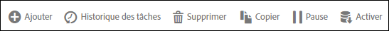

# Panneau Flux de données

Vous pouvez intervenir de plusieurs façons sur un flux de données.

Dans l’interface des flux de données, lorsque vous cochez la case située en regard d’un ou de plusieurs flux, les actions disponibles s’affichent sous la forme d’une collection de boutons au-dessus de la liste.

Pour modifier un flux, cliquez sur son nom dans la liste.
