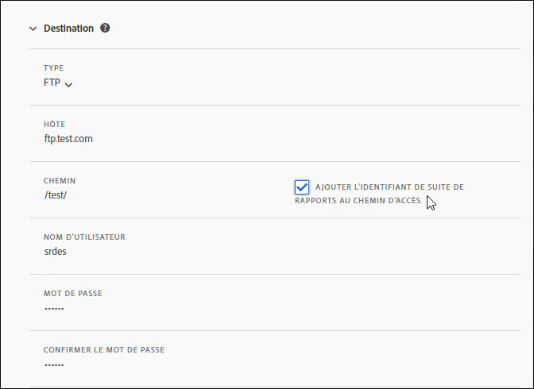
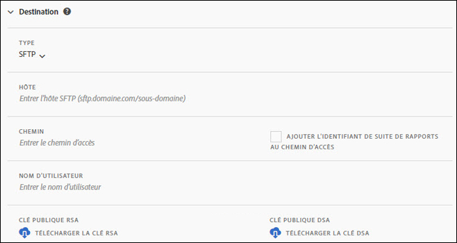
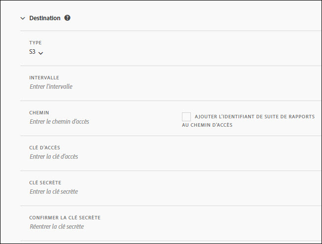
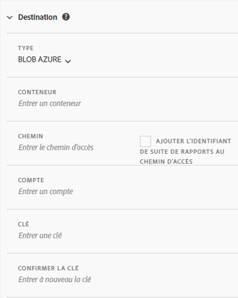

# Destination du flux

La section relative à la destination du flux définit la manière dont le flux est distribué.

Il existe quatre canaux de distribution :

* FTP
* SFTP
* Amazon S3
* Azure Blob

## FTP {#section_D2B521C49BDE4F91A1999FE222CF306F}

Les informations de flux de données peuvent être distribuées vers un emplacement FTP hébergé par Adobe ou par le client.

Si vous optez pour le téléchargement des données vers votre serveur FTP, vous devez indiquer à Adobe le nom d’utilisateur, le mot de passe et le chemin de téléchargement appropriés. Vous devez mettre en œuvre votre propre procédure en matière de gestion de l’espace disque sur le serveur, dans la mesure où Adobe ne supprime aucune donnée du serveur.

## SFTP {#section_8D9215E441474D2BBC56228C2BC926E5}

Les informations de flux de données peuvent être distribuées vers un emplacement sFTP hébergé par Adobe ou par le client.

Si vous optez pour le transfert des données vers votre serveur FTP, vous devez indiquer à Adobe le nom d’utilisateur, le mot de passe et le chemin de transfert appropriés.

<!-- 

Adobe Customer Care will provide you with a Public key. Verify in recording.

 -->

Vous devez mettre en œuvre votre propre procédure en matière de gestion de l’espace disque sur le serveur, dans la mesure où Adobe ne supprime aucune donnée du serveur.

## Amazon S3 {#section_4191CD7B8D3F419EB850B286B542C14A}

Vous pouvez transférer vos fichiers vers un compartiment Amazon S3. Amazon chiffre automatiquement les données au repos (sur les serveurs Amazon). Les données que vous téléchargez sont automatiquement déchiffrées.

Si vous chargez des données par Amazon S3, vous devez fournir un nom de compartiment, un identifiant de clé d’accès, une clé secrète et un nom de dossier.

Les flux de données communiquent avec les 11 régions AWS standard suivantes (en utilisant l’algorithme de signature approprié si nécessaire) :

* us-east-1
* us-west-1
* us-west-2
* ap-south-1
* ap-northeast-2
* ap-southeast-1
* ap-southeast-2
* ap-northeast-1
* eu-central-1
* eu-west-1
* sa-east-1

La région AWS Pékin, Chine (cn-north-1) n’est pour l’instant pas prise en charge.

## Azure Blob {#section_1E9F1D0E7EAB4189A5D748FCA57D63D1}

Vous pouvez charger vos fichiers dans un compte de stockage Azure Blob.

## Champs {#section_AD54B41BC7C945DC85F5FB8FCD4A4792}

Le tableau suivant affiche toutes les options des canaux de distribution. Les options disponibles varient en fonction du canal de distribution sélectionné.

<table id="table_F743C620C82349D9943A13B99EA312BA"> 
 <thead> 
  <tr> 
   <th colname="col1" class="entry"> Champ </th> 
   <th colname="col2" class="entry"> Description </th> 
  </tr> 
 </thead>
 <tbody> 
  <tr> 
   <td colname="col1"> 
Clé d’accès 
 </td> 
   <td colname="col2"> 
Saisissez la clé d’accès Amazon S3. 
 </td> 
  </tr> 
  <tr> 
   <td colname="col1"> 
Compartiment 
 </td> 
   <td colname="col2"> 
Saisissez l’emplacement du compartiment Amazon S3. 
 
Cette valeur doit correspondre au format du compartiment S3 approprié. (See <a href="https://docs.aws.amazon.com/awscloudtrail/latest/userguide/cloudtrail-s3-bucket-naming-requirements.html" format="html" scope="external"> https://docs.aws.amazon.com/awscloudtrail/latest/userguide/cloudtrail-s3-bucket-naming-requirements.html</a>.) 
 
 
Remarque : Pour en savoir plus sur les paramètres Amazon S3, voir <a href="../../../export/analytics-data-feed/feed-troubleshooting.md#section_6797EBBB7E6D44D4B00C7AEDF4C2EE1D" format="dita" scope="local">Paramètre BucketOwnerFullControl pour les flux de données Amazon S3</a> ci-dessous. 
 
 </td> 
  </tr> 
  <tr> 
   <td colname="col1"> 
Conteneur 
 </td> 
   <td colname="col2"> 
Entrez le nom du conteneur Azure Blob. 
 </td> 
  </tr> 
  <tr> 
   <td colname="col1"> 
 Hôte 
 </td> 
   <td colname="col2"> 
Indiquez l’emplacement FTP ou SFTP de l’hôte. 
 
Cette valeur doit être au format ftp/sftp approprié, <code>ftp.domain.com/sous-domaine</code> ou <code>sftp.domain.com/sous-domaine</code>. 
 
 Les ports standard 21 et 22 pour le FTP et le sFTP sont requis. 
 </td> 
  </tr> 
  <tr> 
   <td colname="col1"> 
Mot de passe 
 
Confirmer le mot de passe 
 </td> 
   <td colname="col2"> 
Saisissez le mot de passe FTP. Confirmez-le en le saisissant à nouveau. 
 </td> 
  </tr> 
  <tr> 
   <td colname="col1"> 
Chemin d’accès 
 </td> 
   <td colname="col2"> 
Sélectionnez le chemin d’accès à l’hôte ou au compartiment. Ce chemin d’accès doit exister avant la création du flux. 
 
 
Remarque : Pour en savoir plus sur les paramètres Amazon S3, voir <a href="../../../export/analytics-data-feed/feed-troubleshooting.md#section_6797EBBB7E6D44D4B00C7AEDF4C2EE1D" format="dita" scope="local">Paramètre BucketOwnerFullControl pour les flux de données Amazon S3</a> ci-dessous. 
 
 </td> 
  </tr> 
  <tr> 
   <td colname="col1"> 
Compte 
 </td> 
   <td colname="col2"> 
 Entrez le compte de stockage Azure. 
 </td> 
  </tr> 
  <tr> 
   <td colname="col1"> 
Clé publique 
 </td> 
   <td colname="col2"> 
Indiquez la clé SFTP publique. 
 
Vous devez télécharger la clé publique pour configurer le référentiel SFTP. 
 
 
Remarque : Le téléchargement de la clé publique n’est pas requis pour la création du flux. 
 
 
Vous pouvez utiliser une clé publique qui a déjà été téléchargée lors de la création d’un autre flux. 
 
Pour en savoir plus, voir <a href="https://marketing.adobe.com/resources/help/en_US/whitepapers/ftp/ftp_sftp_dw.html" format="html" scope="external">https://marketing.adobe.com/resources/help/fr_FR/whitepapers/ftp/ftp_sftp_dw.html</a>. 
 </td> 
  </tr> 
  <tr> 
   <td colname="col1"> 
Clé 
 
Confirmer la clé 
 </td> 
   <td colname="col2"> 
 Entrez la clé d’accès du stockage. Entrez-la de nouveau pour la confirmer. 
 
 
Remarque : Voir <a href="https://docs.microsoft.com/en-us/azure/storage/common/storage-create-storage-account#view-and-copy-storage-access-keys" format="https" scope="external">https://docs.microsoft.com/fr-fr/azure/storage/common/storage-create-storage-account#view-and-copy-storage-access-keys</a> pour savoir comment accéder aux clés d’accès. 
 
 </td> 
  </tr> 
  <tr> 
   <td colname="col1"> 
Clé secrète 
 
Confirmer la clé secrète 
 </td> 
   <td colname="col2"> 
Saisissez la clé secrète Amazon S3. Confirmez-la en la saisissant à nouveau. 
 </td> 
  </tr> 
  <tr> 
   <td colname="col1"> 
Type 
 </td> 
   <td colname="col2"> 
Sélectionnez le type de destination. 
 
 
     <ul id="ul_B893EEDA73A34DE0AEB8570BE9027F21"> 
      <li id="li_325546FCEB404C50AA6829573CCA340B">FTP (par défaut) </li> 
      <li id="li_6A2C03115903484797485D073A610607">AmazonS3 </li> 
      <li id="li_C24540F6FCD24702B7693A515CEBE977">SFTP </li> 
      <li id="li_8E03CA78E7FE427C9F6F8B112BC76266">Azure Blob </li> 
     </ul> 
 
Une fois que vous avez sélectionné le type de destination, la liste des champs change de sorte à n’afficher que les options disponibles pour la destination sélectionnée. 
 </td> 
  </tr> 
  <tr> 
   <td colname="col1"> 
Nom d’utilisateur 
 </td> 
   <td colname="col2"> 
Saisissez le nom d’utilisateur FTP. 
 </td> 
  </tr> 
 </tbody> 
</table>

