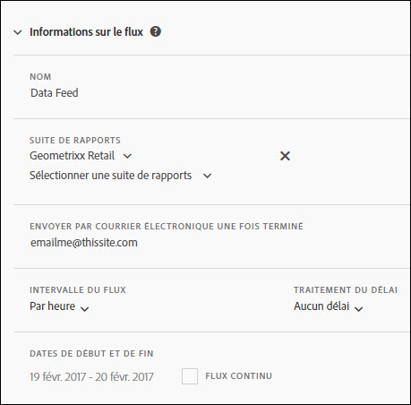

# Informations sur les flux

Utilisez la section Informations sur les flux pour nommer le flux, définir la suite de rapports sur laquelle l’exécuter, déterminer sa fréquence ainsi que sa date et son heure de début et de fin.

<table id="table_C98C7C3CE4194BEF819E792793EBC517">
 <thead>
  <tr>
   <th colname="col1" class="entry"> Champ </th>
   <th colname="col2" class="entry"> Description </th>
  </tr>
 </thead>
 <tbody> 
  <tr> 
   <td colname="col1"> 
Nom (obligatoire) 
 </td>
   <td colname="col2"> 
Saisissez le nom du flux. 
 
Le nom doit être unique au sein de la suite de rapports sélectionnée et peut comporter jusqu’à 255 caractères. 
 </td>
  </tr>
  <tr>
   <td colname="col1"> 
Suite de rapports (obligatoire) 
 </td>
   <td colname="col2"> 
Indiquez les suites de rapports pour la demande de flux. 
 
Vous devez sélectionner au moins une suite de rapports. Vous ne pouvez pas répertorier deux fois la même suite de rapports. 
 
Toutes les suites de rapports non virtuelles disponibles pour l'utilisateur connecté sont disponibles. 
</td>
  </tr>
  <tr>
   <td colname="col1"> 
Envoyer par courrier électronique une fois terminé (obligatoire) 
 </td>
   <td colname="col2"> 
Indiquez l’adresse électronique du destinataire des mises à jour de diffusion du flux. 
 
Ce champ ne peut pas être vide. Il doit contenir une adresse électronique correcte. 
 </td>
  </tr>
  <tr>
   <td colname="col1"> 
Intervalle du flux (obligatoire) 
 </td>
   <td colname="col2"> 
Indiquez la fréquence prévue. 
 
Remarque : En raison de la taille potentielle des fichiers compressés du flux de données, veillez à ce que le processus ETL utilise un utilitaire de compression de 64 bits. 
 </td>
  </tr>
  <tr>
   <td colname="col1"> 
Traitement du délai (facultatif) 
 </td>
   <td colname="col2"> 
Indiquez quel délai appliquer entre chaque instance planifiée. 
 </td>
  </tr>
  <tr>
   <td colname="col1"> 
Date de début et de fin (obligatoire) 
 
Flux continu (facultatif) 
 </td>
   <td colname="col2"> 
Définissez à quelles dates le flux commencera et s’arrêtera. 
 

     <ul id="ul_509977336CD34032924B48E043E8CBC7">
      <li id="li_BFB5B6ADCB184D839C9BA42DB3DCAF32">Date de début : par défaut, la date d’aujourd’hui. </li>
      <li id="li_34F8DB45D9B54076840D1A0B782812D3">Date de fin : par défaut, la date de demain. </li>
     </ul>
     
 </td>
  </tr>
 </tbody>
</table>