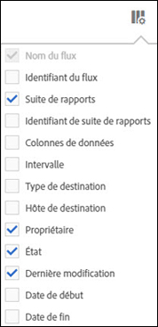

# Tri des colonnes

Vous pouvez déterminer les colonnes disponibles et les trier en fonction de vos besoins.

1. To determine which columns are visible, click the **[!UICONTROL Columns Configuration]** button.

   

1. Pour trier une colonne, cliquez sur son titre.

   Les colonnes alphabétiques sont triées par ordre alphabétique. Cliquez sur le titre pour les trier en ordre alphabétique inversé.

   Les colonnes numériques sont triées par ordre croissant. Cliquez sur le titre pour passer d’un tri croissant à un tri décroissant.
