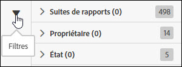

# Recherche et filtrage

La recherche et le filtrage vous permettent de localiser un flux dans la liste.

1. Pour afficher les options de filtrage, cliquez sur l’icône Filtre ou passez le curseur au-dessus de celle-ci.

   

   Il existe trois options de filtrage :

   * Suite de rapports
   * Propriétaire
   * État

1. Saisissez un terme de recherche pour effectuer une recherche dans la liste des flux.

   

Pour trouver vos flux, vous pouvez combiner les fonctions de filtrage et de recherche. Les filtres combinés sont reliés par un opérateur ET.
