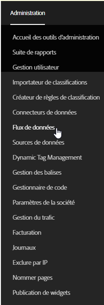
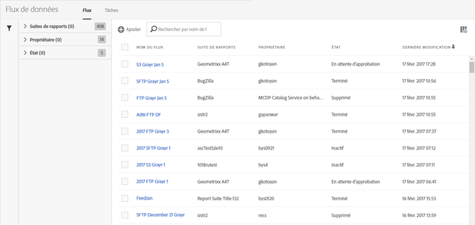

# Ouverture de l'interface Flux de données

L’interface des flux de données est accessible depuis l’onglet d’administration 

1. Ouvrez l’onglet Administration.
1. Select **[!UICONTROL Data Feeds]**.

   

La page d’entrée des flux de données répertorie tous les flux actuellement définis pour votre entreprise, pour toutes les suites de rapports auxquelles l’utilisateur administrateur peut accéder.

Si aucun flux n’a été défini, la page affiche un bouton **[!UICONTROL Créer un flux de données].**

To view your [jobs](../../../export/analytics-data-feed/c-data-feed-actions/t-feed-job-history.md#task_0D05F2D1B41B4E4A95B570DC78014480), click **[!UICONTROL Jobs]**. Pour retourner à l’affichage des flux, cliquez sur **[!UICONTROL Flux]**.