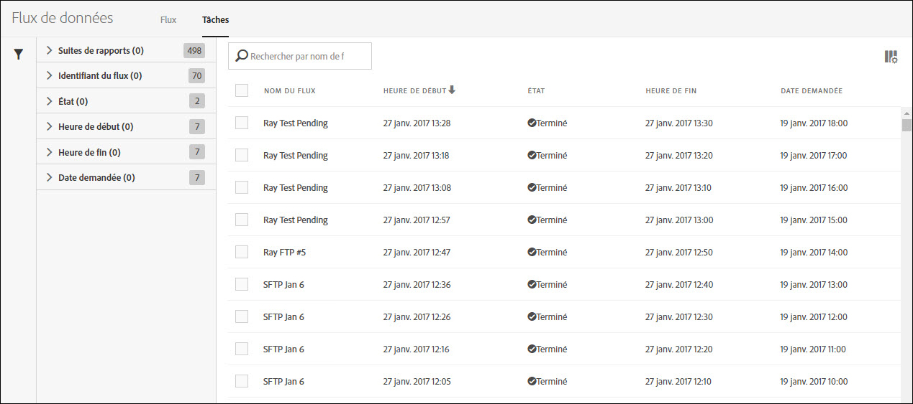
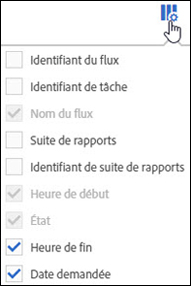

# Tâche des flux de données - présentation

Utilisez l’onglet Tâches pour afficher l’historique des tâches et gérer ces dernières.

La liste des tâches fournit des informations telles que l’état de la tâche, sa date et son heure de début et de fin, sa durée d’exécution, etc.

Cliquez sur le titre d’une colonne pour modifier l’ordre dans lequel les tâches sont affichées.

Pour définir quelles informations afficher dans la liste des tâches, cliquez sur l’icône Paramètres, puis sélectionnez les noms de colonnes souhaités.

Les colonnes Nom du flux, Heure de début et État sont obligatoires et ne peuvent pas être supprimées de la liste des tâches.

| Colonne | Description |
|---|---|
| Identifiant du flux | Identifiant unique du flux. |
| ID de tâche | Identifiant unique de la tâche. |
| Nom du flux | Nom donné au flux. |
| Heure de début | Heure de début de la tâche, affichée dans votre fuseau horaire. |
| Heure d’exécution | La durée nécessaire à l’exécution de la tâche. Affichée sous la forme jj hh:mm:ss |
| État | L'actif [État](../../../export/analytics-data-feed/c-df-jobs/r-job-status.md#reference_7A39A327F643447F9B5AE3A2502C72BA) actuel de la tâche. |
| Heure de fin | L’heure de fin d’exécution de la tâche. Affichée dans votre fuseau horaire. |
| Date demandée | Horodatage des données comprises dans la tâche. |

