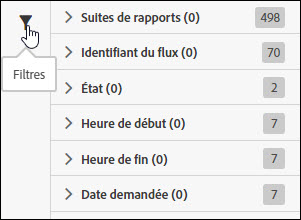

# Filtrage de la liste des tâches

Pour retrouver une tâche dans la liste, vous pouvez vous servir des fonctions de recherche et de filtrage.

1. Pour afficher les options de filtrage, cliquez sur l’icône Filtre ou passez le curseur au-dessus de celle-ci.

   

   Il existe plusieurs options de filtrage :

   * Suite de rapports
   * Identifiant du flux
   * État
   * Heure de début
   * Heure de fin
   * Date demandée

1. Saisissez un terme à rechercher dans la liste des tâches.

   

Pour trouver vos tâches, vous pouvez combiner les options de filtrage et de recherche. L’opérateur ET permet de relier les différents filtres et termes de recherche.
