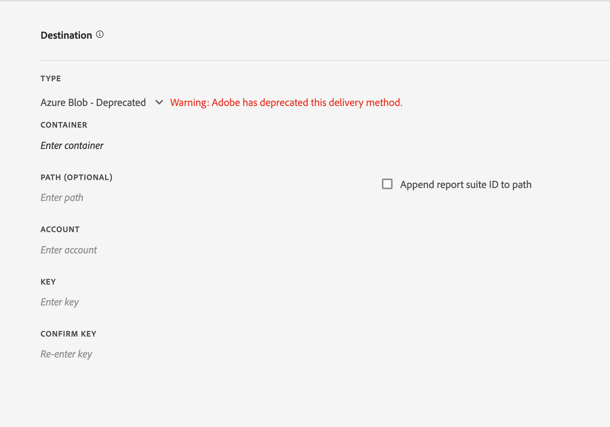

# Création ou modification d’un flux de données

La création d’un flux de données permet à Adobe de savoir où envoyer les fichiers de données brutes et les éléments que vous souhaitez inclure dans chaque fichier. Cette page répertorie les paramètres individuels que vous pouvez personnaliser lorsque vous créez un flux de données.

Il est recommandé de posséder des connaissances élémentaires des flux de données avant de lire cette page. Consultez l’[aperçu des flux de données](data-feed-overview.md) pour vous assurer de répondre aux exigences en matière de création des flux de données.

## Champs d’informations sur les flux

* **Nom** : le nom du flux de données. Doit être unique au sein de la suite de rapports sélectionnée et peut comporter jusqu’à 255 caractères.
* **Suite de rapports :** la suite de rapports sur laquelle le flux de données est basé. Si plusieurs flux de données sont créés pour une même suite de rapports, ils doivent avoir des définitions de colonne différentes. Seules les suites de rapports source prennent en charge les flux de données ; les suites de rapports virtuelles ne sont pas prises en charge.
* **Envoyer par courrier électronique une fois terminé** : l’adresse e-mail vers laquelle envoyer une notification lorsque le traitement d’un flux est terminé. L’adresse e-mail doit être correctement formatée.
* **Intervalle du flux** : les flux horaires contiennent l’équivalent d’une seule heure de données. Les flux quotidiens contiennent l’équivalent d’une journée complète de données. Ces flux comprennent les données de minuit à minuit dans le fuseau horaire de la suite de rapports.
* **Traitement du délai** : patientez un certain temps avant de traiter un fichier de flux de données. Il peut être utile de mettre en place un délai pour donner aux appareils hors ligne la possibilité de se connecter et d’envoyer leurs données dans le cadre d’implémentations mobiles. Il est également possible d’utiliser un délai pour adapter les processus côté serveur de votre entreprise en ce qui concerne la gestion des fichiers traités précédemment. Dans la plupart des cas aucun délai n’est nécessaire. Un flux peut être se voir attribuer un délai pouvant aller jusqu’à 120 minutes.
* **Dates de début et de fin** : la date de début indique la première date pour laquelle vous souhaitez un flux de données. Définissez cette date dans le passé pour commencer immédiatement à traiter les flux de données des données historiques. Le traitement du flux se poursuit jusqu’à ce que la date de fin soit atteinte. Les dates de début et de fin sont définies en fonction du fuseau horaire de la suite de rapports.
* **Flux continu** : cette case à cocher supprime la date de fin et permet à un flux de s’exécuter indéfiniment. Lorsqu’un flux termine le traitement de données historiques, un flux attend la fin de la collecte des données pour une heure ou un jour donné. Une fois l’heure ou le jour en question terminé, le traitement commence après le délai indiqué.

## Champ de destination

Les champs disponibles dans les champs de destination dépendent du type de destination.

### Google Cloud Platform

Accès aux compartiments de stockage GCP en tant que destination sécurisée

**Champs**
* *Type :* Type de destination de la plateforme Google Cloud
* *ID de projet :* Identifiant de projet GCP où se trouve le compartiment de stockage
* *Nom du compartiment de stockage :* Les noms de compartiment sans point sont limités à 3-63 caractères. Les noms contenant des points peuvent contenir jusqu’à 222 caractères, mais chaque composant séparé par des points ne peut pas dépasser 63 caractères.
* *Chemin (facultatif) :* &amp; *Ajouter l’identifiant de suite de rapports au chemin d’accès :* Emplacement des ressources à récupérer ou à stocker


**Processus de création de compte de service**

L’utilisateur devra créer un compte de service pour que la destination Google Cloud Platform soit sélectionnée.

Un seul compte de service GCP sera autorisé par organisation d’analyse. Une fois le compte de service créé pour le flux de données, tous les flux de données supplémentaires au sein de l’organisation sont préremplis avec le compte de service.


### Amazon S3

Stockage du compartiment Amazon S3 accessible via le rôle IAM au sein d’une entité approuvée.

**Champs**

* *Type :* Type de destination d’Amazon S3
* *Compartiment :* Nom du compartiment S3
* *Trusted Entity ARN :* AWS IAM Entity ARN `arn:aws:iam::<12 digit account number>:user/<username>`
* *Role ARN :* APERÇU DU Rôle IAM AWS `arn:aws:iam::<12 digit account number>:role/<role name>`
* *Chemin (facultatif) :* &amp; *Ajouter l’identifiant de suite de rapports au chemin d’accès :* Emplacement des ressources à récupérer ou à stocker
* *Spécifiez la région (facultatif) :* Liste déroulante de toutes les régions AWS disponibles, y compris les régions CN


**Création et sélection d’une entité approuvée**

L’utilisateur peut sélectionner une entité de confiance parmi les options répertoriées dans la liste déroulante ou en créer une et en récupérer une nouvelle en cliquant sur l’icône `Create Entity` bouton .

Après avoir cliqué sur l’icône `Create Entity` , l’utilisateur sera redirigé vers un processus d’authentification. Une fois l’utilisateur authentifié, l’entité de confiance est créée et ajoutée aux options de la liste déroulante.

La liste déroulante répertorie toutes les entités de confiance qui ont été créées dans l’organisation par cet utilisateur.


Vous pouvez envoyer des flux directement aux compartiments Amazon S3 par le biais de la méthode héritée. Consultez les [conditions d’attribution de noms pour des compartiments Amazon S3](https://docs.aws.amazon.com/fr_fr/awscloudtrail/latest/userguide/cloudtrail-s3-bucket-naming-requirements.html) dans les documents Amazon S3 pour plus d’informations.

**Champs - Obsolète**

* *Type :* Type de destination de la méthode S3 obsolète
* *Compartiment :* Nom du compartiment Amazon S3
* *Chemin (facultatif) :* &amp; *Ajouter l’identifiant de suite de rapports au chemin d’accès :* Emplacement des ressources à récupérer ou à stocker
* *Clé d’accès :* Identifiant de clé d’accès de l’utilisateur AWS
* *Clé secrète :* Clé secrète de l’utilisateur AWS
* *Confirmer la clé secrète :* Rentrer la clé secrète de l’utilisateur AWS


L’utilisateur pour lequel vous chargez des flux de données doit disposer des [autorisations](https://docs.aws.amazon.com/fr_fr/AmazonS3/latest/API/API_Operations_Amazon_Simple_Storage_Service.html) suivantes :

* s3:GetObject
* s3:PutObject
* s3:PutObjectAcl

Pour chaque chargement vers un compartiment Amazon S3, [!DNL Analytics] ajoute le propriétaire du compartiment à la liste de contrôle d’accès BucketOwnerFullControl, que le compartiment ait ou non une politique qui le requiert. Pour plus d’informations, voir « [Quel paramètre BucketOwnerFullControl pour les flux de données Amazon S3 ?](df-faq.md#BucketOwnerFullControl) ».

**Régions AWS prises en charge**:
* us-east-2
* us-east-1
* us-west-1
* us-west-2
* ap-south-1
* ap-northeast-2
* ap-southeast-1
* ap-southeast-2
* ap-northeast-1
* ca-central-1
* eu-central-1
* eu-west-1
* eu-west-2
* eu-west-3
* eu-north-1
* sa-east-1
* cn-north-1
* cn-norwest-1


### Azure Blob

Destination sécurisée Azure Blob à l’aide du contrôle d’accès en fonction du rôle (RBAC) ou de la signature d’accès partagé (SAS). Lorsque vous sélectionnez le contrôle d’accès, le contenu du panneau est mis à jour pour refléter les champs correspondants.

**Champs - RBAC**
* *Type :* Type de destination de l’objet Blob Azure
* *Contrôle d’accès :* Option d’utilisation des fonctions RBAC ou SAS
* *Identifiant du tenant principale Directory :* ID d’organisation du compte Azure
* *ID de l’application :* ID de l’application de l’adaptateur Principale Directory
* *Client Secret :* Secret client Azure
* *Nom du compte de stockage :* Nom du compte contenant des objets de données
* *Nom du conteneur :* Conteneur appartenant à un compte de stockage donné.
* *Chemin (facultatif) :* &amp; *Ajouter l’identifiant de suite de rapports au chemin d’accès :* Emplacement des ressources à récupérer ou à stocker


**Champs - SAS**
* *Type :* Type de destination de l’objet Blob Azure
* *Contrôle d’accès :* Option d’utilisation des fonctions RBAC ou SAS
* *Identifiant du tenant principale Directory :* ID de l’instance Azure Principal Directory
* *ID de l’application :* ID de l’application de l’adaptateur Principale Directory
* *Client Secret :* Secret client Azure
* *URI Key Vault :* Emplacement du KeyVault Azure
* *Key Vault Secret Name :* Nom secret pour accéder au Key Vault sécurisé
* *Chemin (facultatif) :* &amp; *Ajouter l’identifiant de suite de rapports au chemin d’accès :* Emplacement des ressources à récupérer ou à stocker


**Champs - Obsolète**
* *Type :* Type de destination de l’objet Blob Azure
* *Conteneur :* Nom du conteneur Azure
* *Chemin (facultatif) :* &amp; *Ajouter l’identifiant de suite de rapports au chemin d’accès :* Emplacement des ressources à récupérer ou à stocker
* *Compte :* Secret du compte Azure
* *URI Key Vault :* Emplacement du KeyVault Azure
* *Key Vault Secret Name :* Nom secret pour accéder au Key Vault sécurisé

Vous devez mettre en œuvre votre propre processus pour gérer l’espace disque sur la destination de flux. Adobe ne supprime pas les données du serveur.
Pour en savoir plus, consultez [Création d’un compte Azure Storage](https://docs.microsoft.com/fr-fr/azure/storage/common/storage-quickstart-create-account?tabs=azure-portal#view-and-copy-storage-access-keys) dans la documentation Microsoft Azure.



>[!NOTE]
>
>Vous devez mettre en œuvre votre propre processus pour gérer l’espace disque sur la destination de flux. Adobe ne supprime pas les données du serveur.

### FTP : obsolète

**Champs**
* *Type :* Type de destination du FTP
* *Hôte :* Point d’entrée pour accéder à l’hôte
* *Chemin (facultatif) :* &amp; *Ajouter l’identifiant de suite de rapports au chemin d’accès :* Emplacement des ressources à récupérer ou à stocker
* *Nom d’utilisateur :* Nom d’utilisateur de l’hôte
* *Mot de passe :* Mot de passe de l’hôte
* *Confirmer le mot de passe :* Entrez à nouveau et vérifiez le mot de passe de l’hôte.


### SFTP - Obsolète

La prise en charge SFTP des flux de données est disponible. Nécessite un hôte SFTP, un nom d’utilisateur et un site de destination contenant une clé publique RSA ou DSA. Vous pouvez télécharger la clé publique appropriée à la création du flux.

**Champs**
* *Type :* Type de destination du SFTP
* *Hôte :* Point d’entrée pour accéder à l’hôte
* *Chemin (facultatif) :* &amp; *Ajouter l’identifiant de suite de rapports au chemin d’accès :* Emplacement des ressources à récupérer ou à stocker
* *Clé publique RSA :* ou *Clé publique DSA :* Clé publique pour accéder à l’hôte


## Définitions des colonnes de données

Toutes les colonnes sont disponibles qu’elles contiennent des données ou non. Un flux de données doit inclure au moins une colonne.

* **Supprimer les caractères avec échappement** : au cours d’une collecte de données, certains caractères (comme les sauts de lignes) peuvent occasionner des erreurs. Cochez cette case si vous souhaitez retirer ces caractères des fichiers de flux.
* **Format de compression** : le type de compression utilisé. Fichiers de sortie Gzip au format `.tar.gz`. Fichiers de sortie Zip au format `.zip`.
* **Type de groupement** : un fichier unique sort le fichier `hit_data.tsv` dans un fichier unique pouvant être volumineux. La fonction plusieurs fichiers met en page vos données par blocs de 2 Go (non compressés). Si vous avez sélectionné plusieurs fichiers, mais que la taille des données non compressées pour la fenêtre de création de rapports est inférieure à 2 Go, un seul fichier est envoyé. Adobe recommande d’utiliser plusieurs fichiers pour la plupart des flux de données.
* **Manifeste** : indique si Adobe doit ou non livrer un [fichier de manifeste](c-df-contents/datafeeds-contents.md#feed-manifest) à la destination lorsqu’aucune donnée n’est collectée pour un intervalle de flux. Si vous sélectionnez Fichier de manifeste, vous recevrez un fichier de manifeste similaire à ce qui suit lorsqu’aucune donnée n’est collectée :

```text
   Datafeed-Manifest-Version: 1.0
    Lookup-Files: 0
    Data-Files: 0
    Total-Records: 0
```

* **Modèles de colonnes** : lorsque vous créez plusieurs flux de données, Adobe vous recommande de créer un modèle de colonnes. La sélection d’un modèle de colonnes inclut automatiquement les colonnes indiquées dans le modèle. Adobe fournit également plusieurs modèles par défaut.
* **Colonnes disponibles** : Toutes les colonnes de données disponibles dans Adobe Analytics. Cliquez sur [!UICONTROL Toujours ajouter] pour inclure toutes les colonnes d’un flux de données.
* **Colonnes incluses** : les colonnes à inclure à un flux de données. Cliquez sur [!UICONTROL Tout supprimer] pour supprimer toutes les colonnes d’un flux de données.
* **Télécharger un fichier CSV** : télécharge un fichier CSV contenant toutes les colonnes incluses.
