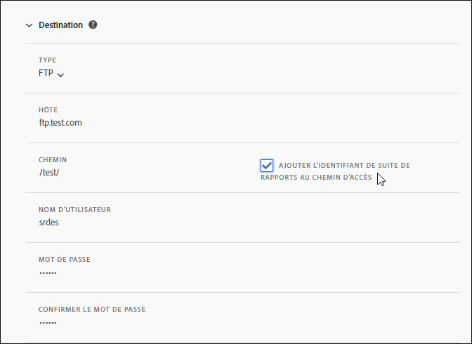
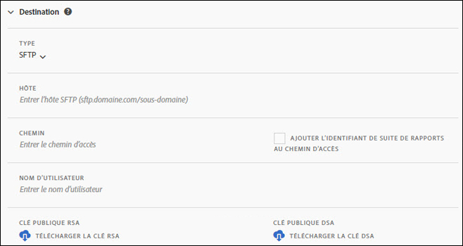
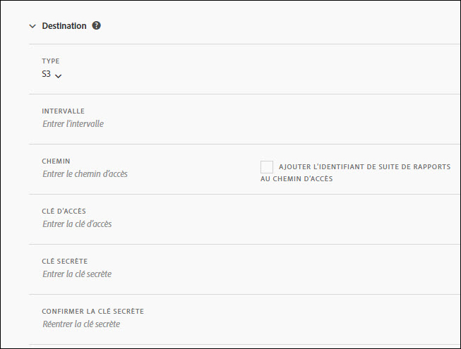
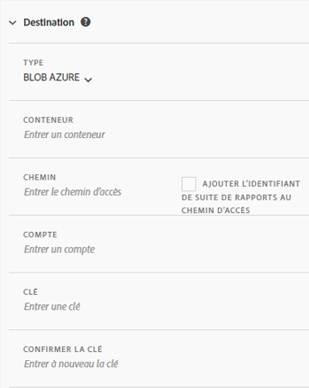

# Création ou modification d’un flux de données

La création d’un flux de données permet à Adobe de savoir où envoyer les fichiers de données brutes et ce que vous souhaitez inclure dans chaque fichier. Cette page répertorie les paramètres individuels que vous pouvez personnaliser lors de la création d’un flux de données.

Il est recommandé de connaître les flux de données avant de lire cette page. Voir Présentation [des flux de](data-feed-overview.md) données pour vous assurer que vous remplissez les conditions requises pour créer un flux de données.

## Champs Informations sur le flux

* **Nom**: Nom du flux de données. Doit être unique dans la suite de rapports sélectionnée et peut comporter jusqu’à 255 caractères.
* **** Suite de rapports : Suite de rapports sur laquelle repose le flux de données. Si plusieurs flux de données sont créés pour la même suite de rapports, ils doivent avoir des définitions de colonne différentes. Seules les suites de rapports source prennent en charge les flux de données ; les suites de rapports virtuelles ne sont pas prises en charge.
* **Envoyer un courrier électronique une fois terminé**: Adresse électronique à notifier lorsqu’un flux termine son traitement. L’adresse électronique doit être correctement formatée.
* **Intervalle** du flux : Les flux horaires contiennent une valeur d’une heure de données. Les flux quotidiens contiennent l’équivalent d’une journée complète de données.
* **Retard du traitement**: Patientez un certain temps avant de traiter un fichier de flux de données. Un délai peut s’avérer utile pour donner aux implémentations mobiles l’opportunité aux périphériques hors ligne de se connecter et d’envoyer des données. Il peut également être utilisé pour adapter les processus côté serveur de votre entreprise à la gestion des fichiers précédemment traités. Dans la plupart des cas, aucun délai n'est nécessaire. Un flux peut être retardé de 120 minutes au maximum.
* **Dates** de début et de fin : La date de début indique la première date que vous souhaitez utiliser pour un flux de données. Définissez cette date dans le passé pour commencer immédiatement le traitement des flux de données pour les données historiques. Le traitement des flux se poursuit jusqu’à la date de fin.
* **Flux** continu : Cette case à cocher supprime la date de fin, ce qui permet à un flux de s’exécuter indéfiniment. Lorsqu’un flux termine le traitement des données historiques, il attend que les données se terminent pendant une heure ou un jour donné. Une fois l’heure ou le jour en cours terminé, le traitement commence après le délai spécifié.

## Champs de destination

Les champs disponibles sous les champs de destination dépendent du type de destination.

### FTP

Les informations de flux de données peuvent être distribuées vers un emplacement FTP hébergé par Adobe ou par le client. Nécessite un hôte FTP, un nom d’utilisateur et un mot de passe. Utilisez le champ de chemin pour placer des fichiers de flux dans un dossier. Les dossiers doivent déjà exister ; les flux renvoient une erreur si le chemin spécifié n’existe pas.

### SFTP

La prise en charge SFTP des flux de données est disponible. Nécessite qu’un hôte SFTP, un nom d’utilisateur et le site de destination contiennent une clé publique RSA ou DSA valide. Vous pouvez télécharger la clé publique appropriée lors de la création du flux.

### S3

Vous pouvez envoyer des flux directement vers les intervalles Amazon S3. Nécessite un nom de compartiment, un ID de clé d’accès et une clé secrète. Pour plus d’informations, voir Conditions requises [pour l’appellation des lots](https://docs.aws.amazon.com/awscloudtrail/latest/userguide/cloudtrail-s3-bucket-naming-requirements.html) Amazon S3 dans les documents Amazon S3.

Les 11 régions AWS standard suivantes sont prises en charge (à l’aide de l’algorithme de signature approprié, le cas échéant) :

* us-east-1
* us-west-1
* us-west-2
* ap-south-1
* ap-northeast-2
* ap-southeast-1
* ap-southeast-2
* ap-northeast-1
* eu-central-1
* eu-west-1
* sa-east-1

> [!NOTE] La région cn-north-1 n’est pas prise en charge.

### Azure Blob

Les flux de données prennent en charge les destinations Azure Blob. Nécessite un conteneur, un compte et une clé. Amazon chiffre automatiquement les données au repos. Les données que vous téléchargez sont automatiquement déchiffrées. Voir [Création d'un compte](https://docs.microsoft.com/en-us/azure/storage/common/storage-quickstart-create-account?tabs=azure-portal#view-and-copy-storage-access-keys) de stockage dans les documents Microsoft Azure pour plus d'informations.

> [!NOTE] Vous devez mettre en oeuvre votre propre processus pour gérer l’espace disque sur la destination du flux. Adobe ne supprime aucune donnée du serveur.

## Définitions des colonnes de données

Toutes les colonnes, qu’elles contiennent des données ou non, sont disponibles. Un flux de données doit inclure au moins une colonne.

* **Supprimer les caractères**&#x200B;échappés : Lors de la collecte de données, certains caractères (tels que les nouvelles lignes) peuvent entraîner des problèmes. Cochez cette case si vous souhaitez supprimer ces caractères des fichiers de flux.
* **Format** de compression : Type de compression utilisé. Gzip génère les fichiers au `.tar.gz` format. Le code postal génère les fichiers au `.zip` format.
* **Type** d’assemblage : Un seul fichier génère le `hit_data.tsv` fichier dans un seul fichier potentiellement massif. Plusieurs fichiers paginent vos données en blocs de 2 Go (non compressés). Si plusieurs fichiers sont sélectionnés et que les données non compressées de la fenêtre de rapport sont inférieures à 2 Go, un fichier est envoyé. Adobe recommande d’utiliser plusieurs fichiers pour la plupart des flux de données.
* **Modèles** de colonne : Lors de la création de nombreux flux de données, Adobe recommande de créer un modèle de colonne. La sélection d’un modèle de colonne inclut automatiquement les colonnes spécifiées dans le modèle. Adobe fournit également plusieurs modèles par défaut.
* **Colonnes** disponibles : Toutes les colonnes de données disponibles dans Adobe Analytics. Cliquez sur [!UICONTROL Ajouter tout] pour inclure toutes les colonnes dans un flux de données.
* **Colonnes** incluses : Colonnes à inclure dans un flux de données. Cliquez sur [!UICONTROL Supprimer tout] pour supprimer toutes les colonnes d’un flux de données.
* **Télécharger CSV**: Télécharge un fichier CSV contenant toutes les colonnes incluses.
