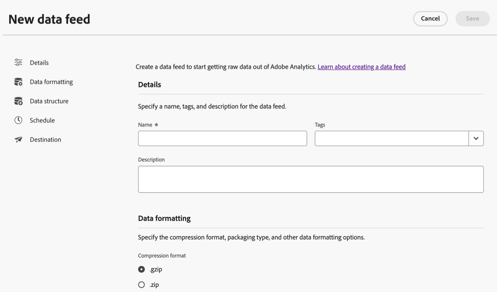
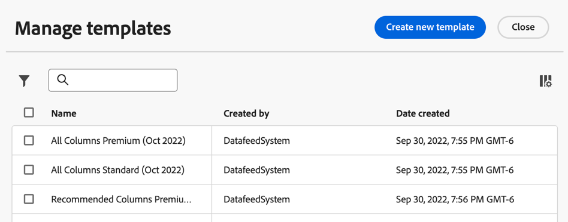

# Créer un flux de données

Lors de la création d’un flux de données, vous fournissez à Adobe les éléments suivants :

* Informations sur la destination vers laquelle envoyer les fichiers de données brutes

* Les données à inclure dans chaque fichier

* La fréquence d’envoi du flux de données (y compris l’intervalle de recherche en amont si vous choisissez d’inclure les accès arrivant tard)

Avant de créer un flux de données, il est important de comprendre les bases des flux de données et de vous assurer que vous remplissez toutes les conditions préalables. Consultez la [vue d’ensemble des flux de données](data-feed-overview.md) pour en savoir plus.

## Créer et configurer un flux de données {#create-and-configure-data-feed}

<!-- markdownlint-disable MD034 -->

>[!CONTEXTUALHELP]
>id="aa_datafeed_os_strings"
>title="Remplacer les chaînes du système d’exploitation"
>abstract="Cette option nettoie la sortie des données en détectant les séquences de chaînes suivantes incorporées dans les données clientèle et en les remplaçant par un espace :  Windows : CRLF, CR ou TAB Mac et Linux : \n, \r ou \t"

<!-- markdownlint-enable MD034 -->

<!-- markdownlint-disable MD034 -->

>[!CONTEXTUALHELP]
>id="aa_datafeed_export_file"
>title="Manifeste"
>abstract="Choisissez d’inclure un fichier manifeste avec chaque diffusion de flux de données. Les fichiers manifeste contiennent des informations pour chaque fichier inclus dans le flux de données. Lors de l’envoi de données de flux de données dans un seul package, vous pouvez également choisir d’inclure un fichier de fin, mais les fichiers de manifeste sont recommandés. "

<!-- markdownlint-enable MD034 -->

<!-- markdownlint-disable MD034 -->

>[!CONTEXTUALHELP]
>id="aa_datafeed_notify"
>title="Avertir une fois l’opération terminée"
>abstract="Indiquez une ou plusieurs adresses e-mail auxquelles une notification doit être envoyée après l’envoi du flux de données. Plusieurs adresses e-mail doivent être séparées par une virgule."

<!-- markdownlint-enable MD034 -->

<!-- added help for Dynamic lookups to this page: help/export/analytics-data-feed/c-df-contents/dynamic-lookups.md -->

1. Connectez-vous à [experiencecloud.adobe.com](https://experiencecloud.adobe.com) à l’aide de vos identifiants Adobe ID.

1. Sélectionnez l’icône des 9 carrés dans le coin supérieur droit, puis sélectionnez [!UICONTROL **Analytics**].

1. Dans la barre de navigation supérieure, accédez à [!UICONTROL **Admin**] > [!UICONTROL **Flux de données**].

1. Sélectionnez [!UICONTROL **Créer un flux de données**].

   Une page s’affiche avec les catégories suivantes : [!UICONTROL **Détails**], [!UICONTROL **Formatage des données**], [!UICONTROL **Structure des données**], [!UICONTROL **Planification**] et [!UICONTROL **Destination**].

   

1. Dans la section [!UICONTROL **Détails**], renseignez les champs suivants :

   | Champ | Fonction |
   |---------|----------|
   | [!UICONTROL **Nom**] | Nom du flux de données. Les noms doivent être uniques dans la suite de rapports sélectionnée et peuvent comporter jusqu’à 255 caractères. [En savoir plus](/help/export/analytics-data-feed/df-faq.md#must-feed-names-be-unique) |
   | [!UICONTROL **Balises**] | Appliquez des balises au flux de données pour faciliter la catégorisation. Vous pouvez filtrer selon les balises comme décrit dans [Filtrer et rechercher la liste des flux de données](/help/export/analytics-data-feed/df-manage-feeds.md#filter-and-search-the-list-of-data-feeds) dans [Gérer les flux de données](/help/export/analytics-data-feed/df-manage-feeds.md). |
   | [!UICONTROL **Description**] | Spécifiez une description pour le flux de données. La description que vous ajoutez est visible lors de la modification du flux de données. |

1. Dans la section [!UICONTROL **Formatage des données**], spécifiez les informations suivantes :

   | Champ | Fonction |
   |---------|----------|
   | [!UICONTROL **Format de compression**] | Le type de compression utilisé. Fichiers de sortie **Gzip** au format `.tar.gz`. Fichiers de sortie **Zip** au format `.zip`. |
   | [!UICONTROL **Type de packaging**] | Sélectionnez [!UICONTROL **Plusieurs fichiers**] pour la plupart des flux de données. Cette option pagine vos données en blocs de 2 Go non compressés. (Si l’option [!UICONTROL **Plusieurs fichiers**] est sélectionnée et que les données non compressées pour la fenêtre de création de rapports font moins de 2 Go, un fichier est envoyé.) Sélectionnez **Fichier unique** pour générer le fichier `hit_data.tsv` dans un seul fichier potentiellement volumineux. |
   | [!UICONTROL **Manifeste**] | Choisissez d’inclure un fichier manifeste avec chaque diffusion de flux de données. 
Vous pouvez choisir parmi les options suivantes :
<ul><li>**[!UICONTROL Fichier de manifeste]** : contient des informations pour chaque fichier inclus dans le flux de données.</li><li>**[!UICONTROL Fichier de fin (hérité)]** : indique que le flux de données s’est terminé avec succès. Aucune autre information n’est incluse. Cette option est adaptée aux flux existants qui ont utilisé cette option à l’origine et qui doivent être retraités. Elle est disponible uniquement lors de l’envoi de données de flux de données dans un seul package. </li><li>**[!UICONTROL Aucun]** : aucun fichier n’est inclus</li></ul> |
   | [!UICONTROL **Envoyer le manifeste même en l’absence de données**] | Indique si Adobe doit ou non livrer un [fichier de manifeste](/help/export/analytics-data-feed/c-df-contents/datafeeds-contents.md#feed-manifest) à la destination lorsqu’aucune donnée n’est collectée pour un intervalle de flux. Si vous sélectionnez **Fichier de manifeste**, vous recevez un fichier de manifeste similaire à ce qui suit lorsqu’aucune donnée n’est collectée :
`text`

`Datafeed-Manifest-Version: 1.0`

`Lookup-Files: 0`

`Data-Files: 0`

 `Total-Records: 0`
 |
   | [!UICONTROL **Remplacer les chaînes du système d’exploitation**] | Lors de la collecte de données, certains caractères (tels que les nouvelles lignes) peuvent entraîner des problèmes. Sélectionnez cette option pour supprimer ces caractères des fichiers de flux.
Cette option détecte les séquences de chaînes suivantes incorporées dans les données client et les remplace par un espace :
 <ul><li>**Windows:** CRLF, CR ou TAB</li><li>**Mac et Linux :** \n, \r ou \t</li></ul> |
   | [!UICONTROL **Activer les recherches dynamiques**] | Les recherches dynamiques vous permettent de recevoir des fichiers de recherche supplémentaires dans votre flux de données qui ne seraient pas disponibles autrement. Ce paramètre permet d’envoyer les tables de recherche suivantes avec chaque fichier de flux de données :<ul><li> **Nom du transporteur**</li><li>**Attributs mobiles**</li><li>**Type de système d’exploitation**</li></ul>
Pour plus d’informations, voir [Recherches dynamiques](/help/export/analytics-data-feed/c-df-contents/dynamic-lookups.md).
 |
   | **Autoriser les accès en retard** | Les données historiques peuvent arriver une fois qu’une tâche de flux de données a terminé le traitement pendant une heure ou une journée donnée, par exemple par le biais d’accès horodatés ou de sources de données.
Sélectionnez cette option pour inclure les données arrivées après la fin du traitement des données par le traitement de flux de données dans la fréquence de création de rapports définie (généralement par semaine ou par heure). Lorsque cette option est activée, chaque fois qu’un flux de données traite des données, il tient compte de l’arrivée des accès tardifs et les regroupe dans le fichier de flux de données suivant envoyé.

Pour plus d’informations, voir [ Accès en retard ](/help/export/analytics-data-feed/c-df-contents/late-arriving-hits.md).
 |
   | **Intervalle de recherche en amont** (pour les accès arrivés en retard) | Cette option s’affiche lorsque l’option **[!UICONTROL Autoriser les accès en retard]** est activée. Sélectionnez l’intervalle de recherche en amont pour limiter la période des accès tardifs inclus. Sélectionnez **[!UICONTROL Illimité]** si vous souhaitez autoriser tous les accès arrivant en retard, quelle que soit leur date de retard. Vous pouvez choisir un intervalle prédéfini, tel que **[!UICONTROL 1 heure]**, **[!UICONTROL 2 heures]**, **[!UICONTROL 1 semaine]**, **[!UICONTROL 2 semaines]** etc. Vous pouvez également sélectionner **[!UICONTROL Intervalle de recherche en amont personnalisé]** puis, dans le champ **[!UICONTROL Recherche en amont personnalisée]** spécifier un intervalle de recherche en amont allant jusqu’à 26 280 heures. |

1. Dans la section [!UICONTROL **Structure de données**], dans le champ **[!UICONTROL Suite de rapports]**, sélectionnez la suite de rapports source qui contient les données à exporter. 
Tenez compte des points suivants lors de la sélection d’une suite de rapports :
 <ul><li>Si plusieurs flux de données sont créés pour la même suite de rapports, chaque flux de données doit avoir des définitions de colonne différentes.</li><li>Seules les suites de rapports source prennent en charge les flux de données ; les suites de rapports virtuelles ne sont pas prises en charge.</li><li>La liste des colonnes disponibles dépend de la société de connexion à laquelle appartient la suite de rapports sélectionnée. Si vous modifiez la suite de rapports, la liste des colonnes disponibles peut changer. </li></ul>

1. Utilisez l’une des méthodes suivantes, ou les deux, pour déterminer les colonnes de données à inclure dans le flux :

   * **Ajouter des colonnes individuellement :** dans la section **[!UICONTROL Disponible]** sur la gauche, sélectionnez les colonnes à inclure, puis sélectionnez **[!UICONTROL Inclure]**. Toutes les colonnes de données d’Adobe Analytics sont disponibles. Vous pouvez sélectionner plusieurs colonnes en maintenant la touche **[!UICONTROL Maj]** enfoncée ou en maintenant la touche **[!UICONTROL Commande]** (sous macOS) ou **[!UICONTROL Ctrl]** (sous Windows) enfoncée. Cliquez sur **[!UICONTROL Toujours ajouter]** pour inclure toutes les colonnes d’un flux de données.

     Les colonnes que vous ajoutez s’affichent dans la section **[!UICONTROL Inclus]** à droite.

   * **Ajouter un modèle de colonne :** dans le champ **[!UICONTROL Modèles de colonne]**, sélectionnez un modèle de colonne à ajouter. Un modèle de colonne est un groupe prédéfini de colonnes, et Adobe en fournit plusieurs par défaut.

     Toutes les colonnes incluses dans le modèle apparaissent dans la section **[!UICONTROL Inclus]** à droite.

1. (Facultatif) Pour créer un modèle de colonne basé sur le flux de données que vous êtes en train de créer, sélectionnez **[!UICONTROL Enregistrer en tant que modèle]**, spécifiez un nom pour le modèle, puis sélectionnez **[!UICONTROL Enregistrer]**. Cette option est utile si vous prévoyez de créer des flux de données supplémentaires qui incluent les mêmes colonnes.

   

1. (Facultatif) Pour télécharger une liste des colonnes incluses au format .csv, sélectionnez **[!UICONTROL Télécharger les colonnes]**. Cette option peut s’avérer utile pour les flux de données comportant un grand nombre de colonnes.

1. Dans la section [!UICONTROL **Planifier**], spécifiez les informations suivantes :

   | Champ | Fonction |
   |---------|----------|
   | [!UICONTROL **Fréquence**] | Sélectionnez la fréquence d’envoi du flux de données. Les options disponibles sont renseignées dynamiquement en fonction de la configuration de votre suite de rapports. 
Les options suivantes sont couramment disponibles :
<ul><li>**Quotidien** : les flux contiennent l’équivalent d’une journée complète de données, de minuit à minuit dans le fuseau horaire de la suite de rapports. Utilisez cette option pour les données de renvoi ou historiques, ou pour les flux continus.</li><li>**Par heure** : les flux contiennent l’équivalent d’une heure de données. Utilisez cette option pour poursuivre les flux.</li></ul>
Une fréquence d’exportation de 15 minutes est possible, mais n’est pas disponible par défaut. Pour que cette option soit disponible dans votre environnement, vous devez d’abord contacter l’assistance clientèle d’Adobe et demander que votre suite de rapports soit configurée pour prendre en charge les exports de 15 minutes.
 |
   | [!UICONTROL **Délai de traitement**] | Choisissez s’il faut attendre un temps donné avant de traiter un fichier de flux de données. Il peut être utile de mettre en place un délai pour donner aux appareils hors ligne la possibilité de se connecter et d’envoyer leurs données dans le cadre d’implémentations mobiles. Il est également possible d’utiliser un délai pour adapter les processus côté serveur de votre entreprise en ce qui concerne la gestion des fichiers traités précédemment. Dans la plupart des cas aucun délai n’est nécessaire. Vous pouvez retarder un flux de 8 heures au maximum (480 minutes), voire plus si vous sélectionnez une durée personnalisée (9 999 minutes de retard, soit environ 1 semaine). |
   | [!UICONTROL **Flux continu**] | Lorsque cette option est sélectionnée, la date de fin est supprimée, ce qui permet à un flux de s’exécuter indéfiniment. Lorsqu’un flux termine le traitement de données historiques, un flux attend la fin de la collecte des données pour une heure ou un jour donné. Lorsque l’heure ou la journée en cours se termine, le traitement commence après le délai spécifié. |
   | [!UICONTROL **Date de début**] | Indiquez la date à laquelle vous souhaitez que le flux de données commence. Pour commencer immédiatement à traiter les flux de données pour les données historiques, définissez cette date sur n’importe quelle date dans le passé à laquelle les données sont collectées. La date de début est basée sur le fuseau horaire de la suite de rapports. |
   | [!UICONTROL **Date de fin**] | Indiquez la date à laquelle vous souhaitez que le flux de données se termine. La date de fin est basée sur le fuseau horaire de la suite de rapports. |

1. Dans la section [!UICONTROL **Destination**], configurez la destination vers laquelle vous souhaitez que les données soient envoyées.

   >[!NOTE]
   >
   >Tenez compte de ce qui suit lors de la configuration du rapport de destination :
   >
   >* Adobe recommande d’utiliser un compte cloud pour la destination de vos rapports. Les [comptes FTP et SFTP hérités](#legacy-destinations) sont disponibles, mais ne sont pas recommandés.
   >* Tous les comptes cloud que vous avez précédemment configurés peuvent être utilisés pour les flux de données. Vous pouvez configurer des comptes cloud de l’une des manières suivantes :
   >
   >   * Lors de la configuration des comptes cloud pour [Data Warehouse](/help/export/data-warehouse/create-request/dw-request-report-destinations.md)
   >   
   >   * Lors de l’[importation de données de classification Adobe Analytics](/help/components/locations/locations-manager.md) (les emplacements configurés pour importer des données de classification ne peuvent pas être utilisés).
   >   
   >   * Dans le gestionnaire des emplacements, dans [Composants > Emplacements](/help/components/locations/configure-import-accounts.md).
   >
   >* Les comptes cloud sont associés à votre compte d’utilisateur ou d’utilisatrice Adobe Analytics. Les autres utilisateurs ne peuvent pas utiliser ni afficher les comptes cloud que vous configurez, sauf si vous les rendez disponibles pour tous les utilisateurs de votre organisation.
   >
   >* Vous pouvez modifier les emplacements que vous créez à partir du gestionnaire d’emplacements dans [Composants > Emplacements](/help/components/locations/configure-import-accounts.md).

   Renseignez les champs suivants :

   | Champ | Fonction |
   |---------|----------|
   | [!UICONTROL **Compte**] | Effectuez l’une des opérations suivantes :<ul><li>**Utiliser un compte existant :** sélectionnez le menu déroulant en regard du champ **[!UICONTROL Compte]**. Vous pouvez également commencer à saisir le nom du compte, puis le sélectionner dans le menu déroulant. 
Vous ne pouvez accéder aux comptes que si vous les avez configurés ou s’ils sont partagés avec une organisation dont vous faites partie.
</li><li>**Créer un compte :** sélectionnez **[!UICONTROL Ajouter]** sous le champ **[!UICONTROL Compte]**. Pour plus d’informations sur la configuration du compte, voir [Configurer un compte d’emplacement](/help/components/locations/configure-import-accounts.md#configure-a-location-account) dans [Configurer des comptes d’import et d’export cloud](/help/components/locations/configure-import-accounts.md).</li></ul> |
   | [!UICONTROL **Emplacement**] | Effectuez l’une des opérations suivantes :<ul><li>**Utiliser un emplacement existant :** sélectionnez le menu déroulant en regard du champ **[!UICONTROL Emplacement]**. Vous pouvez également commencer à saisir le nom de l’emplacement, puis le sélectionner dans le menu déroulant.</li><li>**Créer un emplacement :** sélectionnez **[!UICONTROL Ajouter]** sous le champ **[!UICONTROL Emplacement]**. Pour plus d’informations sur la configuration de l’emplacement, voir [Configurer un emplacement](/help/components/locations/configure-import-locations.md#configure-a-location) dans [Configurer des emplacements d’importation et d’exportation dans le cloud](/help/components/locations/configure-import-locations.md).</li></ul> |
   | [!UICONTROL **Avertir lorsque l’opération est terminée**] | Indiquez une ou plusieurs adresses e-mail auxquelles une notification doit être envoyée une fois le flux de données envoyé avec succès ou en cas d’échec. Plusieurs adresses e-mail doivent être séparées par une virgule. |

1. Sélectionnez **[!UICONTROL Enregistrer]**.

## Gestion des modèles de colonne

Les modèles vous permettent de réutiliser les mêmes colonnes pour les flux de données futurs que vous créez.

Lors de la gestion des modèles, vous pouvez créer des modèles, utiliser des modèles déjà créés, copier des modèles, modifier des modèles et supprimer des modèles.

**[!UICONTROL Admin]** > **[!UICONTROL Flux de données]** > **[!UICONTROL Gérer les modèles]**

### Création d’un modèle de colonne

Lors de la création de plusieurs flux de données utilisant les mêmes colonnes, Adobe vous recommande de créer des modèles de colonnes. Tous les modèles de colonne que vous créez peuvent être utilisés par n’importe quel membre de votre organisation.

Pour créer un modèle de colonne, procédez comme suit :

1. Dans Adobe Analytics, accédez à [!UICONTROL **Admin**] > [!UICONTROL **Flux de données**] > **[!UICONTROL Gérer les modèles]**.

1. Sélectionnez **[!UICONTROL Créer un modèle]** pour créer un modèle de colonne.

   

1. Dans le champ **[!UICONTROL Nom du modèle]**, indiquez un nom pour le modèle.

1. Dans la section **[!UICONTROL Disponible]** sur la gauche, sélectionnez les colonnes à inclure, puis sélectionnez **[!UICONTROL Inclure]**. Toutes les colonnes de données disponibles dans Adobe Analytics sont disponibles. Vous pouvez sélectionner plusieurs colonnes en maintenant la touche **[!UICONTROL Maj]** enfoncée ou en maintenant la touche **[!UICONTROL Commande]** (sous macOS) ou **[!UICONTROL Ctrl]** (sous Windows) enfoncée. Cliquez sur **[!UICONTROL Toujours ajouter]** pour inclure toutes les colonnes d’un flux de données.

   Les colonnes que vous ajoutez s’affichent dans la section **[!UICONTROL Inclus]** à droite.

1. Sélectionnez **[!UICONTROL Enregistrer]**.

### Modification d’un modèle de colonne

1. Dans Adobe Analytics, accédez à [!UICONTROL **Admin**] > [!UICONTROL **Flux de données**] > **[!UICONTROL Gérer les modèles]**.

1. Sélectionnez le modèle à modifier, puis sélectionnez **[!UICONTROL Modifier]**.

1. Apportez des modifications, puis sélectionnez **[!UICONTROL Enregistrer]**.

### Copie d’un modèle de colonne

1. Dans Adobe Analytics, accédez à [!UICONTROL **Admin**] > [!UICONTROL **Flux de données**] > **[!UICONTROL Gérer les modèles]**.

1. Sélectionnez le modèle à copier, puis sélectionnez **[!UICONTROL Copier]**.

1. Dans le champ **[!UICONTROL Nom du modèle]**, indiquez un nom pour le modèle.

1. Apportez des modifications supplémentaires, puis sélectionnez **[!UICONTROL Enregistrer]**.

### Supprimer les modèles de colonne

1. Dans Adobe Analytics, accédez à [!UICONTROL **Admin**] > [!UICONTROL **Flux de données**] > **[!UICONTROL Gérer les modèles]**.

1. Sélectionnez un ou plusieurs modèles à supprimer, puis sélectionnez **[!UICONTROL Supprimer]**.

<!-- why would you want to do this? -->

<!-- I don't think we need anything after this, but saving here just in case:

1. In the [!UICONTROL **Feed Information**] section, complete the following fields:
   
   | Field | Function |
   |---------|----------|
   | [!UICONTROL **Name**] | The name of the data feed. Must be unique within the selected report suite, and can be up to 255 characters in length. [Learn more](/help/export/analytics-data-feed/df-faq.md#must-feed-names-be-unique) |
   | [!UICONTROL **Report suite**] | The report suite that the data feed is based on. If multiple data feeds are created for the same report suite, they must have different column definitions. Only source report suites support data feeds; virtual report suites are not supported. |
   | [!UICONTROL **Email when complete**] | The email address to be notified when a feed finishes processing. The email address must be properly formatted. |
   | [!UICONTROL **Feed interval**] | Select **Daily** for backfill or historical data. Daily feeds contain a full day's worth of data, from midnight to midnight in the report suite's time zone. Select **Hourly** for continuing data (Daily is also available for continuing feeds if you prefer). Hourly feeds contain a single hour's worth of data. |
   | [!UICONTROL **Delay processing**] | Wait a given amount of time before processing a data feed file. A delay can be useful to give mobile implementations an opportunity for offline devices to come online and send data. It can also be used to accommodate your organization's server-side processes in managing previously processed files. In most cases, no delay is needed. A feed can be delayed by up to 120 minutes. |
   | [!UICONTROL **Start & end dates**] | The start date indicates the date when you want the data feed to begin. To immediately begin processing data feeds for historical data, set this date to any date in the past when data is being collected. The start and end dates are based on the report suite's time zone. |
   | [!UICONTROL **Continuous feed**] | This checkbox removes the end date, allowing a feed to run indefinitely. When a feed finishes processing historical data, a feed waits for data to finish collecting for a given hour or day. Once the current hour or day concludes, processing begins after the specified delay. |
   
1. In the [!UICONTROL **Destination**] section, in the [!UICONTROL **Type**] drop-down menu, select the destination where you want the data to be sent. 

   >[!NOTE]
   >
   >Consider the following when configuring a report destination:
   >
   >* We recommend using a cloud account for your report destination. [Legacy FTP and SFTP accounts](#legacy-destinations) are available, but are not recommended.
   >* Any cloud accounts that you previously configured are available to use for Data Feeds. You can configure cloud accounts in any of the following ways:
   >
   >   * When configuring cloud accounts for [Data Warehouse](/help/export/data-warehouse/create-request/dw-request-report-destinations.md) 
   >   
   >   * When [importing Adobe Analytics classification data](/help/components/locations/locations-manager.md) (Any locations that are configured for importing classification data cannot be used.)
   >   
   >   * From the Locations manager, in [Components > Locations](/help/components/locations/configure-import-accounts.md) 
   >
   >* Cloud accounts are associated with your Adobe Analytics user account. Other users cannot use or view cloud accounts that you configure.
   >
   >* You can edit any locations that you create from the Locations manager in [Components > Locations](/help/components/locations/configure-import-accounts.md)

   

   Use any of the following destination types when creating a data feed. For configuration instructions, expand the destination type. (Additional [legacy destinations](#legacy-destinations) are also available, but are not recommended.)

   +++Amazon S3

   You can send feeds directly to Amazon S3 buckets. This destination type requires only your Amazon S3 account and the location (bucket). 

   Adobe Analytics uses cross-account authentication to upload files from Adobe Analytics to the specified location in your Amazon S3 instance.

   When using Amazon S3 with Data Feeds, only SSE-S3 encryption is supported.

   To configure an Amazon S3 bucket as the destination for a data feed:

   1. Begin creating a data feed as described in [Create and configure a data feed](#create-and-configure-a-data-feed).
   
   1. In the [!UICONTROL **Destination**] section, in the [!UICONTROL **Type**] drop-down menu, select [!UICONTROL **Amazon S3**].

      

   1. Select [!UICONTROL **Select location**].

      The Amazon S3 Export Locations page is displayed.

   1. (Conditional) If an Amazon S3 account (and a location on that account) has already been configured in Adobe Analytics, you can use it as your data feed destination: 

      >[!NOTE]
      >
      >Accounts are available to you only if you configured them or if they were shared with an organization you are a part of.
   
      1. Select the account from the [!UICONTROL **Select account**] drop-down menu.

         Any cloud accounts that were configured in any of the following areas of Adobe Analytics are available to use:
      
         * When importing Adobe Analytics classification data, as described in [Schema](/help/components/classifications/sets/manage/schema.md).
      
           However, any locations that are configured for importing classification data cannot be used. Instead, add a new destination as described below.

         * When configuring accounts and locations in the Locations area, as described in [Configure cloud import and export accounts](/help/components/locations/configure-import-accounts.md) and [Configure cloud import and export locations](/help/components/locations/configure-import-locations.md).
   
      1. Select the location from the [!UICONTROL **Select location**] drop-down menu.

      1. Select [!UICONTROL **Save**] > [!UICONTROL **Save**].

      The destination is now configured to send data to the Amazon S3 location that you specified.
   
   1. (Conditional) If you have not previously added an Amazon S3 account:

      1. Select [!UICONTROL **Add account**], then specify the following information:
   
         |Field | Function |
         |---------|----------|
         | [!UICONTROL **Account name**] | A name for the account. This can be any name you choose. |
         | [!UICONTROL **Account description**] | A description for the account. |
         | [!UICONTROL **Role ARN**] | You must provide a Role ARN (Amazon Resource Name) that Adobe can use to gain access to the Amazon S3 account. To do this, you create an IAM permission policy for the source account, attach the policy to a user, and then create a role for the destination account. For specific information, see [this AWS documentation](https://aws.amazon.com/premiumsupport/knowledge-center/cross-account-access-iam/). |
         | [!UICONTROL **User ARN**] | The User ARN (Amazon Resource Name) is provided by Adobe. You must attach this user to the policy you created. |

         {style="table-layout:auto"}

      1. Select [!UICONTROL **Add location**], then specify the following information:
   
         |Field | Function |
         |---------|----------|
         | [!UICONTROL **Name**] | A name for the account.  |
         | [!UICONTROL **Description**] | A description for the account. |
         | [!UICONTROL **Bucket**] | The bucket within your Amazon S3 account where you want Adobe Analytics data to be sent. 
Ensure that the User ARN that was provided by Adobe has the `S3:PutObject` permission in order to upload files to this bucket. This permission allows the User ARN to upload initial files and overwrite files for subsequent uploads.

Bucket names must meet specific naming rules. For example, they must be between 3 to 63 characters long, can consist only of lowercase letters, numbers, dots (.), and hyphens (-), and must begin and end with a letter or number. [A complete list of naming rules are available in the AWS documentation](https://docs.aws.amazon.com/AmazonS3/latest/userguide/bucketnamingrules.html). 
 |
         | [!UICONTROL **Prefix**] | The folder within the bucket where you want to put the data. Specify a folder name, then add a backslash after the name to create the folder. For example, `folder_name/` |

         {style="table-layout:auto"}

      1. Select [!UICONTROL **Create**] > [!UICONTROL **Save**].

         The destination is now configured to send data to the Amazon S3 location that you specified.

      1. (Conditional) If you need to manage the destination (account and location) that you just created, it is available in the [Locations manager](/help/components/locations/locations-manager.md).
   
   +++

   +++Azure RBAC

   You can send feeds directly to an Azure container by using RBAC authentication. This destination type requires an Application ID, Tenant ID, and Secret. 

   To configure an Azure RBAC account as the destination for a data feed:

   1. If you haven't already, create an Azure application that Adobe Analytics can use for authentication, then grant access permissions in access control (IAM). 
   
      For information, refer to the [Microsoft Azure documentation about how to create an Azure Active Directory application](https://learn.microsoft.com/en-us/azure/active-directory/develop/howto-create-service-principal-portal). 
   
   1. In the Adobe Analytics admin console, in the [!UICONTROL **Destination**] section, in the [!UICONTROL **Type**] drop-down menu, select [!UICONTROL **Azure RBAC**].

      

   1. Select [!UICONTROL **Select location**].

      The Azure RBAC Export Locations page is displayed.

   1. (Conditional) If an Azure RBAC account (and a location on that account) has already been configured in Adobe Analytics, you can use it as your data feed destination: 

      >[!NOTE]
      >
      >Accounts are available to you only if you configured them or if they were shared with an organization you are a part of.
   
      1. Select the account from the [!UICONTROL **Select account**] drop-down menu.

      Any cloud accounts that you configured in any of the following areas of Adobe Analytics are available to use:
      
         * When importing Adobe Analytics classification data, as described in [Schema](/help/components/classifications/sets/manage/schema.md).
      
           However, any locations that are configured for importing classification data cannot be used. Instead, add a new destination as described below.

         * When configuring accounts and locations in the Locations area, as described in [Configure cloud import and export accounts](/help/components/locations/configure-import-accounts.md) and [Configure cloud import and export locations](/help/components/locations/configure-import-locations.md).

      1. Select the location from the [!UICONTROL **Select location**] drop-down menu.

      1. Select [!UICONTROL **Save**] > [!UICONTROL **Save**].

         The destination is now configured to send data to the Azure RBAC location that you specified.

   1. (Conditional) If you have not previously added an Azure RBAC account:

      1. Select [!UICONTROL **Add account**], then specify the following information:
   
         |Field | Function |
         |---------|----------|
         | [!UICONTROL **Account name**] | A name for the Azure RBAC account. This name displays in the [!UICONTROL **Select account**] drop-down field and can be any name you choose. |
         | [!UICONTROL **Account description**] | A description for the Azure RBAC account. This description displays in the [!UICONTROL **Select account**] drop-down field and can be any name you choose.  |
         | [!UICONTROL **Application ID**] | Copy this ID from the Azure application that you created. In Microsoft Azure, this information is located on the **Overview** tab within your application. For more information, see the [Microsoft Azure documentation about how to register an application with the Microsoft identity platform](https://learn.microsoft.com/en-us/azure/active-directory/develop/quickstart-register-app). |
         | [!UICONTROL **Tenant ID**] | Copy this ID from the Azure application that you created. In Microsoft Azure, this information is located on the **Overview** tab within your application. For more information, see the [Microsoft Azure documentation about how to register an application with the Microsoft identity platform](https://learn.microsoft.com/en-us/azure/active-directory/develop/quickstart-register-app). |
         | [!UICONTROL **Secret**] | Copy the secret from the Azure application that you created. In Microsoft Azure, this information is located on the **Certificates & secrets** tab within your application. For more information, see the [Microsoft Azure documentation about how to register an application with the Microsoft identity platform](https://learn.microsoft.com/en-us/azure/active-directory/develop/quickstart-register-app). |

         {style="table-layout:auto"}

      1. Select [!UICONTROL **Add location**], then specify the following information: 
   
         |Field | Function |
         |---------|----------|
         | [!UICONTROL **Name**] | A name for the location. This name displays in the [!UICONTROL **Select location**] drop-down field and can be any name you choose. |
         | [!UICONTROL **Description**] | A description for the location. This description displays in the [!UICONTROL **Select location**] drop-down field and can be any name you choose. |
         | [!UICONTROL **Account**] | The Azure storage account. |
         | [!UICONTROL **Container**] | The container within the account you specified where you want Adobe Analytics data to be sent. Ensure that you grant permissions to upload files to the Azure application that you created earlier. |
         | [!UICONTROL **Prefix**] | The folder within the container where you want to put the data. Specify a folder name, then add a backslash after the name to create the folder. For example, `folder_name/`
Make sure the Application ID that you specified when configuring the Azure RBAC account has been granted the `Storage Blob Data Contributor` role in order to access the container (folder).
 
For more information, see [Azure built-in roles](https://learn.microsoft.com/en-us/azure/role-based-access-control/built-in-roles).
 |

         {style="table-layout:auto"}

      1. Select [!UICONTROL **Create**] > [!UICONTROL **Save**].

         The destination is now configured to send data to the Azure RBAC location that you specified.

      1. (Conditional) If you need to manage the destination (account and location) that you just created, it is available in the [Locations manager](/help/components/locations/locations-manager.md).
   
   +++

   +++Azure SAS

   You can send feeds directly to an Azure container by using SAS authentication. This destination type requires an Application ID, Tenant ID, Key vault URI, Key vault secret name, and secret. 

   To configure Azure SAS as the destination for a data feed:

   1. If you haven't already, create an Azure application that Adobe Analytics can use for authentication. 
   
      For information, refer to the [Microsoft Azure documentation about how to create an Azure Active Directory application](https://learn.microsoft.com/en-us/azure/active-directory/develop/howto-create-service-principal-portal). 
   
   1. In the Adobe Analytics admin console, in the [!UICONTROL **Destination**] section, select [!UICONTROL **Azure SAS**].

      

   1. Select [!UICONTROL **Select location**].

      The Azure SAS Export Locations page is displayed.

   1. (Conditional) If an Azure SAS account (and a location on that account) has already been configured in Adobe Analytics, you can use it as your data feed destination: 

      >[!NOTE]
      >
      >Accounts are available to you only if you configured them or if they were shared with an organization you are a part of.
   
      1. Select the account from the [!UICONTROL **Select account**] drop-down menu.

         Any cloud accounts that you configured in any of the following areas of Adobe Analytics are available to use:
      
         * When importing Adobe Analytics classification data, as described in [Schema](/help/components/classifications/sets/manage/schema.md).
      
           However, any locations that are configured for importing classification data cannot be used. Instead, add a new destination as described below.

         * When configuring accounts and locations in the Locations area, as described in [Configure cloud import and export accounts](/help/components/locations/configure-import-accounts.md) and [Configure cloud import and export locations](/help/components/locations/configure-import-locations.md).

      1. Select the location from the [!UICONTROL **Select location**] drop-down menu.

      1. Select [!UICONTROL **Save**] > [!UICONTROL **Save**].

         The destination is now configured to send data to the Azure SAS location that you specified.
   
   1. (Conditional) If you have not previously added an Azure SAS account:

      1. Select [!UICONTROL **Add account**], then specify the following information:
   
         |Field | Function |
         |---------|----------|
         | [!UICONTROL **Account name**] | A name for the Azure SAS account. This name displays in the [!UICONTROL **Select account**] drop-down field and can be any name you choose. |
         | [!UICONTROL **Account description**] | A description for the Azure SAS account. This description displays in the [!UICONTROL **Select account**] drop-down field and can be any name you choose. |
         | [!UICONTROL **Application ID**] | Copy this ID from the Azure application that you created. In Microsoft Azure, this information is located on the **Overview** tab within your application. For more information, see the [Microsoft Azure documentation about how to register an application with the Microsoft identity platform](https://learn.microsoft.com/en-us/azure/active-directory/develop/quickstart-register-app). |
         | [!UICONTROL **Tenant ID**] | Copy this ID from the Azure application that you created. In Microsoft Azure, this information is located on the **Overview** tab within your application. For more information, see the [Microsoft Azure documentation about how to register an application with the Microsoft identity platform](https://learn.microsoft.com/en-us/azure/active-directory/develop/quickstart-register-app). |
         | [!UICONTROL **Key vault URI**] | 
The path to the SAS URI in Azure Key Vault. To configure Azure SAS, you need to store an SAS URI as a secret using Azure Key Vault. For information, see the [Microsoft Azure documentation about how to set and retrieve a secret from Azure Key Vault](https://learn.microsoft.com/en-us/azure/key-vault/secrets/quick-create-portal?source=recommendations).

After the key vault URI is created:<ul><li>Add an access policy on the Key Vault in order to grant permission to the Azure application that you created.
For information, see the [Microsoft Azure documentation about how to assign a Key Vault access policy](https://learn.microsoft.com/en-us/azure/key-vault/general/assign-access-policy?tabs=azure-portal).

Or

If you want to grant an access role directly without creating an access policy, see the [Microsoft Azure documentation about how to assign Azure roles using Azure portal](https://learn.microsoft.com/en-us/azure/role-based-access-control/role-assignments-portal). This adds the role assignment for the application ID to access the key vault URI. 
</li><li>Make sure the Application ID has been granted the `Key Vault Certificate User` built-in role in order to access the key vault URI. 
For more information, see [Azure built-in roles](https://learn.microsoft.com/en-us/azure/role-based-access-control/built-in-roles).
</li></ul> |
         | [!UICONTROL **Key vault secret name**] | The secret name you created when adding the secret to Azure Key Vault. In Microsoft Azure, this information is located in the Key Vault you created, on the **Key Vault** settings pages. For information, see the [Microsoft Azure documentation about how to set and retrieve a secret from Azure Key Vault](https://learn.microsoft.com/en-us/azure/key-vault/secrets/quick-create-portal?source=recommendations). |
         | [!UICONTROL **Secret**] | Copy the secret from the Azure application that you created. In Microsoft Azure, this information is located on the **Certificates & secrets** tab within your application. For more information, see the [Microsoft Azure documentation about how to register an application with the Microsoft identity platform](https://learn.microsoft.com/en-us/azure/active-directory/develop/quickstart-register-app). |

         {style="table-layout:auto"}

      1. Select [!UICONTROL **Add location**], then specify the following information: 
   
         |Field | Function |
         |---------|----------|
         | [!UICONTROL **Name**] | A name for the location. This name displays in the [!UICONTROL **Select location**] drop-down field and can be any name you choose. |
         | [!UICONTROL **Description**] | A description for the location. This description displays in the [!UICONTROL **Select location**] drop-down field and can be any name you choose. |
         | [!UICONTROL **Container**] | The container within the account you specified where you want Adobe Analytics data to be sent. |
         | [!UICONTROL **Prefix**] | The folder within the container where you want to put the data. Specify a folder name, then add a backslash after the name to create the folder. For example, `folder_name/`
Make sure that the SAS URI store that you specified in the Key Vault secret name field when configuring the Azure SAS account has the `Write` permission. This allows the SAS URI to create files in your Azure container. 
If you want the SAS URI to also overwrite files, make sure that the SAS URI store has the `Delete` permission.

For more information, see [Blob storage resources](https://learn.microsoft.com/en-us/azure/storage/blobs/storage-blobs-introduction#blob-storage-resources) in the Azure Blob Storage documentation.
 |

         {style="table-layout:auto"}

      1. Select [!UICONTROL **Create**] > [!UICONTROL **Save**].

         The destination is now configured to send data to the Azure SAS location that you specified.

      1. (Conditional) If you need to manage the destination (account and location) that you just created, it is available in the [Locations manager](/help/components/locations/locations-manager.md).
   
   +++

   +++Google Cloud Platform

   You can send feeds directly to Google Cloud Platform (GCP) buckets. This destination type requires only your GCP account name and the location (bucket) name. 
   
   Adobe Analytics uses cross-account authentication to upload files from Adobe Analytics to the specified location in your GCP instance.

   To configure a GCP bucket as the destination for a data feed:

   1. In the Adobe Analytics admin console, in the [!UICONTROL **Destination**] section, select [!UICONTROL **Google Cloud Platform**].

      

   1. Select [!UICONTROL **Select location**].

      The GCP Export Locations page is displayed.

   1. (Conditional) If a Google Cloud Platform account (and a location on that account) has already been configured in Adobe Analytics, you can use it as your data feed destination: 

      >[!NOTE]
      >
      >Accounts are available to you only if you configured them or if they were shared with an organization you are a part of.
   
      1. Select the account from the [!UICONTROL **Select account**] drop-down menu.

         Any cloud accounts that you configured in any of the following areas of Adobe Analytics are available to use:
      
         * When importing Adobe Analytics classification data, as described in [Schema](/help/components/classifications/sets/manage/schema.md).
      
           However, any locations that are configured for importing classification data cannot be used. Instead, add a new destination as described below.

         * When configuring accounts and locations in the Locations area, as described in [Configure cloud import and export accounts](/help/components/locations/configure-import-accounts.md) and [Configure cloud import and export locations](/help/components/locations/configure-import-locations.md).

      1. Select the location from the [!UICONTROL **Select location**] drop-down menu.

      1. Select [!UICONTROL **Save**] > [!UICONTROL **Save**].

         The destination is now configured to send data to the Google Cloud Platform location that you specified.
   
   1. (Conditional) If you have not previously added a GCP account:

      1. Select [!UICONTROL **Add account**], then specify the following information:
   
         |Field | Function |
         |---------|----------|
         | [!UICONTROL **Account name**] | A name for the account. This can be any name you choose. |
         | [!UICONTROL **Account description**] | A description for the account. |
         | [!UICONTROL **Project ID**] | Your Google Cloud project ID. See the [Google Cloud documentation about getting a project ID](https://cloud.google.com/resource-manager/docs/creating-managing-projects#identifying_projects). |

         {style="table-layout:auto"}

      1. Select [!UICONTROL **Add location**], then specify the following information:
   
         |Field | Function |
         |---------|----------|
         | [!UICONTROL **Principal**] | The Principal is provided by Adobe. You must grant permission to receive feeds to this principal. |
         | [!UICONTROL **Name**] | A name for the account.  |
         | [!UICONTROL **Description**] | A description for the account. |
         | [!UICONTROL **Bucket**] | The bucket within your GCP account where you want Adobe Analytics data to be sent. 
Ensure that you have granted either of the following permissions to the Principal provided by Adobe: (For information about granting permissions, see [Add a principal to a bucket-level policy](https://cloud.google.com/storage/docs/access-control/using-iam-permissions#bucket-add) in the Google Cloud documentation.)<ul><li>`roles/storage.objectCreator`: Use this permission if you  want to limit the Principal to only create files in your GCP account.  **Important:** If you use this permission with scheduled reporting, you must use a unique file name for each new scheduled export. Otherwise, the report generation will fail because the Principal does not have access to overwrite existing files.</li><li>(Recommended) `roles/storage.objectUser`: Use this permission if you want the Principal to have access to view, list, update, and delete files in your GCP account. This permission allows the Principal to overwrite existing files for subsequent uploads, without the need to auto-generate unique file names for each new scheduled export.</li></ul>
If your organization is using [Organization policy constraints](https://cloud.google.com/storage/docs/org-policy-constraints) to allow only the Google Cloud Platform account in your allow list, you need the following Adobe-owned Google Cloud Platform organization ID: <ul><li>`DISPLAY_NAME`: `adobe.com`</li><li>`ID`: `178012854243`</li><li>`DIRECTORY_CUSTOMER_ID`: `C02jo8puj`</li></ul> 
 |
         | [!UICONTROL **Prefix**] | The folder within the bucket where you want to put the data. Specify a folder name, then add a backslash after the name to create the folder. For example, `folder_name/` |

         {style="table-layout:auto"}

      1. Select [!UICONTROL **Create**] > [!UICONTROL **Save**].

         The destination is now configured to send data to the GCP location that you specified.

      1. (Conditional) If you need to manage the destination (account and location) that you just created, it is available in the [Locations manager](/help/components/locations/locations-manager.md).
   
   +++

1. In the  [!UICONTROL **Data Column Definitions**] section, select the latest [!UICONTROL **All Adobe Columns**] template in the drop-down menu, then complete the following fields:
   
   |Field | Function |
   |---------|----------|
   | [!UICONTROL **Remove escaped characters**] | When collecting data, some characters (such as newlines) can cause issues. Check this box if you would like these characters removed from feed files. |
   | [!UICONTROL **Compression format**] | The type of compression used. **Gzip** outputs files in `.tar.gz` format. **Zip** outputs files in `.zip` format. |
   | [!UICONTROL **Packaging type**] | Select [!UICONTROL **Multiple files**] for most data feeds. This option paginates your data into uncompressed 2GB chunks. (If the [!UICONTROL **Multiple files**] option is selected and uncompressed data for the reporting window is less than 2GB, one file is sent.) Selecting **Single file** outputs the `hit_data.tsv` file in a single, potentially massive file. |
   | [!UICONTROL **Manifest**] | Determines whether Adobe should deliver a [manifest file](c-df-contents/datafeeds-contents.md#feed-manifest) to the destination when no data is collected for a feed interval. If you select **Manifest File**, you receive a manifest file similar to the following when no data is collected:
`text`

`Datafeed-Manifest-Version: 1.0`

`Lookup-Files: 0`

`Data-Files: 0`

 `Total-Records: 0`
 |
   | [!UICONTROL **Column templates**] | When creating many data feeds, Adobe recommends creating a column template. Selecting a column template automatically includes the specified columns in the template. Adobe also provides several templates by default. |
   | [!UICONTROL **Available columns**] | All available data columns in Adobe Analytics. Click [!UICONTROL Add all] to include all columns in a data feed. |
   | [!UICONTROL **Included columns**] | The columns to include in a data feed. Click [!UICONTROL Remove all] to remove all columns from a data feed. |
   | [!UICONTROL **Download CSV**] | Downloads a CSV file containing all included columns. |

1. Select [!UICONTROL **Save**] in the top-right.

    Historical data processing begins immediately. When data finishes processing for a day, the file is sent to the destination that you configured.

    For information about how to access the data feed and to get a better understanding of its contents, see [Data feed contents - overview](/help/export/analytics-data-feed/c-df-contents/datafeeds-contents.md).

## Legacy destinations

>[!IMPORTANT]
>
>The destinations described in this section are legacy, and are not recommended. Instead, use one of the following destinations when creating a data feed: Amazon S3, Google Cloud Platform, Azure RBAC, or Azure SAS. See [Create and configure a data feed](#create-and-configure-a-data-feed) for detailed information about each of these recommended destinations. 

The following information provides configuration information for each of the legacy destinations:

### FTP

Data feed data can be delivered to an Adobe or customer-hosted FTP location. Requires an FTP host, username, and password. Use the path field to place feed files in a folder. Folders must already exist; feeds throw an error if the specified path does not exist.

Use the following information when completing the available fields:

* [!UICONTROL **Host**]: Enter the desired FTP destination URL. For example, `ftp://ftp.omniture.com`.
* [!UICONTROL **Path**]: Can be left blank
* [!UICONTROL **Username**]: Enter the username to log in to the FTP site.
* [!UICONTROL **Password and confirm password**]: Enter the password to log in to the FTP site.

### SFTP

SFTP support for data feeds is available. Requires an SFTP host, username, and the destination site to contain a valid RSA or DSA public key. You can download the appropriate public key when creating the feed.

### S3

You can send feeds directly to Amazon S3 buckets. This destination type requires a Bucket name, an Access Key ID, and a Secret Key. See [Amazon S3 bucket naming requirements](https://docs.aws.amazon.com/awscloudtrail/latest/userguide/cloudtrail-s3-bucket-naming-requirements.html) within the Amazon S3 docs for more information.

The user you provide for uploading data feeds must have the following [permissions](https://docs.aws.amazon.com/AmazonS3/latest/API/API_Operations_Amazon_Simple_Storage_Service.html):

* s3:GetObject
* s3:PutObject
* s3:PutObjectAcl

  >[!NOTE]
  >
  >For each upload to an Amazon S3 bucket, [!DNL Analytics] adds the bucket owner to the BucketOwnerFullControl ACL, regardless of whether the bucket has a policy that requires it. For more information, see "[What is the BucketOwnerFullControl setting for Amazon S3 data feeds?](df-faq.md#BucketOwnerFullControl)"

The following 16 standard AWS regions are supported (using the appropriate signature algorithm where necessary):

* us-east-2
* us-east-1
* us-west-1
* us-west-2
* ap-south-1
* ap-northeast-2
* ap-southeast-1
* ap-southeast-2
* ap-northeast-1
* ca-central-1
* eu-central-1
* eu-west-1
* eu-west-2
* eu-west-3
* eu-north-1
* sa-east-1

>[!NOTE]
>
>The cn-north-1 region is not supported.

### Azure Blob

Data feeds support Azure Blob destinations. Requires a container, account, and a key. Amazon automatically encrypts the data at rest. When you download the data, it gets decrypted automatically. See [Create a storage account](https://docs.microsoft.com/en-us/azure/storage/common/storage-quickstart-create-account?tabs=azure-portal#view-and-copy-storage-access-keys) within the Microsoft Azure docs for more information.

>[!NOTE]
>
>You must implement your own process to manage disk space on the feed destination. Adobe does not delete any data from the server.

-->
