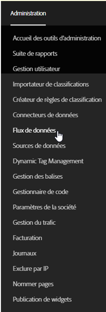
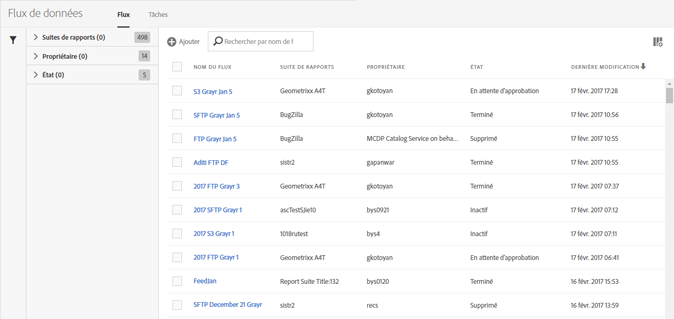
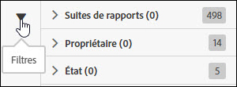
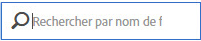
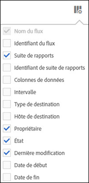

# Gestion des flux de données

Le gestionnaire des flux de données vous permet de créer, de modifier et de supprimer des flux de données pour votre entreprise. Si vous disposez d’autorisations pour accéder au gestionnaire des flux de données, vous pouvez gérer les flux de données pour toutes les suites de rapports qui s’affichent.

Pour accéder à la gestion des flux de données, procédez comme suit :

1. Connectez-vous à [experiencecloud.adobe.com](https://experiencecloud.adobe.com).
2. Cliquez sur le menu à 9 cases en haut à droite, puis sur [!UICONTROL Analytics].
3. Dans le menu supérieur, cliquez sur [!UICONTROL Admin] > [!UICONTROL Flux de données].

## Naviguer dans l’interface

Lorsque vous atteignez la page du gestionnaire des flux de données, l’interface ressemble beaucoup à ce qui suit :

Si aucun flux n’a été défini, la page affiche un bouton [!UICONTROL Créer un flux de données].

### Filtres et recherches

Utilisez les filtres et les recherches pour localiser le flux exact que vous recherchez.

Cliquez sur l’icône Filtrer située à l’extrême gauche pour afficher ou masquer les options de filtrage. Les filtres sont organisés par catégorie. Cliquez sur le chevron pour réduire ou développer les catégories de filtrage. Cochez la case pour appliquer ce filtre.

Utilisez la recherche pour localiser un flux en fonction de son nom.

### Flux et tâches

Cliquez sur l’onglet Tâche pour afficher les tâches individuelles créées pour chacun de vos flux. Voir [Gestion des tâches relatives aux flux de données](df-manage-jobs.md).

### Ajouter

Cliquez sur le bouton + [!UICONTROL Ajouter] à proximité des onglets des flux et des tâches pour créer un nouveau flux. Pour plus d’informations, reportez-vous à [Ajouter un flux](create-feed.md).

### Colonnes

Chaque flux créé affiche plusieurs colonnes fournissant des informations la concernant. Cliquez sur un en-tête de colonne pour la trier dans l’ordre croissant. Cliquez à nouveau sur ce même en-tête pour trier la colonne dans l’ordre décroissant. Si vous ne parvenez pas à afficher une certaine colonne, cliquez sur l’icône colonne en haut à droite.

* **Nom du flux** : colonne requise. Affiche le nom du flux.
* **Identifiant du flux** : affiche l’identifiant du flux, un identifiant unique.
* **Suite de rapports** : la suite de rapports que le flux donne en référence pour ses données.
* **Identifiant de la suite de rapports** : l’identifiant unique de la suite de rapports.
* **Colonnes de données** : les colonnes de données actives pour le flux. Dans la plupart des cas, il y a trop de colonnes à afficher dans ce format.
* **Intervalle** : indique si le flux est horaire ou quotidien.
* **Type de destination** : le type de destination du flux. Par exemple, FTP, Amazon S3 ou Azure.
* **Hôte de destination** : l’emplacement sur lequel le fichier est placé. Par exemple : `ftp.example.com`.
* **Propriétaire** : le compte utilisateur qui a créé le flux.
* **Statut** : le statut du flux.
   * Actif : le flux est opérationnel.
   * En attente d’approbation : dans certaines circonstances, un flux nécessite l’approbation d’Adobe avant de pouvoir commencer à générer des tâches.
   * Supprimé : le flux est supprimé.
   * Terminé : le flux a terminé le traitement. Un flux terminé peut être modifié, mis en attente ou supprimé.
   * En attente : le flux est créé, mais n’est pas encore actif. Les flux restent dans cet état pendant une courte période de transition.
   * Inactif : équivaut à un état « en pause » ou « en attente ». Lorsque le flux est réactivé, il reprend la diffusion des tâches là où il s’est arrêté.
* **Dernière modification** : la date à laquelle le flux a été modifié pour la dernière fois. La date et l’heure s’affichent dans le fuseau horaire de la suite de rapports en tenant compte du décalage par rapport à GMT.
* **Date de début** : la date de la première tâche pour ce flux. La date et l’heure s’affichent dans le fuseau horaire de la suite de rapports en tenant compte du décalage par rapport à GMT.
* **Date de fin** : la date de la dernière tâche pour ce flux. Les flux de données continus ne possèdent pas de date de fin.

## Action des flux de données

Cochez la case en regard d’un flux de données pour afficher les actions possibles.

* **Historique des tâches** : affiche toutes les tâches liées à ces flux de données. Vous emmène automatiquement à l’[interface de gestions des tâches](df-manage-jobs.md).
* **Supprimer** : supprime le flux de données et définit son statut sur [!UICONTROL Supprimé].
* **Copier** : vous permet de [créer un nouveau flux](create-feed.md) avec tous les paramètres du flux actuel. Si plusieurs flux sont sélectionnés, il n’est pas possible de copier.
* **Pause** : arrête le traitement de ce flux et définit son statut sur [!UICONTROL Inactif].
* **Activer** : disponible uniquement pour les flux inactifs. Récupère les données de traitement là où elles ont été laissées en renvoyant des dates lorsque cela est nécessaire.
