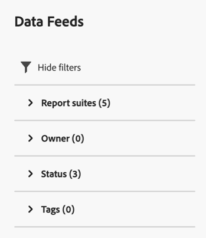

# Gestion des tâches relatives aux flux de données

Les traitements sont des tâches individuelles qui sortent sous la forme d’un fichier compressé. Elles sont créées et régies par des flux.

Pour gérer les tâches relatives aux flux de données :

1. Connectez-vous à [experiencecloud.adobe.com](https://experiencecloud.adobe.com) à l’aide de vos identifiants Adobe ID.

1. Sélectionnez l’icône des 9 carrés dans le coin supérieur droit, puis sélectionnez [!UICONTROL **Analytics**].

1. Dans la barre de navigation supérieure, accédez à [!UICONTROL **Admin**] > [!UICONTROL **Flux de données**].

   Les flux de données de toutes les suites de rapports auxquelles vous avez accès s’affichent. Si aucun flux n’a été configuré, la page affiche également un bouton [!UICONTROL Créer un flux de données].

   

1. (Facultatif) Cochez la case en regard du flux de données contenant les tâches à afficher, puis sélectionnez [!UICONTROL **Historique des tâches**].

   Pour plus d’informations, voir [Afficher l’historique des tâches d’un flux de données](#view-job-history-for-a-data-feed).

## Filtrer et rechercher

Vous pouvez filtrer et rechercher pour localiser le travail exact que vous recherchez.

Cliquez sur l’icône Filtrer située à l’extrême gauche pour afficher ou masquer les options de filtrage. Les filtres sont organisés par catégorie. Cliquez sur le chevron pour réduire ou développer les catégories de filtrage. Cochez la case pour appliquer un filtre.

Utilisez la recherche pour localiser une tâche en fonction de son nom.

## Tri et personnalisation des colonnes

Chaque tâche comporte plusieurs colonnes fournissant des informations sur la tâche. Vous pouvez trier les informations de chaque colonne et personnaliser les colonnes affichées.

### Colonnes de tri

Sélectionnez un en-tête de colonne pour le trier par ordre croissant. Sélectionnez à nouveau un en-tête de colonne pour le trier par ordre décroissant.

### Personnaliser les colonnes

Pour ajuster les colonnes visibles du tableau :

1. Sélectionnez l’icône de colonne  en haut à droite.

1. Dans la boîte de dialogue Personnaliser le tableau , sélectionnez chaque colonne à afficher et désélectionnez chaque colonne à masquer.

   Les colonnes suivantes sont disponibles :

* **Nom du flux** : colonne obligatoire. Affiche le nom du flux. Les tâches créées par le même flux portent le même nom de flux.
* **Identifiant du flux** : affiche l’identifiant du flux, un identifiant unique. Les tâches créées par le même flux possèdent le même identifiant de flux.
* **Suite de rapports** : suite de rapports à partir de laquelle la tâche référence les données.
* **Identifiant de suite de rapports** : identifiant unique de la suite de rapports.
* **Interval** : intervalle du flux.
* **Type de destination** : le type de destination du flux.
* **Destination** : destination du flux.
* **Propriétaire** : propriétaire du flux.
* **Statut** : le statut du flux.
   * En attente des données : la tâche est opérationnelle et les données de la fenêtre de création de rapports sont en cours de collecte.
   * Traitement : la tâche est en train de créer les fichiers de données et de préparer leur envoi.
   * Terminée : la tâche s’est terminée sans aucun problème.
   * Échec : la tâche ne s’est pas terminée. Reportez-vous à la section [Résolution des problèmes liés aux flux de données](troubleshooting.md) pour déterminer la cause de l’échec.
   * En attente d’exportation : les données de la fenêtre de création de rapports n’ont pas encore été entièrement traitées.
   * Aucune donnée : il n’y a pas de données dans la suite de rapport pour la fenêtre de création de rapports demandée.
* **Dernière modification** : l’heure de la dernière modification du flux.
* **Date de début** : heure à laquelle le traitement a commencé. La date et l’heure s’affichent dans le fuseau horaire de la suite de rapports en tenant compte du décalage par rapport à GMT. Les flux quotidiens démarrent en général vers minuit dans le fuseau horaire de la suite de rapports.
* **Date de fin** : heure à laquelle le traitement s’est terminé. La date et l’heure s’affichent dans le fuseau horaire de la suite de rapports en tenant compte du décalage par rapport à GMT.

## Affichage de l’historique des tâches d’un flux de données

Vous pouvez afficher la liste des tâches de flux de données antérieures pour un flux de données donné, ainsi que des informations sur chaque tâche.

Pour afficher l’historique des tâches d’un flux de données :

1. Dans Adobe Analytics, sélectionnez [!UICONTROL **Admin**] > [!UICONTROL **Flux de données**].

   

1. Cochez la case en regard du flux de données dont vous souhaitez afficher l’historique des tâches, puis sélectionnez [!UICONTROL **Historique des tâches**].

   L’historique des tâches du flux de données s’affiche, avec les informations suivantes disponibles sur chaque tâche (sélectionnez l’icône de colonne pour ajouter des colonnes qui ne sont pas visibles par défaut) :

   * **[!UICONTROL Début de la période de demande]**

   * **[!UICONTROL Fin de la période de requête]**

   * **[!UICONTROL Planifié]**

   * **[!UICONTROL Commencé]**

   * **[!UICONTROL Terminé]**

   * **[!UICONTROL Exécuter #]**

   * **[!UICONTROL Statut]**

   * **[!UICONTROL Code d’erreur]**

   * **[!UICONTROL Message d’erreur]**

## Renvoyer les tâches de flux de données

Vous pouvez renvoyer une tâche de flux de données si vous souhaitez renvoyer le fichier de flux de données avec exactement les mêmes données et le même traitement que lors de son envoi initial. Vous pouvez également [retraiter une tâche de flux de données](#reprocess-data-feed-jobs).

Pour renvoyer une ou plusieurs tâches de flux de données :

1. Dans Adobe Analytics, sélectionnez [!UICONTROL **Admin**] > [!UICONTROL **Flux de données**].

1. Cochez la case en regard du flux de données contenant les tâches à envoyer à nouveau, puis sélectionnez [!UICONTROL **Historique des tâches**].

1. Cochez la case en regard d’une ou de plusieurs tâches de flux de données, puis sélectionnez **[!UICONTROL Renvoyer]**. <!-- What does the status need to be? Error, ... -->

   

## Retraitement des tâches de flux de données

Vous pouvez retraiter les données sources d’une tâche de flux de données et les envoyer à nouveau avec les données retraitées. Vous pouvez également [&#x200B; renvoyer une tâche de flux de données &#x200B;](#resend-data-feed-jobs).

Pour retraiter une ou plusieurs tâches de flux de données :

1. Dans Adobe Analytics, sélectionnez [!UICONTROL **Admin**] > [!UICONTROL **Flux de données**].

1. Cochez la case en regard du flux de données contenant les tâches à retraiter, puis sélectionnez [!UICONTROL **Historique des tâches**].

1. Cochez la case en regard d’une ou de plusieurs tâches de flux de données, puis sélectionnez **[!UICONTROL Retraiter]**. <!-- What does the status need to be? Error, ... -->

   
