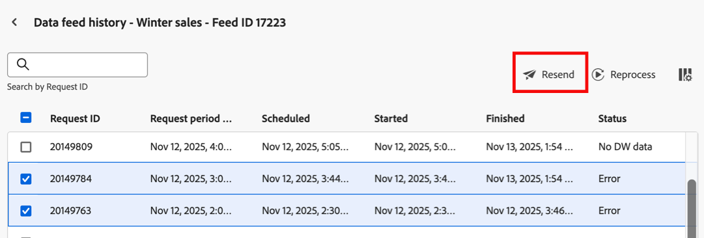

# Gestion des tâches relatives aux flux de données

Les tâches sont des tâches individuelles qui génèrent un fichier compressé. Elles sont créées et régies par des flux.

Vous pouvez afficher l’historique des tâches pour chaque flux de données, renvoyer des tâches ou retraiter des tâches.

## Affichage de l’historique des tâches d’un flux de données

Vous pouvez afficher la liste des tâches relatives aux flux de données pour un flux de données donné, ainsi que des informations sur chaque tâche.

Pour afficher l’historique des tâches d’un flux de données :

1. Connectez-vous à [experiencecloud.adobe.com](https://experiencecloud.adobe.com) à l’aide de vos identifiants Adobe ID.

1. Sélectionnez l’icône des 9 carrés dans le coin supérieur droit, puis sélectionnez [!UICONTROL **Analytics**].

1. Dans la barre de navigation supérieure, accédez à [!UICONTROL **Admin**] > [!UICONTROL **Flux de données**].

   Les flux de données de toutes les suites de rapports auxquelles vous avez accès s’affichent. Si aucun flux n’a été configuré, la page affiche également un bouton **[!UICONTROL Créer un flux de données]**.

   

1. Cochez la case en regard du flux de données contenant les tâches à afficher, puis sélectionnez [!UICONTROL **Historique des tâches**].

   L’historique des tâches du flux de données s’affiche, avec des informations sur chaque tâche dans les colonnes disponibles.

1. (Facultatif) Pour ajuster les colonnes visibles dans le tableau, sélectionnez l’icône de colonne  en haut à droite, puis, dans la boîte de dialogue Personnaliser le tableau, sélectionnez chaque colonne à afficher et désélectionnez chaque colonne à masquer.

   Les colonnes suivantes sont disponibles :

   * **[!UICONTROL Début de la période de demande]**

   * **[!UICONTROL Fin de la période de requête]**

   * **[!UICONTROL Planifié]**

   * **[!UICONTROL Commencé]**

   * **[!UICONTROL Terminé]**

   * **[!UICONTROL Exécuter #]**

   * **[!UICONTROL Statut]**

   * **[!UICONTROL Code d’erreur]**

   * **[!UICONTROL Message d’erreur]**

## Renvoyer les tâches de flux de données

Lorsque vous renvoyez une tâche de flux de données, elle envoie à nouveau le fichier de flux de données avec les mêmes données et le même traitement que lors de l’envoi initial du fichier. Vous pouvez également [retraiter une tâche de flux de données](#reprocess-data-feed-jobs).

Pour renvoyer une ou plusieurs tâches de flux de données :

1. Dans Adobe Analytics, sélectionnez [!UICONTROL **Admin**] > [!UICONTROL **Flux de données**].

1. Cochez la case en regard du flux de données contenant les tâches à envoyer à nouveau, puis sélectionnez [!UICONTROL **Historique des tâches**].

1. Cochez la case en regard d’une ou de plusieurs tâches de flux de données, puis sélectionnez **[!UICONTROL Renvoyer]**. <!-- What does the status need to be? Error, ... -->

   

## Retraitement des tâches de flux de données

Lorsque vous retraitez une tâche de flux de données, elle retraite les données source d’une tâche de flux de données et les envoie à nouveau avec les données retraitées. Vous pouvez également [ renvoyer une tâche de flux de données ](#resend-data-feed-jobs).

Pour retraiter une ou plusieurs tâches de flux de données :

1. Dans Adobe Analytics, sélectionnez [!UICONTROL **Admin**] > [!UICONTROL **Flux de données**].

1. Cochez la case en regard du flux de données contenant les tâches à retraiter, puis sélectionnez [!UICONTROL **Historique des tâches**].

1. Cochez la case en regard d’une ou de plusieurs tâches de flux de données, puis sélectionnez **[!UICONTROL Retraiter]**. <!-- What does the status need to be? Error, ... -->

   
