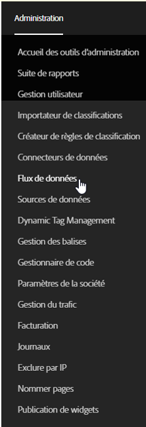

# Gestion des tâches relatives aux flux de données

Les tâches sont des tâches individuelles qui sortent sous la forme d’un fichier compressé. Elles sont créées et régies par des flux.

Pour accéder à la gestion des tâches des flux de données, procédez comme suit :

1. Connectez-vous à [experiencecloud.adobe.com](https://experiencecloud.adobe.com).
2. Cliquez sur le menu à 9 cases en haut à droite, puis sur [!UICONTROL Analytics].
3. Dans le menu supérieur, cliquez sur [!UICONTROL Admin] > [!UICONTROL Flux de données].
4. Cliquez sur l’onglet Tâches à proximité du haut de l’écran.

## Naviguer dans l’interface

Une tâche relative à un flux de données est une instance unique sur laquelle Adobe traite et sort un fichier compressé pour une fenêtre de création de rapports donnée. Le gestionnaire des tâches vous donne accès à une vue plus précise qui vous permet de voir le statut des tâches individuelles.

### Filtres et recherches

Utilisez les filtres et les recherches pour localiser la tâche exacte que vous recherchez.

Cliquez sur l’icône Filtrer située à l’extrême gauche pour afficher ou masquer les options de filtrage. Les filtres sont organisés par catégorie. Cliquez sur le chevron pour réduire ou développer les catégories de filtrage. Cochez la case pour appliquer ce filtre.

Utilisez la recherche pour localiser une tâche en fonction de son nom.

### Flux et tâches

Cliquez sur l’onglet Flux pour afficher les flux globaux qui créent ces tâches. Voir [Gestion des flux de données](df-manage-feeds.md).

### Colonnes

Chaque tâche affiche plusieurs colonnes fournissant des informations la concernant. Cliquez sur un en-tête de colonne pour la trier dans l’ordre croissant. Cliquez à nouveau sur ce même en-tête pour trier la colonne dans l’ordre décroissant. Si vous ne parvenez pas à afficher une certaine colonne, cliquez sur l’icône colonne en haut à droite.

* **Identifiant du flux** : affiche l’identifiant du flux, un identifiant unique. Les tâches créées par le même flux possèdent le même identifiant de flux.
* **Identifiant de tâche** : l’identifiant unique de la tâche. Toutes les tâches possèdent un identifiant de tâche différent.
* **Nom du flux** : colonne requise. Affiche le nom du flux. Les tâches créées par le même flux possèdent le même nom de flux.
* **Suite de rapports** : la suite de rapports que la tâche donne en référence pour ses données.
* **Identifiant de la suite de rapports** : l’identifiant unique de la suite de rapports.
* **Heure de début** : l’heure à laquelle la tâche a commencé. La date et l’heure s’affichent dans le fuseau horaire de la suite de rapports en tenant compte du décalage par rapport à GMT. Les flux quotidiens démarrent en général vers minuit dans le fuseau horaire de la suite de rapports.
* **Statut** : le statut du flux.
   * En attente des données : la tâche est opérationnelle et les données de la fenêtre de création de rapports sont en cours de collecte.
   * Traitement : la tâche est en train de créer les fichiers de données et de préparer leur envoi.
   * Terminée : la tâche s’est terminée sans aucun problème.
   * Échec : la tâche ne s’est pas terminée. Reportez-vous à [Résolution des problèmes liés aux tâches](jobs-troubleshooting.md) pour déterminer la cause de l’échec.
   * En attente d’exportation : les données de la fenêtre de création de rapports n’ont pas encore été entièrement traitées.
   * Aucune donnée : il n’y a pas de données dans la suite de rapport pour la fenêtre de création de rapports demandée.
* **Heure de fin** : l’heure à laquelle la tâche s’est terminée. La date et l’heure s’affichent dans le fuseau horaire de la suite de rapports en tenant compte du décalage par rapport à GMT.
* **Date demandée** : la fenêtre de création de rapports du fichier. Les flux quotidiens affichent en général 00:00 - 23:59 en tenant compte du décalage par rapport à GMT, ce qui indique une journée complète basée sur le fuseau horaire de la suite de rapports. Les flux horaires affichent l’heure individuelle concernée par la tâche.
