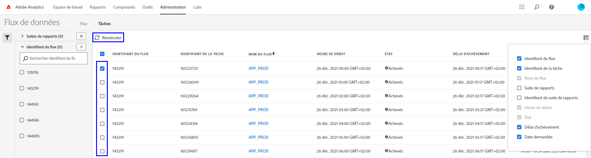

# Résolution des problèmes liés aux flux de données

Déterminez les raisons potentielles entraînant l’échec de la tâche ou de sa diffusion.

## Résolution des problèmes liés à un flux de données existant

Si votre flux de données ne fonctionne plus correctement ces derniers temps, alors quʼil opérait sans problème toutes les heures ou tous les jours auparavant, effectuez les étapes suivantes :

* Utilisez lʼ[outil Adobe Status](https://status.adobe.com/fr/experience_cloud) pour vérifier si des périodes de maintenance planifiées ou des problèmes de disponibilité sont en cours. En cas de problème connu au moment où l’erreur s’est produite, Adobe traite automatiquement les flux de données planifiés une fois le service restauré.
* Assurez-vous que le site FTP dispose de suffisamment d’espace disponible. Si lʼespace disque sur le site FTP est insuffisant, supprimez des fichiers du serveur afin de libérer de l’espace pour de nouveaux fichiers.
* S’il n’existe aucun problème connu et que le site FTP dispose de suffisamment d’espace disque, vous pouvez envoyer à nouveau le flux de données.

   1. Connectez-vous à Adobe Analytics et accédez à **[!UICONTROL Admin]** > **[!UICONTROL Flux de données]**.
   2. Recherchez le ou les flux de données de votre choix, puis cochez la case en regard de chacun des flux que vous souhaitez réexécuter.
   3. Cliquez sur **[!UICONTROL Réexécuter]**.

  

Si vous ne recevez toujours pas les fichiers de flux de données après les avoir réexécutés, contactez l’assistance clientèle.

## Résolution des problèmes liés un nouveau flux de données

Si un nouveau flux de données renvoie une erreur, essayez de résoudre le problème en chargeant manuellement un fichier test sur le site FTP. Dans la plupart des cas, cette procédure vous permettra de déterminer la défaillance.

1. Connectez-vous à votre site FTP à l’aide de l’explorateur de fichiers (sur Windows) ou de Finder (sur Mac). Veillez à utiliser le protocole FTP (`ftp://`) et à autoriser les [adresses IP dʼAdobe](/help/technotes/ip-addresses.md) dans le pare-feu de votre entreprise. Si vous ne parvenez pas à atteindre le site FTP, contactez le propriétaire du site FTP pour déterminer la destination correcte.

   

2. Une fenêtre contextuelle vous demandant un nom d’utilisateur et un mot de passe s’affiche. Saisissez vos informations d’authentification. Si les identifiants sont acceptés, la fenêtre affiche les contenus actuels présents sur le site FTP. Si les identifiants ne sont pas acceptés, contactez le propriétaire du site FTP pour vous assurer que le nom d’utilisateur et le mot de passe sont corrects. Si vous utilisez le protocole SFTP, veillez à suivre chaque étape décrite dans le [Guide SFTP](../ftp-and-sftp/c-sftp/ftp-sftp.md). Notez quʼAdobe ne prend pas en charge tous les cas dʼutilisation du protocole SFTP.
3. Chargez un fichier sur le site FTP en le faisant glisser sur la fenêtre authentifiée. Toute image ou tout document texte est approprié. Si vous recevez un message d’erreur lorsque vous tentez de placer un fichier sur le site FTP, travaillez avec le propriétaire FTP pour vérifier qu’il y a suffisamment d’espace disque et que le nom d’utilisateur possède les autorisations d’écriture sur le site FTP.
4. Lorsque vous avez confirmé que le fichier se trouve sur le site FTP, vous pouvez supprimer le fichier chargé à l’étape précédente.

Si toutes les étapes ci-dessous fonctionnent, mais que vous recevez toujours une erreur FTP, contactez lʼassistance clientèle.
