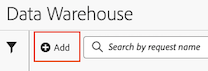

# Créer une demande dans Data Warehouse

Plusieurs options de configuration sont disponibles lors de la création d’une requête Data Warehouse. Les informations suivantes décrivent comment commencer à créer une demande, puis fournissent des liens vers des informations plus détaillées pour terminer la demande.

## Commencer à créer la demande

1. Dans Adobe Analytics, sélectionnez **[!UICONTROL Outils]** > **[!UICONTROL Data Warehouse]**.

1. Sur la page [!UICONTROL **Data Warehouse**], sélectionnez [!UICONTROL **Ajouter**].

   

   La page Nouvelle requête Data Warehouse s’affiche.

   

## Compléter la demande

Plusieurs onglets sont disponibles lors de la création d’une requête Data Warehouse. Pour plus d’informations sur les différentes options de configuration de chaque onglet, consultez les articles suivants :

* [Paramètres généraux](/help/export/data-warehouse/create-request/dw-general-settings.md)

* [Créer votre rapport](/help/export/data-warehouse/create-request/dw-request-build-report.md)

* [Destination du rapport](/help/export/data-warehouse/create-request/dw-request-report-destinations.md)

* [Options de rapport](/help/export/data-warehouse/create-request/dw-request-report-options.md)

* [Options de planification](/help/export/data-warehouse/create-request/dw-request-scheduling.md)

* [E-mail de notification](/help/export/data-warehouse/create-request/dw-request-email.md)
