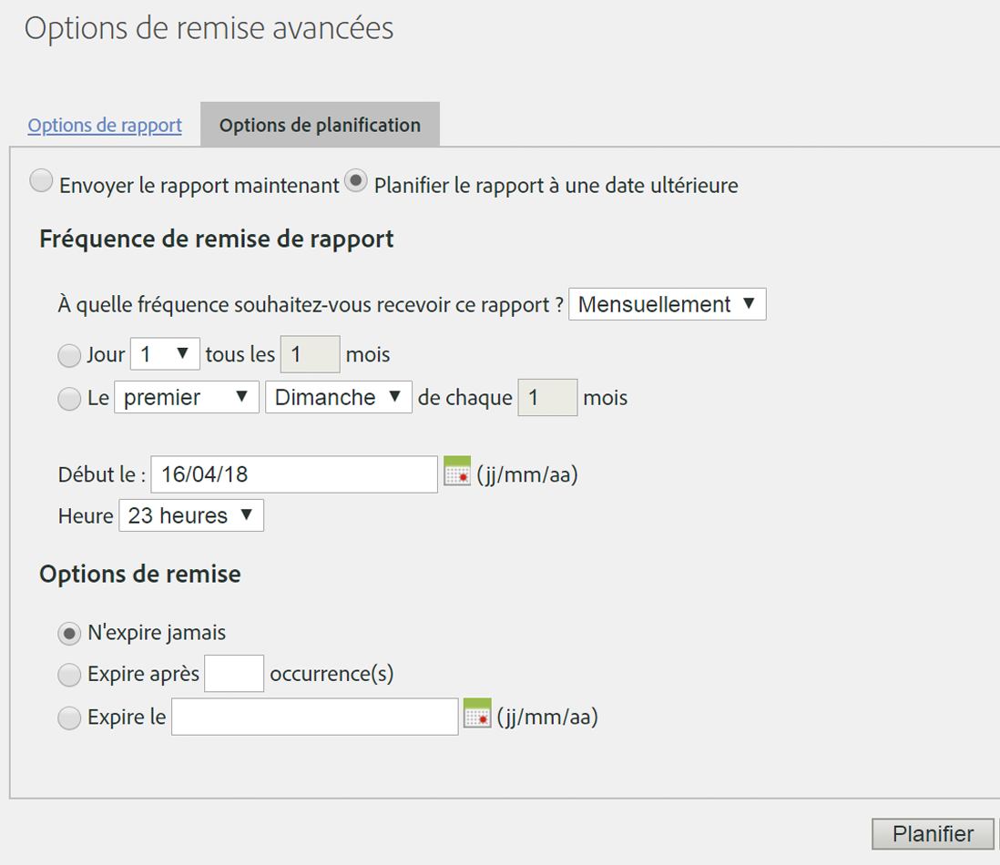

# Planifier une requête récurrente

## Planifier une requête récurrente {#topic_8C3CE0CE8A584F80946D24B377CB51BE}

Pour planifier des demandes Data Warehouse quotidiennement/mensuellement/annuellement, assurez-vous que l’option *Prédéfinie* est correctement sélectionnée

1. Sous [!UICONTROL Date de rapport], sélectionnez **[!UICONTROL Prédéfinie]**.

1. Sous [!UICONTROL Calendrier de remise], cliquez sur **[!UICONTROL Options de remise avancées]**.

1. Accédez à l’onglet Options de calendrier et sélectionnez **[!UICONTROL Planifier pour plus tard]**.
1. Sélectionnez les paramètres souhaités pour [!UICONTROL Fréquence de remise] et [!UICONTROL Options de remise finale].

   

1. Cliquez sur **[!UICONTROL Planifier]**.

