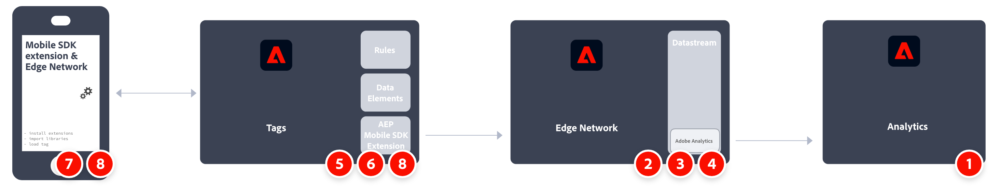

# Mettre en œuvre Adobe Analytics à l’aide du SDK Mobile d’Adobe Experience Platform

Adobe Experience Platform Mobile SDK permet d’optimiser les solutions et services d’entreprise CX d’Adobe dans vos applications mobiles. Il est disponible pour Android, iOS et différents frameworks de développement sur plusieurs plateformes. La configuration est gérée via la collecte de données d’Adobe Experience Platform.

>[!IMPORTANT]
>
>Une extension Adobe Analytics est également disponible dans la collecte de données Adobe Experience Platform. Si vous installez cette extension, vous ne profitez pas de XDM ou du réseau Edge.

## SDK Adobe Experience Platform

Présentation générale des tâches d’implémentation :

<table style="width:100%">

<tr>
<th style="width:5%"></th><th style="width:60%"><b>Tâche</b></th><th style="width:35%"><b>Informations supplémentaires</b></th>
</tr>

<tr>
<td>1</td>
<td>Vérifiez que vous avez <b>défini une suite de rapports</b>.</td>
<td><a href="../../../admin/tools/manage-rs/report-suites-admin.md">Gestionnaire de suites de rapports</a></td>
</tr>

<tr>
<td>2</td>
<td><b>Configurez un flux de données</b>. Un flux de données représente la configuration côté serveur lors de l’implémentation du SDK Web Adobe Experience Platform.</td>
<td><a href="https://experienceleague.adobe.com/docs/experience-platform/edge/datastreams/configure.html?lang=fr">Configurer un flux de données<a></td> 
</tr>

<td>3</td>
<td><b>Ajoutez un service Adobe Analytics</b> à votre flux de données. Ce service contrôle si et comment les données sont envoyées à Adobe Analytics.</td>
<td><a href="https://experienceleague.adobe.com/docs/experience-platform/edge/datastreams/configure.html?lang=fr#analytics">Ajoutez un service Adobe Analytics à un flux de données.</a></td>
</tr>

<tr>
<td>4</td>
<td><b>Créez une propriété mobile</b>. Une propriété est un conteneur que vous remplissez d’extensions, de règles, d’éléments de données et de bibliothèques.</td>
<td><a href="https://developer.adobe.com/client-sdks/documentation/getting-started/create-a-mobile-property/">Configurer une propriété mobile</a></tr>

<tr>
<td>5</td>
<td><b>Installez l’extension du réseau Edge d’Adobe Experience Platform</b> dans la propriété de balise mobile et configurez le flux de données dans l’extension.</td>
<td><a href="https://developer.adobe.com/client-sdks/documentation/edge-network/">Réseau EDGE d²Adobe Experience Platform</a>
</tr>

<tr>
<td>6</td>
<td><b>Utilisez le code dans votre application</b> pour enregistrer les extensions nécessaires et charger votre configuration de balise.</td>
<td><a href="https://developer.adobe.com/client-sdks/documentation/user-guides/getting-started-with-platform/overview/#set-up-the-configuration">Définir la configuration</a></td>
</tr>

<tr>
<td>7</td>
<td><b>Implémentez et testez la fonctionnalité</b> en combinant des éléments de données de la balise, des règles, des extensions supplémentaires et des appels API du SDK dans votre application. Inspectez, validez et déboguez la collecte de données et les expériences pour votre application mobile.</td>
<td><a href="https://developer.adobe.com/client-sdks/documentation/user-guides/getting-started-with-platform/overview/#use-the-sample-application">Utiliser l’exemple d’application</a>
</tr>

<tr>
<td>8</td>
<td><b>Étendez et validez l’implémentation de votre application mobile</b> avant de la diffuser en production.</td>
<td></td> 
</tr>

</table>

## Extension Adobe Analytics.

Présentation générale des tâches d’implémentation :

<table style="width:100%">

<tr>
<th style="width:5%"></th><th style="width:60%"><b>Tâche</b></th><th style="width:35%"><b>Informations supplémentaires</b></th>
</tr>

<tr>
<td>1</td>
<td>Vérifiez que vous avez <b>défini une suite de rapports</b>.</td>
<td><a href="../../../admin/tools/manage-rs/report-suites-admin.md">Gestionnaire de suites de rapports</a></td>
</tr>

<tr>
<td>2</td>
<td><b>Installez l’extension Adobe Analytics</b> dans la propriété de balise mobile et configurez l’extension pour qu’elle pointe vers votre suite de rapports.</td>
<td><a href="https://developer.adobe.com/client-sdks/documentation/adobe-analytics/">Extension Adobe Analytics pour la propriété mobile</a>
</tr>

<tr>
<td>3</td>
<td><b>Utilisez le code dans votre application</b> pour enregistrer les extensions nécessaires et charger votre configuration de balise.</td>
<td><a href="https://developer.adobe.com/client-sdks/documentation/user-guides/getting-started-with-platform/overview/#set-up-the-configuration">Définir la configuration</a></td>
</tr>

<tr>
<td>4</td>
<td><b>Implémentez et testez la fonctionnalité</b> en combinant des éléments de données de la balise, des règles, des extensions supplémentaires et des appels API du SDK dans votre application. Inspectez, validez et déboguez la collecte de données et les expériences pour votre application mobile.</td>
<td><a href="https://developer.adobe.com/client-sdks/documentation/user-guides/getting-started-with-platform/overview/#use-the-sample-application">Utiliser l’exemple d’application</a>
</tr>

<tr>
<td>5</td>
<td><b>Étendez et validez l’implémentation de votre application mobile</b> avant de la diffuser en production.</td>
<td></td> 
</tr>

</table>

## Ressources supplémentaires

- [Documentation sur les balises](https://experienceleague.adobe.com/docs/experience-platform/tags/home.html?lang=fr#)

- [Documentation de Mobile SDK](https://developer.adobe.com/client-sdks/documentation/)
