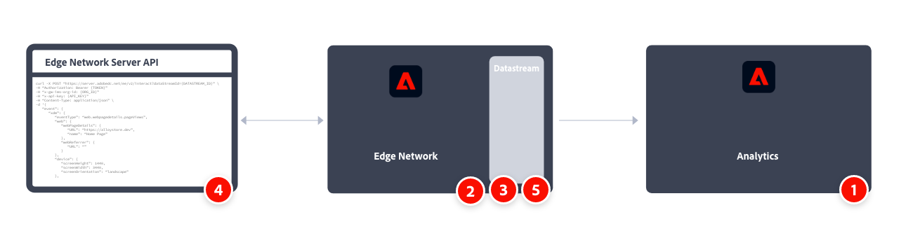

# Mise en oeuvre d’Adobe Analytics à l’aide de l’API Adobe Experience Platform Edge Network Server

En règle générale, vous utilisez l’API serveur Edge Network Experience Platform pour collecter des données côté serveur plutôt que côté client et lors de la collecte de données à partir d’appareils tels que des appareils IoT, des décodeurs et des applications de bureau. Ensuite, vous envoyez ces données au réseau Edge et à des services comme Adobe Analytics.

Tenez également compte de l’API serveur Edge Network lorsque vous avez besoin que des données sensibles soient collectées en toute sécurité et authentifiées sur l’ensemble du réseau. Voir [Authentification](https://experienceleague.adobe.com/docs/experience-platform/edge-network-server-api/authentication.html) pour plus d’informations.

Présentation générale des tâches d’implémentation :

<table style="width:100%">

<tr>
<th style="width:5%"></th><th style="width:60%"><b>Tâche</b></th><th style="width:35%"><b>Informations supplémentaires</b></th>
</tr>

<tr>
<td>1</td>
<td>Vérifiez que vous avez <b>défini une suite de rapports</b>.</td>
<td><a href="../../../admin/admin/c-manage-report-suites/report-suites-admin.md">Gestionnaire de suites de rapports</a></td>
</tr>

<tr>
<td>2</td>
<td><b>Configuration de schémas</b>. Pour normaliser la collecte de données à utiliser dans les applications qui utilisent Adobe Experience Platform, Adobe a créé la norme ouverte et accessible au public, Modèle de données d’expérience (XDM).</td>
<td><a href="https://experienceleague.adobe.com/docs/experience-platform/xdm/ui/overview.html?lang=fr">Présentation de l’interface utilisateur des schémas</a></td>
</tr>

<tr>
<td>3</td>
<td><b>Configurez un flux de données</b>. Un flux de données représente la configuration côté serveur lors de l’utilisation des API de l’API Adobe Experience Platform Edge Network.</td>
<td><a href="https://experienceleague.adobe.com/docs/experience-platform/datastreams/configure.html?lang=fr">Configurer un flux de données<a></td> 
</tr>

<tr>
<td>4</td>
<td><b>Mettez en oeuvre et testez la collecte de données</b> à l’aide des données d’événement unique et des API de collecte de données d’événement par lot.</td>
<td><a href="https://experienceleague.adobe.com/docs/experience-platform/edge-network-server-api/data-collection/interactive-data-collection.html?lang=fr">Collecte de données d’événement unique</a> <a href="https://experienceleague.adobe.com/docs/experience-platform/edge-network-server-api/data-collection/non-interactive-data-collection.html">Collecte de données d’événement par lot</a>
</tr>

<td>5</td>
<td><b>Ajoutez un service Adobe Analytics</b> à votre flux de données. Ce service contrôle si et comment les données sont envoyées à Adobe Analytics.</td>
<td><a href="https://experienceleague.adobe.com/docs/experience-platform/edge-network-server-api/interacting-other-adobe-solutions/interacting-adobe-analytics.html?lang=fr">Interagir avec Adobe Analytics</a></td>
</tr>

</table>

Pour plus d’informations, reportez-vous à la [documentation sur l’API de serveur Edge Network](https://experienceleague.adobe.com/docs/experience-platform/edge-network-server-api/overview.html?lang=fr) et à un exemple [d’intégration à Adobe Analytics](https://experienceleague.adobe.com/docs/experience-platform/edge-network-server-api/interacting-other-adobe-solutions/interacting-adobe-analytics.html?lang=fr).

