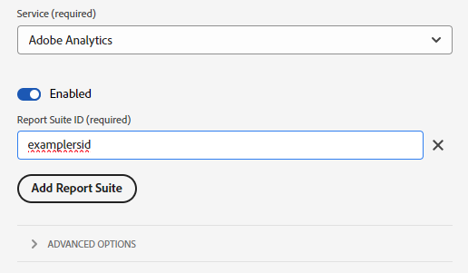

# Migration de l’extension de balise Adobe Analytics vers l’extension de balise SDK Web

Ce chemin d’implémentation implique une approche de migration méthodique pour passer de l’extension de balise Adobe Analytics à l’extension de balise SDK Web. D’autres chemins de mise en oeuvre sont abordés sur des pages distinctes :

* [AppMeasurement à la bibliothèque JavaScript du SDK Web](appmeasurement-to-web-sdk.md) : approche douce et méthodique de la migration vers le SDK Web, sauf qu’elle n’utilise pas de balises. À la place, vous supprimez manuellement la bibliothèque de collecte de données Adobe Analytics (`AppMeasurement.js`) et la remplacez par la bibliothèque JavaScript SDK Web (`alloy.js`).
* [Extension de balise du SDK Web](web-sdk-tag-extension.md) : nouvelle installation du SDK Web dans laquelle vous gérez l’implémentation à l’aide de balises dans la collecte de données Adobe Experience Platform. Il nécessite que le groupe de champs ExperienceEvent d’Adobe Analytics, qui inclut des variables Analytics standard à inclure dans votre schéma XDM.
* [ Bibliothèque JavaScript SDK Web ](web-sdk-javascript-library.md) : nouvelle installation du SDK Web à l’aide de la bibliothèque JavaScript SDK Web (`alloy.js`). Gérez vous-même l’implémentation au lieu d’utiliser l’interface utilisateur des balises. Il nécessite que le groupe de champs ExperienceEvent d’Adobe Analytics, qui inclut des variables Analytics standard à inclure dans votre schéma XDM.

## Avantages et inconvénients de ce chemin de mise en oeuvre

L’utilisation de cette approche de migration présente des avantages et des inconvénients. Pesez soigneusement chaque option pour choisir la méthode qui convient le mieux à votre entreprise.

| Avantages | Inconvénients |
| --- | --- |
| <ul><li>**Aucune modification du code sur votre site** : comme votre implémentation comporte déjà des balises installées, toutes les mises à jour de migration peuvent être effectuées dans l’interface des balises.</li><li>**Utilise votre implémentation existante** : cette approche ne nécessite pas de nouvelle implémentation. Bien qu’il nécessite de nouvelles actions de règle, vous pouvez réutiliser vos éléments de données et conditions de règle existants avec des modifications minimales.</li><li>**Ne nécessite pas de schéma** : pour cette étape de migration vers le SDK Web, vous n’avez pas besoin d’un schéma XDM. Vous pouvez à la place renseigner l’objet `data` qui envoie directement des données à Adobe Analytics. Une fois la migration vers le SDK Web terminée, vous pouvez créer un schéma pour votre organisation et utiliser le mappage de flux de données pour remplir les champs XDM applicables. Si un schéma était requis à ce stade du processus de migration, votre entreprise serait contrainte d’utiliser un schéma XDM Adobe Analytics. L’utilisation de ce schéma rend plus difficile l’utilisation de votre propre schéma par votre entreprise à l’avenir.</li></ul> | <ul><li>**Dette technique de mise en oeuvre** : comme cette approche utilise une forme modifiée de votre mise en oeuvre existante, il peut être plus difficile de suivre la logique de mise en oeuvre et d’effectuer des modifications si nécessaire. Le code personnalisé peut être particulièrement difficile à déboguer.</li><li>**Nécessite un mappage pour l’envoi de données à Platform** : lorsque votre organisation est prête à utiliser Customer Journey Analytics, vous devez envoyer des données à un jeu de données dans Adobe Experience Platform. Cette action nécessite que chaque champ de l’objet `data` soit une entrée dans l’outil de mappage de flux de données qui l’affecte à un champ de schéma XDM. Le mappage ne doit être effectué qu’une seule fois pour ce workflow, ce qui évite toute modification de l’implémentation. Cependant, il s’agit d’une étape supplémentaire qui n’est pas requise lors de l’envoi de données dans un objet XDM.</li></ul> |

Adobe recommande de suivre ce chemin d’implémentation dans les scénarios suivants :

* Vous disposez d’une mise en oeuvre existante à l’aide de l’extension de balise Adobe Analytics. Si vous disposez d’une implémentation à l’aide d’AppMeasurement, suivez la section [Migration de l’AppMeasurement vers le SDK Web](appmeasurement-to-web-sdk.md) à la place.
* Vous prévoyez d’utiliser Customer Journey Analytics à l’avenir, mais ne souhaitez pas remplacer votre mise en oeuvre Analytics par une mise en oeuvre SDK Web de A à Z. Le remplacement de votre implémentation de A à Z sur le SDK Web nécessite le plus d’efforts, mais offre également l’architecture d’implémentation à long terme la plus viable. Si votre entreprise est disposée à entreprendre une implémentation propre du SDK Web, reportez-vous à la section [Ingestion de données via le SDK Web Adobe Experience Platform](https://experienceleague.adobe.com/fr/docs/analytics-platform/using/cja-data-ingestion/ingest-use-guides/edge-network/aepwebsdk) du guide d’utilisation du Customer Journey Analytics.

## Procédure de migration vers le SDK Web

Les étapes suivantes contiennent des objectifs concrets. Cliquez sur chaque étape pour obtenir des instructions détaillées sur la manière d’y parvenir.

+++**1. Création et configuration d’un flux de données**

Créez un flux de données dans la collecte de données Adobe Experience Platform. Lorsque vous envoyez des données à ce flux de données, elles sont transférées à Adobe Analytics. À l’avenir, ce même flux de données transfère les données vers Customer Journey Analytics.

1. Accédez à [experience.adobe.com](https://experience.adobe.com) et connectez-vous à l’aide de vos informations d’identification.
1. Utilisez la page d’accueil ou le sélecteur de produits en haut à droite pour accéder à **[!UICONTROL Collecte de données]**.
1. Dans le volet de navigation de gauche, sélectionnez **[!UICONTROL Datastreams]**.
1. Sélectionnez **[!UICONTROL Nouveau flux de données]**.
1. Saisissez le nom de votre choix, puis sélectionnez **[!UICONTROL Enregistrer]**.
1. Une fois le flux de données créé, sélectionnez **[!UICONTROL Ajouter un service]**.
1. Dans le menu déroulant du service, sélectionnez **[!UICONTROL Adobe Analytics]**.
1. Saisissez le même identifiant de suite de rapports que le site auquel vous envoyez actuellement des données d’analyse. Cliquez sur **[!UICONTROL Enregistrer]**.

 {style="border:1px solid lightslategray"}

Votre flux de données est maintenant prêt à recevoir et à transmettre des données à Adobe Analytics.

+++

+++**2. Ajoutez l’extension SDK Web à la propriété de balise**.

Cette section prépare votre balise pour l’essentiel de l’effort de migration qui se déroulera à l’étape suivante.

1. Cliquez sur l’icône représentant un hamburger en haut à gauche de l’interface de Adobe Experience Platform, puis sélectionnez **[!UICONTROL Balises]**.
1. Sélectionnez la propriété de balise de votre choix.
1. Dans le volet de navigation de gauche de la propriété de balise, sélectionnez **[!UICONTROL Extensions]**.
1. Sélectionnez **[!UICONTROL Catalogue]** près de la partie supérieure pour afficher la liste de toutes les extensions disponibles.
1. Recherchez et sélectionnez l’extension **[!UICONTROL Adobe Experience Platform Web SDK]**, puis cliquez sur **[!UICONTROL Installer]** à droite.

    {style="border:1px solid lightslategray"}

1. Les paramètres de configuration de l’extension s’affichent. Recherchez la section Flux de données , puis sélectionnez le flux de données que vous avez créé à l’étape précédente.

    {style="border:1px solid lightslategray"}

1. Sélectionnez **[!UICONTROL Enregistrer]**.

Le SDK Web est désormais installé pour votre propriété de balise.

+++

+++**3. Création d’un élément de données d’objet de données**

L’élément de données d’objet de données fournit une structure intuitive pour configurer une charge utile que le SDK Web utilise pour envoyer à un flux de données. La plupart des règles que vous mettez à jour à l’étape suivante interagissent avec cet élément de données.

1. Dans le volet de navigation de gauche de l’interface des balises, sélectionnez **[!UICONTROL Data Elements]**.
1. Sélectionnez **[!UICONTROL Ajouter un élément de données]**
1. Définissez les paramètres suivants pour l’élément de données :
   * [!UICONTROL Nom] : tout ce que vous souhaitez, par exemple &quot;Couche de données&quot; ou &quot;Objet de données&quot;
   * [!UICONTROL Extension] : [!UICONTROL SDK Web Adobe Experience Platform]
   * [!UICONTROL Type d’élément de données] : [!UICONTROL Variable]
   * Les cases à cocher peuvent rester inchangées.
1. Sur la droite, sélectionnez les paramètres suivants :
   * Bouton radio Propriété : [!UICONTROL Data]
   * Solution : [!UICONTROL Adobe Analytics]
1. Sélectionnez **[!UICONTROL Enregistrer]**.

 {style="border:1px solid lightslategray"}

Votre propriété de balise dispose désormais de tous les éléments nécessaires pour mettre à jour chaque règle.

+++

+++**4. Mettez à jour les règles pour utiliser l’extension SDK Web au lieu de l’extension Analytics**

Cette étape représente l’essentiel des efforts nécessaires pour migrer vers le SDK Web et nécessite des connaissances sur le fonctionnement de votre mise en oeuvre. Vous trouverez ci-dessous un exemple de modification d’une règle de balise standard. Mettez à jour toutes les règles de balise dans votre mise en oeuvre pour remplacer toutes les références à l’extension Adobe Analytics par l’extension SDK Web.

1. Dans le volet de navigation de gauche de l’interface des balises, sélectionnez **[!UICONTROL Rules]**.
1. Sélectionnez une règle à modifier.
1. Sélectionnez l’action **[!UICONTROL Adobe Analytics - Set Variables]**
1. Notez toutes les variables Analytics définies dans cette règle. Incluez les deux variables définies dans les menus déroulants et les variables définies dans le code personnalisé.
1. Remplacez la [!UICONTROL configuration de l&#39;action] par les paramètres suivants :
   * [!UICONTROL Extension] : [!UICONTROL SDK Web Adobe Experience Platform]
   * [!UICONTROL Type d’action] : mettre à jour la variable
1. Assurez-vous que votre objet de données est sélectionné dans la liste déroulante à droite.
1. Définissez les variables Analytics sur leurs valeurs respectives telles qu’elles ont été configurées dans l’extension Analytics.
   * Les variables définies dans l’interface des balises peuvent directement se traduire par les mêmes valeurs.
   * Les variables de chaîne définies dans le code personnalisé nécessitent des ajustements minimaux. Au lieu d&#39;utiliser l&#39;objet `s`, utilisez `data.__adobe.analytics` à la place. Par exemple, `s.eVar1` traduirait en `data.__adobe.analytics.eVar1`.
   * Les variables de configuration et les appels de méthode Analytics dans le code personnalisé peuvent nécessiter une logique de mise en oeuvre modifiée. Consultez chacune des [variables](/help/implement/vars/overview.md) respectives pour déterminer comment atteindre son équivalent à l’aide du SDK Web.
1. Une fois que toute la logique de règle est répliquée à l’aide de l’extension SDK Web, sélectionnez **[!UICONTROL Conserver les modifications]**.
1. Répétez ces étapes pour chaque configuration d’action qui utilise l’extension Adobe Analytics pour définir des valeurs. Cette étape inclut les variables définies à l’aide de l’interface des balises et les variables définies à l’aide du code personnalisé. Les blocs de code personnalisés ne peuvent faire référence à l’objet `s` nulle part.

Les étapes ci-dessus s’appliquent uniquement aux règles qui définissent des valeurs. Les étapes suivantes remplacent toutes les actions qui utilisent la [!UICONTROL configuration de l’action] [!UICONTROL Envoyer la balise].

1. Sélectionnez une règle qui envoie une balise.
1. Sélectionnez l’action **[!UICONTROL Adobe Analytics - Send Beacon]**.
1. Notez la valeur actuelle du bouton radio [!UICONTROL Tracking] à droite ([`s.t()`](../../vars/functions/t-method.md) ou [`s.tl()`](../../vars/functions/tl-method.md)).
1. Remplacez la [!UICONTROL configuration de l&#39;action] par les paramètres suivants :
   * [!UICONTROL Extension] : [!UICONTROL SDK Web Adobe Experience Platform]
   * [!UICONTROL Type d’action] : [!UICONTROL Envoyer l’événement]
1. À droite, définissez les paramètres de l’action sur les éléments suivants :
   * [!UICONTROL Type] : Pour `s.t()`, utilisez **[!UICONTROL Pages vues Web Webpagedetails]**. Pour `s.tl()`, utilisez les **[!UICONTROL clics sur les liens Web-interaction]**. Si vous utilisez [`s.tl()`](../../vars/functions/tl-method.md), vous devez également inclure les champs suivants dans votre objet de données. Ces champs sont répertoriés sous [!UICONTROL Additional properties] lors de l’exécution de la configuration de l’action [!UICONTROL Update variable] :
      * [Nom du lien](../../vars/functions/tl-method.md)
      * [Type de lien  ](../../vars/functions/tl-method.md)
      * [URL du lien](../../vars/config-vars/linkurl.md)
1. Sélectionnez **[!UICONTROL Conserver les modifications]**.
1. Répétez ces étapes pour chaque configuration d’action qui utilise Adobe Analytics pour envoyer une balise.

+++

+++**5. Règles mises à jour Publish**

La publication des règles mises à jour suit le même processus que toute autre modification apportée à la configuration des balises.

1. Dans le volet de navigation de gauche de l’interface des balises, sélectionnez **[!UICONTROL Flux de publication]**.
1. Sélectionnez **[!UICONTROL Ajouter une bibliothèque]**.
1. Donnez à cette balise un nom, par exemple &quot;Mettre à niveau vers le SDK Web&quot;.
1. Sélectionnez **[!UICONTROL Ajouter toutes les ressources modifiées]**.
1. Sélectionnez **[!UICONTROL Enregistrer]**.
1. Le processus de publication affiche un point orange, indiquant qu’il est en cours de création. Une fois que le point devient vert, vos modifications sont disponibles dans votre environnement de développement.
1. Testez vos modifications dans votre environnement de développement pour vous assurer que toutes les règles se déclenchent correctement et que l’objet de données est rempli avec les valeurs attendues.
1. Une fois prête, envoyez la bibliothèque pour approbation, créez-la pour l’évaluation, puis approuvez et publiez-la pour la production.

 {style="border:1px solid lightslategray"}

+++

+++**6. Désactiver l’extension Analytics**

Une fois l’implémentation de vos balises entièrement sur le SDK Web, vous pouvez désactiver l’extension Adobe Analytics.

1. Dans le volet de navigation de gauche de l’interface des balises, sélectionnez **[!UICONTROL Extensions]**.
1. Recherchez et sélectionnez l’extension [!UICONTROL Adobe Analytics]. À droite, sélectionnez **[!UICONTROL Désactiver]**.
1. Suivez le même processus de publication ci-dessus pour publier la suppression de l’extension [!UICONTROL Adobe Analytics].
1. Une fois l’extension désactivée en production, vous pouvez la désinstaller entièrement. Sélectionnez l’extension, sélectionnez le menu à trois points à droite, puis sélectionnez **[!UICONTROL Désinstaller]**.
1. Suivez le même processus de publication ci-dessus pour publier ces modifications en production.

+++

À ce stade, votre mise en oeuvre d’Analytics se trouve entièrement sur le SDK Web et est prête à passer à Customer Journey Analytics ultérieurement.
