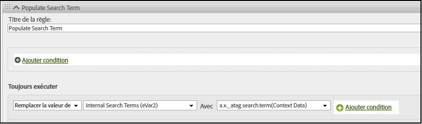

# Mappage manuel des données XDM vers Analytics

Le SDK Web Adobe Experience Platform (AEP) comprend des aides vous permettant de mapper manuellement les données entre Platform et Analytics.

Pour les données XDM qui ne sont pas automatiquement mappées vers Analytics, vous pouvez ajouter des [données contextuelles](https://docs.adobe.com/content/help/fr-FR/analytics/implementation/vars/page-vars/contextdata.html) correspondant à votre [schéma](https://docs.adobe.com/content/help/fr-FR/experience-platform/xdm/schema/composition.html). Elles peuvent ensuite être utilisées par les [règles de traitement](https://docs.adobe.com/content/help/fr-FR/analytics/admin/admin-tools/processing-rules/processing-rules-configuration/t-processing-rules.html) Analytics pour renseigner les variables Analytics.

Vous pouvez également utiliser des listes de produits et un ensemble d’actions par défaut pour envoyer ou récupérer des données avec le SDK Web AEP. Pour ce faire, consultez [Produits](https://docs.adobe.com/content/help/fr-FR/experience-platform/edge/implement/commerce.html).

## Données contextuelles

Pour être utilisées par Analytics, les données XDM sont aplaties à l’aide de la notation par points et mises à disposition sous forme de `contextData`. La liste suivante de paires de valeurs présente un exemple de `context data` :

```javascript
{
          "bh": "900",
          "bw": "1680",
          "c": "24",
          "c.a.d.key.[0]": "value1",
          "c.a.d.key.[1]": "value2",
          "c.a.d.object.key1": "value1",
          "c.a.d.object.key2.[0]": "value2",
          "c.a.x.environment.browserdetails.javascriptenabled": "true",
          "c.a.x.environment.type": "browser",
          "cust_hit_time_gmt": "1579781427",
          "g": "http://example.com/home",
          "gn": "home",
          "j": "1.8.5",
          "k": "Y",
          "s": "1680x1050",
          "tnta": "218287:1:0|0,218287:1:0|2,218287:1:0|1,218287:1:0|32767,218287:1:0|1,218287:1:0|0,218287:1:0|1,218287:1:0|0,218287:1:0|1",
          "user_agent": "Mozilla/5.0 AppleWebKit/537.36 Safari/537.36",
          "v": "Y"
        }
```

## Règles de traitement

Toutes les données collectées par le réseau Edge sont accessibles via des [règles de traitement](https://docs.adobe.com/content/help/fr-FR/analytics/admin/admin-tools/processing-rules/processing-rules-configuration/t-processing-rules.html). Dans Analytics, vous pouvez utiliser des règles de traitement pour incorporer des données contextuelles dans des variables Analytics.

Par exemple, dans la règle suivante, Analytics est défini pour renseigner les **termes pour la recherche interne (eVar2)** avec les données associées à **a.x_atag.search.term(Context Data)**.




## Schéma XDM

Experience Platform utilise des schémas pour décrire la structure des données de manière cohérente et réutilisable. En définissant les données de manière cohérente sur l’ensemble des systèmes, il est plus simple de leur donner du sens et donc d’en tirer profit. Les données contextuelles Analytics fonctionnent avec la structure définie par le schéma.

L’exemple suivant montre comment la [`event` commande](https://docs.adobe.com/content/help/fr-FR/experience-platform/edge/fundamentals/tracking-events.html) peut être utilisée avec l’option `xdm` pour envoyer et récupérer des données avec le SDK Web AEP. Dans cet exemple, la commande `event` correspond au [Schéma de détails du commerce ExperienceEvent](https://github.com/adobe/xdm/blob/1c22180490558e3c13352fe3e0540cb7e93c69ca/docs/reference/context/experienceevent-commerce.schema.md), ce qui permet de suivre le `name` de productListItems et les valeurs `SKU` :


```
alloy("event",{
  "xdm":{
    "commerce":{
      "productViews":{
        "value":1
      }
    },
    "productListItems":[
      {
        "SKU":"HT105",
        "name":"Large Field Hat",
      },
      {
        "SKU":"HT104",
        "name":"Small Field Hat",
      }
    ]
  }
});
```

Pour plus d’informations sur le suivi des événements à l’aide du SDK Web AEP, consultez [Suivi des événements](https://docs.adobe.com/content/help/fr-FR/experience-platform/edge/fundamentals/tracking-events.html).