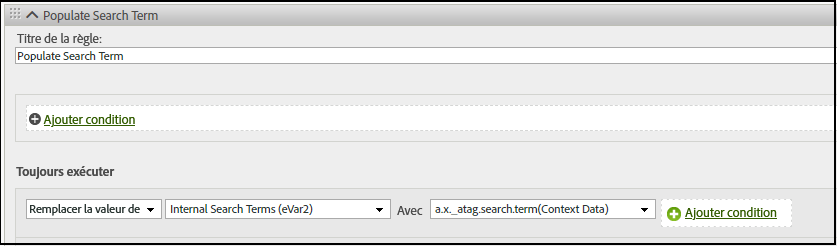

# Mappage de la variable d’objet XDM à Adobe Analytics

Le tableau suivant montre les variables XDM que Adobe Experience Platform Edge Network mappe automatiquement dans Adobe Analytics. Si vous utilisez ces chemins de champ XDM, aucune configuration supplémentaire n’est nécessaire pour envoyer des données à Adobe Analytics. Ces champs sont inclus dans le groupe de champs **[!UICONTROL Modèle Adobe Analytics ExperienceEvent]**. L’utilisation de ces champs est recommandée si vous avez l’intention d’envoyer des données à Adobe Analytics et à Adobe Experience Platform.

Si votre entreprise prévoit de passer à Customer Journey Analytics, Adobe recommande plutôt d’utiliser l’objet `data` pour envoyer directement des données à Adobe Analytics sans se conformer à un schéma. Cette stratégie permet à votre organisation d’utiliser votre propre schéma, au lieu d’utiliser le [!UICONTROL modèle Adobe Analytics ExperienceEvent] (qui s’applique moins à Customer Journey Analytics). Consultez [Mappage des variables d’objet de données à Adobe Analytics](data-var-mapping.md) pour obtenir un tableau de mappage similaire.

## Priorités des valeurs

La plupart des champs d’objet XDM de ce tableau correspondent à un [champ d’objet de données](data-var-mapping.md). Si vous définissez un champ d’objet XDM donné et son champ d’objet de données respectif, le champ d’objet de données est prioritaire. Si vous utilisez à la fois le champ d’objet XDM et le champ d’objet de données, Adobe recommande de définir des événements personnalisés à l’aide du champ d’objet de données. Si le champ `data.__adobe.analytics.events` est présent, il remplace tous les champs d’objet XDM liés aux événements commerciaux et personnalisés.

## Mappage de champs d’objet XDM

Vous trouverez les mises à jour précédentes de ce tableau dans la section [historique de validation sur GitHub](https://github.com/AdobeDocs/analytics.fr-FR/commits/main/help/implement/aep-edge/xdm-var-mapping.md) de cette page.

| Chemin d’accès au champ XDM | Variable et description Analytics |
| --- | --- |
| `xdm.application.isClose` | Permet de définir la mesure de cycle de vie mobile [Blocages](https://developer.adobe.com/client-sdks/home/base/mobile-core/lifecycle/metrics/). |
| `xdm.application.isInstall` | Permet de déterminer quand augmenter la mesure de cycle de vie mobile [Premiers lancements](https://developer.adobe.com/client-sdks/home/base/mobile-core/lifecycle/metrics/). |
| `xdm.application.closeType` | Détermine si un événement de fermeture est un blocage ou non. Les valeurs valides sont les suivantes : `close` (Une session de cycle de vie se termine et un événement pause a été reçu pour la session précédente) et `unknown` (Une session de cycle de vie se termine sans événement pause). Permet de définir la mesure de cycle de vie mobile [Blocages](https://developer.adobe.com/client-sdks/home/base/mobile-core/lifecycle/metrics/). |
| `xdm.application.isInstall` | Mesure de cycle de vie mobile [Installations](https://developer.adobe.com/client-sdks/home/base/mobile-core/lifecycle/metrics/). |
| `xdm.application.isLaunch` | Mesure de cycle de vie mobile [Lancements](https://developer.adobe.com/client-sdks/home/base/mobile-core/lifecycle/metrics/). |
| `xdm.application.name` | Permet de définir la dimension de cycle de vie mobile [ID de l’application](https://developer.adobe.com/client-sdks/home/base/mobile-core/lifecycle/metrics/). |
| `xdm.application.isUpgrade` | Mesure de cycle de vie mobile [Mises à niveau](https://developer.adobe.com/client-sdks/home/base/mobile-core/lifecycle/metrics/). |
| `xdm.application.version` | Permet de définir la dimension de cycle de vie mobile [ID de l’application](https://developer.adobe.com/client-sdks/home/base/mobile-core/lifecycle/metrics/). |
| `xdm.application.sessionLength` | Mesure de cycle de vie mobile [Durée de la session précédente](https://developer.adobe.com/client-sdks/home/base/mobile-core/lifecycle/metrics/). |
| `xdm.commerce.checkouts.id` | Applique la [sérialisation des événements](../vars/page-vars/events/event-serialization.md) à la mesure [Passages en caisse](/help/components/metrics/checkouts.md). |
| `xdm.commerce.checkouts.value` | Incrémente la mesure [Passages en caisse](/help/components/metrics/checkouts.md) de la quantité souhaitée. |
| `xdm.commerce.order.currencyCode` | Définit la variable de configuration [currencyCode](../vars/config-vars/currencycode.md). |
| `xdm.commerce.order.purchaseID` | Définit la variable de page [purchaseID](../vars/page-vars/purchaseid.md). |
| `xdm.commerce.order.payments[0].transactionID` | Définit la variable de page [transactionID](../vars/page-vars/transactionid.md). |
| `xdm.commerce.productListAdds.id` | Applique la [sérialisation des événements](../vars/page-vars/events/event-serialization.md) à la mesure [Ajouts au panier](/help/components/metrics/cart-additions.md). |
| `xdm.commerce.productListAdds.value` | Incrémente la mesure [Ajouts au panier](/help/components/metrics/cart-additions.md). |
| `xdm.commerce.productListOpens.id` | Applique la [sérialisation des événements](../vars/page-vars/events/event-serialization.md) à la mesure [Paniers](/help/components/metrics/carts.md). |
| `xdm.commerce.productListOpens.value` | Incrémente la mesure [Paniers](/help/components/metrics/carts.md). |
| `xdm.commerce.productListRemovals.id` | Applique la [sérialisation des événements](../vars/page-vars/events/event-serialization.md) à la mesure [Suppression du panier](/help/components/metrics/cart-removals.md). |
| `xdm.commerce.productListRemovals.value` | Incrémente la mesure [Retraits du panier](/help/components/metrics/cart-removals.md). |
| `xdm.commerce.productListViews.id` | Applique la [sérialisation des événements](../vars/page-vars/events/event-serialization.md) à la mesure [Vues du panier](/help/components/metrics/cart-views.md). |
| `xdm.commerce.productListViews.value` | Incrémente la mesure [Consultations du panier](/help/components/metrics/cart-views.md). |
| `xdm.commerce.productViews.id` | Applique la [sérialisation des événements](../vars/page-vars/events/event-serialization.md) à la mesure [Vues des produits](/help/components/metrics/product-views.md). |
| `xdm.commerce.productViews.value` | Incrémente la mesure [Consultations de produit](/help/components/metrics/product-views.md). |
| `xdm.commerce.purchases.value` | Incrémente la mesure [Commandes](/help/components/metrics/orders.md). |
| `xdm.device.model` | Dimension du cycle de vie mobile [Nom de l’appareil](https://developer.adobe.com/client-sdks/home/base/mobile-core/lifecycle/metrics/). |
| `xdm.device.colorDepth` | Permet de définir la dimension [Profondeur de la couleur](/help/components/dimensions/color-depth.md). |
| `xdm.device.screenHeight` | Permet de définir la dimension [Résolution du moniteur.](/help/components/dimensions/monitor-resolution.md) |
| `xdm.device.screenWidth` | Permet de définir la dimension [Résolution du moniteur.](/help/components/dimensions/monitor-resolution.md) |
| `xdm.device.type` | Type d’appareil mobile. |
| `xdm.environment.browserDetails.acceptLanguage` | Permet de définir la dimension [Langue](/help/components/dimensions/language.md). |
| `xdm.environment.browserDetails.cookiesEnabled` | Définit la dimension [Prise en charge des cookies](/help/components/dimensions/cookie-support.md). Les valeurs valides sont les suivantes : `Y` (le navigateur accepte les cookies) et `N` (le navigateur rejette les cookies). |
| `xdm.environment.browserDetails.javaEnabled` | Définit la dimension [Compatible Java](/help/components/dimensions/java-enabled.md). Les valeurs valides sont les suivantes : `Y` (Java est activé) et `N` (Java est désactivé). |
| `xdm.environment.browserDetails.userAgent` | Utilisé comme méthode d’identification [visiteur unique](/help/components/metrics/unique-visitors.md) de secours. Généralement renseignée à l’aide de l’en-tête de requête HTTP `User-Agent`. Vous pouvez associer ce champ à une eVar si vous souhaitez l’utiliser dans des rapports. |
| `xdm.environment.browserDetails.viewportHeight` | Définit la dimension [Hauteur du navigateur](/help/components/dimensions/browser-height.md). |
| `xdm.environment.browserDetails.viewportWidth` | Définit la dimension [Largeur du navigateur](/help/components/dimensions/browser-width.md). |
| `xdm.environment.carrier` | Dimension du cycle de vie mobile [Nom de l’opérateur](https://developer.adobe.com/client-sdks/home/base/mobile-core/lifecycle/metrics/). |
| `xdm.environment.connectionType` | Permet de définir la dimension [Type de connexion](/help/components/dimensions/connection-type.md). |
| `xdm.environment._dc.language` | Définit la variable de données contextuelles `a.locale`. Utilisé uniquement si `xdm.environment.language` n’est pas défini. Adobe recommande d’utiliser ce champ plutôt que `xdm.environment.language`. |
| `xdm.environment.ipV4` | Utilisé comme méthode d’identification [visiteur unique](/help/components/metrics/unique-visitors.md) de secours. Généralement renseignée à l’aide de l’en-tête HTTP `X-Forwarded-For`. |
| `xdm.environment.language` | Définit la variable de données contextuelles `a.locale`. Adobe recommande plutôt l’utilisation de `xdm.environment._dc.language` . |
| `xdm.environment.operatingSystem` | Dimension du cycle de vie mobile [Système d’exploitation](https://developer.adobe.com/client-sdks/home/base/mobile-core/lifecycle/metrics/). |
| `xdm.environment.operatingSystemVersion` | Permet de définir la dimension de cycle de vie mobile [Version du système d’exploitation](https://developer.adobe.com/client-sdks/home/base/mobile-core/lifecycle/metrics/). |
| `xdm._experience.analytics.customDimensions.`<br/>`eVars.eVar1`<br/>`[...]`<br/>`xdm._experience.analytics.customDimensions.`<br/>`eVars.eVar250` | Définit la dimension [eVar](/help/components/dimensions/evar.md) correspondante. |
| `xdm._experience.analytics.customDimensions.`<br/>`hierarchies.hier1`<br/>`[...]`<br/>`xdm._experience.analytics.customDimensions.`<br/>`hierarchies.hier5` | Définit la dimension [Hiérarchie](/help/components/dimensions/hierarchy.md) correspondante. |
| `xdm._experience.analytics.customDimensions.`<br/>`listProps.prop1.delimiter`<br/>`[...]`<br/>`xdm._experience.analytics.customDimensions.`<br/>`listProps.prop75.delimiter` | Remplacement du délimiteur de props de liste. L’utilisation de ce champ n’est pas recommandée, car le délimiteur est automatiquement récupéré depuis [Admin des variables de trafic](/help/admin/tools/manage-rs/edit-settings/c-traffic-variables/traffic-var.md) dans les paramètres de la suite de rapports. L’utilisation de ce champ peut créer une incohérence entre le délimiteur utilisé et le délimiteur attendu par Analytics. |
| `xdm._experience.analytics.customDimensions.`<br/>`listProps.prop1.values`<br/>`[...]`<br/>`xdm._experience.analytics.customDimensions.`<br/>`listProps.prop75.values` | Un tableau de chaînes contenant les valeurs correspondantes de [props de liste](../vars/page-vars/prop.md#list-props). |
| `xdm._experience.analytics.customDimensions.`<br/>`lists.list1.list[].value`<br/>`[...]`<br/>`xdm._experience.analytics.customDimensions.`<br/>`lists.list3.list[].value` | Concatène toutes les chaînes `value` de chaque tableau `list[]` à sa [variable de liste](../vars/page-vars/list.md). Le délimiteur est automatiquement sélectionné en fonction de la valeur définie dans [Paramètres de la suite de rapports](/help/admin/tools/manage-rs/edit-settings/conversion-var-admin/list-var-admin.md). |
| `xdm._experience.analytics.customDimensions.`<br/>`props.prop1`<br/>`[...]`<br/>`xdm._experience.analytics.customDimensions.`<br/>`props.prop75` | Définit la dimension [prop](/help/components/dimensions/prop.md) correspondante. |
| `xdm._experience.analytics.event1to100.`<br/>`event1.id`<br/>`[...]`<br/>`xdm._experience.analytics.event901to1000.`<br/>`event1000.id` | Applique la [sérialisation des événements](../vars/page-vars/events/event-serialization.md) à la mesure correspondante des [événements personnalisés](/help/components/metrics/custom-events.md). Chaque ID d’événement réside dans son parent de groupe 100. Par exemple, pour appliquer la sérialisation à `event678`, utilisez `xdm._experience.analytics.event601to700.event678.id`. |
| `xdm._experience.analytics.event1to100.`<br/>`event1.value`<br/>`[...]`<br/>`xdm._experience.analytics.event901to1000.`<br/>`event1000.value` | Incrémente la mesure correspondante des [événements personnalisés](/help/components/metrics/custom-events.md) par la quantité désirée. Chaque événement réside dans son parent de groupe 100. Par exemple, le champ pour `event567` est `xdm._experience.analytics.event501to600.event567.value`. |
| `xdm.identityMap.ECID[0].id` | L’[identifiant du service d’identités Adobe Experience Cloud](https://experienceleague.adobe.com/fr/docs/id-service/using/home). |
| `xdm.marketing.trackingCode` | Définit la dimension [Code de suivi](/help/components/dimensions/tracking-code.md). |
| `xdm.media.mediaTimed.completes.value` | La mesure des services de médias en flux continu [Contenu terminé](https://experienceleague.adobe.com/fr/docs/media-analytics/using/implementation/variables/audio-video-parameters#content-complete). |
| `xdm.media.mediaTimed.dropBeforeStart.value` | `a.media.view`, `a.media.timePlayed`, `a.media.play` |
| `xdm.media.mediaTimed.federated.value` | La mesure Services de médias en flux continu [Données fédérées](https://experienceleague.adobe.com/fr/docs/media-analytics/using/implementation/variables/audio-video-parameters#federated-data). |
| `xdm.media.mediaTimed.firstQuartiles.value` | La mesure des services de médias en flux continu [Marqueur de progression de 25 %](https://experienceleague.adobe.com/fr/docs/media-analytics/using/implementation/variables/audio-video-parameters#twenty-five--progress-marker). |
| `xdm.media.mediaTimed.mediaSegmentView.value` | La mesure Services de médias en flux continu [vues de segments de contenu](https://experienceleague.adobe.com/fr/docs/media-analytics/using/implementation/variables/audio-video-parameters#content-segment-views). |
| `xdm.media.mediaTimed.midpoints.value` | La mesure des services de médias en flux continu [Marqueur de progression de 50 %](https://experienceleague.adobe.com/fr/docs/media-analytics/using/implementation/variables/audio-video-parameters#progress-marker). |
| `xdm.media.mediaTimed.pauseTime.value` | La mesure des services de streaming multimédia [Durée totale de pause](https://experienceleague.adobe.com/fr/docs/media-analytics/using/implementation/variables/audio-video-parameters#total-pause-duration). |
| `xdm.media.mediaTimed.pauses.value` | La mesure des services de médias en flux continu [Pause des événements](https://experienceleague.adobe.com/fr/docs/media-analytics/using/implementation/variables/audio-video-parameters#pause-events). |
| `xdm.mediaCollection.sessionDetails.assetID` | La dimension des services de streaming multimédia [ID de ressource](https://experienceleague.adobe.com/fr/docs/media-analytics/using/implementation/variables/audio-video-parameters#asset-id). |
| `xdm.mediaCollection.sessionDetails.friendlyName` | La dimension des services de streaming multimédia [Nom de la vidéo](https://experienceleague.adobe.com/fr/docs/media-analytics/using/implementation/variables/audio-video-parameters#video-name). |
| `xdm.mediaCollection.sessionDetails.originator` | La dimension des services de streaming multimédia [Émetteur](https://experienceleague.adobe.com/fr/docs/media-analytics/using/implementation/variables/audio-video-parameters#originator). |
| `xdm.mediaCollection.sessionDetails.episode` | La dimension des services de streaming multimédia [épisode](https://experienceleague.adobe.com/fr/docs/media-analytics/using/implementation/variables/audio-video-parameters#episode). |
| `xdm.mediaCollection.sessionDetails.genre` | La dimension des services de streaming multimédia [Genre](https://experienceleague.adobe.com/fr/docs/media-analytics/using/implementation/variables/audio-video-parameters#genre). |
| `xdm.mediaCollection.sessionDetails.rating` | La dimension des services de médias en flux continu [évaluation du contenu](https://experienceleague.adobe.com/fr/docs/media-analytics/using/implementation/variables/audio-video-parameters#content-rating). |
| `xdm.mediaCollection.sessionDetails.season` | La dimension des services de streaming multimédia [Saison](https://experienceleague.adobe.com/fr/docs/media-analytics/using/implementation/variables/audio-video-parameters#season). |
| `xdm.mediaCollection.sessionDetails.name` | La dimension des services de médias en flux continu [ID de contenu](https://experienceleague.adobe.com/fr/docs/media-analytics/using/implementation/variables/audio-video-parameters#content-id). |
| `xdm.mediaCollection.sessionDetails.show` | La dimension des services de streaming multimédia [Afficher](https://experienceleague.adobe.com/fr/docs/media-analytics/using/implementation/variables/audio-video-parameters#show). |
| `xdm.mediaCollection.sessionDetails.showType` | La dimension des services de streaming multimédia [Type d’affichage](https://experienceleague.adobe.com/fr/docs/media-analytics/using/implementation/variables/audio-video-parameters#show-type). |
| `xdm.mediaCollection.sessionDetails.length` | La dimension des services de streaming multimédia [Durée de la vidéo](https://experienceleague.adobe.com/fr/docs/media-analytics/using/implementation/variables/audio-video-parameters#video-length). |
| `xdm.media.mediaTimed.primaryAssetViewDetails.@id` | La dimension des services de médias en flux continu [ID de session de médias](https://experienceleague.adobe.com/fr/docs/media-analytics/using/implementation/variables/audio-video-parameters#media-session-id). |
| `xdm.mediaCollection.sessionDetails.channel` | La dimension des services de médias en flux continu [canal de contenu](https://experienceleague.adobe.com/fr/docs/media-analytics/using/implementation/variables/audio-video-parameters#content-channel). |
| `xdm.mediaCollection.sessionDetails.contentType` | La dimension des services de médias en flux continu [Type de contenu](https://experienceleague.adobe.com/fr/docs/media-analytics/using/implementation/variables/audio-video-parameters#content-type). |
| `xdm.mediaCollection.sessionDetails.network` | La dimension des services de streaming multimédia [Réseau](https://experienceleague.adobe.com/fr/docs/media-analytics/using/implementation/variables/audio-video-parameters#network). |
| `xdm.media.mediaTimed.primaryAssetViewDetails.`<br/>`mediaSegmentView.value` | La dimension des services de médias en flux continu [Segment de contenu](https://experienceleague.adobe.com/fr/docs/media-analytics/using/implementation/variables/audio-video-parameters#content-segment). |
| `xdm.mediaCollection.sessionDetails.playerName` | La dimension des services de streaming multimédia [Nom du lecteur de contenu](https://experienceleague.adobe.com/fr/docs/media-analytics/using/implementation/variables/audio-video-parameters#content-player-name). |
| `xdm.mediaCollection.sessionDetails.appVersion` | La dimension des services de streaming multimédia [Version de SDK](https://experienceleague.adobe.com/fr/docs/media-analytics/using/implementation/variables/audio-video-parameters#sdk-version). |
| `xdm.mediaCollection.sessionDetails.feed` | La dimension Services de médias en flux continu [Type de flux de médias](https://experienceleague.adobe.com/fr/docs/media-analytics/using/implementation/variables/audio-video-parameters#media-feed-type). |
| `xdm.mediaCollection.sessionDetails.streamFormat` | La dimension des services de streaming multimédia [Format de streaming](https://experienceleague.adobe.com/fr/docs/media-analytics/using/implementation/variables/audio-video-parameters#stream-format). |
| `xdm.media.mediaTimed.progress10.value` | La mesure des services de médias en flux continu [Marqueur de progression de 10 %](https://experienceleague.adobe.com/fr/docs/media-analytics/using/implementation/variables/audio-video-parameters#ten--progress-marker). |
| `xdm.media.mediaTimed.progress95.value` | La mesure des services de médias en flux continu [Marqueur de progression de 95 %](https://experienceleague.adobe.com/fr/docs/media-analytics/using/implementation/variables/audio-video-parameters#ninety-five--progress-marker). |
| `xdm.mediaCollection.sessionDetails.hasResume` | La mesure des services de médias en flux continu [Reprise du contenu](https://experienceleague.adobe.com/fr/docs/media-analytics/using/implementation/variables/audio-video-parameters#content-resumes). |
| `xdm.media.mediaTimed.starts.value` | La mesure Services de médias en flux continu [démarrages des médias](https://experienceleague.adobe.com/fr/docs/media-analytics/using/implementation/variables/audio-video-parameters#media-starts). |
| `xdm.media.mediaTimed.thirdQuartiles.value` | La mesure des services de médias en flux continu [Marqueur de progression de 75 %](https://experienceleague.adobe.com/fr/docs/media-analytics/using/implementation/variables/audio-video-parameters#seventy-five--progress-marker). |
| `xdm.media.mediaTimed.timePlayed.value` | La mesure des services de médias en flux continu [Temps passé sur le contenu](https://experienceleague.adobe.com/fr/docs/media-analytics/using/implementation/variables/audio-video-parameters#content-time-spent). |
| `xdm.media.mediaTimed.totalTimePlayed.value` | La mesure Services de médias en flux continu [Durée des médias utilisée](https://experienceleague.adobe.com/fr/docs/media-analytics/using/implementation/variables/audio-video-parameters#media-time-spent). |
| `xdm.placeContext.geo._schema.latitude` | La latitude et l’emplacement du visiteur. Permet de définir les dimensions [emplacement du cycle de vie mobile](/help/components/dimensions/lifecycle-dimensions.md). |
| `xdm.placeContext.geo._schema.longitude` | Emplacement en longitude du visiteur. Permet de définir les dimensions [emplacement du cycle de vie mobile](/help/components/dimensions/lifecycle-dimensions.md). |
| `xdm.placeContext.geo.postalCode` | La dimension [Code postal](/help/components/dimensions/zip-code.md). |
| `xdm.placeContext.geo.stateProvince` | La dimension [États américains](/help/components/dimensions/us-states.md). |
| `xdm.placeContext.localTime` | Apparaît comme `t_time_info` dans [Flux de données](/help/export/analytics-data-feed/c-df-contents/datafeeds-reference.md). |
| `xdm.productListItems[]._experience.analytics.`<br/>`customDimensions.eVars.eVar1`<br/>`[...]`<br/>`xdm.productListItems[]._experience.analytics.`<br/>`customDimensions.eVars.eVar250` | Applique le marchandisage de la [syntaxe du produit](../vars/page-vars/products.md) aux eVars. |
| `xdm.productListItems[]._experience.analytics.`<br/>`event1to100.event1.value`<br/>`[...]`<br/>`xdm.productListItems[]._experience.analytics.`<br/>`event901-1000.event1000.value` | Applique le marchandisage de la [syntaxe de produit](../vars/page-vars/products.md) aux événements. |
| `xdm.productListItems[].productCategories[].categoryID` | La dimension [Catégorie](/help/components/dimensions/category.md). Voir aussi la variable de la page des [produits](../vars/page-vars/products.md). |
| `xdm.productListItems[].name` | La dimension [Produit](/help/components/dimensions/product.md). Voir aussi la variable de la page des [produits](../vars/page-vars/products.md). Si `xdm.productListItems[].SKU` et `xdm.productListItems[].name` contiennent tous deux des données, la valeur de `xdm.productListItems[].SKU` est utilisée. |
| `xdm.productListItems[].priceTotal` | Permet de déterminer la mesure [Revenu](/help/components/metrics/revenue.md). Voir aussi la variable de la page des [produits](../vars/page-vars/products.md). |
| `xdm.productListItems[].quantity` | Permet de déterminer la mesure [Unités](/help/components/metrics/units.md). Voir aussi la variable de la page des [produits](../vars/page-vars/products.md). |
| `xdm.productListItems[].SKU` | La dimension [Produit](/help/components/dimensions/product.md). Voir aussi la variable de la page des [produits](../vars/page-vars/products.md). Si `xdm.productListItems[].SKU` et `xdm.productListItems[].name` contiennent tous deux des données, la valeur de `xdm.productListItems[].SKU` est utilisée. |
| `xdm.web.webInteraction.URL` | La variable de mise en œuvre [linkURL](../vars/config-vars/linkurl.md). |
| `xdm.web.webInteraction.name` | La dimension [Lien personnalisé](/help/components/dimensions/custom-link.md), [Lien de téléchargement](/help/components/dimensions/download-link.md) ou [Lien de sortie](/help/components/dimensions/exit-link.md) selon la valeur dans `xdm.web.webInteraction.type` |
| `xdm.web.webInteraction.type` | Détermine le type de lien sur lequel l’utilisateur a cliqué. Les valeurs valides sont les suivantes : `other` (Liens personnalisés), `download` (Liens de téléchargement) et `exit` (Liens de sortie). |
| `xdm.web.webPageDetails.URL` | La dimension [URL de la page](/help/components/dimensions/page-url.md). |
| `xdm.web.webPageDetails.isErrorPage` | Indicateur qui permet de déterminer la [dimension](/help/components/dimensions/pages-not-found.md) et la [mesure](/help/components/metrics/pages-not-found.md) « Pages introuvables ». |
| `xdm.web.webPageDetails.name` | La dimension [Page](/help/components/dimensions/page.md). |
| `xdm.web.webPageDetails.server` | La dimension [Serveur](/help/components/dimensions/server.md). |
| `xdm.web.webPageDetails.siteSection` | La dimension [Section du site](/help/components/dimensions/site-section.md). |
| `xdm.web.webReferrer.URL` | La dimension [Référent](/help/components/dimensions/referrer.md). |

{style="table-layout:auto"}

<!-- `environment.browserDetails.javaScriptVersion` and `web.webPageDetails.homePage` were included in the original table, but they no longer exist in Analytics. | -->

## Mappage d’autres champs XDM aux variables Analytics

Si vous souhaitez ajouter des dimensions ou des mesures à Adobe Analytics, vous pouvez le faire via [Variables de données contextuelles](../vars/page-vars/contextdata.md).

### Mappage implicite

Tous les éléments de champ XDM qui ne sont pas automatiquement mappés sont envoyés à Adobe Analytics en tant que données contextuelles avec le préfixe `a.x.`. Vous pouvez ensuite mapper cette variable de données contextuelles à la variable Analytics souhaitée à l’aide des [règles de traitement](/help/admin/tools/manage-rs/edit-settings/general/processing-rules/pr-overview.md). Par exemple, si vous définissez l’évènement suivant :

```js
alloy("event",{
    "xdm":{
        "_atag":{
            "search":{
                "term":"Example search term"
            }
        }
    }
})
```

Le SDK Web envoie ces données à Adobe Analytics en tant que variable de données contextuelles `a.x._atag.search.term`. Vous pouvez ensuite utiliser une règle de traitement pour affecter cette valeur de variable de données contextuelles à la variable Analytics souhaitée, par exemple une `eVar` :



## Correspondance explicite

Vous pouvez également mapper explicitement des éléments de champ XDM en tant que données contextuelles. Tout élément de champ XDM explicitement mappé à l’aide de l’élément `contextData` est envoyé à Adobe Analytics en tant que données contextuelles sans préfixe. Vous pouvez ensuite mapper cette variable de données contextuelles à la variable Analytics souhaitée à l’aide des [règles de traitement](/help/admin/tools/manage-rs/edit-settings/general/processing-rules/pr-overview.md). Par exemple, si vous définissez l’évènement suivant :

```js
alloy("event",{
    "xdm":{
        "_atag":{
            "analytics": {
                "contextData" : {
                    "someValue" : "1"
                }
            }
        }
    }
})
```

Le SDK Web envoie ces données à Adobe Analytics en tant que variable de données contextuelles `somevalue` avec la valeur `1`.  Vous pouvez ensuite utiliser une règle de traitement pour affecter cette valeur de variable de données contextuelles à la variable Analytics souhaitée, par exemple une `eVar` :


