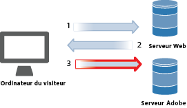
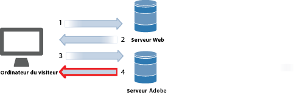
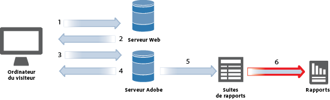
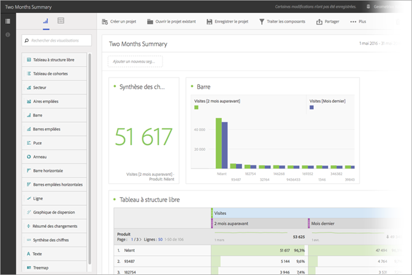

# Collecte de données

Découvrez de quelle façon les visites sur votre site web deviennent un rapport dans Adobe Analytics.

La collecte des données Analytics est effectuée par une demande d’image spécifique aux serveurs de collecte de données Adobe. Dans la plupart des implémentations, du code JavaScript est placé sur les pages web qui font l’objet d’un suivi. Lorsqu’une page web avec des balises est chargée dans le navigateur d’un visiteur, celui-ci exécute le code JavaScript, ce qui permet de capturer les informations sur le visiteur et de remplir correctement les balises. La dernière étape du traitement JavaScript consiste à effectuer une demande d’image à un serveur de collecte de données Analytics qui collecte les données envoyées et renvoie une petite image transparente au navigateur du visiteur.

Lors du traitement du navigateur, le délai du téléchargement des éléments de page (images, etc.) à partir des serveurs web constitue un goulot d’étranglement. Le délai d’exécution du code JavaScript par le navigateur est donc négligeable. Toutefois, la dernière étape au cours de laquelle le navigateur du visiteur demande une image au serveur de collecte de données Adobe n’augmente pas le délai total du téléchargement des pages. L’impact global sur le délai du téléchargement des pages dépend de la proximité du visiteur du sites web (en tronçons et non en kilomètres) aux serveurs de collecte de données Adobe.

Adobe a élaboré plusieurs méthodes d’envoi de données dans Analytics. Ces méthodes incluent des informations de suivi en temps réel provenant des sources suivantes :

* Applications ayant accès à Internet
* Campagnes
* Applications sur le serveur du client
* Emails
* Appareils mobiles
* Kiosques basés sur le web
* Sites web

<!-- 

Need to reconcile with Data Collection topics in the user guide, in this guide, and in reference. 

 -->

1. Quand un visiteur arrive sur votre site, une demande est envoyée à votre serveur web.

   

1. Le serveur web de votre site envoie les informations du code de la page, puis la page s’affiche dans le navigateur.

   

1. La page se charge et le code JavaScript Analytics s’exécute.

   

   Le code JavaScript envoie une demande d’image au serveur Adobe, en transmettant les variables, les mesures et les données de page que vous avez définies dans votre mise en œuvre.

   **Exemple de code JavaScript :** le code JavaScript est placé entre les balises &lt;body&gt; d’une page web :

   

   **Exemple de demande d’image :** extrait de code de la demande d’image avec le nom de la page en évidence :

   

   >[!NOTE]
   >
   >Chaque demande d’image contient une chaîne numérique aléatoire afin d’éviter la mise en mémoire cache du navigateur et de garantir que les demandes d’image postérieures sont créées par le navigateur.

1. Adobe renvoie une image pixel transparente.

   

   Le code collecte automatiquement les détails supplémentaires (système d’exploitation, type de navigateur, hauteur et largeur du navigateur, adresse IP et langue du navigateur).

1. Les serveurs Adobe stockent les données d’analyse web dans *`report suites`* (votre référentiel de données).

   

   Une [suite de rapports](https://marketing.adobe.com/resources/help/en_US/reference/report_suites_admin.html) définit les rapports indépendants et complets d’un site web donné, d’un ensemble de sites web ou d’un sous-ensemble de pages web.

1. Les données de la suite de rapports renseignent les rapports auxquels vous avez accès dans un navigateur web.

   

   **Exemple de rapport :**

   

   L’exécution du code JavaScript survient rapidement et n’affecte pas le temps de chargement de la page de manière notable. Grâce à cette méthode, vous pouvez comptabiliser les pages affichées quand un visiteur a cliqué sur **[!UICONTROL Recharger]** ou **[!UICONTROL Précédent]** pour atteindre une page, puisque le code JavaScript s’exécute même quand la page est récupérée dans la mémoire cache.

Pour plus d’informations, voir :

* [Collecte de données](/help/implement/js-implementation/data-collection/query-parameters.md)
* [Création d’un élément de données](/help/implement/c-implement-with-dtm/t-data-element.md)
* [Data Warehouse](https://marketing.adobe.com/resources/help/en_US/reference/data_warehouse.html)
* [Ad Hoc Analysis](https://marketing.adobe.com/resources/help/en_US/dsc/c_getting_started.html)
* [Sources de données](https://marketing.adobe.com/resources/help/en_US/whitepapers/ftp/ftp_datasources.html)
* [Data Connectors](https://marketing.adobe.com/resources/help/en_US/whitepapers/ftp/ftp_genesis.html)
* [Flux de données Analytics](/help/export/analytics-data-feed/data-feed-overview.md)

>[!MORELIKETHIS]
>       
>* [Débogueur Experience Cloud](/help/implement/impl-testing/debugger.md)

