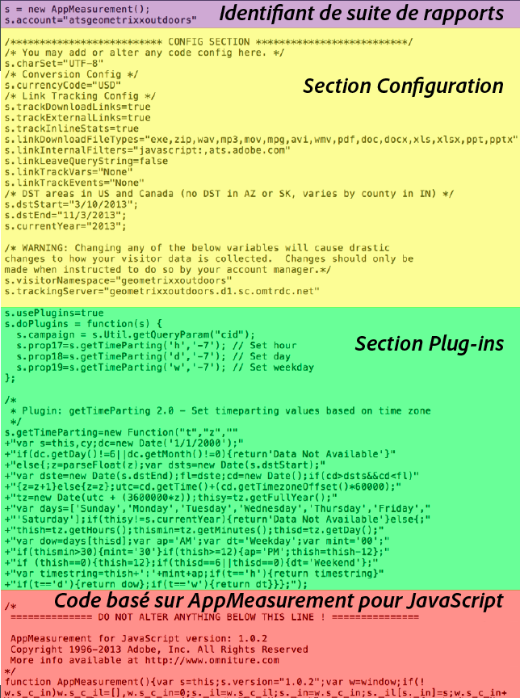

# Code Analytics

Les données sont envoyées à une suite de rapports afin d’être affichées dans des rapports. La méthode la plus simple, mais aussi la plus courante, pour envoyer des données vers Analytics consiste à utiliser la mise en œuvre avec la gestion dynamique des balises. Vous pouvez également saisir le code avec la mise en œuvre via JavaScript.

Pour plus d’informations sur l’utilisation de [!UICONTROL Dynamic Tag Management] afin de créer le code d’en-tête et de pied de page, voir [Ajout de code d’en-tête et de pied de page](/help/implement/c-implement-with-dtm/c-headers-footers/t-header-footer-code.md).

Voici un exemple de fichier [!DNL AppMeasurement] JavaScript qui illustre les parties du code :

