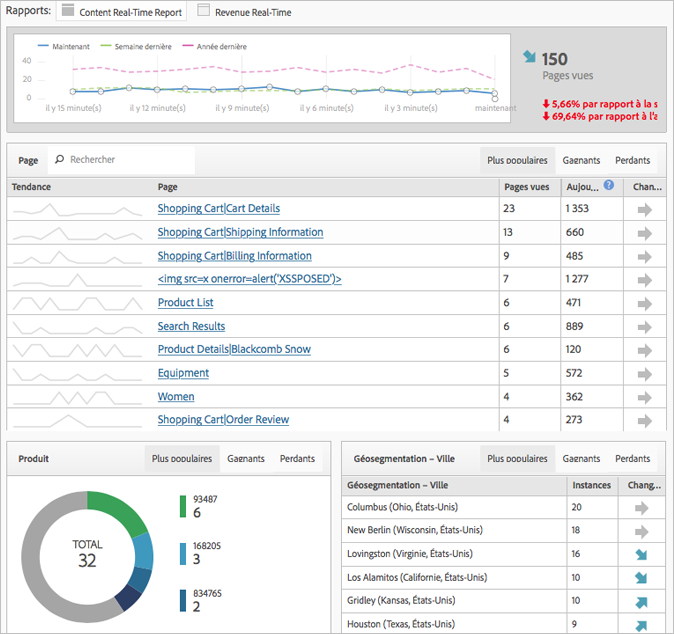

# Fenêtre modale de mise en œuvre simplifiée

Si vous êtes un nouvel utilisateur, découvrez ce que vous devez savoir sur la mise en œuvre d’Adobe Analytics.

<!-- 

https://activation.adobedtm.com/index.php?redirected=1 

 -->

Les nouveaux utilisateurs peuvent rapidement créer leur première suite de rapports [!DNL Analytics] (référentiel de données) à l’aide de cette fenêtre modale de configuration *`Getting Started with Adobe Analytics`*. Vous pouvez ensuite déployer le code [!DNL Analytics] à l’aide de [!DNL Dynamic Tag Management].

[!DNL Dynamic Tag Management] permet de gérer la mise en œuvre d’Adobe Analytics sans avoir à apporter des modifications à votre site. Si vous mettez en œuvre une application mobile, vous pouvez vous procurer le kit SDK dont vous avez besoin pour collecter des données précieuses de vos applications.

Cette procédure permet d’effectuer les opérations suivantes :

* Créer votre première [suite de rapports](https://marketing.adobe.com/resources/help/en_US/analytics/getting-started/report-suites.html)
* Déployez [!DNL Analytics] et le service [d’](https://marketing.adobe.com/resources/help/en_US/mcvid/)identité.

* Exécuter des rapports sur des données de niveau de page standard.

> [!NOTE] Avant de commencer, vérifiez qu’Analytics est [activé dans Adobe Experience Cloud](https://marketing.adobe.com/resources/help/en_US/mcloud/core_services.html) (le processus d’attribution des privilèges d’accès aux solutions). Si vous avez reçu un message vous invitant à vous connecter à Analytics dans Enterprise Dashboard, cela signifie que vous avez rempli cette condition préalable requise.

**Pour exécuter la fenêtre modale de mise en œuvre simplifiée :**

1. Log in to the [!DNL Adobe Experience Cloud] ( [experiencecloud.adobe.com](https://experiencecloud.adobe.com)).

   Lorsque vous accédez à [!DNL Analytics], le système détermine si vous disposez d’une suite de rapports. Si ce n’est pas le cas, la page [!UICONTROL Prise en main d’Adobe Analytics] s’affiche.

   

   Vous pouvez également effectuer cette configuration dans [!DNL Analytics] en cliquant sur **[!UICONTROL Aide]** &gt; **[!UICONTROL Bienvenue dans Adobe Analytics]**.

1. Indiquez les informations de base suivantes relatives à votre entreprise :

   <table id="table_1741878A1B284CB78D297D531DC703D6"> 
     <thead> 
      <tr> 
       <th colname="col1" class="entry"> Élément </th> 
       <th colname="col2" class="entry"> Description </th> 
      </tr> 
     </thead>
     <tbody> 
      <tr> 
       <td colname="col1"> 
Type de la propriété 
 </td> 
       <td colname="col2"> 
Votre mise en œuvre est-elle pour le web, le mobile ou les deux ? 
 </td> 
      </tr> 
      <tr> 
       <td colname="col1"> 
Secteurs d’activité 
 </td> 
       <td colname="col2"> 
Indiquez quelle est l’activité de votre entreprise (produits, services client, prospects, notoriété des marques et publicités). 
 </td> 
      </tr> 
      <tr> 
       <td colname="col1"> 
Couche de données 
 </td> 
       <td colname="col2"> 
(Recommandé) Tableau JavaScript utilisé pour stocker des informations. Si vous effectuez la configuration automatique à l’aide de Dynamic Tag Management, vous utiliserez une couche de données. 
 
Pour consulter un blog sur les couches de données, accédez à <a href="https://blogs.adobe.com/digitalmarketing/analytics/data-layers-buzzword-best-practice/"> Data Layer: From Buzzword to Best Practice</a> (en anglais). 
 </td> 
      </tr> 
      <tr> 
       <td colname="col1"> 
Référentiel de données (suite de rapports) 
 </td> 
       <td colname="col2"> 
 Une <a href="https://marketing.adobe.com/resources/help/en_US/analytics/getting-started/report-suites.html">suite de rapports</a> est un jeu de données distinct qui correspond généralement à une seule propriété (site ou application) ou marque. Chaque suite de rapports possède ses propres ensembles de rapports et de mesures. 
 </td> 
      </tr> 
      <tr> 
       <td colname="col1"> 
Fuseau horaire 
 </td> 
       <td colname="col2"> 
Le fuseau horaire local : (détecté automatiquement) 
 </td> 
      </tr> 
      <tr> 
       <td colname="col1"> 
Estimation du nombre de pages vues 
 </td> 
       <td colname="col2"> 
Nombre de pages vues reçues par votre site par jour. 
 </td> 
      </tr> 
      <tr> 
       <td colname="col1"> 
Devise de base 
 </td> 
       <td colname="col2"> 
Devise utilisée par votre entreprise. 
 </td> 
      </tr> 
     </tbody> 
    </table>

1. Cliquez sur **[!UICONTROL Suivant]**.

   Le système crée une suite de rapports.

1. Pour commencer le déploiement, cliquez sur **[!UICONTROL Suivant]**, puis sur l’une des options suivantes :

   <table id="table_71C7F7B9677346CD8D5130519D32464B"> 
     <thead> 
      <tr> 
       <th colname="col1" class="entry"> Élément </th> 
       <th colname="col2" class="entry"> Description </th> 
      </tr> 
     </thead>
     <tbody> 
      <tr> 
       <td colname="col1"> 
Déploiement 
 </td> 
       <td colname="col2"> 
 Lance Dynamic Tag Management dans laquelle vous pouvez vous connecter et déployer Analytics. Ce processus met automatiquement en œuvre le fichier  AppMeasurement.js et le service d’identité ( VisitorAPI.js). 
 
 
Important : dans un nouvel onglet de navigateur, une page d’aide vous guide tout au long du déploiement d’Adobe Analytics via Dynamic Tag Management. 
 
 </td> 
      </tr> 
      <tr> 
       <td colname="col1"> 
Télécharger 
 </td> 
       <td colname="col2"> 
 Télécharge le fichier d’installation appelé INSTALL-ME &lt;nom de la suite de rapports&gt;.js. Cette option est destinée aux utilisateurs expérimentés qui comprennent la <a href="https://marketing.adobe.com/resources/help/en_US/sc/implement/js_implementation.html">mise en œuvre de JavaScript</a>. 
 
 
Important : Le téléchargement du code n’est pas un déploiement d’Analytics. Il s’agit d’un déploiement manuel que vous effectuez sur les pages de votre site ou par le bais des services de conseil Adobe. 
 
 </td> 
      </tr> 
     </tbody> 
    </table>

1. Exécution d’un rapport.

   Une fois l’outil Analytics déployé, vous pouvez exécuter un rapport dans les Reports &amp; Analytics pour vérifier que des données arrivent à votre site. (Reportez-vous à la section   [Connexion et navigation](https://marketing.adobe.com/resources/help/en_US/analytics/getting-started/analytics-navigation.html) pour vous familiariser avec l’interface d’Analytics.)

   Par exemple, un rapport **[!UICONTROL Mesures du site]** &gt; **[!UICONTROL Temps réel]** permet d’afficher les données immédiates.

   >[!NOTE]
   >
   >Une configuration du rapport en [!UICONTROL temps réel] est nécessaire avant son exécution. Voir [Configuration d’un rapport en temps réel](https://marketing.adobe.com/resources/help/en_US/reference/t_realtime_admin.html).

**Exemple de rapport en temps réel**

