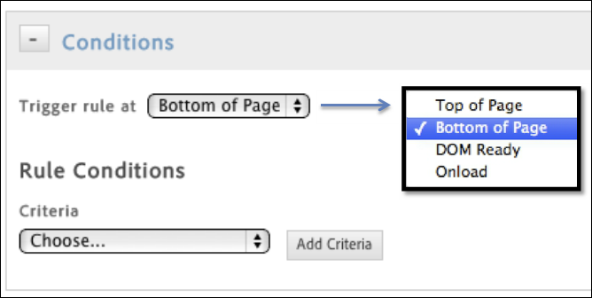

# Création de conditions pour les règles de chargement de page

Créez des règles qui déterminent sur quelles pages une règle est déclenchée.

1. Indiquez à quel emplacement de la page la règle doit être déclenchée.

   Le délai du déclenchement de la règle devient plus important lorsque le contenu des pages contient des dépendances au sein de la règle.

   

1. Spécifiez la condition qui entraîne le déclenchement de la règle.

   Vous pouvez par exemple sélectionner **[!UICONTROL Chemin d’accès]pour identifier des pages spécifiques pour lesquelles la règle doit être déclenchée.**

   

