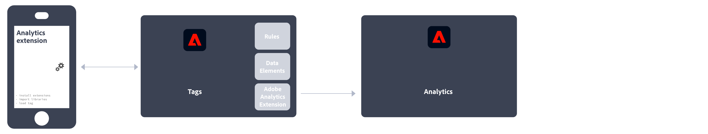

# Mise en œuvre d’Adobe Analytics

Adobe requiert du code sur votre site ou application pour envoyer des données aux serveurs de collecte de données d’Adobe. Les étapes suivantes indiquent le fonctionnement d’une mise en œuvre type.

1. Quand un visiteur arrive sur votre site, une demande est envoyée à votre serveur web.
2. Le serveur web de votre site envoie les informations du code de la page, puis la page s’affiche dans le navigateur.
3. La page se charge et le code JavaScript Analytics s’exécute.
Le code JavaScript envoie une demande d’image aux serveurs de collecte de données Adobe. Les données de page que vous avez définies dans votre mise en œuvre sont envoyées dans le cadre d’une chaîne de requête dans cette demande d’image.

4. Adobe renvoie une image pixel transparente.
5. Les serveurs Adobe stockent les données collectées dans une ou plusieurs *suites de rapports*.
6. Les données de la suite de rapports renseignent les rapports auxquels vous avez accès dans un navigateur web.

L’exécution du code JavaScript survient rapidement et n’affecte pas le temps de chargement de la page de manière notable. Grâce à cette méthode, vous pouvez comptabiliser les pages affichées quand un visiteur a cliqué sur **[!UICONTROL Recharger]** ou **[!UICONTROL Précédent]** pour atteindre une page, puisque le code JavaScript s’exécute même quand la page est récupérée dans la mémoire cache.

Adobe Analytics exige du code sur votre site web, votre application mobile ou toute autre application pour envoyer des données aux serveurs de collecte de données. Il existe plusieurs méthodes de mise en œuvre de ce code, selon la plateforme et les besoins de votre entreprise.

## Méthodes de mise en œuvre d’un site Web

Pour votre **site Web**, les méthodes de mise en œuvre suivantes sont disponibles :

* **Extension SDK Web** : la méthode normalisée et recommandée pour mettre en œuvre Adobe Analytics pour les nouveaux clients et les nouvelles clientes. Ajoutez la variable **Extension SDK Web Adobe Experience Platform** dans la collecte de données Adobe Experience Platform **Balises**, puis placez une balise de chargement sur chaque page. La balise envoie des données à Adobe Experience Platform. **Edge Network**, qui transfère ces données vers Adobe Analytics.
  
Voir [Comment mettre en oeuvre Adobe Analytics à l’aide de l’extension SDK Web Adobe Experience Platform.](./aep-edge/overview.md).

* **SDK Web** : si vous ne souhaitez pas utiliser la collecte de données d’Adobe Experience Platform, vous pouvez charger manuellement les bibliothèques du SDK Web sur votre site. Référencez la bibliothèque du SDK Web (`alloy.js`) sur chaque page et envoyez les appels de suivi de votre choix au **réseau Edge** d’Adobe Experience Platform dans un format adapté à votre organisation. Le réseau Edge transfère ces données à Adobe Analytics.
  
Voir [Comment mettre en oeuvre Adobe Analytics à l’aide du SDK Web de Adobe Experience Platform](./aep-edge/overview.md) pour plus d’informations.

* **Extension Analytics**: ajoutez le **Extension Adobe Analytics** dans la collecte de données Adobe Experience Platform **Balises**, puis placez une balise de chargement sur chaque page. La balise envoie directement des données à Adobe Analytics. Utilisez cette méthode d’implémentation si vous souhaitez profiter de la commodité des balises, mais ne souhaitez pas utiliser l’infrastructure réseau Edge.
  
Voir [Comment mettre en oeuvre Adobe Analytics à l’aide de l’extension Analytics](launch/overview.md) pour plus d’informations.

* **Code JavaScript hérité** : méthode manuelle historique pour implémenter Adobe Analytics. Référencez la bibliothèque AppMeasurement (`AppMeasurement.js`) sur chaque page, puis définissez des variables et des paramètres dans JavaScript.
  
Cette méthode de mise en oeuvre peut s’avérer utile pour les mises en oeuvre qui utilisent du code personnalisé. Elle est idéale pour les types de mise en oeuvre qui ne sont pas proposés ailleurs, tels que pour [Pages AMP](other/amp.md).

Le flux de décision suivant peut vous aider à sélectionner une méthode de mise en oeuvre :

>[!TIP]
>
>Contactez votre équipe de compte d’Adobe pour obtenir des conseils et connaître les bonnes pratiques sur la mise en oeuvre à choisir en fonction de votre situation actuelle.

## Méthodes d’implémentation des applications mobiles

Pour votre **application mobile**, les méthodes d’implémentation suivantes sont disponibles :

* **Extension SDK mobile** : méthode normalisée et recommandée pour implémenter Adobe Analytics dans votre application mobile. Utilisez des bibliothèques dédiées pour envoyer facilement des données à Adobe depuis votre application mobile. Ajoutez la variable **Extension SDK Mobile Adobe Experience Platform** dans la collecte de données Adobe Experience Platform **Balises**, puis implémentez la bibliothèque SDK Mobile dans votre application. Vous pouvez utiliser le SDK pour importer des bibliothèques, enregistrer des extensions et charger la configuration des balises. Envoi de données à Adobe Experience Platform **Edge Network**; Edge transfère ensuite ces données à Adobe Analytics.
  

  Voir [Implémenter Adobe Analytics à l’aide du SDK mobile Adobe Experience Platform](../implement/aep-edge/mobile-sdk/overview.md) pour plus d’informations.

* **Extension Analytics**: ajoutez le **Extension Adobe Analytics** dans la collecte de données Adobe Experience Platform **Balises**et implémentez la bibliothèque SDK Mobile dans votre application. Vous pouvez utiliser le SDK pour importer des bibliothèques, enregistrer des extensions et charger la configuration des balises. Cette méthode d’implémentation envoie directement des données à Adobe Analytics. Il est recommandé si vous souhaitez profiter de la fonctionnalité de collecte de données Adobe Experience Platform, mais ne souhaitez pas utiliser l’infrastructure réseau Edge Experience Platform d’Adobe.
  

  Voir [Implémenter Adobe Analytics à l’aide de l’extension Analytics](../implement/aep-edge/mobile-sdk/overview.md) pour plus d’informations.

>[!CAUTION]
>
>La prise en charge des SDK mobiles version 4 a pris fin le 31 août 2021. Pour plus d’informations, voir la [FAQ sur la fin de prise en charge des SDK mobiles version 4](https://developer.adobe.com/client-sdks/resources/upgrade-platform-sdks/v4-faq/).

## Principaux articles sur l’implémentation d’Analytics

* [Prise en charge d’une implémentation Adobe Analytics existante](/help/implement/prepare/existing-implementation.md)
* [Adobe Debugger](validate/debugger.md)
* [Création d’une propriété de balise dans Experience Platform](launch/create-analytics-property.md)
* [Mises à jour d’AppMeasurement](appmeasurement-updates.md)

## Plus de guides d’utilisation d’Analytics

[Guides d’utilisation d’Analytics](https://experienceleague.adobe.com/docs/analytics.html?lang=fr)

## Principales ressources Analytics

* [Contacter l’assistance clientèle](https://experienceleague.adobe.com/?support-solution=Analytics&amp;lang=fr#support)
* [Forum de la communauté Analytics](https://experienceleaguecommunities.adobe.com/t5/adobe-analytics/ct-p/adobe-analytics-community?profile.language=fr)
* [Ressources Adobe Analytics](https://experienceleaguecommunities.adobe.com/t5/adobe-analytics-discussions/adobe-analytics-resources/m-p/276666?profile.language=fr)
