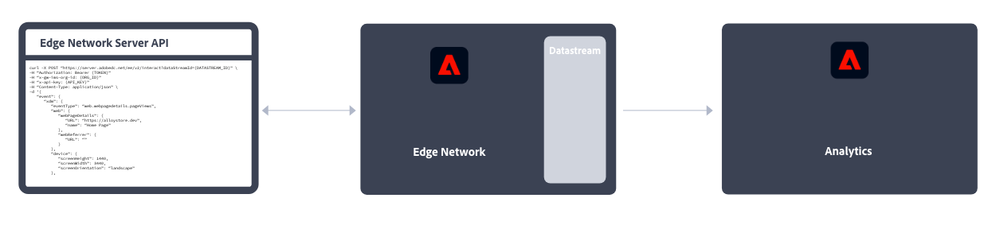

# Mise en œuvre d’Adobe Analytics

Adobe Analytics exige du code sur votre site web, votre application mobile ou toute autre application pour envoyer des données aux serveurs de collecte de données. Il existe plusieurs méthodes de mise en œuvre de ce code, selon la plateforme et les besoins de votre entreprise.

## Méthodes de mise en œuvre d’un site Web

Pour votre **site Web**, les méthodes de mise en œuvre suivantes sont disponibles :

### Côté client

* **Extension SDK Web** : la méthode normalisée et recommandée pour mettre en œuvre Adobe Analytics pour les nouveaux clients et les nouvelles clientes. Ajoutez l’**extension SDK Web d’Adobe Experience Platform** dans les **balises** de collecte de données Adobe Experience Platform, puis placez une balise de chargement sur chaque page. La balise envoie des données au **réseau Edge** d’Adobe Experience Platform, qui transfère ces données vers Adobe Analytics.
  
Voir [Implémenter Adobe Analytics à l’aide de l’extension SDK Web d’Adobe Experience Platform.](./aep-edge/overview.md) pour plus d’informations.

* **SDK Web** : si vous ne souhaitez pas utiliser la collecte de données d’Adobe Experience Platform, vous pouvez charger manuellement les bibliothèques du SDK Web sur votre site. Référencez la bibliothèque du SDK Web (`alloy.js`) sur chaque page et envoyez les appels de suivi de votre choix au **réseau Edge** d’Adobe Experience Platform dans un format adapté à votre organisation. Le réseau Edge transfère ces données à Adobe Analytics.
  
Pour plus d’informations, voir [Implémenter Adobe Analytics à l’aide du SDK Web d’Adobe Experience Platform](./aep-edge/overview.md).

* **Extension Analytics** : ajoutez l’**extension Adobe Analytics** dans les **balises** de collecte de données Adobe Experience Platform, puis placez une balise de chargement sur chaque page. La balise envoie des données directement à Adobe Analytics. Utilisez cette méthode d’implémentation si vous souhaitez profiter de la commodité des balises sans utiliser l’infrastructure du réseau Edge.
  
Pour plus d’informations, voir [Implémenter Adobe Analytics à l’aide de l’extension Analytics](launch/overview.md).

* **Code JavaScript hérité** : méthode manuelle historique pour implémenter Adobe Analytics. Référencez la bibliothèque AppMeasurement (`AppMeasurement.js`) sur chaque page, puis définissez les paramètres et variables dans JavaScript.
  
Cette méthode d’implémentation peut se révéler utile pour les implémentations qui utilisent du code personnalisé. Elle est idéale pour les types d’implémentation qui ne sont pas proposés ailleurs, tels que pour les [pages AMP](other/amp.md).

Le flux de décision suivant peut vous aider à sélectionner une méthode d’implémentation côté client :

>[!TIP]
>
>Contactez l’équipe Adobe en charge des comptes pour obtenir des conseils et connaître les bonnes pratiques relatives à l’implémentation à choisir en fonction de votre situation actuelle.

### Côté serveur

Pour mettre en oeuvre Adobe Analytics côté serveur, vous disposez des options suivantes :

* **API Edge Server**: vous implémentez du code sur le serveur qui utilise l’API du serveur Adobe Experience Platform Edge pour communiquer avec Adobe Analytics par le biais d’un flux de données.
  
Voir [Mise en oeuvre d’Adobe Analytics à l’aide de l’API Adobe Experience Platform Edge Network Server](/help/implement/aep-edge/server-api/overview.md) pour plus d’informations.

* **API d’insertion de données (en bloc)**: vous utilisez les API d’insertion de données Adobe Analytics (en bloc) pour collecter les données côté serveur directement dans Adobe Analytics.
  
Voir [API d’insertion de données](../import/c-data-insertion-api/c-data-insertion-api.md) pour plus d’informations.

## Méthodes d’implémentation des applications mobiles

Pour votre **application mobile**, les méthodes d’implémentation suivantes sont disponibles :

* **Extension SDK mobile** : méthode normalisée et recommandée pour implémenter Adobe Analytics dans votre application mobile. Utilisez des bibliothèques dédiées pour envoyer facilement des données à Adobe depuis votre application mobile. Ajoutez l’**extension SDK Mobile d’Adobe Experience Platform** dans les **balises** de collecte de données Adobe Experience Platform, puis implémentez la bibliothèque SDK Mobile dans votre application. Vous pouvez utiliser le SDK pour importer des bibliothèques, enregistrer des extensions et charger la configuration des balises. Envoyez les données au **réseau Edge** d’Adobe Experience Platform ; Edge transfère ensuite ces données à Adobe Analytics.
  

  Voir [Implémenter Adobe Analytics à l’aide du SDK mobile Adobe Experience Platform](../implement/aep-edge/mobile-sdk/overview.md) pour plus d’informations.

* **Extension Analytics** : ajoutez l’**extension Adobe Analytics** aux **balises** de collecte de données Adobe Experience Platform et implémentez la bibliothèque SDK Mobile dans votre application. Vous pouvez utiliser le SDK pour importer des bibliothèques, enregistrer des extensions et charger la configuration des balises. Cette méthode d’implémentation envoie directement des données à Adobe Analytics. Elle est recommandée si vous souhaitez profiter de la collecte de données d’Adobe Experience Platform sans utiliser l’infrastructure de réseau Edge Experience Platform d’Adobe.
  

  Voir [Implémenter Adobe Analytics à l’aide de l’extension Analytics](../implement/aep-edge/mobile-sdk/overview.md) pour plus d’informations.

>[!CAUTION]
>
>Voir pour la prise en charge des anciennes versions des SDK mobiles d’Adobe [Annonces de fin de prise en charge des SDK](https://developer.adobe.com/client-sdks/resources/sdks-end-of-support/).

## Principaux articles sur l’implémentation d’Analytics

* [Prise en charge d’une implémentation Adobe Analytics existante](/help/implement/prepare/existing-implementation.md)
* [Adobe Debugger](validate/debugger.md)
* [Création d’une propriété de balise dans Experience Platform](launch/create-analytics-property.md)
* [Mises à jour d’AppMeasurement](appmeasurement-updates.md)
* [Tutoriel sur la configuration d’Adobe Analytics avec le SDK Web Platform](https://experienceleague.adobe.com/docs/platform-learn/implement-web-sdk/applications-setup/setup-analytics.html)
* [Tutoriel sur l’implémentation d’Adobe Experience Cloud dans les applications mobiles](https://experienceleague.adobe.com/docs/platform-learn/implement-mobile-sdk/overview.html?lang=fr)

## Principales ressources Analytics

* [Contacter l’assistance clientèle](https://experienceleague.adobe.com/?support-solution=Analytics&amp;lang=fr#support)
* [Forum de la communauté Analytics](https://experienceleaguecommunities.adobe.com/t5/adobe-analytics/ct-p/adobe-analytics-community?profile.language=fr)
* [Ressources Adobe Analytics](https://experienceleaguecommunities.adobe.com/t5/adobe-analytics-discussions/adobe-analytics-resources/m-p/276666?profile.language=fr)
* [Dernières notes de mise à jour de](../release-notes/latest.md)
