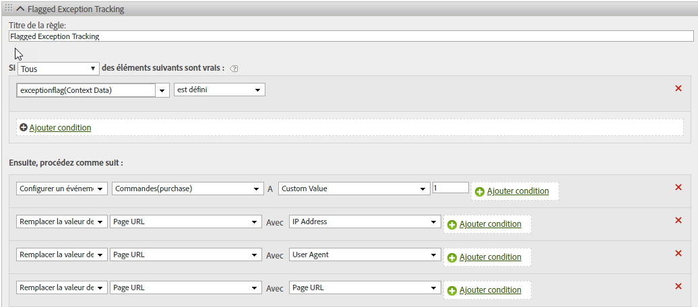

# hitGovernor

Le module externe s.hitGovernor effectue le suivi du nombre total de demandes d’images Analytics envoyées au cours d’une période récurrente prédéfinie et peut réaliser une logique supplémentaire en cas de besoin si le nombre total dépasse un certain seuil.

Bien que le trafic provenant de bots, d’araignées, d’agents d’utilisateurs spécifiques ou d’une liste spécifique d’adresses IP peut être identifié comme trafic de bot ou exclu des rapports, il est possible qu’une portion du trafic capturé dans vos suites de rapports ne devrait pas être comptabilisée. Par exemple, un nombre élevé de clics ou de pages vues au cours d’un laps de temps non raisonnable (c’est-à-dire environ une demande par seconde) peut être le signe d’un trafic malveillant.

Ce module externe vous permet de bloquer automatiquement ce trafic pendant la durée de vie restante de ce visiteur. De plus, ce trafic peut être identifié de manière dynamique au sein des rapports.

## Fonctionnement du module externe Hit Governor {#section_541BC639E31442D09B1C85A2FFCDC02C}

Le module externe incrémente une valeur de cookie chaque fois qu’une demande d’image est envoyée à vos serveurs de suivi et en effectue un suivi au cours d’une période récurrente. La période par défaut est d’une minute, mais elle peut être remplacée. (Voir [Mise en œuvre](/help/implement/js-implementation/plugins/hitgovernor.md#task_D4BDB524AA294C139AFCAE2B61FEA3F2) ci-dessous) Si le nombre total d’accès durant cette période dépasse le seuil d’accès par défaut (60), une demande d’image de lien personnalisé finale est envoyée à la variable de données contextuelles *`exceptionFlag`*. Le seuil d’accès par défaut peut également être remplacé.

Si vous le souhaitez, à partir de ce point, la collecte du trafic de ce visiteur spécifique peut cesser pendant une période par défaut de 60 jours. Le blocage du trafic requiert une ligne de code supplémentaire dans votre fonction doPlugins, comme décrit ci-dessous. La période peut également être ajustée. La logique permet à l’heure d’inclure l’adresse IP de l’utilisateur, l’agent utilisateur ou l’identifiant de visiteur [!DNL Experience Cloud] dans la logique d’exception permanente, ou de réinitialiser la période d’expiration après 60 jours. Si ce trafic est identifié comme frauduleux par le module externe après 60 jours, il est à nouveau marqué comme une exception et n’est pas collecté pendant 60 jours.

## Création de rapports {#section_E742F19B528041808454744DB2C7007C}

Aucune variable ni événement par défaut ne doit être configuré. Toutefois, nous recommandons fortement de configurer une logique de règles de traitement pour définir des variables et des événements en conséquence. Ces variables et événements personnalisés peuvent inclure :

* [!DNL Experience Cloud] Identifiant visiteur
* Adresse IP
* Agent utilisateur
* Événement d’exception avec indicateur

La création de segments avec ces variables vous permettrait ensuite de créer des segments et des suites de rapports virtuels afin d’afficher l’impact global de ces accès ambigus sur le site.

Nous recommandons d’utiliser les valeurs capturées dans les rapports pour mettre à jour les règles de bots, les règles DB VISTA ou les exclusions IP de l’entreprise.

## Implémentation {#task_D4BDB524AA294C139AFCAE2B61FEA3F2}

Pour mettre en œuvre le module externe hitGovernor :

1. Modification de la bibliothèque AppMeasurement.

   Pour initialiser le module externe, incluez cette ligne de code (en gras) au sein de la fonction `registerPostTrackCallback` dans le code de bibliothèque AppMeasurement.

   >[!NOTE]
   >
   >La fonctionnalité `registerPostTrackCallback` est incluse dans les bibliothèques AppMeasurement 1.8.0+, mais dans aucune configuration de code personnalisée par défaut. Elle est incluse après et *hors de* la fonction doPlugins.

   ```
    s.registerPostTrackCallback(function(){ 
    s.governor();
   }); 
   ```

   Sous la section doPlugins de votre fichier AppMeasurement, incluez le code de module externe contenu dans [le code source du module externe](/help/implement/js-implementation/plugins/hitgovernor.md#reference_76423C81A7A342B2AC4BE41490B27DE0), ci-dessous.

   Le seuil de limite d’accès, le seuil de délai d’accès et les périodes d’exclusion du trafic peuvent tous être remplacés en définissant ces variables, hors du module externe et de préférence avec vos autres variables de configuration :

<table id="table_9959A40F5F0B40B39DB86E21D03E25FD"> 
 <thead> 
  <tr> 
   <th colname="col1" class="entry"> Variable </th> 
   <th colname="col2" class="entry"> du lien personnalisé </th> 
   <th colname="col3" class="entry"> Description </th> 
  </tr> 
 </thead>
 <tbody> 
  <tr> 
   <td colname="col1"> <p>Seuil de limite d’accès </p> </td> 
   <td colname="col2"> <p> <code> s.hl = 60; </code> </p> </td> 
   <td colname="col3"> <p>Nombre total d’accès qui ne devrait pas être dépassé au cours d’une période donnée. </p> </td> 
  </tr> 
  <tr> 
   <td colname="col1"> <p>Seuil de temps d’accès </p> </td> 
   <td colname="col2"> <p> <code> s.ht = 10; </code> </p> </td> 
   <td colname="col3"> <p>Fenêtre en secondes d’enregistrement des accès. Ce nombre est divisé par six pour déterminer les fenêtres récurrentes. </p> </td> 
  </tr> 
  <tr> 
   <td colname="col1"> <p>Seuil d’exclusion </p> </td> 
   <td colname="col2"> <p> <code> s.he = 60; </code> </p> </td> 
   <td colname="col3"> <p>Nombre de jours défini pour le cookie d’exclusion pour ce visiteur. </p> </td> 
  </tr> 
 </tbody> 
</table>

>[!NOTE]
>
>Votre mise en œuvre peut utiliser un nom d’objet différent de celui de l’objet « s » par défaut d’Analytics. Si tel est le cas, veuillez mettre à jour le nom de l’objet en conséquence.

1. Configuration des règles de traitement.

   Ce module externe enregistre les exceptions avec indicateur sous forme de données contextuelles dans une demande d’image de suivi des liens. Ainsi, les règles de traitement doivent être configurées pour affecter et suivre ces exceptions avec indicateur dans les variables appropriées telles que celles ci-après.

   

1. (Facultatif) Incluez le code de blocage de trafic dans doPlugins.

   Une fois le trafic identifié comme une exception, tout accès ultérieur de ce visiteur peut être bloqué entièrement en incluant ce code au sein de la fonction `doPlugins` :

   ```
   //Check for hit governor flag 
         if(s.Util.cookieRead('s_hg')==9)s.abort=true;
   ```

   Si ce code n’est pas inclus, le trafic de ce visiteur sera marqué avec un indicateur, mais pas bloqué.

## Code source du module externe {#reference_76423C81A7A342B2AC4BE41490B27DE0}

Ce code devrait être ajouté ci-dessous sous la section doPlugins de votre bibliothèque AppMeasurement.

```
//Hit Governor (Version 0.1 BETA, 11-13-17) 
s.governor=new Function("","" 
+"var s=this;if(typeof s.hl=='undefined'){s.hl=60;}if(typeof s.ht=='u" 
+"ndefined'){s.ht=60;}if(typeof s.he=='undefined'){s.he=60;}if(s.Util" 
+".cookieRead('s_hg')==8){var i=new Date(),y=i.getFullYear(),m=i.getM" 
+"onth(),d=i.getDate(),i=new Date(y,m,d+s.he);s.Util.cookieWrite('s_h" 
+"g',9,i);return;}var f=s.Util.cookieRead('s_hc'),g=Number(s.Util.coo" 
+"kieRead('s_ht')),h=Math.floor((new Date()).getTime()),ha=f!=''?f.sp" 
+"lit('|').map(Number):[0,0,0,0,0],i=ha.reduce(function(ha,b){return " 
+"ha+b;},0),j=g==0?0:Math.floor(((h-g)/(s.ht/6))/1000);if(g==0)s.Util" 
+".cookieWrite('s_ht',h);if(i<s.hl){if(j>=1){if(j>=6){ha=[0,0,0,0,0];" 
+"}else{for(var k=0;k<j;k++){ha.unshift(0);ha.pop();}}s.Util.cookieWr" 
+"ite('s_ht',h);}}else{s.Util.cookieWrite('s_hg',8);s.linkTrackVars+=" 
+"',contextData.exceptionFlag';s.contextData['exceptionFlag']='true';" 
+"s.tl(this,'o','exceptionFlag');}ha[0]++;s.Util.cookieWrite('s_hc',h" 
+"a.join('|'));"); 
```

