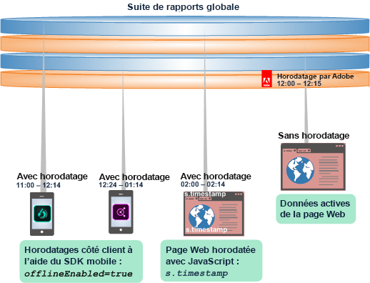
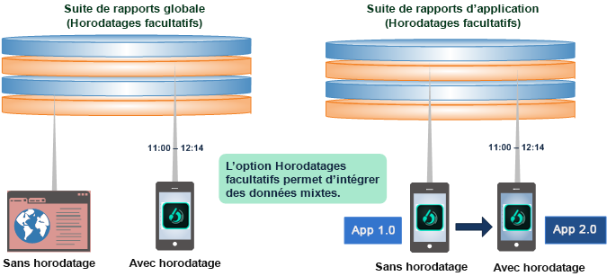
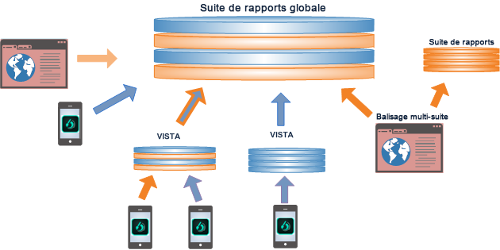
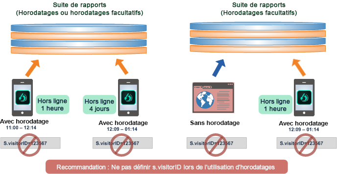
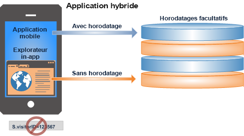

# Utilisation du paramètre Horodatages (facultatif)

Découvrez-en plus sur les avantages et les contraintes liés à l’utilisation du paramètre Horodatages (facultatif).

Le paramètre Horodatages (facultatif) est défini par défaut pour toutes les nouvelles suites de rapports.

* Ajoutez des données horodatées et non horodatées à la même suite de rapports globale.
* Envoyez des données horodatées d’une application mobile vers une suite de rapports globale.
* Mettez à niveau les applications afin d’utiliser les horodatages sans avoir à créer de suite de rapports.

>[!NOTE]
>
>Le paramètre Horodatages (facultatif) est le paramètre par défaut pour toutes les nouvelles suites de rapports générées à partir d’un modèle. Les nouvelles suites de rapports copiées à partir d’une suite de rapports existante héritent des paramètres de la suite de rapports d’origine.

Voir [Horodatages (facultatif)](https://marketing.adobe.com/resources/help/en_US/reference/timestamp-optional.html) pour en savoir plus sur la configuration.

## Horodatages (facultatif) : intégration de données horodatées et non horodatées. {#section_BF17CB593044462B993FD0D28EA56518}

Avec l’option Horodatages (facultatif), vous pouvez combiner des données horodatées et non horodatées sans aucune perte de données. Les données hors ligne avec des horodatages générés par un appareil mobile peuvent être combinées à des données en direct non horodatées d’une page Web, ou intégrées aux données d’une plateforme quelconque à l’aide d’un appel d’horodatage côté client.

* **Données horodatées**. Client-side timestamp data is captured and sent directly with the device data using client-side timestamp variables: Javascript on a web page, or using a Mobile SDK call ( [!DNL offlineEnabled=true]) in a mobile app.
* **Données non horodatées**. Adobe définit un horodatage sur les données non horodatées dans une suite de rapports lorsque les données parviennent aux serveurs de collection.

L’un des paramètres d’horodatage suivants peut être défini pour une suite de rapports :

* Horodatages non autorisés (paramètre visitorID pris en charge)
* Horodatages requis (paramètre visitorID non pris en charge)
* Horodatages facultatifs (paramètre visitorID pris en charge sauf sur les accès horodatés)

## Paramètre Horodatages (facultatif) {#section_63B2FA9A2AB24B3993E84D2C2B4BF2CE}

Le paramètre Horodatages (facultatif) permet d’intégrer plusieurs suites de rapports et d’en produire des rapports, avec ou sans horodatage côté client. Avec ce paramètre, vous pouvez mettre à jour votre application afin d’utiliser les horodatages tout en continuant à utiliser les données non horodatées de l’application antérieure.

| Dans les versions précédentes... | En outre... |
|--- |--- |
| Il n’était pas possible d’envoyer les données horodatées vers une suite de rapports globale non horodatée. Par conséquent, les données d’accès envoyées par les appareils hors ligne étaient ignorées lors de l’ajout à une suite de rapports non horodatée.   Par conséquent, les données d’accès envoyées à partir des données hors ligne étaient ignorées lors de l’ajout à une suite de rapports non horodatée. | La mise à jour d’une application pour collecter et utiliser les horodatages vous obligeait à utiliser une nouvelle suite de rapports.  Vous ne pouviez pas les enregistrer dans la suite de rapports existante ni intégrer les données existantes lors de la mise à jour d’une application pour utiliser des horodatages. |

Avec le paramètre **Horodatages (facultatif)**, vous pouvez intégrer des données non horodatées d’un site Web aux données hors ligne d’appareils mobiles ou mettre à jour votre application non horodatée en application horodatée. 

## Combinaison de données dans une suite de rapports globale {#section_5BE3BDF56007402BB1F5C3144D5FE1E0}

Vous pouvez combiner les données dans une suite de rapports globale de plusieurs façons, notamment en utilisant le balisage multisuite, les règles Vista et les fichiers de lots importés à partir de sources hors ligne.

>[!IMPORTANT]
>
>Planifiez soigneusement la conception pour chaque jeu de données de composant afin que la combinaison soit logique dans une suite de rapports globale.

## Bonnes pratiques lors du recours aux horodatages {#section_9436394E5D7E4F8A8B369B6D11BB2B2B}

Vous trouverez ci-dessous quelques bonnes pratiques et autres exigences et restrictions à prendre en compte lors de l’intégration de données horodatées à des données non horodatées.

* En général, les horodatages pour un visiteur ou une visite donné(e) doivent parvenir à Adobe dans un ordre chronologique correct.

   Les données qui ne sont pas dans l’ordre peuvent inclure des données arrivées tardivement issues de collections de données hors ligne et d’accès tardifs, ou encore d’horloges désynchronisées sur les appareils mobiles hors ligne. Ceci risquerait de nuire aux calculs de durée (valeurs de durée) et aux rapports d’attribution (persistance des eVars), du nombre de visites/de visiteurs et de cheminement.

   

* Il n’est pas recommandé d’utiliser des horodatages si un attribut [s.visitorID](https://marketing.adobe.com/resources/help/en_US/sc/implement/?f=visid_custom) est défini. Ceci risque de désordonner les données.

* Il est préférable de ne pas avoir recours aux horodatages dans les applications hybrides composées d’une application (données hors ligne horodatées) ouvrant un navigateur Web (données en direct non horodatées). Il en résulterait des rapports de session inexacts.

   

   En outre, les applications hybrides ne doivent pas définir l’attribut visitorID.
