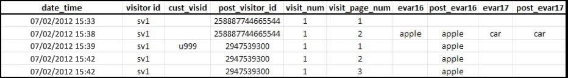
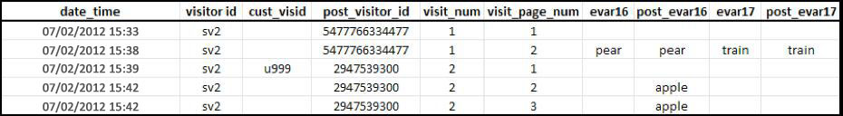

# Attribution et persistance

>[!IMPORTANT]
>
>Cette méthode d'identification des visiteurs sur l'ensemble des périphériques n'est plus recommandée. Please refer to the [Adobe Experience Cloud Device Co-op Documentation](https://marketing.adobe.com/resources/help/en_US/mcdc/).

Lorsque des profils du visiteur sont fusionnés après avoir été associés à la même variable d’identifiant visiteur, l’attribution n’est pas modifiée dans l’ensemble de données historiques.

* Lorsque la variable `s.visitorID` est définie et envoyée sur un accès, le système recherche les autres profils du visiteur ayant un identifiant visiteur correspondant.
* Si un profil existe, le profil du visiteur qui figure déjà dans le système est utilisé à partir de ce moment et le profil précédent est abandonné.
* Si aucun identifiant visiteur correspondant n’est trouvé, un nouveau profil est créé.

Lorsqu’un client non authentifié arrive pour la première fois sur votre site, Adobe Analytics lui affecte un profil du visiteur. Comme indiqué dans la rubrique [Comptabilisation des visiteurs uniques et des visites](../../../implement/js-implementation/xdevice-visid/xdevice-connecting.md#section_70330AB6724C4E419A4BD0BDD54641AC), un nouveau profil est créé lors de l’authentification. Lorsque le nouveau profil est créé, une visite se termine et une autre visite commence.

**Lors de la première connexion de données**

L’exemple ci-dessous explique comment les données sont envoyées à Adobe Analytics lorsqu’un client s’authentifie pour la première fois, sur le premier périphérique :

* `eVar16` a une expiration de 1 jour et `evar17` expire à la visite.

* The `post_visitor_id` column represents the profile maintained by Adobe Analytics.
* The `post_evar16` and `post_evar17` columns show shows the persistence of eVars.

* `cust_visid` représente une valeur dans `s.visitorID`.

* Chaque ligne correspond à un « accès », une seule demande envoyée aux serveurs de collecte de données d’Adobe Analytics.

Lors de la première connexion de données contenant une valeur `s.visitorID` précédemment non reconnue (`u999` ci-dessus), le nouveau profil est créé. Les valeurs persistantes du profil précédent sont transférées vers le nouveau profil.

* Les eVars définies pour expirer à la fin de la visite ne sont pas copiées vers le profil authentifié. Notez que la valeur `car` ci-dessus n’est pas conservée.
* Les eVars définies pour expirer selon d’autres mesures sont copiées vers le profil authentifié. Notez que la valeur `apple` n’est pas conservée.
* Pour les eVars persistantes, aucune mesure d’instance n’est enregistrée. Cela signifie que lors de l’utilisation de l’identification des visiteurs sur plusieurs périphériques, il est possible d’afficher des rapports pour lesquels la mesure Visites uniques d’une valeur eVar est supérieure à la mesure d’instance.

**Lors des connexions de données suivantes**

L’exemple ci-dessous explique comment les données sont envoyées à Adobe Analytics lorsqu’un client s’authentifie sur un nouveau périphérique, après s’être authentifié antérieurement sur un périphérique différent :

Lorsque le client s’authentifie, son identifiant est mis en correspondance avec le profil « authentifié » précédent – `2947539300`. Le profil utilisé au début de cette visite (`5477766334477`) n’est plus utilisé et aucune donnée du fichier n’est conservée.

* Les données de géosegmentation sont enregistrées selon le premier accès de la visite. Elles ne changent pas pour une même visite, quel que soit le périphérique utilisé. Cela signifie que, lors d’une connexion de données suivante sur un nouveau périphérique, la géosegmentation n’est généralement pas incluse.
* Les colonnes relatives aux technologies, par exemple, le navigateur, le système d’exploitation, l’intensité de couleur, sont enregistrées lors du premier accès d’une visite. Comme les valeurs de géosegmentation, elles ne sont pas copiées sur le profil associé.
* Un canal marketing, Direct ou Interne par exemple, qui est généralement configuré pour ne pas remplacer un autre canal va remplacer d’autres canaux lors d’une connexion de données suivantes contenant une première authentification pour le périphérique en question, telle la première authentification présentée dans la rubrique [Comptabilisation des visiteurs uniques et des visites](../../../implement/js-implementation/xdevice-visid/xdevice-connecting.md#section_70330AB6724C4E419A4BD0BDD54641AC).

**Cas particulier**

Dans d’autres cas, les données ne sont pas conservées entre le profil non authentifié et le profil authentifié.

* Si un utilisateur est nouveau sur votre site (n’a jamais effectué de visites auparavant avec ce périphérique) ET qu’il s’authentifie dans les 3 minutes (environ) suivant son arrivée, aucune valeur ne sera conservée dans le profil authentifié.

